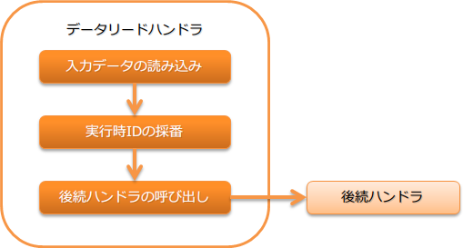

# データリードハンドラ

データリーダ を使用して、入力データの順次読み込みを行なうハンドラ。

このハンドラは、実行コンテキスト上の データリーダ を使用し、業務処理に対する入力データを1件ずつ読み込み、
それを引数として後続ハンドラに処理を委譲する。
データリーダ の終端に達した場合は、後続のハンドラを実行せずに、データの終端に達したことを示す `NoMoreRecord` を返却する。

本ハンドラでは、以下の処理を行う。

* データリーダを使用して入力データの読み込み
* 実行時ID の採番

処理の流れは以下のとおり。



## ハンドラクラス名

* `nablarch.fw.handler.DataReadHandler`

## モジュール一覧

```xml
<dependency>
  <groupId>com.nablarch.framework</groupId>
  <artifactId>nablarch-fw-standalone</artifactId>
</dependency>
```

## 制約

本ハンドラより手前のハンドラにて、 `ExecutionContext` に `DataReader` を設定する必要がある。
本ハンドラが呼び出されたタイミングで `DataReader` が設定されていない場合、処理対象データ無しとして本ハンドラは処理を終了( `NoMoreRecord` を返却)する。

## 最大処理件数の設定

本ハンドラには、最大の処理件数を設定することが出来る。最大処理件数分のデータを処理し終わると、本ハンドラは処理対象レコードなしを示す  `NoMoreRecord`  を返却する。

この設定値は、大量データを処理するバッチ処理を数日に分けて処理させる場合などに指定する。
この設定値を使用することで、最大100万件を処理するバッチを、日次で最大10万件だけ処理をさせ10日間かけて全件を処理させることが実現できる。

以下に設定例を示す。

```xml
<component class="nablarch.fw.handler.DataReadHandler">
  <!-- 処理する件数は、最大1万レコード -->
  <property name="maxCount" value="10000" />
</component>
```
