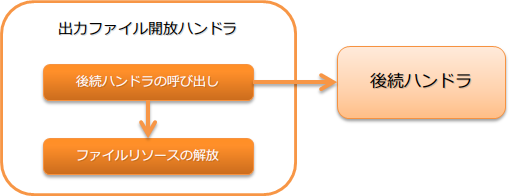

# 出力ファイル開放ハンドラ

## 概要

業務アクションやハンドラで開いた出力ファイルを閉じる(リソースの解放)ハンドラ。

> **Important:** このハンドラで解放対象となるのは、 `FileRecordWriterHolder` を使用して開いた出力ファイルとなる。 それ以外のAPI(例えば、 `java.io` パッケージ)を使って開いたリソースについては、個別にクローズ処理を行うこと。
処理の流れは以下のとおり。



## ハンドラクラス名

* `nablarch.common.io.FileRecordWriterDisposeHandler`

<details>
<summary>keywords</summary>

出力ファイル開放ハンドラとは, FileRecordWriterDisposeHandler概要, 出力ファイルを閉じる, リソース解放ハンドラ, FileRecordWriterDisposeHandler, nablarch.common.io.FileRecordWriterDisposeHandler, 出力ファイル開放ハンドラ, ハンドラクラス

</details>

## モジュール一覧

```xml
<!-- 汎用データフォーマット -->
<dependency>
  <groupId>com.nablarch.framework</groupId>
  <artifactId>nablarch-core-dataformat</artifactId>
</dependency>
```

<details>
<summary>keywords</summary>

nablarch-core-dataformat, com.nablarch.framework, 汎用データフォーマット, モジュール依存関係

</details>

## 制約

なし。

<details>
<summary>keywords</summary>

制約なし, 出力ファイル開放ハンドラ制約

</details>

## ハンドラキューへの設定について

このハンドラは、ハンドラキュー上に設定するだけで、後続のハンドラや業務アクションで開いた出力ファイルを自動的にクローズする。
このため、ファイルを出力する全てのハンドラより手前に設定する必要がある。

<details>
<summary>keywords</summary>

FileRecordWriterHolder, nablarch.common.io.FileRecordWriterHolder, ハンドラキュー設定, 出力ファイル自動クローズ, リソース解放

</details>
