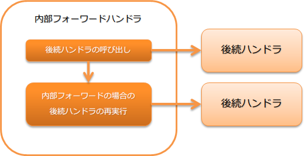

# 内部フォーワードハンドラ

## 概要

このハンドラは、後続ハンドラからのレスポンス中のコンテンツが、内部フォーワードを示している場合に、指定されたリクエストパスで後続ハンドラを再実行する。

内部フォーワードは、遷移先の画面が単純な画面表示ではなく、チェックボックスやドロップダウンリストなどの選択肢をサーバサイドで取得する場合に使用する。
例えば、入力チェックでエラーとなった際に単純に入力画面を再表示するだけでなく、入力項目の選択肢をサーバサイドで取得する場合が該当する。詳細は、 エラー時の遷移先画面に表示するデータを取得する を参照。

本ハンドラでは、以下の処理を行う。

* 内部フォーワード時の後続ハンドラの再実行

処理の流れは以下のとおり。



## ハンドラクラス名

* `nablarch.fw.web.handler.ForwardingHandler`

<details>
<summary>keywords</summary>

ForwardingHandler, nablarch.fw.web.handler.ForwardingHandler, 内部フォーワードハンドラ, 後続ハンドラ再実行, 選択肢サーバサイド取得

</details>

## モジュール一覧

```xml
<dependency>
  <groupId>com.nablarch.framework</groupId>
  <artifactId>nablarch-fw-web</artifactId>
</dependency>
```

<details>
<summary>keywords</summary>

nablarch-fw-web, com.nablarch.framework, モジュール依存関係

</details>

## 制約

セッション変数保存ハンドラ より後ろに配置すること
セッション変数保存ハンドラ より後ろに配置すべき理由は、
改竄エラー時の遷移先を設定する を参照

<details>
<summary>keywords</summary>

配置順序制約, session_store_handler, セッションストアハンドラ, ハンドラ配置順

</details>

## 内部フォーワードを示すレスポンスを返却する

業務アクションなどで内部フォーワードを示すレスポンスを返却する場合には、
レスポンスが示すコンテンツパスを `forward://` から開始する。

以下に例を示す。

```java
public HttpResponse sample(HttpRequest request, ExecutionContext context) {
  // 業務処理

  // 同一業務アクションのinitializeに内部フォーワード
  return new HttpResponse("forward://initialize");
}
```
> **Tip:** ステータスコードはフォーワード時とフォーワード後を比較し、大きい値をレスポンス時のステータスコードとする。 以下に例を示す。 * フォーワード時が **200** で、フォーワード後が **500** の場合は、クライアントには **500** を返却する。 * フォーワード時が **400** で、フォーワード後が **200** の場合は、クライアントには **400** を返却する。

<details>
<summary>keywords</summary>

forward://, HttpResponse, 内部フォーワードレスポンス, ステータスコード比較, コンテンツパス

</details>

## 内部フォーワードに指定するパスのルール

内部フォーワードで指定するフォーワード先のパスには、相対パスと絶対パスの指定が出来る。

相対パス
現在のリクエストURIを起点としたパスになる。

絶対パス
サーブレットコンテキスト名を起点としたパスになる。

絶対パスの場合には、指定するパスを `/` から開始する。


以下に例を示す。

現在のリクエストURIが `action/users/save` の場合、下記の相対パスと絶対パスが示す内部フォーワード先は同一となる。

```java
// 相対パス
new HttpResponse("forward://initialize");

// 絶対パス
new HttpResponse("forward:///action/users/initialize");
```

<details>
<summary>keywords</summary>

相対パス, 絶対パス, フォーワードパス指定, サーブレットコンテキスト, パス指定ルール

</details>

## 内部リクエストIDについて

内部フォーワード時、フォーワード先のリクエストIDを内部リクエストIDとしてスレッドコンテキストに保持する。

<details>
<summary>keywords</summary>

内部リクエストID, スレッドコンテキスト, フォーワード先リクエストID, internal_request_id

</details>
