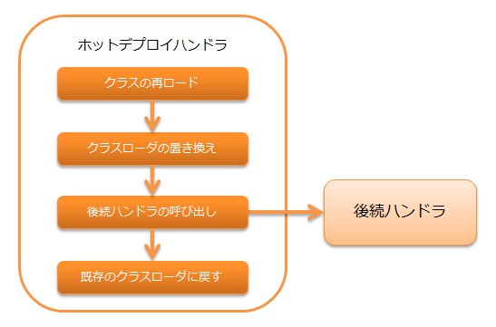

# ホットデプロイハンドラ

開発時にアプリケーションのホットデプロイを行うハンドラ。

本ハンドラを使用することで、アプリケーションサーバを再起動することなくアクションクラスやフォームクラスの変更を即座に反映できる。
それにより、ソースコードを修正するたびにアプリケーションサーバを再起動するといった手間を省き、効率よく作業を進めることができる。

処理の流れは以下のとおり。


> **Important:** 本ハンドラはリクエスト毎にクラスの再ロードを行うため、レスポンス速度の低下につながる可能性がある。 そのため、開発環境での使用のみ想定しており、 **本番環境では絶対に使用してはならない。**
> **Important:** 本ハンドラを使用した場合、リクエスト単体テストが正常に動作しない可能性があるため、リクエスト単体テスト時には本ハンドラを使用しないこと。
> **Tip:** 本ハンドラを使用する場合は、サーバのホットデプロイ機能は無効化すること。

## ハンドラクラス名

* `nablarch.fw.hotdeploy.HotDeployHandler`

<details>
<summary>keywords</summary>

HotDeployHandler, nablarch.fw.hotdeploy.HotDeployHandler, ホットデプロイ, クラス再ロード, 開発環境専用, 本番環境禁止, リクエスト単体テスト

</details>

## モジュール一覧

```xml
<dependency>
  <groupId>com.nablarch.framework</groupId>
  <artifactId>nablarch-fw-web-hotdeploy</artifactId>
</dependency>
```

<details>
<summary>keywords</summary>

nablarch-fw-web-hotdeploy, com.nablarch.framework, モジュール, Maven依存関係, 制約, ホットデプロイハンドラ制約

</details>

## 制約

なし。

<details>
<summary>keywords</summary>

targetPackages, ホットデプロイ対象パッケージ, エンティティクラス除外, クラスローダ, session_store, キャスト失敗

</details>

## ホットデプロイ対象のパッケージを指定する

ホットデプロイ対象となるパッケージは、`targetPackages` プロパティに設定する。

設定例を以下に示す。

```xml
<component class="nablarch.fw.hotdeploy.HotDeployHandler">
  <property name="targetPackages">
    <list>
      <value>please.change.me.web.action</value>
      <value>please.change.me.web.form</value>
    </list>
  </property>
</component>
```
> **Important:** 以下に示す理由により、エンティティクラスはホットデプロイ対象にしてはならない。 * リクエスト毎に対象パッケージ内の全てのクラスが再ロードされるため、 エンティティクラスのような頻繁に変更されないクラスもホットデプロイ対象にしてしまうとレスポンス速度の低下につながる恐れがある。 * リクエスト毎にクラスローダが変わるため、 session_store を使用した場合などでエンティティクラスのキャストに失敗する場合がある。
