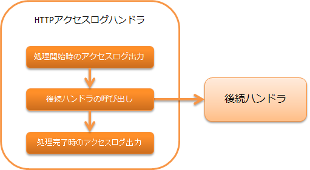

# HTTPアクセスログハンドラ

## 概要

HTTPアクセスログ を出力するハンドラ。

本ハンドラでは、以下の処理を行う。

* リクエスト処理開始時のアクセスログを出力する
* リクエスト処理完了時のアクセスログを出力する

処理の流れは以下のとおり。



## ハンドラクラス名

* `nablarch.common.web.handler.HttpAccessLogHandler`

## モジュール一覧

```xml
<dependency>
  <groupId>com.nablarch.framework</groupId>
  <artifactId>nablarch-fw-web</artifactId>
</dependency>
```

## 制約

thread_context_handler より後ろに配置すること
このハンドラから呼ばれるログ出力の処理内では、通常 `ThreadContext` に保持する内容が必要となる。
このため、 thread_context_handler より後ろに配置する必要がある。

http_error_handler より前に配置すること
また、完了時のログ出力にはエラーコードが必要となるため、 http_error_handler より前に配置する必要がある。

セッションストアIDを出力する場合は session_store_handler より後ろに配置すること
詳細は http_access_log-session_store_id を参照。

## アクセスログ出力内容の切り替え

アクセスログの出力内容の切り替え方法は、 log および http_access_log を参照すること。
