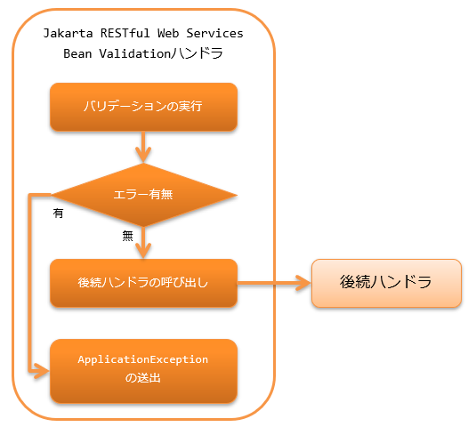

# Jakarta RESTful Web Servcies Bean Validationハンドラ

> **Tip:** 本機能は、Nablarch5までは「JAX-RS BeanValidationハンドラ」という名称だった。 しかし、Java EEがEclipse Foundationに移管され仕様名が変わったことに伴い「Jakarta RESTful Web Servcies Bean Validationハンドラ」という名称に変更された。 変更されたのは名称のみで、機能的な差は無い。 その他、Nablarch6で名称が変更された機能については Nablarch5と6で名称が変更になった機能について を参照のこと。
本ハンドラは、リソース(アクション)クラスが受け取るForm(Bean)に対して、Bean Validation を実行する。
バリデーションでバリデーションエラーが発生した場合には、後続のハンドラに処理は委譲せずに、
`ApplicationException` を送出して処理を終了する。

本ハンドラでは、以下の処理を行う。

* リソース(アクション)クラスのメソッドが受け取るFormに対する Bean Validation を行う。

処理の流れは以下のとおり。



## ハンドラクラス名

* `nablarch.fw.jaxrs.JaxRsBeanValidationHandler`

<details>
<summary>keywords</summary>

JaxRsBeanValidationHandler, nablarch.fw.jaxrs.JaxRsBeanValidationHandler, JAX-RS BeanValidationハンドラ, ApplicationException, Bean Validationハンドラ, リソースクラス, バリデーションエラー

</details>

## モジュール一覧

```xml
<dependency>
  <groupId>com.nablarch.framework</groupId>
  <artifactId>nablarch-fw-jaxrs</artifactId>
</dependency>

<!-- Bean Validationのモジュール -->
<dependency>
  <groupId>com.nablarch.framework</groupId>
  <artifactId>nablarch-core-validation-ee</artifactId>
</dependency>
```

<details>
<summary>keywords</summary>

nablarch-fw-jaxrs, nablarch-core-validation-ee, モジュール依存関係, Maven, Bean Validation

</details>

## 制約

リクエストボディ変換ハンドラ よりも後ろに設定すること
このハンドラは、 リクエストボディ変換ハンドラ がリクエストボディから変換したForm(Bean)に対してバリデーションを行うため。

<details>
<summary>keywords</summary>

body_convert_handler, ハンドラ設定順序, 制約, BodyConvertHandler, リクエストボディ変換

</details>

## リソース(アクション)で受け取るForm(Bean)に対してバリデーションを実行する

リソース(アクション)のメソッドで受け取るForm(Bean)に対して、バリデーションを実行したい場合は、
そのメソッドに対して `Valid` アノテーションを設定する。

以下に例を示す。

```java
// Personオブジェクトに対してバリデーションを実行したいので、
// Validアノテーションを設定する。
@POST
@Consumes(MediaType.APPLICATION_JSON)
@Valid
public HttpResponse save(Person person) {
    UniversalDao.insert(person);
    return new HttpResponse();
}
```

<details>
<summary>keywords</summary>

@Valid, Valid, バリデーション実行, Form, Bean, アノテーション, jaxrs_bean_validation_handler_perform_validation

</details>

## Bean Validationのグループを指定する

`Valid` アノテーションを設定したメソッドに対して
`ConvertGroup` アノテーションを設定することで、Bean Validationのグループを指定することができる。

`ConvertGroup` アノテーションは `from` 属性と `to` 属性の指定が必須である。
それぞれ以下のように指定すること。

* `from` ・・・ `Default.class` 固定

* メソッドに `Valid` アノテーションを設定する場合、
バリデーションは `Default` グループを設定したものとして実行されるため。

* `to` ・・・Bean Validationのグループを指定する

以下に例を示す。

```java
// Personクラス内で設定されたバリデーションルールのうち、
// Createグループに所属するルールのみを使用して検証する。
@POST
@Consumes(MediaType.APPLICATION_JSON)
@Valid
@ConvertGroup(from = Default.class, to = Create.class)
public HttpResponse save(Person person) {
    UniversalDao.insert(person);
    return new HttpResponse();
}
```

<details>
<summary>keywords</summary>

@ConvertGroup, ConvertGroup, Default.class, Bean Validationグループ, バリデーショングループ, from属性, to属性

</details>
