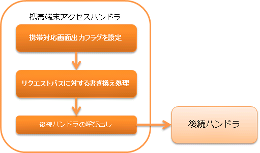

# 携帯端末アクセスハンドラ

本ハンドラでは、いわゆる feature phone と呼ばれる携帯電話など、JavaScriptが動作しない環境で\
ウェブアプリケーションを動作させるために、下記を実現する。

* 画面で押されたボタンのボタン名から、想定されるURLにディスパッチする
* JSP上にJavaScriptを出力しないよう変数を設定する


処理の流れは以下のとおり。



## ハンドラクラス名

* `nablarch.fw.web.handler.KeitaiAccessHandler`

<details>
<summary>keywords</summary>

KeitaiAccessHandler, nablarch.fw.web.handler.KeitaiAccessHandler, 携帯端末アクセスハンドラ, フィーチャーフォン対応, JavaScript非対応環境

</details>

## モジュール一覧

```xml
<dependency>
  <groupId>com.nablarch.framework</groupId>
  <artifactId>nablarch-fw-web</artifactId>
</dependency>
```

<details>
<summary>keywords</summary>

nablarch-fw-web, com.nablarch.framework, モジュール依存関係

</details>

## 制約

HTTPレスポンスハンドラ より後ろに配置すること
本ハンドラは、通常クライントからのJSP上にJavaScriptを出力しないよう変数を設定するため、\
JSPへのフォワード処理を行う HTTPレスポンスハンドラ より後に配置する必要がある。

スレッドコンテキスト変数管理ハンドラ より前に配置すること
通常JSPが出力するJavaScriptで決定されるURIを決定する処理が含まれるため、\
URIを使用する スレッドコンテキスト変数管理ハンドラ より前に配置する必要がある。

<details>
<summary>keywords</summary>

配置制約, http_response_handler, thread_context_handler, ハンドラ配置順序

</details>

## JavaScript出力が抑制されるタグ

携帯端末アクセスハンドラを使用したURLにアクセスした際は、 下記Nablarch
タグライブラリが通常出力するJavaScriptが一切出力されなくなる。

* n:form タグ
* n:script タグ
* サブミット関連のタグ

> **Important:** 下記のタグは、元々想定していた機能が実現できないため、使用できなくなる。 * n:submitLink タグ n:submitLink タグの代替として、 n:a タグを使用すること。 特にリクエストパラメータについては、GETメソッドのパラメータで送信する必要がある。

<details>
<summary>keywords</summary>

JavaScript抑制, n:submitLink, n:a タグ, n:form タグ, n:script タグ, GETメソッド, タグライブラリ

</details>

## URLの関連付け

携帯端末アクセスハンドラを適用した場合、下記の動作で、通常NablarchでJavaScriptで行っているformのURI属性の書き換えがサーバサイドで実施される。

1. JSP表示時の動作

1.1. n:submit、 n:button を記載した個所で出力するHTMLのinputタグについて、 name 属性に設定する値を `nablarch_uri_override_<JSP上のname属性>|<サブミット先のURI>` に出力

1.2. n:form タグでは、単純に HTML の <form> タグを出力する。\
つまり、ボタン押下時にはHTMLの<form>タグに記載したURLに押下したボタンのname属性が送られる。\
(通常、閉じタグの</form>には、押下したボタンに合わせたURLに <form> タグのuri属性を変更するJavaScriptが挿入される。)

2. form サブミット時の動作

2.1. KeitaiAccessHandler にて、サブミット時に押下したボタンに設定された name 属性(1.1. で設定した  `nablarch_uri_override_` から始まる文字列)から、元のJSPタグに設定されていたURI属性を取得。

2.2. KeitaiAccessHandler にて、リクエストパラメータに処理対象のURIとして扱われるパラメータキー `nablarch_submit` で取得したURI属性を設定。
(つまり、通常NablarchでJavaScriptで行っているformのURI属性の書き換えを、サーバサードで実施している)

2.3. 後続処理に委譲する。(以降、クライアントからのリクエスト時にボタンに対応するURIが指定された場合と同じ動作をする)

<details>
<summary>keywords</summary>

URL関連付け, nablarch_uri_override_, nablarch_submit, フォームサブミット, ボタンURI解決, サーバサイドURI書き換え

</details>
