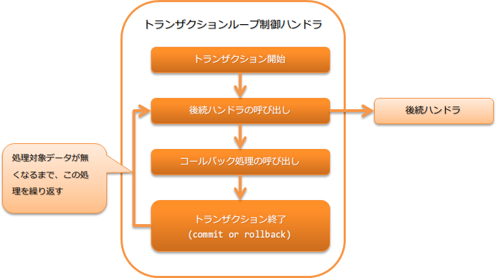

# トランザクションループ制御ハンドラ

## 概要

本ハンドラは、データリーダ上に処理対象のデータが存在する間、後続ハンドラの処理を繰り返し実行する。実行中はトランザクションを制御し、一定の繰り返し回数ごとにトランザクションをコミットする。
トランザクションのコミット間隔を大きくすることで、バッチ処理のスループットを向上させることができる。

* トランザクションの開始
* トランザクションの終了(コミットやロールバック)
* トランザクションの終了時のコールバック

処理の流れは以下のとおり。



## ハンドラクラス名

* `nablarch.fw.handler.LoopHandler`

<details>
<summary>keywords</summary>

LoopHandler, トランザクションループ制御ハンドラ, データリーダ, ループ処理, 後続ハンドラ繰り返し実行, トランザクション制御, コミット間隔, バッチ処理ループ, 処理対象データ繰り返し, LoopHandler, nablarch.fw.handler.LoopHandler, トランザクションループ制御ハンドラ, ハンドラクラス名

</details>

## モジュール一覧

```xml
<dependency>
  <groupId>com.nablarch.framework</groupId>
  <artifactId>nablarch-fw-standalone</artifactId>
</dependency>

<dependency>
  <groupId>com.nablarch.framework</groupId>
  <artifactId>nablarch-core-transaction</artifactId>
</dependency>

<!-- データベースに対するトランザクションを制御する場合のみ -->
<dependency>
  <groupId>com.nablarch.framework</groupId>
  <artifactId>nablarch-core-jdbc</artifactId>
</dependency>
```

<details>
<summary>keywords</summary>

nablarch-fw-standalone, nablarch-core-transaction, nablarch-core-jdbc, モジュール依存関係, Maven依存設定

</details>

## 制約

データベース接続管理ハンドラ より後ろに設定すること
データベースに対するトランザクションを制御する場合には、トランザクション管理対象のデータベース接続がスレッド上に存在している必要がある。

<details>
<summary>keywords</summary>

database_connection_management_handler, DbConnectionManagementHandler, ハンドラ順序制約, データベース接続管理ハンドラ, トランザクション制御制約

</details>

## トランザクション制御対象を設定する

このハンドラは、 `transactionFactory`
プロパティに設定されたファクトリクラス( `TransactionFactory` の実装クラス)を使用してトランザクションの制御対象を取得しスレッド上で管理する。

スレッド上で管理する際には、トランザクションを識別するための名前を設定する。
デフォルトでは、 `transaction` が使用されるが、任意の名前を使用する場合は、 `transactionName` プロパティに設定すること。

> **Tip:** データベース接続管理ハンドラ で設定したデータベースに対してトランザクションを制御する場合は、 extdoc:`DbConnectionManagementHandler#connectionName <nablarch.common.handler.DbConnectionManagementHandler.setConnectionName(java.lang.String)>` に設定した値と同じ値を extdoc:`transactionName <nablarch.fw.handler.LoopHandler.setTransactionName(java.lang.String)>` プロパティに設定すること。 なお、 `DbConnectionManagementHandler#connectionName` に値を設定していない場合は、 extdoc:`transactionName <nablarch.fw.handler.LoopHandler.setTransactionName(java.lang.String)>` への設定は省略して良い。
以下の設定ファイル例を参考にし、このハンドラを設定すること。

```xml
<!-- トランザクション制御ハンドラ -->
<component class="nablarch.fw.handler.LoopHandler">
  <property name="transactionFactory" ref="databaseTransactionFactory" />
  <property name="transactionName" value="name" />
</component>

<!-- データベースに対するトランザクション制御を行う場合には、JdbcTransactionFactoryを設定する -->
<component name="databaseTransactionFactory"
    class="nablarch.core.db.transaction.JdbcTransactionFactory">
  <!-- プロパティの設定は省略 -->
</component>
```

<details>
<summary>keywords</summary>

transactionFactory, transactionName, TransactionFactory, JdbcTransactionFactory, DbConnectionManagementHandler, connectionName, トランザクション制御対象設定, トランザクション識別名

</details>

## コミット間隔を指定する

バッチ処理のコミット間隔は、 `commitInterval` プロパティに設定する。
概要で述べたように、コミット間隔を調整することで、バッチ処理のスループットを向上させることができる。

以下に設定例を示す。

```xml
<component class="nablarch.fw.handler.LoopHandler">
  <!-- コミット間隔に1000を指定 -->
  <property name="commitInterval" value="1000" />
</component>
```

<details>
<summary>keywords</summary>

commitInterval, コミット間隔, バッチスループット, トランザクションコミット間隔, loop_handler-commit_interval

</details>

## トランザクション終了時に任意の処理を実行したい

このハンドラでは、後続のハンドラの処理実行後にコールバック処理を行う。

コールバックされる処理は、このハンドラより後続に設定されたハンドラの中で、 `TransactionEventCallback` を実装しているものとなる。
もし、複数のハンドラが  `TransactionEventCallback` を実装している場合は、より手前に設定されているハンドラから順次コールバック処理を実行する。

後続ハンドラが正常に処理を終えた場合のコールバック処理は、後続ハンドラと同一のトランザクションで実行される。
コールバック処理で行った処理は、次回のコミットタイミングで一括コミットされる。

後続のハンドラで例外及びエラーが発生し、トランザクションをロールバックする場合には、ロールバック後にコールバック処理を実行する。
このため、コールバック処理は新しいトランザクションで実行され、コールバックが正常に終了するとコミットされる。

> **Important:** 複数のハンドラがコールバック処理を実装していた場合で、コールバック処理中にエラーや例外が発生した場合は、 残りのハンドラに対するコールバック処理は実行しないため注意すること。
以下に例を示す。

コールバック処理を行うハンドラの作成
以下実装例のように、  `TransactionEventCallback` を実装したハンドラを作成する。

`transactionNormalEnd` にトランザクションコミット時のコールバック処理を実装し、
`transactionAbnormalEnd` にトランザクションロールバック時のコールバック処理を実装する。

```java
public static class SampleHandler
    implements Handler<Object, Object>, TransactionEventCallback<Object> {

  @Override
  public Object handle(Object o, ExecutionContext context) {
    // ハンドラの処理を実装する
    return context.handleNext(o);
  }

  @Override
  public void transactionNormalEnd(Object o, ExecutionContext ctx) {
    // 後続ハンドラが正常終了した場合のコールバック処理を実装する
  }

  @Override
  public void transactionAbnormalEnd(Throwable e, Object o, ExecutionContext ctx) {
    // トランザクションロールバック時のコールバック処理を実装する
  }
}
```
ハンドラキューを構築する
以下のように、このハンドラの後続ハンドラにコールバック処理を実装したハンドラを設定する。

```xml
<list name="handlerQueue">
  <!-- トランザクション制御ハンドラ -->
  <component class="nablarch.fw.handler.LoopHandler">
    <!-- プロパティへの設定は省略 -->
  </component>

  <!-- コールバック処理を実装したハンドラ -->
  <component class="sample.SampleHandler" />
</list>
```

<details>
<summary>keywords</summary>

TransactionEventCallback, transactionNormalEnd, transactionAbnormalEnd, コールバック処理, トランザクション終了通知, ロールバック後処理, loop_handler-callback

</details>
