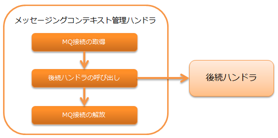

# メッセージングコンテキスト管理ハンドラ

## 概要

後続のハンドラ及びライブラリで使用するためのMQ接続を、スレッド上で管理するハンドラ。

MOMメッセージングの詳細は、 システム間メッセージング を参照。

本ハンドラでは、以下の処理を行う。

* MQ接続の取得
* MQ接続の解放

処理の流れは以下のとおり。



## ハンドラクラス名

* `nablarch.fw.messaging.handler.MessagingContextHandler`

<details>
<summary>keywords</summary>

MessagingContextHandler, nablarch.fw.messaging.handler.MessagingContextHandler, MOMメッセージング, MQ接続管理, スレッド管理

</details>

## モジュール一覧

```xml
<dependency>
  <groupId>com.nablarch.framework</groupId>
  <artifactId>nablarch-fw-messaging</artifactId>
</dependency>
```

<details>
<summary>keywords</summary>

nablarch-fw-messaging, com.nablarch.framework, モジュール, 依存関係

</details>

## 制約

なし。

<details>
<summary>keywords</summary>

制約, なし

</details>

## MQの接続先を設定する

このハンドラは、 `messagingProvider`
プロパティに設定されたプロバイダクラス( `MessagingProvider` 実装クラス)を使用してMQ接続を取得する。

以下に設定例を示す。
プロバイダクラスの設定内容については、使用する
`MessagingProvider` 実装クラスのJavadocを参照。

```xml
<!-- メッセージコンテキスト管理ハンドラ -->
<component class="nablarch.fw.messaging.handler.MessagingContextHandler">
  <property name="messagingProvider" ref="messagingProvider" />
</component>

<!-- プロバイダクラス -->
<component name="messagingProvider"
    class="nablarch.fw.messaging.provider.JmsMessagingProvider">
  <!-- プロパティの設定は省略 -->
</component>
```

<details>
<summary>keywords</summary>

MessagingProvider, nablarch.fw.messaging.MessagingProvider, JmsMessagingProvider, nablarch.fw.messaging.provider.JmsMessagingProvider, messagingProvider, MQ接続設定, プロバイダクラス設定

</details>
