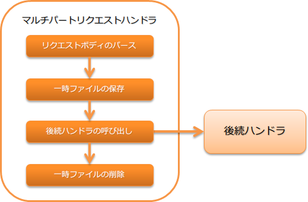

# マルチパートリクエストハンドラ

## 概要

HTTPリクエストがマルチパート形式の場合に、ボディ部を解析しアップロードファイルを一時ファイルとして保存するハンドラ。

本ハンドラでは、以下の処理を行う。

* マリチパートリクエストの解析
* アップロードファイルを一時ファイルとして保存
* 保存した一時ファイルの削除


処理の流れは以下のとおり。



## ハンドラクラス名

* `nablarch.fw.web.upload.MultipartHandler`

<details>
<summary>keywords</summary>

MultipartHandler, nablarch.fw.web.upload.MultipartHandler, マルチパートリクエストハンドラ, ハンドラクラス

</details>

## モジュール一覧

```xml
<dependency>
  <groupId>com.nablarch.framework</groupId>
  <artifactId>nablarch-fw-web</artifactId>
</dependency>

<!-- 一時保存先を指定する場合のみ -->
<dependency>
  <groupId>com.nablarch.framework</groupId>
  <artifactId>nablarch-core</artifactId>
</dependency>
```

<details>
<summary>keywords</summary>

nablarch-fw-web, nablarch-core, モジュール依存関係, Maven

</details>

## 制約

なし。

<details>
<summary>keywords</summary>

制約, マルチパートハンドラ制約

</details>

## このハンドラの動作条件

このハンドラはマルチパート形式のリクエストの場合のみ、リクエストボディを解析する。マルチパート形式かどうかは、リクエストヘッダの `Content-Type` で判断する。

`Content-Type` が `multipart/form-data` と一致する場合は、リクエストがマルチパート形式だと判断し、ボディの解析処理を行う。
それ以外の場合には、このハンドラは何もせずに後続のハンドラに処理を委譲する。

<details>
<summary>keywords</summary>

Content-Type, multipart/form-data, 動作条件, マルチパート判定, リクエスト振り分け

</details>

## アップロードファイルの一時保存先を指定する

アップロードファイルの一時保存先ディレクトリは、 ファイルパス管理 に設定する。

ファイルパス管理に一時保存先ディレクトリの指定がない場合は、デフォルトの保存先としてシステムプロパティの `java.io.tmpdir` の値を使用する。

以下に一時ファイルの保存先ディレクトリの設定例を示す。

ポイント
* 保存先ディレクトリの論理名は、 `uploadFileTmpDir` とすること。

```xml
<component name="filePathSetting" class="nablarch.core.util.FilePathSetting">
  <!-- ディレクトリの設定 -->
  <property name="basePathSettings">
    <map>
      <!-- アップロードファイルの一時保存ディレクトリ -->
      <entry key="uploadFileTmpDir" value="file:/var/nablarch/uploadTmpDir" />
    </map>
  </property>
</component>
```
> **Tip:** 上記の例では、保存先ディレクトリを直接指定しているが、この値は環境ごとに異なることが想定される。 このため、直接コンポーネント設定ファイルに設定するのではなく、環境設定ファイルに設定することを推奨する。 詳細は、依存値を設定する を参照。

<details>
<summary>keywords</summary>

uploadFileTmpDir, file_path_management, FilePathSetting, 一時保存先ディレクトリ, java.io.tmpdir, アップロード一時ファイル

</details>

## 巨大なファイルのアップロードを防ぐ

巨大なファイルをアップロードされると、ディスクリソースが枯渇するなどが原因でシステムが正常に稼働しなくなる可能性がある。
このため、このハンドラではアップロードサイズの上限を超過した場合には、413(Payload Too Large)をクライアントに返却する。

アップロードサイズの上限は、バイト数で設定する。設定を省略した場合は、無制限となる。
DoS攻撃を防ぐためにも、アップロードサイズの上限は常に設定しておくこと。

以下にアップロードサイズの設定例を示す。

```xml
<component class="nablarch.fw.web.upload.MultipartHandler" name="multipartHandler">
  <property name="uploadSettings">
    <component class="nablarch.fw.web.upload.UploadSettings">
      <!-- アップロードサイズ(Content-Length)の上限(約1MB) -->
      <property name="contentLengthLimit" value="1000000" />
    </component>
  </property>
</component>
```
> **Tip:** アップロードサイズの上限は、ファイル単位ではなく1リクエストでアップロード出来る上限となる。 このため、複数のファイルをアップロードした場合には、それらのファイルサイズの合計値(厳密には、Content-Length)により、上限チェックが実施される。 もし、ファイル単位でサイズチェックをする必要がある場合には、アクション側で実装すること。

<details>
<summary>keywords</summary>

contentLengthLimit, UploadSettings, 413, Payload Too Large, ファイルサイズ上限, DoS攻撃対策, アップロードサイズ制限

</details>

## ファイルの大量アップロードを防ぐ

アップロードサイズの上限を設定しても、1つ1つのファイルサイズを小さくすることで一度に大量のファイルをアップロードできる。
不必要な処理を減らすため、マルチパートリクエストハンドラでは一度にアップロードできるファイル数に上限を設定できるようになっている。
上限を超えるファイルがアップロードされた場合、このハンドラは400(Bad Request)を返す。

以下に設定例を示す。

```xml
<component class="nablarch.fw.web.upload.MultipartHandler" name="multipartHandler">
  <property name="uploadSettings">
    <component class="nablarch.fw.web.upload.UploadSettings">
      <!-- アップロードファイル数の上限 -->
      <property name="maxFileCount" value="100" />
    </component>
  </property>
</component>
```
`maxFileCount` に0以上の値を設定すると、その値が一度にアップロードできるファイル数の上限となる。
負数を設定した場合は無制限となる。
未設定の場合はデフォルトで-1となる。

<details>
<summary>keywords</summary>

maxFileCount, UploadSettings, 400, Bad Request, ファイル数上限, 大量アップロード防止

</details>

## 一時ファイルの削除（クリーニング）を行う

保存されたアップロードファイルを以下の条件でクリーニングする。

* ボディの解析中に例外が発生した場合
* ハンドラの復路で自動削除設定が有効な場合

自動削除設定は、デフォルトで有効に設定されている。
この設定は本番環境で安易に無効にすると、大量の一時ファイルがディスク上に残り、最悪の場合ディスクフルの原因となるため注意すること。

設定値を無効にする場合には、 `UploadSettings#autoCleaning` に `false` を設定する。

<details>
<summary>keywords</summary>

autoCleaning, UploadSettings, 一時ファイル削除, クリーニング, 自動削除設定, ディスクフル防止

</details>

## マルチパート解析エラー及びファイルサイズ上限超過時の遷移先画面を設定する

このハンドラでは、マルチパート解析エラー [#part_error]_ や ファイルサイズの上限超過時 に、
不正なリクエストとしてクライアントに `400(BadRequest)` を返却する。

このため、 `400(BadRequest)` に対応したエラーページの設定を `web.xml` に行う必要がある。
`web.xml` へのエラーページ設定を省略した場合は、ウェブアプリケーションサーバが持つデフォルトのページなどがクライアントに返却される。

> **Important:** このハンドラは、制約 にあるとおり、 セッション変数保存ハンドラ より手前に設定する必要がある。 このため、 セッション変数保存ハンドラ の後続に設定される HTTPエラー制御ハンドラ の デフォルトページの設定 は使用できない。
.. [#part_error]
マルチパート解析エラーが発生するケース

* アップロード中にクライアントからの切断要求があり、ボディ部が不完全な場合
* バウンダリーが存在しない

<details>
<summary>keywords</summary>

web.xml, 400, BadRequest, エラーページ設定, session_store_handler, http_error_handler, マルチパート解析エラー

</details>

## アップロードしたファイルを読み込む

アップロードされたファイル(一時保存されたファイル)は、 `HttpRequest` から取得する。

以下に実装例を示す。

ポイント
* `HttpRequest#getPart` を呼び出してアップロードされたファイルを取得する。
* `HttpRequest#getPart` の引数には、パラメータ名を指定する。

```java
public HttpResponse upload(HttpRequest request, ExecutionContext context) throws IOException {
  // アップロードファイルの取得
  List<PartInfo> partInfoList = request.getPart("uploadFile");

  if (partInfoList.isEmpty()) {
    // アップロードファイルが指定されていなかった場合は業務エラー
  }

  // アップロードされたファイルを処理する
  InputStream file = partInfoList.get(0).getInputStream()

  // 以下アップロードファイルを読み込み処理を行う。
}
```
アップロードファイルを処理する詳細な実装方法は、以下のドキュメントを参照。
なお、 様々なフォーマットのデータへのアクセス に記載がある通り、 データバインド が推奨となる。
(データバインド で扱うことのできない形式の場合は、 汎用データフォーマット を使用すること。)

* データバインドを使ってアップロードファイルを処理する
* 汎用データフォーマットを使ってアップロードファイルを処理する

> **Tip:** アップロードされたファイルが画像ファイル等のバイナリファイルの場合は、読み込んだバイナリデータを使用して処理を行うこと。 以下の様に実装することでアップロードファイルのバイトデータを読み込むことができる。 .. code-block:: java File savedFile = partInfo.getSavedFile(); try { byte[] bytes = Files.readAllBytes(savedFile.toPath()); } catch (IOException e) { throw new RuntimeException(e); }

<details>
<summary>keywords</summary>

HttpRequest, getPart, PartInfo, data_bind, data_format, アップロードファイル読み込み, 一時ファイル取得, バイナリファイル, getSavedFile, InputStream

</details>
