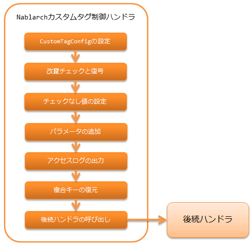

# Nablarchカスタムタグ制御ハンドラ

## 概要

Nablarchの tag に必要なリクエスト処理を行うハンドラ。

本ハンドラでは、以下の処理を行う。

* カスタムタグのデフォルト値をJSPで参照できるように、
`CustomTagConfig` をリクエストスコープに設定する。
* hidden暗号化 に対応する改竄チェックと復号処理を行う。
* チェックボックスのチェックなしに対する値を指定する ために、リクエストにチェックなしに対応する値を設定する。
* ボタン又はリンク毎のパラメータ追加 のために、リクエストにパラメータを追加する。
* http_access_log のリクエストパラメータを出力する。
* 複合キーを扱える ようにするため、複合キーを復元する。

> **Tip:** GETリクエストの場合、カスタムタグではhiddenパラメータを出力しない。 hiddenパラメータを出力しない理由は、 tag-using_get を参照。 カスタムタグに合わせて、本ハンドラでも、GETリクエストの場合はhiddenパラメータに関連する処理を行わず、 複合キーの復元処理のみを行う。
処理の流れは以下のとおり。



## ハンドラクラス名

* `nablarch.common.web.handler.NablarchTagHandler`

## モジュール一覧

```xml
<dependency>
  <groupId>com.nablarch.framework</groupId>
  <artifactId>nablarch-fw-web-tag</artifactId>
</dependency>
```

## 制約

multipart_handler より後ろに設定すること
本ハンドラは、 tag に必要なリクエスト処理でリクエストパラメータにアクセスするため。

hidden暗号化 使用時は、thread_context_handler より後ろに設定すること
hidden暗号化対象のリクエストか否かを判定するために、スレッドコンテキストからリクエストIDを取得するため。

## 復号に失敗(改竄エラー、セッション無効化エラー)した場合のエラーページを設定する

hidden暗号化 の復号処理は、次の2つのケースにおいて失敗する可能性がある。
改竄の判定基準は、 復号処理 を参照。

* 暗号化したデータが改竄された場合(改竄エラー)
* セッションから復号に使う鍵を取得できない場合(セッション無効化エラー)

それぞれ、
`NablarchTagHandler` の設定で、
エラー発生時のエラーページとステータスコードを指定できる。

```xml
<component name="nablarchTagHandler"
           class="nablarch.common.web.handler.NablarchTagHandler">
  <!--
    改竄エラー発生時の設定
  -->
  <property name="path" value="/TAMPERING-DETECTED.jsp" />
  <property name="statusCode" value="400" />
  <!--
    セッション無効化エラー発生時の設定
    省略した場合は改竄エラー発生時の設定が使用される。
  -->
  <property name="sessionExpirePath" value="/SESSION-EXPIRED.jsp" />
  <property name="sessionExpireStatusCode" value="400" />

</component>
```
