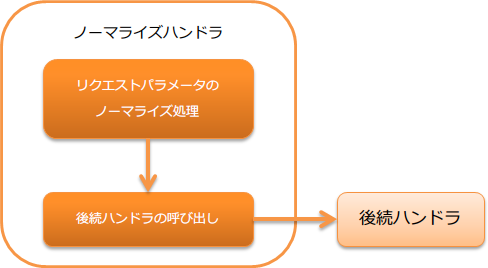

# ノーマライズハンドラ

## 概要

クライアントから送信されるリクエストパラメータをノーマライズするハンドラ。

本ハンドラでは、以下の処理を行う。

* リクエストパラメータのノーマライズ処理

処理の流れは以下のとおり。



## ハンドラクラス名

* `nablarch.fw.web.handler.NormalizationHandler`

<details>
<summary>keywords</summary>

NormalizationHandler, nablarch.fw.web.handler.NormalizationHandler, ノーマライズハンドラ, リクエストパラメータ正規化

</details>

## モジュール一覧

```xml
<dependency>
  <groupId>com.nablarch.framework</groupId>
  <artifactId>nablarch-fw-web</artifactId>
</dependency>
```

<details>
<summary>keywords</summary>

nablarch-fw-web, com.nablarch.framework, モジュール依存関係

</details>

## 制約

マルチパートリクエストハンドラ より後ろに配置すること
このハンドラはリクエストパラータにアクセスする。
このため、 マルチパートリクエストハンドラ よりも後ろに設定する必要がある。

<details>
<summary>keywords</summary>

multipart_handler, ハンドラ配置順序, 制約, リクエストパラメータアクセス

</details>

## 標準で提供しているノーマライズ処理

標準では、以下のノーマライズ処理を提供している。

* リクエストパラメータの前後のホワイトスペースを除去するノーマライザ( `TrimNormalizer` ) [#whitespace]_

<details>
<summary>keywords</summary>

TrimNormalizer, nablarch.fw.web.handler.normalizer.TrimNormalizer, ホワイトスペース除去, デフォルトノーマライザ, Character#isWhitespace, ホワイトスペース定義

</details>

## ノーマライズ処理を追加する

このハンドラはデフォルト動作で、リクエストパラメータの前後のホワイトスペース [#whitespace]_ を除去するノーマライザが有効となっている。

プロジェクト要件で、ノーマライズ処理を追加する場合には、 `Normalizer` の実装クラスを作成し、本ハンドラに設定する。

以下に例を示す。

ノーマライザの実装例
```java
public class SampleNormalizer implements Normalizer {

    @Override
    public boolean canNormalize(final String key) {
      // パラメータのキー値にnumが含まれた場合は、そのパラメータをノーマライズする
      return key.contains("num");
    }

    @Override
    public String[] normalize(final String[] value) {
      // パラメータ中のカンマ(,)を除去する
      final String[] result = new String[value.length];
      for (int i = 0; i < value.length; i++) {
          result[i] = value[i].replace(",", "");
      }
      return result;
    }
}
```
コンポーネント設定ファイルに定義する
以下の設定例のように、適用したいノーマライザを設定する。
複数のノーマライザを設定した場合、より上に設定したものから順次ノーマライズ処理が実行される。
このため、ノーマライズ処理に順序性がある場合には、設定順に注意すること。

```xml
<component class="nablarch.fw.web.handler.NormalizationHandler">
  <property name="normalizers">
    <list>
      <component class="sample.SampleNormalizer" />
      <component class="nablarch.fw.web.handler.normalizer.TrimNormalizer" />
    </list>
  </property>
</component>
```
> **Tip:** ノーマライザを設定せずに、以下のようにハンドラを設定した場合、デフォルトで提供される前後のホワイトスペースを除去するノーマライザが自動的に適用される。 .. code-block:: xml <component class="nablarch.fw.web.handler.NormalizationHandler" />
ホワイトスペースの定義は :java:extdoc:`Character#isWhitespace <java.lang.Character.isWhitespace(int)>` を参照

<details>
<summary>keywords</summary>

Normalizer, nablarch.fw.web.handler.normalizer.Normalizer, normalizers, カスタムノーマライザ, ノーマライズ処理追加, 複数ノーマライザ設定順序

</details>
