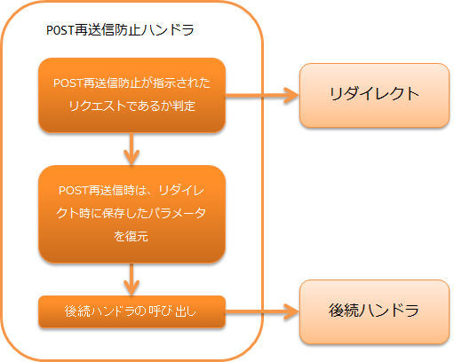

# POST再送信防止ハンドラ

POSTで受け付けたリクエストに対して、リダイレクトを使用し再度リクエストを受け付けなおす処理を行うハンドラ。
この処理により、ブラウザ上のリロード処理などによる誤操作による意図しないPOSTリクエストの再送を防ぐ目的で使用する。


> **Important:** 新規プロジェクトにおける本ハンドラの使用は推奨しない。
> **Important:** 本ハンドラでは、POST再送信防止が指示されたリクエストが送信された際、POST情報をセッションに格納し次のリダイレクト処理でPOST情報をセッションから破棄している。 この方法では、大量のリクエストが送信された際に、POST情報が解放されずにセッションに蓄積され、メモリを圧迫する。 つまり、POSTリクエストを連続して送信するDOS攻撃に対して脆弱である。 本ハンドラを使用せずにブラウザからのPOST情報の再送信を防止するには、業務アクションにてリダイレクトのレスポンスを返すことで実現するよう検討すること。
本ハンドラでは、以下の処理を行う。

* リクエストがPOST再送信防止対象であった場合、リクエストパラメータをセッションに保存してリダイレクト先にリダイレクトする。
(POST再送信防止対象であるか否かの条件は下記2点。)

* リクエストがPOSTであること。
* リクエストパラメータに "POST_RESUBMIT_PREVENT_PARAM" が含まれること。(formタグのpreventPostResubmitがtrueに設定されていると、このパラメータが自動設定される。)


* リクエストがPOST再送信防止によるGETリクエストであった場合、セッションに保持したリクエストパラメータを復元してセッションから削除する。
もしセッションにパラメータが存在しなかった場合、再送信処理として所定のエラー画面を表示する。

処理の流れは以下のとおり。



## ハンドラクラス名

* `nablarch.fw.web.post.PostResubmitPreventHandler`

<details>
<summary>keywords</summary>

PostResubmitPreventHandler, nablarch.fw.web.post.PostResubmitPreventHandler, POST_RESUBMIT_PREVENT_PARAM, preventPostResubmit, POST再送信防止, リダイレクト処理, セッション保存

</details>

## モジュール一覧

```xml
<dependency>
  <groupId>com.nablarch.framework</groupId>
  <artifactId>nablarch-fw-web</artifactId>
</dependency>
```

<details>
<summary>keywords</summary>

nablarch-fw-web, com.nablarch.framework, モジュール依存関係

</details>

## 制約

Nablarchカスタムタグ制御ハンドラ より前に配置すること
本ハンドラは、リクエストの内容をセッションに保持して処理をリダイレクトする。
カスタムタグ制御ハンドラで暗号化パラメータを戻す前にリダイレクトを行う必要があるため、本ハンドラは Nablarchカスタムタグ制御ハンドラ より前に配置する必要がある。

<details>
<summary>keywords</summary>

nablarch_tag_handler, ハンドラ配置順序, DoS攻撃脆弱性, セッションメモリ圧迫, 配置制約, POST情報

</details>

## ポスト再送信防止の使用方法

ポスト再送信防止は、本ハンドラをハンドラキュー上に設定したうえで、 JSPファイル中の n:formタグのpreventPostResubmit属性をtrueに設定することで使用できる。

<details>
<summary>keywords</summary>

preventPostResubmit, n:formタグ, ハンドラキュー設定, POST再送信防止使用方法

</details>

## リクエスト先と遷移先パスのマッピングを行う

リクエスト先と遷移先は、リクエストIDの前方一致で設定できる。
設定例は下記の通り。

```xml
<!-- POST再送信防止ハンドラ -->
<component name="postResubmitPreventHandler"
    class="nablarch.fw.web.post.PostResubmitPreventHandler">

  <!--
  リダイレクト後のGETリクエストが複数回送信された場合の遷移先パスのマッピングを設定する。

  リクエストIDがkeyで指定した場合、valueで設定したパスに遷移する。
  複数のkeyがマッチした場合、最も文字数が長いkeyに対応するvalueのパスに遷移する。
  -->
  <property name="forwardPathMapping">
    <map>
      <entry key="/"  value="redirect:///action/error/index" />
      <entry key="/action/func1/" value="redirect:///action/error/index2" />
      <entry key="/action/func2/" value="/error.jsp" />
    </map>
  </property>
</component>
```
この設定例でリクエストID「/action/func1/index」のように、複数のリクエストIDの前方一致で複数マッチするリクエストID
については、最も長いキーにマッチしたリダイレクト先(上記の場合、"redirect:///action/error/index2")が選択される。

<details>
<summary>keywords</summary>

forwardPathMapping, 前方一致マッピング, リダイレクト先設定, 最長一致, 遷移先パス設定

</details>
