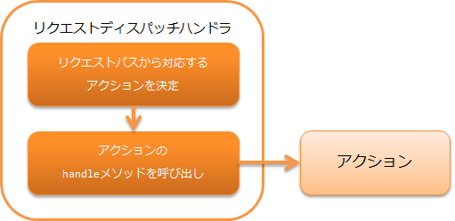

# リクエストディスパッチハンドラ

本ハンドラは、アプリケーションの機能ごとに行う処理を記載するアクションに処理を委譲する。
本ハンドラは、主に メッセージング の機能で、任意のアクションにディスパッチする目的で使用する。

本ハンドラでは、 `Request#getRequestPath()` で取得した
リクエストパスを元に、ディスパッチ先のアクションを選択する。
リクエストパスの形式は以下を想定している。

リクエストパスの形式\: /\<basePath\>/\<className\>

上記形式の\<\>で囲まれた部分はそれぞれ下記を意味する。

| ラベル        意味 |  |
|---|---|
| basePath | ディスパッチ対象を表すベースパス |
| className | クラス名 (必須) |

たとえば、クラス `xxx.yyy.ExampleBatchAction` を呼び出す場合に、ベースパスが `batch` の場合は
`/batch/ExampleBatchAction` のようにリクエストパスを指定する。


> **Important:** 通常、 `Request#getRequestPath()` で取得されるリクエストパスは、 main に記載の通り、コマンドラインで起動する際に `-requestPath` オプションで指定する。
本ハンドラでは、以下の処理を行う。

* リクエストパスを解析し、対応するアクションの handle メソッドを呼び出す。


処理の流れは以下のとおり。



## ハンドラクラス名

* `nablarch.fw.handler.RequestPathJavaPackageMapping`

<details>
<summary>keywords</summary>

RequestPathJavaPackageMapping, nablarch.fw.handler.RequestPathJavaPackageMapping, リクエストディスパッチ, アクション委譲, リクエストパス解析, メッセージングディスパッチ

</details>

## モジュール一覧

```xml
<dependency>
  <groupId>com.nablarch.framework</groupId>
  <artifactId>nablarch-fw</artifactId>
</dependency>
```

<details>
<summary>keywords</summary>

nablarch-fw, モジュール依存設定, com.nablarch.framework

</details>

## 制約

なし。

<details>
<summary>keywords</summary>

制約なし, RequestPathJavaPackageMapping制約

</details>

## ベースパッケージ、ベースパスの設定

本ハンドラのディスパッチ先のクラスを配置するベースパッケージと、リクエストパスにつけるベースパスは、
プロパティ `basePackage` および `basePath` で設定できる。

ベースパッケージを `nablarch.application` 、ベースパスを `/app/action` に設定する例を以下に示す。


```xml
<component class="nablarch.fw.handler.RequestPathJavaPackageMapping">
  <property name="basePath"    value="/app/action/" />
  <property name="basePackage" value="nablarch.application" />
</component>
```

<details>
<summary>keywords</summary>

basePackage, basePath, ベースパッケージ設定, ベースパス設定, RequestPathJavaPackageMapping設定

</details>

## 複数パッケージのクラスにディスパッチする

本ハンドラを使ってディスパッチする場合、ディスパッチ先のクラスは、リクエストパスの指定によって複数振り分けることができる。
この際は、リクエストパスでクラス名を指定する箇所で、ベースパッケージからの相対パッケージ名を指定する。

たとえば上記 ベースパッケージ、ベースパスの設定 を設定した際に、 `nablarch.application.xxx.ExampleBatchAction`
クラスにディスパッチする場合、リクエストパスには `/app/action/xxx/ExampleBatchAction` を指定すればよい。

<details>
<summary>keywords</summary>

複数パッケージディスパッチ, 相対パッケージ指定, リクエストパスサブパッケージ

</details>

## クラス名のプレフィクス、サフィックスの設定

クラス名のプレフィクス、サフィックスをリクエストパスに出したくない場合、本ハンドラの `classNamePrefix` および `classNameSuffix`
を設定することでリクエストパスでの指定を省略できる。

たとえば、クラス名を `XxxProjectXxxxBatchAction` のように、プレフィクスに `XxxProject` というプロジェクト名、
サフィックスに `BatchAction` を指定するルールを取った場合、以下のように設定することでリクエストパスを
`/app/action/Xxxx` のように省略できる。


```xml
<component class="nablarch.fw.handler.RequestPathJavaPackageMapping">
  <property name="basePath"    value="/app/action/" />
  <property name="basePackage" value="nablarch.application" />
  <property name="classNamePrefix" value="XxxProject" />
  <property name="classNameSuffix" value="BatchAction" />
</component>
```

<details>
<summary>keywords</summary>

classNamePrefix, classNameSuffix, クラス名省略, プレフィクス設定, サフィックス設定

</details>

## 複雑なパッケージへのディスパッチ

複数パッケージのクラスにディスパッチする で示した方法では、
「アクションを配置するパッケージを同じパッケージ配下のサブパッケージにまとめないといけない」制約がある。
本ハンドラでは、このようなディスパッチでは問題がある場合に、 アクションを配置するパッケージをリクエストパスごとに別々に設定する方法を提供している。


たとえば、以下のようなリクエストパスとディスパッチ先を設定する場合を考える。

| リクエストパス | ディスパッチ対象クラス |
|---|---|
| /admin/AdminApp | nablarch.sample.apps1.admin.AdminApp |
| /user/UserApp | nablarch.sample.apps2.user.UserApp |
| /BaseApp | nablarch.sample.base.BaseApp |

このようなディスパッチを行う場合、以下のように `optionalPackageMappingEntries` プロパティに
`JavaPackageMappingEntry` クラスを使用して設定する。

```xml
<component class="nablarch.fw.handler.RequestPathJavaPackageMapping">
    <property name="optionalPackageMappingEntries">
      <!-- リクエストパスのパターンとJavaパッケージの組み合わせをマッチさせたい順番に記載する。 -->
      <list>
        <component class="nablarch.fw.handler.JavaPackageMappingEntry">
          <property name="requestPattern" value="/admin//" />
          <property name="basePackage" value="nablarch.sample.apps1" />
        </component>
        <component class="nablarch.fw.handler.JavaPackageMappingEntry">
          <property name="requestPattern" value="/user//" />
          <property name="basePackage" value="nablarch.sample.apps2" />
        </component>
      </list>
    </property>
    <!-- optionalPackageMappingEntriesにマッチするものが存在しない場合に使用されるJavaパッケージ -->
    <property name="basePackage" value="nablarch.sample.base" />
</component>
```

<details>
<summary>keywords</summary>

JavaPackageMappingEntry, nablarch.fw.handler.JavaPackageMappingEntry, optionalPackageMappingEntries, requestPattern, 複雑なパッケージディスパッチ, パッケージマッピング, リクエストパターン設定

</details>

## ディスパッチ対象クラスを遅延実行する

デフォルトではディスパッチ対象クラスへの委譲は即時実行されるが、ハンドラキュー上の後続のハンドラ実行後にディスパッチ対象クラスへ委譲したい場合は、以下の例を参照して `immediate` プロパティにfalseを設定すること。

```xml
<component class="nablarch.fw.handler.RequestPathJavaPackageMapping">
  <property name="basePackage" value="${nablarch.commonProperty.basePackage}" />
  <property name="immediate" value="false" />
</component>
```

<details>
<summary>keywords</summary>

immediate, 遅延実行, ディスパッチタイミング制御, 後続ハンドラ実行後ディスパッチ

</details>
