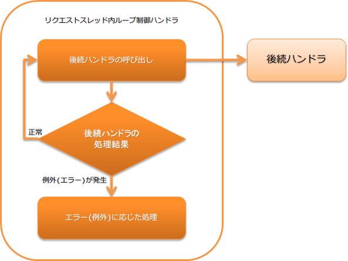

# リクエストスレッド内ループ制御ハンドラ

プロセスの停止要求があるまで、後続のハンドラを繰り返し実行するハンドラ。
このハンドラは、メッセージキューやデータベース上のテーブルなどを監視し、未処理のデータを随時処理するプロセスで使用する。

> **Tip:** メッセージキューやデータベース上のテーブルを監視して処理するプロセスでは、個々のリクエスト(データ)は独立して扱われる。 1つのリクエスト処理がエラーとなっても他のリクエスト処理はそのまま継続しなければならない。 このため、このハンドラで捕捉した例外は、プロセス正常停止要求や致命的な一部の例外を除き処理を継続する。 詳細は、 後続ハンドラで発生した例外(エラー)に応じた処理内容 を参照。
本ハンドラでは、以下の処理を行う。

* 後続ハンドラを繰り返し実行
* プロセス停止要求を示す例外発生時の後続ハンドラ実行の停止 
詳細は、 本ハンドラの停止方法 を参照
* 後続ハンドラで発生した例外(エラー)に応じた処理(ログ出力等) 
詳細は、 後続ハンドラで発生した例外(エラー)に応じた処理内容 を参照

処理の流れは以下のとおり。



## ハンドラクラス名

* `nablarch.fw.handler.RequestThreadLoopHandler`

## モジュール一覧

```xml
<dependency>
  <groupId>com.nablarch.framework</groupId>
  <artifactId>nablarch-fw-standalone</artifactId>
</dependency>
```

## 制約

リトライハンドラ より後ろに配置すること
このハンドラでは、処理が継続可能な例外の場合に `リトライ可能例外(Retryable)` を送出する。
このため、リトライ可能例外を処理する リトライハンドラ よりも後ろにこのハンドラを設定する必要がある。

## サービス閉塞中の待機時間を設定する

後続のハンドラからサービス閉塞中を示す例外(`ServiceUnavailable`)が発生した場合の待機時間を設定することが出来る。
この時間を設定することで、サービスが開局されたかどうかのチェックタイミングを調整することが出来る。

待機時間を長くし過ぎると、サービスが開局中に変更されても、即処理が開始されない問題があるので、要件にあわせて値を設定すること。
なお、設定を省略した場合は、1秒待機後に後続ハンドラを再実行する。

以下に設定例を示す。

```xml
<component class="nablarch.fw.handler.RequestThreadLoopHandler">
  <!-- 待機時間に5秒を設定 -->
  <property name="serviceUnavailabilityRetryInterval" value="5000" />
</component>
```
> **Tip:** 後続ハンドラに ServiceAvailabilityCheckHandler を設定しない場合には、本設定値は設定する必要が無い。 (設定したとしても、この値が使われることはない。)

## 本ハンドラの停止方法

このハンドラは、プロセスの停止要求を示す例外が発生するまで、繰り返し後続のハンドラに対して処理を委譲する。
このため、メンテナンスなどでプロセスを停止する必要がある場合には、本ハンドラより後続に プロセス停止制御ハンドラ を設定し、
外部からプロセスを停止できるようにする必要がある。

プロセス停止要求を示す例外が発生した場合の処理内容は、 後続ハンドラで発生した例外(エラー)に応じた処理内容 を参照。

## 後続ハンドラで発生した例外(エラー)に応じた処理内容

このハンドラで行う後続ハンドラで発生した例外(エラー)に応じた処理内容について解説する。

サービス閉塞中例外(`ServiceUnavailable`)
一定時間待機後に、再度後続ハンドラに処理を委譲する。
待機時間の設定方法は、 サービス閉塞中の待機時間を設定する を参照。

プロセス停止要求を示す例外(`ProcessStop`)
プロセス停止要求を示す例外であるため、本ハンドラの処理を終了する。

プロセスの異常終了を示す例外(`ProcessAbnormalEnd`)
プロセスの異常終了を示す例外のため、捕捉した例外を再送出する。

処理を継続することができなかったことを示すサービスエラー(`ServiceError`)
補足した例外クラスにログ出力処理を委譲し、 `リトライ可能例外(Retryable)` を送出する。

ハンドラの処理が異常終了したことを示す例外(`Result.Error`)
`FATAL` レベルのログを出力し、 `リトライ可能例外(Retryable)` を送出する。

実行時例外(`RuntimeException`)
`FATAL` レベルのログを出力し、 `リトライ可能例外(Retryable)` を送出する。

スレッドの停止を示す例外(`ThreadDeath`)
`INFO` レベルのログを出力し、補足した例外(ThreadDeath)を再送出する。

スタックオーバーフローエラー(`StackOverflowError`)
`FATAL` レベルのログを出力し、 `リトライ可能例外(Retryable)` を送出する。

ヒープ不足のエラー(`OutOfMemoryError`)
標準エラー出力にヒープ不足が発生したことを示すメッセージを出力し、 `FATAL` レベルのログ出力を行う。
(ログ出力時に再度ヒープ不足が発生する可能性があるため、標準エラー出力にメッセージ出力後にログを出力する。)

ヒープ不足の原因不足となったオブジェクトへの参照が切れ、処理継続可能な場合があるため `リトライ可能例外(Retryable)` を送出する。

JVMの異常を示すエラー(`VirtualMachineError`)
発生した例外を再送出する

上記以外のエラー
`FATAL` レベルのログを出力し、 `リトライ可能例外(Retryable)` を送出する。
