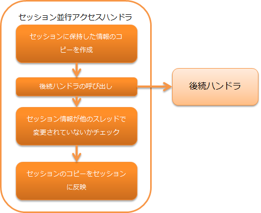

# セッション並行アクセスハンドラ

> **Important:** 新規プロジェクトにおける本ハンドラの使用は推奨しない。セッション変数保存ハンドラを使用すること。
本ハンドラはセッションごとにリクエスト処理の並行同時アクセスに対して、同時実行に
よって発生するスレッド間の処理不整合を防ぐ機能を提供する。


本ハンドラでは、以下の処理を行う。

* セッションに保持した情報のコピーを作成する
* 処理終了後、他のスレッドによってセッションが更新されていないかチェックし、更新済みであればエラーとする
* 処理終了後、セッション情報のコピーをセッションに反映する




## ハンドラクラス名

* `nablarch.fw.web.handler.SessionConcurrentAccessHandler`

<details>
<summary>keywords</summary>

SessionConcurrentAccessHandler, nablarch.fw.web.handler.SessionConcurrentAccessHandler, セッション並行アクセス制御, スレッド処理不整合防止, セッション排他制御, 並行アクセス制御, 非推奨ハンドラ

</details>

## モジュール一覧

```xml
<dependency>
  <groupId>com.nablarch.framework</groupId>
  <artifactId>nablarch-fw-web</artifactId>
</dependency>
```

<details>
<summary>keywords</summary>

nablarch-fw-web, com.nablarch.framework, モジュール依存関係

</details>

## 制約

なし。

<details>
<summary>keywords</summary>

制約なし, 使用制限なし

</details>
