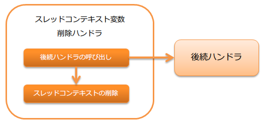

# スレッドコンテキスト変数削除ハンドラ

スレッドコンテキスト変数管理ハンドラ で設定したスレッドローカル上の変数を削除するハンドラ。

本ハンドラでは、以下の処理を行う。

* スレッドコンテキストの削除処理

処理の流れは以下のとおり。



## ハンドラクラス名

* `nablarch.common.handler.threadcontext.ThreadContextClearHandler`

<details>
<summary>keywords</summary>

ThreadContextClearHandler, nablarch.common.handler.threadcontext.ThreadContextClearHandler, スレッドコンテキスト変数削除ハンドラ, ハンドラクラス

</details>

## モジュール一覧

```xml
<dependency>
  <groupId>com.nablarch.framework</groupId>
  <artifactId>nablarch-fw</artifactId>
</dependency>
```

<details>
<summary>keywords</summary>

nablarch-fw, com.nablarch.framework, モジュール依存関係, Maven依存設定

</details>

## 制約

本ハンドラは極力手前側に配置すること。
なぜなら復路処理では、本ハンドラより手前のハンドラではスレッドコンテキストにアクセスできなくなるため。

<details>
<summary>keywords</summary>

ハンドラ配置順序, スレッドコンテキストアクセス制約, 復路処理, ハンドラキュー配置

</details>

## スレッドコンテキストの削除処理

スレッドコンテキスト変数管理ハンドラ でスレッドローカル上に設定した値を全て削除する。

<details>
<summary>keywords</summary>

スレッドコンテキスト削除, スレッドローカル変数削除, ThreadContextHandler, 変数クリア

</details>
