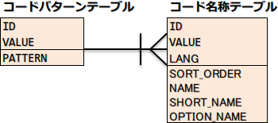
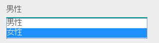
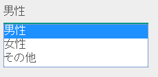
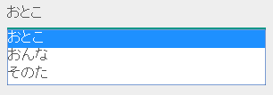

# コード管理

## 概要

アプリケーションで使用する値と名称とのマッピングを管理する機能を提供する。

例えば、以下の様な性別区分と表示名称のマッピング情報を管理する。

| 値 | 名称 | 略称 |
|---|---|---|
| male | 男性 | 男 |
| female | 女性 | 女 |


> **Important:** この機能では、静的なコード情報(値と名称とのマッピング)を管理するものであり、\ 「商品コード」や「企業コード」といった値に紐づく情報が動的に変化するものは管理対象外とする。 このような情報は、アプリケーションでマスタ用のテーブルを作成し、対処すること。
> **Important:** この機能を使用すると、コードの名称を持つテーブルとコード値を持つテーブルにRDBMSの参照整合性制約を設定できない。 このような制約のチェックには code-validation を使用すること。
> **Tip:** 静的なコード情報については、以下の理由によりenumで表現したほうが良い。 * 値と名称の単純なマッピングを行いたいだけの場合、データベースを使用したコード定義は大掛かりであり、メンテナンスのコストが掛かる。 * データベースを使ったコード定義の場合、Java上でコード値を扱うための数値型定数を定義することが多いため二重メンテナンスが発生する。 しかし、Nablarchはenumの値とデータベースの値との相互変換の機能を持っておらず、enumの値をデータベースに登録できない。 Domaを使用することで、enumの値をデータベース登録できる。 Domaを使用する際は、 doma_adaptor を参照して設定すること。

## 機能概要

## 国際化に対応できる

この機能は、言語ごとに名称を管理することが出来る。

詳細は、 code-use_multilingualization を参照。

## コード情報はテーブルで管理する

この機能は、値及び名称の情報をデータベース上で管理する。
このため、事前にデータベースにテーブルを作成し、静的なコード情報をテーブル上に登録しておくこと。

詳細は、 code-setup_table を参照。

## モジュール一覧

```xml
<dependency>
  <groupId>com.nablarch.framework</groupId>
  <artifactId>nablarch-common-code</artifactId>
</dependency>
<dependency>
  <groupId>com.nablarch.framework</groupId>
  <artifactId>nablarch-common-code-jdbc</artifactId>
</dependency>
```

## 使用方法

<details>
<summary>keywords</summary>

BasicCodeManager, BasicStaticDataCache, BasicCodeLoader, CodePatternSchema, CodeNameSchema, BasicApplicationInitializer, コード管理機能設定, コードパターンテーブル, コード名称テーブル, 初期設定, codeManager, loadOnStartup, CodeUtil, パターン切り替え, CodePatternSchema, patternColumnNames, getValues, codeSelect, pattern属性, PATTERN1, PATTERN2, CodeUtil, 多言語化対応, getName, getShortName, Locale, LANG, 言語指定, SORT_ORDER, ソート順定義, コード名称テーブル, codeSelect, CodeUtil, getOptionalName, オプション名称, OPTIONAL_NAME, optionColumnName, labelPattern, FORM_NAME, KANA_NAME, CodePatternSchema, patternColumnNames, @CodeValue, バリデーション, CodeValue, bean_validation, nablarch_validation, pattern属性, SampleDomainBean, ドメインバリデーション, コード管理, コード値名称マッピング, 値, 名称, 略称, 国際化対応, 多言語化, 参照整合性制約, code-validation, doma_adaptor, テーブル管理, nablarch-common-code, nablarch-common-code-jdbc, モジュール依存関係, Maven

</details>

## コード管理機能を使用する為の初期設定

この機能を使用するためには、コードを管理するためのテーブルを作成し、その情報を設定ファイルに設定する必要がある。

以下にテーブルの構造及び設定例を示す。

テーブルの構造
コード情報は、 `コードパターンテーブル` と `コード名称テーブル` の2つのテーブルを使用する。
2テーブルの関係は、以下のとおり。


設定ファイル例
コード管理を使用する為の設定ファイル例を以下に示す。

ポイント
* `BasicCodeManager` のコンポーネント名は、 **codeManager** とすること。
* `BasicStaticDataCache` の `loadOnStartup` に対する設定値は、 static_data_cache-cache_timing を参照すること。
* `BasicCodeLoader` および `BasicStaticDataCache` は、初期化が必要なので初期化対象のリストに設定すること。

```xml
<component name="codeLoader" class="nablarch.common.code.BasicCodeLoader">

  <!-- コードパターンテーブルのスキーマ情報 -->
  <property name="codePatternSchema">
    <component class="nablarch.common.code.schema.CodePatternSchema">
      <!-- CodePatternSchemaのプロパティにテーブル名及びカラム名を設定する。 -->
    </component>
  </property>

  <!-- コード名称テーブルのスキーマ情報 -->
  <property name="codeNameSchema">
    <component class="nablarch.common.code.schema.CodeNameSchema">
      <!-- CodeNameSchemaのプロパティにテーブル名及びカラム名を設定する。 -->
    </component>
  </property>
</component>

<!-- データベースから取得した情報をキャッシュするための設定 -->
<component name="codeCache" class="nablarch.core.cache.BasicStaticDataCache" >
  <property name="loader" ref="codeLoader"/>
  <property name="loadOnStartup" value="false"/>
</component>

<!-- データベースから取得した情報をキャッシュするクラスをBasicCodeManagerに設定する -->
<component name="codeManager" class="nablarch.common.code.BasicCodeManager" >
  <property name="codeDefinitionCache" ref="codeCache"/>
</component>

<!-- BasicCodeLoaderとBasicStaticDataCacheは初期化が必要なため初期化リストに設定する -->
<component name="initializer"
    class="nablarch.core.repository.initialization.BasicApplicationInitializer">
  <property name="initializeList">
    <list>
      <component-ref name="codeLoader"/>
      <component-ref name="codeCache"/>
    </list>
  </property>
</component>
```

## 機能毎に使用するコード情報を切り替える

コード情報をリスト表示する際に、機能毎に表示・非表示を切り替えたい場合がある。
このような場合は、コードパターンテーブルのパターンを用いて、機能毎にどのパターンの情報を表示するか否かを切り替える。


以下に例を示す。

コードパターンテーブルにパターンカラムを定義する
コードパターンテーブルに表示パターンを持つパターン列を定義する。

パターン列は、 `CodePatternSchema.patternColumnNames` に設定することで使用可能となる。
設定ファイルへの設定方法は、 code-setup_table を参照。


この例では、 `PATTERN1` と `PATTERN2` の2つのパターンを定義し、
`PATTERN2` ではOTHERを非表示としている。

コードパターンテーブル
| ID | VALUE | PATTERN1 | PATTERN2 |
|---|---|---|---|
| GENDER | MALE | 1 | 1 |
| GENDER | FEMALE | 1 | 1 |
| GENDER | OTHER | 1 | 0 |

コード名称テーブル
| ID | VALUE | LANG | SORT_ORDER | NAME | SHORT_NAME |
|---|---|---|---|---|---|
| GENDER | MALE | ja | 1 | 男性 | 男 |
| GENDER | FEMALE | ja | 2 | 女性 | 女 |
| GENDER | OTHER | ja | 3 | その他 | 他 |

パターンを指定してコード情報を取得する
コード情報は、 `CodeUtil` を使用して取得する。

パターンを使用する場合、どのパターンを使用するかは文字列で指定する。
この値は、 code-setup_table で設定ファイルに設定したカラム名と厳密に一致させる必要がある。

```java
// PATTER1のリストを取得する。
// [MALE, FEMALE, OTHER]が取得できる。
List<String> pattern1 = CodeUtil.getValues("GENDER", "PATTERN1");

// PATTER2のリストを取得する。
// [MALE, FEMALE]が取得できる。
List<String> pattern2 = CodeUtil.getValues("GENDER", "PATTERN2");
```
画面(JSP)でパターンを指定してコード情報を取得する
コード情報を取得するカスタムタグライブラリを使用する際に、パターンを指定することでそのパターンの情報のみが表示される。

カスタムタグライブラリの詳細な使用方法は、以下を参照。

* tag-code_input_output

PATTERN2を指定する場合は、以下のように `pattern` 属性に指定する。

```jsp
<n:codeSelect name="form.gender" codeId="GENDER" pattern="PATTERN2" cssClass="form-control" />
```
PATTERN2で対象となっている、 `男性` と `女性` が出力される。



## 名称の多言語化対応

名称の多言語化対応を行うには、コード名称テーブルにサポートする言語ごとのデータを準備する。

以下に例を示す。

コード名称テーブルのデータ
この例の場合、 `ja` と `en` の２つの言語がサポートされる。

| ID | VALUE | LANG | SORT_ORDER | NAME | SHORT_NAME |
|---|---|---|---|---|---|
| GENDER | MALE | ja | 1 | 男性 | 男 |
| GENDER | FEMALE | ja | 2 | 女性 | 女 |
| GENDER | OTHER | ja | 3 | その他 | 他 |
| GENDER | MALE | en | 1 | Male | M |
| GENDER | FEMALE | en | 2 | Female | F |
| GENDER | OTHER | en | 3 | Unknown | \- |

言語を指定してコード情報を取得する
`CodeUtil` を使用して、言語に対応した名称を取得出来る。

```java
// 名称
CodeUtil.getName("GENDER", "MALE", Locale.JAPANESE);    // -> 男性
CodeUtil.getName("GENDER", "MALE", Locale.ENGLISH);     // -> Male

// 略称
CodeUtil.getShortName("GENDER", "MALE", Locale.JAPANESE) // -> 男
CodeUtil.getShortName("GENDER", "MALE", Locale.ENGLISH) // -> M
```
> **Important:** JSP用に提供されているカスタムタグライブラリでは、言語指定による値の取得はできないので注意すること。 カスタムタグライブラリが使用する言語情報の詳細は、 tag-code_input_output を参照。

## 画面などで表示する名称のソート順を定義する

画面のリストボックやチェックボックスにコード情報を表示する際のソート順を定義出来る。
ソート順は、国ごとに異なる可能性があるため、言語ごとに設定することが出来る。


以下に例を示す。

コード名称テーブルのSORT_ORDERにソート順を設定する
ソート順は、コード名称テーブルのSORT_ORDERカラムに設定する。

この例では、 `MALE` -> `FEMALE` -> `OTHER` の順に表示される。

| ID | VALUE | LANG | SORT_ORDER | NAME | SHORT_NAME |
|---|---|---|---|---|---|
| GENDER | MALE | ja | 1 | 男性 | 男 |
| GENDER | FEMALE | ja | 2 | 女性 | 女 |
| GENDER | OTHER | ja | 3 | その他 | 他 |

画面表示例
カスタムタグライブラリの `codeSelect` を使用した場合は、
以下のように  `MALE(男性)` -> `FEMALE(女性)` -> `OTHER(その他)` の順に表示される。



## 名称、略称以外の名称を定義する

デフォルトの動作では名称と略称の2種類の名称を使用できる。

要件によっては、これら以外の表示名称を定義したい場合がある。
この場合は、オプション名称領域を使用して対応する。

以下に例を示す。

コード名称テーブルにオプション名称カラムを定義する
コード名称テーブルに、オプションの名称を持つカラムを定義する。

パターン列は、 `CodePatternSchema.patternColumnNames` に設定することで使用可能となる。
設定ファイルへの設定方法は、 code-setup_table を参照。

この例では、オプション名称のカラムとして、 `FORM_NAME` と `KANA_NAME` の2つを定義している。

| ID | VALUE | LANG | SORT_ORDER | NAME | SHORT_NAME | FORM_NAME | KANA_NAME |
|---|---|---|---|---|---|---|---|
| GENDER | MALE | ja | 1 | 男性 | 男 | Male | おとこ |
| GENDER | FEMALE | ja | 2 | 女性 | 女 | Female | おんな |
| GENDER | OTHER | ja | 3 | その他 | 他 | Other | そのた |


オプションの名称を取得する
オプション名称は、  `CodeUtil` を使用して取得する。

オプション名称を取得する場合、どのオプション名称を取得するかを文字列で指定する。
この値は、 code-setup_table で設定ファイルに設定したカラム名と厳密に一致させる必要がある。

```java
CodeUtil.getOptionalName("GENDER", "MALE", "KANA_NAME") // -> おとこ
CodeUtil.getOptionalName("GENDER", "FEMALE", "FORM_NAME", Locale.JAPANESE) // -> Female
```
画面(JSP)でオプショナル名称を表示する
カスタムタグライブラリを使用する際に、オプショナル名称を指定することでその名称を表示できる。

カスタムタグライブラリの詳細な使用方法は以下を参照。

* code_select
* code

KANA_NAMEの名称を表示する場合は、以下のように `optionColumnName` を指定し、 `labelPattern` に **$OPTIONALNAME$** を指定する。

```jsp
<n:codeSelect name="form.gender" codeId="GENDER" optionColumnName="KANA_NAME" cssClass="form-control" labelPattern="$OPTIONALNAME$"/>
```
オプション名称のKANA_NAMEの値が表示される。



## 入力値が有効なコード値かチェックする

入力値(画面の場合はクライアントから送信されるリクエストパラメータ)が、コードの有効範囲内かをチェック出来る機能を提供する。
この機能を使用すると、アノテーションの設定のみで入力値のチェックを行える。

以下に例を示す。

bean_validation
bean_validation を使用する場合は、 `nablarch.common.code.validator.ee.CodeValue` アノテーションを使用する。

```java
@CodeValue(codeId = "GENDER")
private String gender;
```
nablarch_validation
nablarch_validation を使用する場合は、 `nablarch.common.code.validator.CodeValue` アノテーションを使用する。

```java
@CodeValue(codeId = "GENDER")
public void setGender(String gender) {
  this.gender = gender;
}
```
入力画面などで、 パターン を使用して、選択できる値を制限した場合、
バリデーション時にもそのパターン内で有効な値かをチェックする必要がある。

バリデーション用のアノテーションの `pattern` 属性にパターン名を指定することで、
そのパターンで有効な値かをチェックできる。

以下に例を示す。

```java
@CodeValue(codeId = "GENDER", pattern = "PATTERN2")
private String gender;
```
> **Tip:** `ドメインバリデーション <bean_validation-domain_validation>` を使用した場合、1つのドメインに対して1つのパターンしか指定できない。 このため、複数のパターンに対応するためには、パターンに対応したドメインを定義する必要がある。 ただし、全てのパターンに対応したドメインを定義する必要はなく、バリデーションで必要なドメインのみ定義すればよい。 以下に例を示す。 .. code-block:: java public class SampleDomainBean { // PATTERN1用のドメイン @CodeValue(codeId = "FLOW_STATUS", pattern = "PATTERN1") String flowStatusGeneral; // PATTERN2用のドメイン @CodeValue(codeId = "FLOW_STATUS", pattern = "PATTERN2") String flowStatusGuest; }
