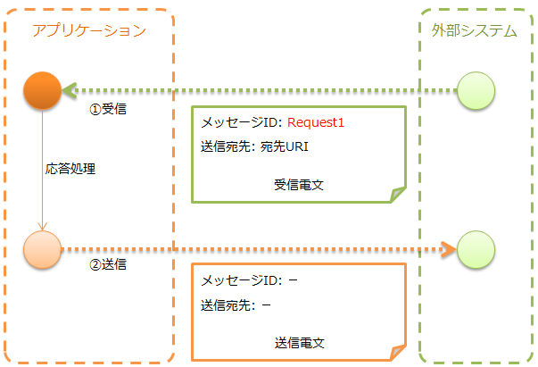
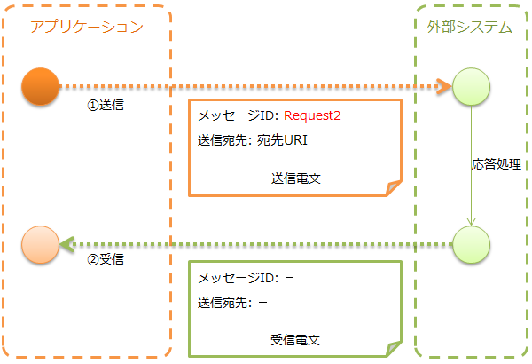

# HTTPメッセージング

**公式ドキュメント**: [1](https://nablarch.github.io/docs/LATEST/doc/application_framework/application_framework/libraries/system_messaging/http_system_messaging.html) [2](https://nablarch.github.io/docs/LATEST/javadoc/nablarch/fw/messaging/action/MessagingAction.html) [3](https://nablarch.github.io/docs/LATEST/javadoc/nablarch/fw/messaging/MessageSender.html) [4](https://nablarch.github.io/docs/LATEST/javadoc/nablarch/fw/messaging/MessageSenderClient.html) [5](https://nablarch.github.io/docs/LATEST/javadoc/nablarch/fw/messaging/realtime/http/client/HttpMessagingClient.html) [6](https://nablarch.github.io/docs/LATEST/javadoc/nablarch/fw/messaging/RequestMessage.html) [7](https://nablarch.github.io/docs/LATEST/javadoc/nablarch/fw/messaging/SyncMessage.html) [8](https://nablarch.github.io/docs/LATEST/javadoc/nablarch/fw/messaging/FwHeaderDefinition.html) [9](https://nablarch.github.io/docs/LATEST/javadoc/nablarch/fw/messaging/StandardFwHeaderDefinition.html)

## 機能概要

HTTPを使ったメッセージの送受信機能。メッセージのフォーマットには [data_format](libraries-data_format.md) を使用する。

> **重要**: フレームワーク制御ヘッダはメッセージボディに含めることを前提としているため、外部システムで既に電文フォーマットが規定されている場合は適合しない場合がある。代替機能の使用を推奨する。
> - サーバサイド(メッセージ受信): :ref:`restful_web_service` の使用を推奨。
> - クライアントサイド(メッセージ送信): Jakarta RESTful Web ServicesのClient機能の使用を推奨。
>
> やむを得ず本機能を使用する場合は [http_system_messaging-change_fw_header](#s4) を参照してプロジェクトで実装を追加すること。

| 送受信の種類 | 実行制御基盤 |
|---|---|
| HTTPメッセージ受信([http_system_messaging-message_receive](#s3)) | :ref:`http_messaging` |
| HTTPメッセージ送信([http_system_messaging-message_send](#s3)) | 実行制御基盤に依存しない |

[mom_system_messaging](libraries-mom_system_messaging.md) と同じAPI（`MessagingAction` / `MessageSender`）で実装できるため、学習コストが低い。

<details>
<summary>keywords</summary>

MessagingAction, MessageSender, HTTPメッセージング, メッセージ送受信, MOMメッセージング互換, 実行制御基盤, HTTPメッセージ受信, HTTPメッセージ送信

</details>

## モジュール一覧

**モジュール**:
```xml
<dependency>
  <groupId>com.nablarch.framework</groupId>
  <artifactId>nablarch-fw-messaging</artifactId>
</dependency>
<dependency>
  <groupId>com.nablarch.framework</groupId>
  <artifactId>nablarch-fw-messaging-http</artifactId>
</dependency>
```

<details>
<summary>keywords</summary>

nablarch-fw-messaging, nablarch-fw-messaging-http, モジュール依存関係, Maven依存関係

</details>

## 使用方法

### HTTPメッセージングを使うための設定

- メッセージ受信の場合: ハンドラ構成以外に設定不要。
- メッセージ送信の場合: `MessageSenderClient` の実装クラスをコンポーネント定義に追加する。デフォルト実装は `HttpMessagingClient`。コンポーネント名は `messageSenderClient` と指定すること（ルックアップで使用される）。

```xml
<component name="messageSenderClient"
           class="nablarch.fw.messaging.realtime.http.client.HttpMessagingClient" />
```

### メッセージを受信する(HTTPメッセージ受信)

外部システムからメッセージを受信し、応答を返す。



- `MessagingAction` を継承して実装する。
- 応答電文は `RequestMessage.reply` で作成する。

```java
public class SampleAction extends MessagingAction {
    protected ResponseMessage onReceive(RequestMessage request,
                                        ExecutionContext context) {
        Map<String, Object> reqData = request.getParamMap();
        return request.reply()
                .setStatusCodeHeader("200")
                .addRecord(new HashMap() {{
                     put("FIcode",     "9999");
                     put("FIname",     "ﾅﾌﾞﾗｰｸｷﾞﾝｺｳ");
                     put("officeCode", "111");
                  }});
    }
}
```

### メッセージを送信する(HTTPメッセージ送信)

外部システムにメッセージを送信し、応答または待機タイムアウトまで待機する。タイムアウト時は補償処理が必要。



- 要求電文は `SyncMessage` で作成する。
- 送信には `MessageSender.sendSync` を使用する。

```java
SyncMessage requestMessage = new SyncMessage("RM11AC0202")
                               .addDataRecord(new HashMap() {{
                                    put("FIcode",     "9999");
                                    put("FIname",     "ﾅﾌﾞﾗｰｸｷﾞﾝｺｳ");
                                    put("officeCode", "111");
                                }});
SyncMessage responseMessage = MessageSender.sendSync(requestMessage);
```

HTTPヘッダに独自項目を追加する場合:
```java
requestMessage.getHeaderRecord().put("Accept-Charset", "UTF-8");
```

<details>
<summary>keywords</summary>

MessageSenderClient, HttpMessagingClient, MessagingAction, SyncMessage, MessageSender, ResponseMessage, RequestMessage, ExecutionContext, HTTPメッセージ受信, HTTPメッセージ送信, messageSenderClient, コンポーネント定義, メッセージ送信設定

</details>

## 拡張例

### フレームワーク制御ヘッダの読み書きを変更する

- **HTTPメッセージ送信の場合**: メッセージボディのフォーマット定義を変更すればよい。
- **HTTPメッセージ受信の場合**: `FwHeaderDefinition` インタフェースを実装したクラスが読み書きを担う（デフォルト: `StandardFwHeaderDefinition`）。プロジェクトで `FwHeaderDefinition` を実装したクラスを作成し、[http_messaging_request_parsing_handler](../handlers/handlers-http_messaging_request_parsing_handler.md) と [http_messaging_response_building_handler](../handlers/handlers-http_messaging_response_building_handler.md) に設定する。

> **補足**: フレームワーク制御ヘッダの使用は任意。特別要件がない限り使用する必要はない。

### HTTPメッセージ送信のHTTPクライアント処理を変更する

`HttpMessagingClient` のデフォルト動作がプロジェクト要件に合わない場合（例: `Accept: text/json,text/xml` が固定設定される）は、`HttpMessagingClient` を継承したクラスを作成し、[http_system_messaging-settings](#s3) の方法でコンポーネント定義に追加してカスタマイズする。

<details>
<summary>keywords</summary>

FwHeaderDefinition, StandardFwHeaderDefinition, HttpMessagingClient, フレームワーク制御ヘッダのカスタマイズ, HTTPクライアント処理変更, フレームワーク制御ヘッダ読み書き変更

</details>

## 送受信電文のデータモデル


### プロトコルヘッダ

ウェブコンテナによるメッセージ送受信処理に使用される情報を格納したヘッダ領域。Mapインターフェースでアクセス可能。

### 共通プロトコルヘッダ

フレームワークが使用するヘッダ（キー名をカッコで示す）:

- **メッセージID (X-Message-Id)**: 電文ごとに一意採番される文字列。送信時は送信処理で採番した値、受信時は送信側が発番した値。
- **関連メッセージID (X-Correlation-Id)**: 電文が関連する電文のメッセージID。応答電文では要求電文のメッセージID、再送要求では応答再送を要求する要求電文のメッセージID。

### メッセージボディ

HTTPリクエストのデータ領域。フレームワーク機能は原則プロトコルヘッダ領域のみを使用し、それ以外は未解析のバイナリデータとして扱う。[data_format](libraries-data_format.md) によって解析し、フィールド名をキーとするMap形式で読み書き可能。

### フレームワーク制御ヘッダ

フレームワーク機能が電文中に定義されていることを前提とする制御項目群。

| 制御項目 | フィールド名(デフォルト) | 説明 | 使用するハンドラ |
|---|---|---|---|
| リクエストID | requestId | 実行する業務処理を識別するID | [request_path_java_package_mapping](../handlers/handlers-request_path_java_package_mapping.md), [message_resend_handler](../handlers/handlers-message_resend_handler.md), :ref:`permission_check_handler`, :ref:`ServiceAvailabilityCheckHandler` |
| ユーザID | userId | 電文の実行権限を表す文字列 | :ref:`permission_check_handler` |
| 再送要求フラグ | resendFlag | 再送要求電文の送信時に設定されるフラグ | [message_resend_handler](../handlers/handlers-message_resend_handler.md) |
| ステータスコード | statusCode | 要求電文に対する処理結果コード | [message_reply_handler](../handlers/handlers-message_reply_handler.md) |

標準的なフレームワーク制御ヘッダのフォーマット定義例:

```bash
[NablarchHeader]
1   requestId   X(10)       # リクエストID
11  userId      X(10)       # ユーザID
21  resendFlag  X(1)  "0"   # 再送要求フラグ (0: 初回送信 1: 再送要求)
22  statusCode  X(4)  "200" # ステータスコード
26 ?filler      X(25)       # 予備領域
```

フォーマット定義にフレームワーク制御ヘッダ以外の項目を含めた場合は任意ヘッダ項目としてアクセス可能（プロジェクト毎の簡易拡張に使用可能）。将来的な項目追加に対応するため予備領域を設けることを強く推奨。

<details>
<summary>keywords</summary>

プロトコルヘッダ, 共通プロトコルヘッダ, メッセージボディ, フレームワーク制御ヘッダ, requestId, userId, resendFlag, statusCode, X-Message-Id, X-Correlation-Id, データモデル, NablarchHeader

</details>
