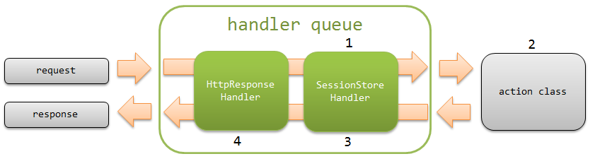

# セッションストア

**目次**

* 機能概要

  * セッション変数の保存先を選択できる
  * セッション変数の直列化の仕組みを選択できる
* モジュール一覧
* 制約

  * 保存対象はシリアライズ可能なJava Beansオブジェクトであること
* 使用方法

  * セッションストアを使用するための設定
  * 入力～確認～完了画面間で入力情報を保持する
  * 認証情報を保持する
  * JSPからセッション変数の値を参照する
  * HIDDENストアの暗号化設定をカスタマイズする
  * セッション変数に値が存在しない場合の遷移先画面を指定する
* 拡張例

  * セッション変数の保存先を追加する
* セッションストアの特長と選択基準
* 有効期間の管理方法

HTTPセッションを抽象化した機能を提供する。

本機能では、セッションを識別するためにセッションIDを発行し、
クッキー( `NABLARCH_SID` (変更可))を使用して、セッションを追跡する。
そして、セッションIDごとにセッションストアと呼ばれる保存先へ読み書きする機能を提供する。

本機能では、セッションIDごとにセッションストアに読み書きされる値をセッション変数と呼ぶ。

簡単な処理の流れを以下の図に示す。



1. [セッション変数保存ハンドラ](../../component/handlers/handlers-SessionStoreHandler.md#session-store-handler) の往路処理で、クッキーから取得したセッションIDをもとに、セッションストアからセッション変数をロードする。
2. 業務アクションから SessionUtil を通して、セッション変数に対して読み書きする。
3. [セッション変数保存ハンドラ](../../component/handlers/handlers-SessionStoreHandler.md#session-store-handler) の復路処理で、セッション変数をセッションストアに保存する。
4. JSPで参照できるように、セッション変数をリクエストスコープに設定する。(既にリクエストスコープに同名の値が存在する場合は設定しない。)

> **Important:**
> 本機能を使用する場合、以下の機能は用途が重複するため非推奨となる。

> * >   [hidden暗号化](../../component/libraries/libraries-tag.md#tag-hidden-encryption)
> * >   [セッション並行アクセスハンドラ](../../component/handlers/handlers-session-concurrent-access-handler.md#session-concurrent-access-handler)
> * >   ExecutionContext のセッションスコープにアクセスするAPI

> **Tip:**
> 本機能で使用するクッキー( `NABLARCH_SID` )は、HTTPセッションの追跡に使用されるJSESSIONIDとは全く別物である。

> **Tip:**
> Nablarch 5u16より、セッションストアの有効期間保存先にHTTPセッション以外も選べるようになった。

> **Tip:**
> クッキーで使用するセッションIDには、UUID を使用している。

## 機能概要

### セッション変数の保存先を選択できる

セッション変数の保存先を、用途に応じて選択できる。

標準では以下の3種類のストアを提供している。

* [DBストア](../../component/libraries/libraries-session-store.md#session-store-db-store)
* [HIDDENストア](../../component/libraries/libraries-session-store.md#session-store-hidden-store)
* [HTTPセッションストア](../../component/libraries/libraries-session-store.md#session-store-http-session-store)

セッションストアの特長や選択基準については、 [セッションストアの特長と選択基準](../../component/libraries/libraries-session-store.md#session-store-future-of-store) を参照。

また、 [Redisストア(Lettuce)アダプタ](../../component/adapters/adapters-redisstore-lettuce-adaptor.md#redisstore-lettuce-adaptor) を使用することで、Redisを保存先として使用できる。

### セッション変数の直列化の仕組みを選択できる

セッション変数をセッションストアに保存する際の直列化の仕組みを以下から選択できる。
各機能の詳細はリンク先のJavadocを参照。

* Java標準のシリアライズによる直列化(デフォルト)
* Java標準のシリアライズによる直列化、および暗号化
* Jakarta XML BindingによるXMLベースの直列化

## モジュール一覧

```xml
<dependency>
  <groupId>com.nablarch.framework</groupId>
  <artifactId>nablarch-fw-web</artifactId>
</dependency>

<!-- DBストアを使用する場合のみ -->
<dependency>
  <groupId>com.nablarch.framework</groupId>
  <artifactId>nablarch-fw-web-dbstore</artifactId>
</dependency>
```

## 制約

### 保存対象はシリアライズ可能なJava Beansオブジェクトであること

セッションストアに保存するオブジェクトはシリアライズ可能なJava Beansオブジェクトである必要がある。

オブジェクトが持つプロパティの型は、Javaの基本型もしくはシリアライズ可能なJava Beansオブジェクトである必要がある。
また、プロパティには配列やコレクションを使用できる。

## 使用方法

### セッションストアを使用するための設定

セッションストアを使用するためには、 [セッション変数保存ハンドラ](../../component/handlers/handlers-SessionStoreHandler.md#session-store-handler) の設定に加えて、
SessionManager をコンポーネント定義に設定する。

以下に、標準で提供している全ての保存先を使用する場合の設定例を示す。

```xml
<!-- "sessionManager"というコンポーネント名で設定する -->
<component name="sessionManager" class="nablarch.common.web.session.SessionManager">

  <!--
    保存先を明示的に指定しなかった場合にデフォルトで使用されるストア名
  -->
  <property name="defaultStoreName" value="db"/>

  <!-- アプリケーションで使用する保存先に合わせてコンポーネントを追加する -->
  <property name="availableStores">
    <list>
      <!-- HIDDENストア -->
      <component class="nablarch.common.web.session.store.HiddenStore">
        <!-- 設定値の詳細はJavadocを参照 -->
      </component>

      <!-- DBストア -->
      <component-ref name="dbStore" />

      <!-- HTTPセッションストア -->
      <component class="nablarch.common.web.session.store.HttpSessionStore">
        <!-- 設定値の詳細はJavadocを参照 -->
      </component>
    </list>
  </property>
</component>

<component name="dbStore" class="nablarch.common.web.session.store.DbStore">
  <!-- 設定値の詳細はJavadocを参照 -->
</component>

<!-- DBストアの初期化設定 -->
<component name="initializer"
    class="nablarch.core.repository.initialization.BasicApplicationInitializer">
  <property name="initializeList">
    <list>
      <!-- 他のコンポーネントは省略 -->
      <component-ref name="dbStore" />
    </list>
  </property>
</component>
```

なお、DBストアを使用する場合、データベース上にセッション変数を保存するためのテーブルを作成する必要がある。

作成するテーブルの定義を以下に示す。

USER_SESSION テーブル
| カラム名 | データ型 |
|---|---|
| SESSION_ID(PK) | java.lang.String |
| SESSION_OBJECT | byte[] |
| EXPIRATION_DATETIME | java.sql.Timestamp |

Oracleで正常に動作しないケースがあるため、 SESSION_ID はCHARではなくVARCHARで定義すること。

テーブル名およびカラム名は変更可能である。
変更する場合は、 DbStore.userSessionSchema に
UserSessionSchema のコンポーネントを定義する。

```xml
<property name="userSessionSchema">
  <component class="nablarch.common.web.session.store.UserSessionSchema">
    <!-- 設定値の詳細はJavadocを参照 -->
  </component>
</property>
```

> **Tip:**
> DBストアを使用した場合、ブラウザが閉じられた場合などにテーブル上にセッション情報が残ってしまうことがある。
> そのため、期限切れのセッション情報は定期的に削除する必要がある。

### 入力～確認～完了画面間で入力情報を保持する

入力～確認～完了画面間で入力情報を保持する場合、
複数タブでの画面操作を許容するか否かでセッションストアを使い分ける。

複数タブでの画面操作を許容しない場合
DBストアを使用してデータベース上のテーブルにセッション変数を保持する。
複数タブでの画面操作を許容する場合
HIDDENストアを使用してクライアントサイドにセッション変数を保持する。

HIDDENストアを使用する場合、以下の様に入力・確認画面のJSPに [hiddenStoreタグ](../../component/libraries/libraries-tag-reference.md#tag-hidden-store-tag) を使用する。

```jsp
<n:form>
  <!--
    name属性にはコンポーネント設定ファイルに定義した、
    HiddenStoreのparameterNameプロパティの値を設定
  -->
  <n:hiddenStore name="nablarch_hiddenStore" />
  <!-- その他のタグは省略 -->
</n:form>
```

入力～確認～完了画面間でのセッションストアの実装例を以下に示す。

session_store/create_example

session_store/update_example

> **Tip:**
> セッションストアには、Formではなく、業務ロジックを実行するためのオブジェクト(Entity)を格納すること。

> Entityを格納することで、セッションストアから取り出したオブジェクトを使って、すぐに業務ロジックを実行できる。
> これにより、余計な処理が業務ロジックに混入することを防ぎ、ソースの凝集性が高まることが期待できる。

> 反対に、Formを格納すると、Formによるデータの受け渡しを誘発し、業務ロジックに不要なデータの変換処理等が入り込み、
> 密結合なソースが生まれる可能性が高まる。

> また、Formは外部の入力値を受け付けるため、バリデーション済みであればよいが、バリデーション前であれば信頼できない値を保持した状態となる。
> そのため、セキュリティの観点から、セッションストアに保持するデータは生存期間が長くなるので、
> できるだけ安全なデータを保持しておき、脆弱性を埋め込むリスクを減らすという狙いもある。

### 認証情報を保持する

認証情報を保持する場合は、DBストアを使用する。

ログイン、ログアウト時のセッションストアの実装例を以下に示す。

アプリケーションにログインする
```java
// ログイン前にセッションIDを変更する
SessionUtil.changeId(ctx);

// CSRFトークンを再生成する（CSRFトークン検証ハンドラを使用している場合）
CsrfTokenUtil.regenerateCsrfToken(ctx);

// ログインユーザの情報をセッションストアに保存
SessionUtil.put(ctx, "user", user, "db");
```

> **Important:**
> 以下の条件を全て満たす場合、ログインのときにCSRFトークンの再生成が必要になる。

> * >   [CSRFトークン検証ハンドラ](../../component/handlers/handlers-csrf-token-verification-handler.md#csrf-token-verification-handler) を使用している
> * >   ログイン時にセッションIDの変更のみを行う（セッション情報は維持する）

> 詳しくは [CSRFトークンを再生成する](../../component/handlers/handlers-csrf-token-verification-handler.md#csrf-token-verification-handler-regeneration) を参照。

アプリケーションからログアウトする
```java
// セッションストア全体を破棄
SessionUtil.invalidate(ctx);
```

### JSPからセッション変数の値を参照する

通常のリクエストスコープやセッションスコープと同様の手順で、
JSPからセッションストアで保持しているセッション変数の値を参照できる。

> **Important:**
> ただし、既にリクエストスコープ上に同名の値が存在する場合は、JSPからセッション変数の値を参照できないため、
> セッション変数にはリクエストスコープと重複しない名前を設定すること。

### HIDDENストアの暗号化設定をカスタマイズする

[HIDDENストア](../../component/libraries/libraries-session-store.md#session-store-hidden-store) の暗号化/復号設定のデフォルトは、以下の通りである。

| 設定項目 | 設定内容 |
|---|---|
| 暗号化アルゴリズム | AES |
| 暗号化キー | アプリケーションサーバ内で共通の自動生成されたキーを使用 |

アプリケーションサーバが冗長化されている場合、アプリケーションサーバごとに異なるキーを生成するため、復号に失敗してしまうケースがある。
このケースでは、明示的に暗号化/復号のキーを設定する。

暗号化アルゴリズムに AES を使用し、暗号化/復号のキーを明示的に設定する設定例を以下に示す。

```xml
<component class="nablarch.common.web.session.store.HiddenStore">
  <!-- 他の設定値は省略 -->
  <property name="encryptor">
    <component class="nablarch.common.encryption.AesEncryptor">
      <property name="base64Key">
        <component class="nablarch.common.encryption.Base64Key">
          <property name="key" value="OwYMOWbnLyYy93P8oIayeg==" />
          <property name="iv" value="NOj5OUN+GlyGYTc6FM0+nw==" />
        </component>
      </property>
    </component>
  </property>
</component>
```

ポイント
暗号化の鍵及びIVは、base64でエンコードした値を設定する。
鍵の強度を高めるためには、以下の機能を使用して生成すると良い。

* KeyGenerator を使用して鍵を生成する。
* SecureRandom を使用してIVを生成する。

なお、base64エンコードは java.util.Base64.getEncoder() より取得できる java.util.Base64.Encoder を使用して行うと良い。

### セッション変数に値が存在しない場合の遷移先画面を指定する

正常な画面遷移では必ずセッション変数が存在しているが、ブラウザの戻るボタンを使用され不正な画面遷移が行われることで、
本来存在しているはずのセッション変数にアクセスできない場合がある。
この場合、セッション変数が存在しないことを示す例外( SessionKeyNotFoundException )が送出されるので、
この例外を補足することで任意のエラーページに遷移させることが出来る。

以下に実現方法を示す。

システムで共通のエラーページに遷移させる
システムで共通のエラーページに遷移させる場合は、ハンドラで例外を捕捉し遷移先を指定する。

実装例
```java
public class SampleErrorHandler implements Handler<Object, Object> {

  @Override
  public Object handle(Object data, ExecutionContext context) {

    try {
      return context.handleNext(data);
    } catch (SessionKeyNotFoundException e) {
      // セッション変数が存在しないことを示す例外を捕捉し、
      // 不正な画面遷移を表すエラーページを返す
      throw new HttpErrorResponse(HttpResponse.Status.BAD_REQUEST.getStatusCode(),
              "/WEB-INF/view/errors/BadTransition.jsp", e);
    }
  }
}
```
リクエスト毎に遷移先を指定する
リクエスト毎に遷移先を切り替える場合には、 [OnErrorインターセプタ](../../component/handlers/handlers-on-error.md#on-error-interceptor) を使用して遷移先を指定する。
なお、上記のシステムで共通のエラーページに遷移させると併用することで、一部のリクエストのみ遷移先を変更することも出来る。

実装例
```java
// 対象例外にセッション変数が存在しないことを示す例外を指定して、リクエスト毎の遷移先を指定する
@OnError(type = SessionKeyNotFoundException.class, path = "redirect://error")
public HttpResponse backToNew(HttpRequest request, ExecutionContext context) {
  Project project = SessionUtil.get(context, "project");
  // 処理は省略
}
```

## 拡張例

### セッション変数の保存先を追加する

セッション変数の保存先を追加するには以下の手順が必要となる。

1. SessionStore を継承し、追加したい保存先に対応したクラスを作成する。
2. SessionManager.availableStores に、作成したクラスのコンポーネント定義を追加する。

## セッションストアの特長と選択基準

デフォルトで使用できるセッション変数の保存先は以下の通り。

DBストア
データベース上のテーブル

* ローリングメンテナンス等でアプリケーションサーバが停止した場合でもセッション変数の復元が可能。
* アプリケーションサーバのヒープ領域を圧迫しない。
* 同一セッションの処理が複数スレッドで実行された場合後勝ちとなる。(先に保存されたセッションのデータは消失する)

HIDDENストア
クライアントサイド
( hidden タグを使用して画面間でセッション変数を引き回して実現)

* 複数タブでの画面操作を許容できる。
* アプリケーションサーバのヒープ領域を圧迫しない。
* 同一セッションの処理が複数スレッドで実行された場合、セッションのデータはそれぞれのスレッドに紐付けて保存される。

HTTPセッションストア
アプリケーションサーバのヒープ領域
(アプリケーションサーバの設定によっては、データベースやファイル等に保存される場合がある。)

* 認証情報の様なアプリケーション全体で頻繁に使用する情報の保持に適している。
* APサーバ毎に情報を保持するため、スケールアウトを行う際に工夫が必要となる。
* 画面の入力内容の様な大量データを保存すると、ヒープ領域を圧迫する恐れがある。
* 同一セッションの処理が複数スレッドで実行された場合後勝ちとなる。(先に保存されたセッションのデータは消失する)

上記を踏まえ、各セッションストアの選択基準を以下に示す。

| 用途 | セッションストア |
|---|---|
| 入力～確認～完了画面間で入力情報の保持(複数タブでの画面操作を許容しない) | [DBストア](../../component/libraries/libraries-session-store.md#session-store-db-store) |
| 入力～確認～完了画面間で入力情報の保持(複数タブでの画面操作を許容する) | [HIDDENストア](../../component/libraries/libraries-session-store.md#session-store-hidden-store) |
| 認証情報の保持 | [DBストア](../../component/libraries/libraries-session-store.md#session-store-db-store) または [HTTPセッションストア](../../component/libraries/libraries-session-store.md#session-store-http-session-store) |
| 検索条件の保持 | 使用しない [1] |
| 検索結果一覧の保持 | 使用しない [2] |
| セレクトボックス等の画面表示項目の保持 | 使用しない [3] |
| エラーメッセージの保持 | 使用しない [3] |

認証情報を除き、セッションストアでは複数機能に跨るデータの保持は想定していない。
ブラウザのローカルストレージに検索時のURLを保持するなど、アプリケーションの要件に合わせて設計・実装すること。

一覧情報のような大量データは保存領域を圧迫する可能性があるのでセッションストアには保存しない。

画面表示に使用する値はリクエストスコープを使用して受け渡せばよい。

> **Tip:**
> [Redisストア(Lettuce)アダプタ](../../component/adapters/adapters-redisstore-lettuce-adaptor.md#redisstore-lettuce-adaptor) については、保存先が異なるだけで特徴はDBストアと同じになる。

## 有効期間の管理方法

セッションの有効期間はデフォルトではHTTPセッションに保存されている。
設定を変更することで有効期間の保存先をデータベースに変更できる。

詳細は [有効期間をデータベースに保存する](../../component/handlers/handlers-SessionStoreHandler.md#db-managed-expiration) を参照。

また、 [Redisストア(Lettuce)アダプタ](../../component/adapters/adapters-redisstore-lettuce-adaptor.md#redisstore-lettuce-adaptor) を使用した場合は有効期限をRedisに保存できる。

> **Tip:**
> 有効期間をデータベースに保存する意義については [Webアプリケーションをステートレスにする](../../component/libraries/libraries-stateless-web-app.md#stateless-web-app) 参照。
