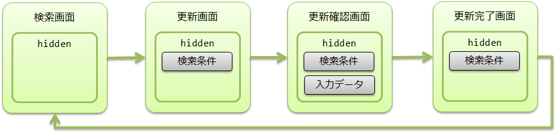
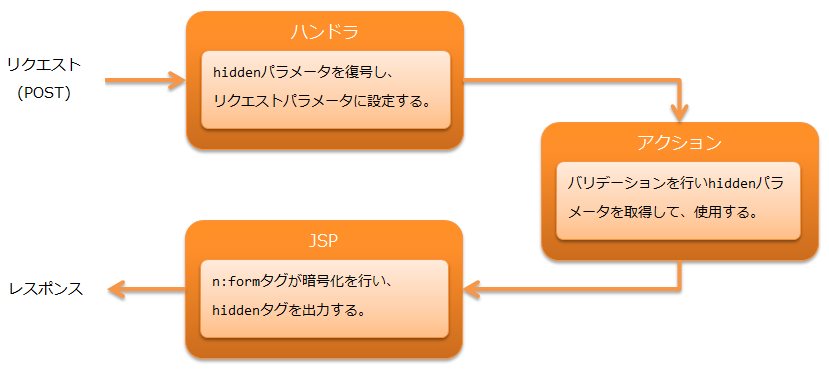
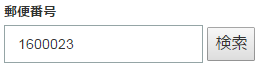
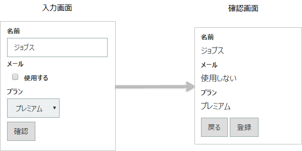
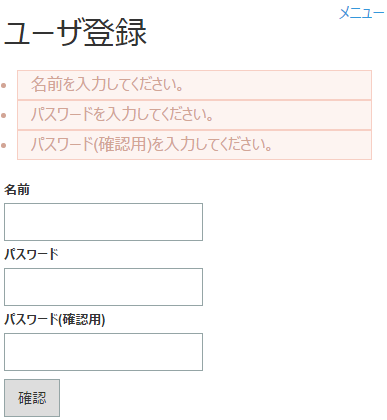
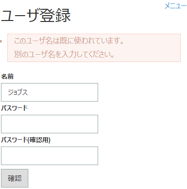
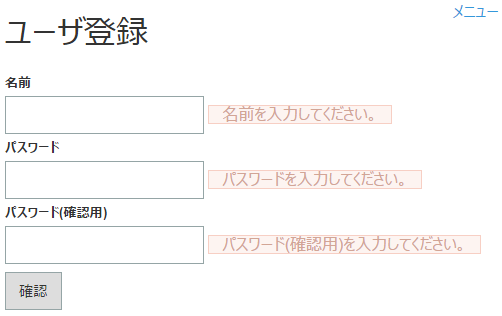
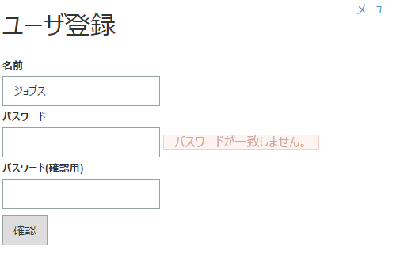
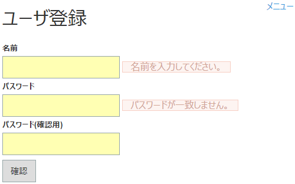

# Jakarta Server Pagesカスタムタグ

**目次**

* 機能概要

  * HTMLエスケープ漏れを防げる
  * 入力画面と確認画面のJSPを共通化して実装を減らす
* モジュール一覧
* 使用方法

  * カスタムタグの設定
  * カスタムタグを使用する(taglibディレクティブの指定方法)
  * 入力フォームを作る
  * 選択項目(プルダウン/ラジオボタン/チェックボックス)を表示する
  * チェックボックスでチェックなしに対する値を指定する
  * 入力データを画面間で持ち回る(ウィンドウスコープ)
  * クライアントに保持するデータを暗号化する(hidden暗号化)
  * 複合キーのラジオボタンやチェックボックスを作る
  * 複数のボタン/リンクからフォームをサブミットする
  * サブミット前に処理を追加する
  * プルダウン変更などの画面操作でサブミットする
  * ボタン/リンク毎にパラメータを追加する
  * 認可チェック/サービス提供可否に応じてボタン/リンクの表示/非表示を切り替える
  * 別ウィンドウ/タブを開くボタン/リンクを作る(ポップアップ)
  * ファイルをダウンロードするボタン/リンクを作る
  * 二重サブミットを防ぐ

    * サーバ側のトークンをデータベースに保存する
  * 入力画面と確認画面を共通化する
  * 変数に値を設定する
  * GETリクエストを使用する
  * 値を出力する
  * HTMLエスケープせずに値を出力する
  * フォーマットして値を出力する
  * エラー表示を行う
  * コード値を表示する
  * メッセージを出力する
  * 言語毎にリソースパスを切り替える
  * ブラウザのキャッシュを防止する
  * 静的コンテンツの変更時にクライアント側のキャッシュを参照しないようにする
  * 論理属性を指定する
  * 任意の属性を指定する

    * 論理属性の扱い
  * Content Security Policy(CSP)に対応する

    * セキュアハンドラが生成したnonceを任意の要素に埋め込む
    * カスタムタグが生成する要素に対してJavaScriptで処理を追加する
* 拡張例

  * フォーマッタを追加する
  * ボタン/リンクの表示制御に使う判定処理を変更する
  * クライアント側の二重サブミット防止で、二重サブミット発生時の振る舞いを追加する
  * サーバ側の二重サブミット防止で、トークンの発行処理を変更する
* カスタムタグのルール

  * 命名ルール
  * 入力/出力データへのアクセスルール
  * URIの指定方法
  * HTMLエスケープと改行、半角スペース変換
* [タグリファレンス](../../component/libraries/libraries-tag-reference.md#tag-reference)

tag/tag_reference

> **Tip:**
> 本機能は、Nablarch5までは「JSPカスタムタグ」という名称だった。
> しかし、Java EEがEclipse Foundationに移管され仕様名が変わったことに伴い「Jakarta Server Pagesカスタムタグ」という名称に変更された。

> 変更されたのは名称のみで、機能的な差は無い。

> その他、Nablarch6で名称が変更された機能については [Nablarch5と6で名称が変更になった機能について](../../about/about-nablarch/about-nablarch-jakarta-ee.md#renamed-features-in-nablarch-6) を参照のこと。

この機能では、ウェブアプリケーションの画面作成を支援するカスタムタグを提供する。

カスタムタグには、以下の制約がある。

* Jakarta Server Pages 3.1以降をサポートしているWebコンテナで動作する。
* 条件分岐やループなどの制御にはJakarta Standard Tag Libraryを使用する。
* XHTML 1.0 Transitionalに対応した属性をサポートする。
* クライアントのJavaScriptが必須である。( [サブミット前に処理を追加する](../../component/libraries/libraries-tag.md#tag-onclick-override) を参照)
* GETリクエストで一部のカスタムタグが使用できない。( [GETリクエストを使用する](../../component/libraries/libraries-tag.md#tag-using-get) を参照)

> **Important:**
> HTML5で追加された属性は、 [動的属性](../../component/libraries/libraries-tag.md#dynamic-attribute) を使用して記述できる。
> ただし、頻繁に使用されそうな次の属性は予めカスタムタグの属性として定義している。
> また、HTML5で追加されたinput要素は、それぞれ [textタグ](../../component/libraries/libraries-tag-reference.md#tag-text-tag) をベースに以下のタグを追加している。
> 各input要素固有の属性はカスタムタグで個別に定義していないため、動的属性により指定する必要がある。

> * >   追加した属性（属性を追加したHTMLのタグ名をカッコ内に記載する。）

> * >   autocomplete(input、password、form)
> * >   autofocus(input、textarea、select、button)
> * >   placeholder(text、password、textarea)
> * >   maxlength(textarea)
> * >   multiple(input)

> * >   追加したinput要素

> * >   [searchタグ](../../component/libraries/libraries-tag-reference.md#tag-search-tag) (検索テキスト)
> * >   [telタグ](../../component/libraries/libraries-tag-reference.md#tag-tel-tag) (電話番号)
> * >   [urlタグ](../../component/libraries/libraries-tag-reference.md#tag-url-tag) (URL)
> * >   [emailタグ](../../component/libraries/libraries-tag-reference.md#tag-email-tag) (メールアドレス)
> * >   [dateタグ](../../component/libraries/libraries-tag-reference.md#tag-date-tag) (日付)
> * >   [monthタグ](../../component/libraries/libraries-tag-reference.md#tag-month-tag) (月)
> * >   [weekタグ](../../component/libraries/libraries-tag-reference.md#tag-week-tag) (週)
> * >   [timeタグ](../../component/libraries/libraries-tag-reference.md#tag-time-tag) (時間)
> * >   [datetimeLocalタグ](../../component/libraries/libraries-tag-reference.md#tag-datetimelocal-tag) (ローカル日時)
> * >   [numberタグ](../../component/libraries/libraries-tag-reference.md#tag-number-tag) (数値)
> * >   [rangeタグ](../../component/libraries/libraries-tag-reference.md#tag-range-tag) (レンジ)
> * >   [colorタグ](../../component/libraries/libraries-tag-reference.md#tag-color-tag) (色)

> **Important:**
> カスタムタグは、以下のような単純な画面遷移があるウェブアプリケーションを対象にしている。
> そのため、操作性を重視したリッチな画面作成やSPA(シングルページアプリケーション)に対応していない。

> * >   検索画面→詳細画面による検索/詳細表示
> * >   入力画面→確認画面→完了画面による登録/更新/削除
> * >   ポップアップ(別ウィンドウ、別タブ)による入力補助

> プロジェクトでJavaScriptを多用する場合は、カスタムタグが出力するJavaScriptと
> プロジェクトで作成するJavaScriptで副作用が起きないように注意する。
> カスタムタグが出力するJavaScriptについては [サブミット前に処理を追加する](../../component/libraries/libraries-tag.md#tag-onclick-override) を参照。

## 機能概要

### HTMLエスケープ漏れを防げる

HTMLの中では「<」「>」「"」といった文字は、特別な意味を持つため、
それらを含む値をそのままJSPで出力してしまうと、悪意のあるユーザが容易にスクリプトを埋め込むことができ、
クロスサイトスクリプティング(XSS)と呼ばれる脆弱性につながってしまう。
そのため、入力値を出力する場合、HTMLエスケープが必要になる。

ところが、JSPでEL式を使って値を出力すると、HTMLエスケープされない。
そのため、値の出力時はHTMLエスケープを考慮した実装が常に必要になり、生産性の低下につながる。

カスタムタグは、デフォルトでHTMLエスケープするので、
カスタムタグを使って実装している限り、HTMLエスケープ漏れを防げる。

> **Important:**
> JavaScriptに対するエスケープ処理は、提供してないため、
> scriptタグのボディやonclick属性など、JavaScriptを記述する部分には、動的な値(入力データなど)を埋め込まないこと。
> JavaScriptを記述する部分に動的な値(入力データなど)を埋め込む場合は、プロジェクトの責任でエスケープ処理を実施すること。

HTMLエスケープの詳細は以下を参照。

* [HTMLエスケープと改行、半角スペース変換](../../component/libraries/libraries-tag.md#tag-html-escape)
* [HTMLエスケープせずに値を出力する](../../component/libraries/libraries-tag.md#tag-html-unescape)

### 入力画面と確認画面のJSPを共通化して実装を減らす

多くのシステムでは、入力画面と確認画面でレイアウトが変わらず、
似たようなJSPを作成している。

カスタムタグでは、入力画面と確認画面のJSPを共通化する機能を提供しているので、
入力画面向けに作成したJSPに、確認画面との差分(例えば、ボタンなど)のみを追加実装するだけで、
確認画面を作成でき、生産性の向上が期待できる。

入力画面と確認画面の共通化については以下を参照。

* [入力画面と確認画面を共通化する](../../component/libraries/libraries-tag.md#tag-make-common)

## モジュール一覧

```xml
<dependency>
  <groupId>com.nablarch.framework</groupId>
  <artifactId>nablarch-fw-web-tag</artifactId>
</dependency>

<!-- hidden暗号化を使う場合のみ -->
<dependency>
  <groupId>com.nablarch.framework</groupId>
  <artifactId>nablarch-common-encryption</artifactId>
</dependency>

<!-- ファイルダウンロードを使う場合のみ -->
<dependency>
  <groupId>com.nablarch.framework</groupId>
  <artifactId>nablarch-fw-web-extension</artifactId>
</dependency>
```

## 使用方法

> **Tip:**
> カスタムタグの説明では、すべての属性について説明していないので、
> 各カスタムタグで指定できる属性については、 [タグリファレンス](../../component/libraries/libraries-tag-reference.md#tag-reference) を参照。

### カスタムタグの設定

カスタムタグの設定は、 [Nablarchカスタムタグ制御ハンドラ](../../component/handlers/handlers-nablarch-tag-handler.md#nablarch-tag-handler) と
CustomTagConfig
により行う。

[Nablarchカスタムタグ制御ハンドラ](../../component/handlers/handlers-nablarch-tag-handler.md#nablarch-tag-handler)

カスタムタグを使用したリクエストを処理する際に、以下の機能に必要となる前処理を行うハンドラ。
カスタムタグを使用する場合は、このハンドラの設定が必須となる。

* [チェックボックスでチェックなしに対する値を指定する](../../component/libraries/libraries-tag.md#tag-checkbox-off-value)
* [クライアントに保持するデータを暗号化する(hidden暗号化)](../../component/libraries/libraries-tag.md#tag-hidden-encryption)
* [ボタン/リンク毎にパラメータを追加する](../../component/libraries/libraries-tag.md#tag-submit-change-parameter)
* [複合キーのラジオボタンやチェックボックスを作る](../../component/libraries/libraries-tag.md#tag-composite-key)

このハンドラの設定値については、 [Nablarchカスタムタグ制御ハンドラ](../../component/handlers/handlers-nablarch-tag-handler.md#nablarch-tag-handler) を参照。

CustomTagConfig

カスタムタグのデフォルト値を設定するクラス。
選択項目のラベルパターンなど、カスタムタグの属性は、個々の画面で毎回設定するよりも、
アプリケーション全体で統一したデフォルト値を使用したい場合がある。
そのため、カスタムタグのデフォルト値の設定をこのクラスで行う。

デフォルト値の設定は、 このクラスを `customTagConfig` という名前でコンポーネント定義に追加する。
設定項目については、 CustomTagConfig を参照。

### カスタムタグを使用する(taglibディレクティブの指定方法)

カスタムタグとJSTLを使用する想定なので、それぞれのtaglibディレクティブを指定する。

```jsp
<%@ taglib prefix="c" uri="jakarta.tags.core" %>
<%@ taglib prefix="n" uri="http://tis.co.jp/nablarch" %>
```

### 入力フォームを作る

入力フォームは、次のカスタムタグを使用して作成する。
以下に列挙したカスタムタグの詳細は、 [タグリファレンス](../../component/libraries/libraries-tag-reference.md#tag-reference) を参照。

* [formタグ](../../component/libraries/libraries-tag-reference.md#tag-form-tag)
* [textタグ](../../component/libraries/libraries-tag-reference.md#tag-text-tag) などの入力に関するカスタムタグ
* [submitタグ](../../component/libraries/libraries-tag-reference.md#tag-submit-tag)  などのサブミットを行うカスタムタグ
* [errorタグ](../../component/libraries/libraries-tag-reference.md#tag-error-tag) などのエラー表示を行うカスタムタグ

入力フォームを作る上でのポイント

入力値の復元

バリデーションエラーなどで、入力フォームを再表示した場合、カスタムタグによりリクエストパラメータから入力値が復元される。

初期値の出力

入力項目に初期値を出力したい場合は、アクション側でリクエストスコープに初期値を設定したオブジェクトを設定する。
そして、カスタムタグのname属性と、リクエストスコープ上の変数名が対応するように、name属性を指定する。
指定方法の詳細や実装例は、 [入力/出力データへのアクセスルール](../../component/libraries/libraries-tag.md#tag-access-rule) を参照。

サブミット先のURI指定

カスタムタグでは、フォームに配置された複数のボタン/リンクから、それぞれ別々のURIにサブミットできる。
ボタン/リンクのサブミット先となるURIは、uri属性に指定する。
指定方法の詳細や実装例は、 [URIの指定方法](../../component/libraries/libraries-tag.md#tag-specify-uri) を参照。

実装例

```jsp
<n:form>
  <div>
    <label>ユーザID</label>
    <n:text name="form.userId" />
    <n:error name="form.userId" messageFormat="span" errorCss="alert alert-danger" />
  </div>
  <div>
    <label>パスワード</label>
    <n:password name="form.password" />
    <n:error name="form.password" messageFormat="span" errorCss="alert alert-danger" />
  </div>
  <div style="padding: 8px 0;">
    <n:submit type="submit" uri="/action/login" value="ログイン" />
  </div>
</n:form>
```

出力結果


> **Tip:**
> [formタグ](../../component/libraries/libraries-tag-reference.md#tag-form-tag) のname属性には以下の制約がある。

> * >   画面内で一意な名前をname属性に指定する
> * >   JavaScriptの変数名の構文に則った値を指定する

> 画面内で一意な名前をname属性に指定する

> カスタムタグでは、サブミット制御にJavaScriptを使用する。
> JavaScriptについては [サブミット前に処理を追加する](../../component/libraries/libraries-tag.md#tag-onclick-override) を参照。

> このJavaScriptでは、サブミット対象のフォームを特定するために、
> [formタグ](../../component/libraries/libraries-tag-reference.md#tag-form-tag) のname属性を使用する。
> そのため、アプリケーションで [formタグ](../../component/libraries/libraries-tag-reference.md#tag-form-tag) のname属性を指定する場合は、
> 画面内で一意な名前をname属性に指定する必要がある。

> アプリケーションで [formタグ](../../component/libraries/libraries-tag-reference.md#tag-form-tag) のname属性を指定しなかった場合、
> カスタムタグは一意な値をname属性に設定する。

> JavaScriptの変数名の構文に則った値を指定する

> [formタグ](../../component/libraries/libraries-tag-reference.md#tag-form-tag) のname属性はJavaScriptで使用するため、
> JavaScriptの変数名の構文に則った値を指定する必要がある。

> 変数名の構文

> * >   値の先頭は英字始まり
> * >   先頭以降の値は英数字またはアンダーバー

### 選択項目(プルダウン/ラジオボタン/チェックボックス)を表示する

選択項目には、次のカスタムタグを使用する。

* [selectタグ](../../component/libraries/libraries-tag-reference.md#tag-select-tag) (プルダウン)
* [radioButtonsタグ](../../component/libraries/libraries-tag-reference.md#tag-radio-buttons-tag) (複数のラジオボタン)
* [checkboxesタグ](../../component/libraries/libraries-tag-reference.md#tag-checkboxes-tag) (複数のチェックボックス)

アクション側で選択肢リスト(選択肢のラベルと値をもつオブジェクトのリスト)をリクエストスコープに設定し、
カスタムタグで選択肢リストを使用して表示する。

> **Tip:**
> 選択状態の判定は、選択された値と選択肢の値をともに
> Object#toString してから行う。

実装例

選択肢のクラス

```java
public class Plan {

    // 選択肢の値
    private String planId;

    // 選択肢のラベル
    private String planName;

    public Plan(String planId, String planName) {
        this.planId = planId;
        this.planName = planName;
    }

    // カスタムタグはこのプロパティから選択肢の値を取得する。
    public String getPlanId() {
        return planId;
    }

    // カスタムタグはこのプロパティから選択肢のラベルを取得する。
    public String getPlanName() {
        return planName;
    }
}
```

アクション

```java
// 選択肢リストをリクエストスコープに設定する。
List<Plan> plans = Arrays.asList(new Plan("A", "フリー"),
                                 new Plan("B", "ベーシック"),
                                 new Plan("C", "プレミアム"));

// カスタムタグはここで指定した名前を使ってリクエストスコープから選択肢リストを取得する。
context.setRequestScopedVar("plans", plans);
```

プルダウン

JSP

```jsp
<!--
  以下の属性指定により、選択肢の内容にアクセスする。
  listName属性: 選択肢リストの名前
  elementLabelProperty属性: ラベルを表すプロパティ名
  elementValueProperty属性: 値を表すプロパティ名
-->
<n:select name="form.plan1"
          listName="plans"
          elementLabelProperty="planName"
          elementValueProperty="planId" />
```

出力されるHTML

```html
<!--
  "form.plan1"の値が"A"だった場合。
-->
<select name="form.plan1">
  <option value="A" selected="selected">フリー</option>
  <option value="B">ベーシック</option>
  <option value="C">プレミアム</option>
</select>
```

ラジオボタン

JSP

```jsp
<!-- 属性指定はselectタグと同じ。 -->
<n:radioButtons name="form.plan2"
                listName="plans"
                elementLabelProperty="planName"
                elementValueProperty="planId" />
```

出力されるHTML

```html
<!--
 "form.plan2"の値が"B"だった場合。
 デフォルトだとbrタグで出力する。
 listFormat属性を指定して、divタグ、spanタグ、ulタグ、olタグ、スペース区切りに変更できる。
-->
<input id="nablarch_radio1" type="radio" name="form.plan2" value="A" />
<label for="nablarch_radio1">フリー</label><br />
<input id="nablarch_radio2" type="radio" name="form.plan2" value="B" checked="checked" />
<label for="nablarch_radio2">ベーシック</label><br />
<input id="nablarch_radio3" type="radio" name="form.plan2" value="C" />
<label for="nablarch_radio3">プレミアム</label><br />
```

チェックボックス

JSP

```jsp
<!-- 属性指定はselectタグと同じ。 -->
<n:checkboxes name="form.plan4"
              listName="plans"
              elementLabelProperty="planName"
              elementValueProperty="planId" />
```

出力されるHTML

```html
<!--
 "form.plan4"の値が"C"だった場合。
 デフォルトだとbrタグで出力する。
 listFormat属性を指定して、divタグ、spanタグ、ulタグ、olタグ、スペース区切りに変更できる。
-->
<input id="nablarch_checkbox1" type="checkbox" name="form.plan4" value="A"
       checked="checked" />
<label for="nablarch_checkbox1">フリー</label><br />
<input id="nablarch_checkbox2" type="checkbox" name="form.plan4" value="B" />
<label for="nablarch_checkbox2">ベーシック</label><br />
<input id="nablarch_checkbox3" type="checkbox" name="form.plan4" value="C" />
<label for="nablarch_checkbox3">プレミアム</label><br />
```

> **Important:**
> [radioButtonsタグ](../../component/libraries/libraries-tag-reference.md#tag-radio-buttons-tag) と [checkboxesタグ](../../component/libraries/libraries-tag-reference.md#tag-checkboxes-tag) は、
> 簡単に選択項目を出力できる反面、カスタムタグで選択肢をすべて出力するので、
> どうしても出力されるHTMLに制限が出てくる。
> そのため、デザイン会社が作成したHTMLをベースに開発する場合など、プロジェクトでデザインをコントロールできない場合は、
> [radioButtonsタグ](../../component/libraries/libraries-tag-reference.md#tag-radio-buttons-tag) と [checkboxesタグ](../../component/libraries/libraries-tag-reference.md#tag-checkboxes-tag) が出力するHTMLがデザインに合わないケースが出てくる。

> このような場合は、JSTLのc:forEachタグと [radioButtonタグ](../../component/libraries/libraries-tag-reference.md#tag-radio-tag) または [checkboxタグ](../../component/libraries/libraries-tag-reference.md#tag-checkbox-tag) を使って実装すれば、
> 選択肢を表示するHTMLを自由に実装できる。

> ```jsp
> <c:forEach items="${plans}" var="plan">
>   <!-- 前後に好きなHTMLを追加できる。 -->
>   <n:radioButton name="form.plan3" label="${plan.planName}" value="${plan.planId}" />
> </c:forEach>
> ```

### チェックボックスでチェックなしに対する値を指定する

HTMLのcheckboxタグは、チェックなしの場合にリクエストパラメータが送信されない。
単一の入力項目としてcheckboxタグを使用する場合は、データベース上でフラグとして表現されたデータ項目に対応することが多く、
通常はチェックなしの場合にも何らかの値を設定する。
そのため、 [checkboxタグ](../../component/libraries/libraries-tag-reference.md#tag-checkbox-tag) では、チェックなしに対応する値を指定できる機能を提供する。

実装例

```jsp
<!--
 以下の属性指定により、チェックなしの場合の動作を制御する。
 useOffValue属性: チェックなしの値設定を使用するか否か。デフォルトはtrue
                  一括削除などで複数選択させる場合にfalseを指定する。
 offLabel属性: チェックなしの場合に使用するラベル。
               入力画面と確認画面を共通化した場合に確認画面で表示されるラベル。
 offValue属性: チェックなしの場合に使用する値。デフォルトは0。
-->
<n:checkbox name="form.useMail" value="true" label="使用する"
            offLabel="使用しない" offValue="false" />
```

> **Tip:**
> この機能は、[Nablarchカスタムタグ制御ハンドラ](../../component/handlers/handlers-nablarch-tag-handler.md#nablarch-tag-handler) と [hidden暗号化](../../component/libraries/libraries-tag.md#tag-hidden-encryption) を使って実現している。
> checkboxタグ出力時にチェックなしに対応する値をhiddenタグに出力しておき、
> [Nablarchカスタムタグ制御ハンドラ](../../component/handlers/handlers-nablarch-tag-handler.md#nablarch-tag-handler) がリクエスト受付時に、checkboxタグがチェックされていない場合のみ、
> リクエストパラメータにチェックなしに対応する値を設定する。

### 入力データを画面間で持ち回る(ウィンドウスコープ)

> **Important:**
> 入力データ保持は、ここで説明するウィンドウスコープを使う方法と、
> ライブラリの [セッションストア](../../component/libraries/libraries-session-store.md#session-store) を使う方法の2通りがある。
> 以下の理由から、画面間での入力データ保持には、 [セッションストア](../../component/libraries/libraries-session-store.md#session-store) を使用すること。

> * >   ウィンドウスコープでは、データをキー/値のペアで保持するため、Beanをそのまま格納できない。
>   Beanが保持するデータを格納したい場合は、データをバラすことになり、とても実装が煩雑となる。

>   ```java
>   // こんなBeanがあるとする。
>   Person person = new Person();
>   person.setName("名前");
>   person.setAge("年齢");
>   
>   // ウィンドウスコープへの設定(アクションで行う場合)
>   request.setParam("person.name", person.getName());
>   request.setParam("person.age", person.getAge());
>   
>   // ウィンドウスコープへの設定(JSPで行う場合)
>   <n:hidden name="person.name" />
>   <n:hidden name="person.age" />
>   ```
> * >   ウィンドウスコープへの入力データの設定は、カスタムタグの属性指定により行うため、動きが把握しにくい。(実装難易度が高い)

入力データは、クライアント側にhiddenタグとして保持する。
クライアント側に保持することで、サーバ側(セッション)に保持する場合に比べ、
複数ウィンドウの使用やブラウザの戻るボタンの使用など、ブラウザの使用制限を減らし、柔軟な画面設計が可能となる。

ここでは、クライアント側に保持するデータの格納先をウィンドウスコープと呼ぶ。
ウィンドウスコープのデータは、 [hidden暗号化](../../component/libraries/libraries-tag.md#tag-hidden-encryption) により暗号化する。

> **Important:**
> ウィンドウスコープのデータは、[hidden暗号化](../../component/libraries/libraries-tag.md#tag-hidden-encryption) により暗号化されhiddenタグに出力される。
> そのため、Ajaxを使って取得したデータで書き換えるなど、クライアント側でウィンドウスコープの内容を書き換えることはできない。

ウィンドウスコープにデータを設定するには、 [formタグ](../../component/libraries/libraries-tag-reference.md#tag-form-tag) のwindowScopePrefixes属性を指定する。

> **Important:**
> windowScopePrefixes属性を指定すると、リクエストパラメータのうち、
> パラメータ名がこの属性に指定された値に **前方一致** するパラメータが、
> ウィンドウスコープに設定される。

> 例えば、 `windowScopePrefixes="user"` と指定すると、
> `users` で始まるパラメータもウィンドウスコープに設定される。

実装例

検索機能の検索条件、更新機能の入力データを画面間で持ち回る。
画面遷移とhiddenに格納されるデータの動きは以下のとおり。



 検索条件のリクエストパラメータは `searchCondition.*` 、
入力データのリクエストパラメータは `user.*` とする。

検索画面

```jsp
<!-- ウィンドウスコープのデータを送信しない。 -->
<n:form>
```

更新画面

```jsp
<!-- 検索条件だけ送信する。 -->
<n:form windowScopePrefixes="searchCondition">
```

更新確認画面

```jsp
<!--
  検索条件と入力データを送信する。
  複数指定する場合はカンマ区切りで指定する。
-->
<n:form windowScopePrefixes="searchCondition,user">
```

更新完了画面

```jsp
<!-- 検索条件だけ送信する。 -->
<n:form windowScopePrefixes="searchCondition">
```

> **Important:**
> データベースのデータについては、更新対象データを特定する主キーや楽観ロック用のデータなど、必要最低限に留めること。
> 特に入力画面と確認画面で表示するデータ(入力項目ではなく、表示するだけの項目)等は、
> hiddenで引き回すのではなくデータが必要となる度にデータベースから取得すること。
> hiddenのデータ量が増えると、通信速度の低下、メモリ圧迫につながるため。

> **Important:**
> ウィンドウスコープに格納したデータは、hiddenタグに出力し、リクエストパラメータとして画面間を持ち回っている。
> そのため、アクション側でウィンドウスコープに格納したデータを使用する場合は、
> [バリデーション](../../component/libraries/libraries-validation.md#validation) を行う必要がある。

> **Tip:**
> [formタグ](../../component/libraries/libraries-tag-reference.md#tag-form-tag) では、一律リクエストパラメータを全てhiddenタグに出力するのではなく、
> 既に入力項目として出力したリクエストパラメータはhiddenタグの出力から除外する。

> **Tip:**
> ログイン情報など、全ての業務に渡って必要になる情報はサーバ側(セッション)に保持する。

### クライアントに保持するデータを暗号化する(hidden暗号化)

[ウィンドウスコープ](../../component/libraries/libraries-tag.md#tag-window-scope) や [hiddenタグ](../../component/libraries/libraries-tag-reference.md#tag-hidden-tag) の値は、
クライアント側で改竄されたり、HTMLソースから容易に値を参照できる。
そのため、hiddenタグの改竄や参照を防ぐことを目的に、カスタムタグではhidden暗号化機能を提供する。

デフォルトで全ての [formタグ](../../component/libraries/libraries-tag-reference.md#tag-form-tag) で暗号化を行い、全てのリクエストで復号及び改竄チェックを行う。
このため、アプリケーションプログラマは、hidden暗号化機能に関して実装する必要がない。

> **Important:**
> 仕様が複雑であり容易に使用できない、また [ウィンドウスコープ](../../component/libraries/libraries-tag.md#tag-window-scope) にあるように
> 暗号化対象のデータの使用が非推奨であるため本機能も非推奨とする。
> このため、特に理由がない限り [useHiddenEncryption](../../component/libraries/libraries-tag.md#tag-use-hidden-encryption) には `false` を設定すること。

hidden暗号化

hidden暗号化は、 [formタグ](../../component/libraries/libraries-tag-reference.md#tag-form-tag) と [Nablarchカスタムタグ制御ハンドラ](../../component/handlers/handlers-nablarch-tag-handler.md#nablarch-tag-handler) により実現する。
hidden暗号化の処理イメージを以下に示す。
[formタグ](../../component/libraries/libraries-tag-reference.md#tag-form-tag) が暗号化、 [Nablarchカスタムタグ制御ハンドラ](../../component/handlers/handlers-nablarch-tag-handler.md#nablarch-tag-handler) が復号及び改竄チェックを行う。



暗号化処理

暗号化は、 Encryptor インタフェースを実装したクラスが行う。
フレームワークでは、デフォルトの暗号化アルゴリズムとして `AES(128bit)` を使用する。
暗号化アルゴリズムを変更したい場合は、
Encryptor を実装したクラスを
コンポーネント定義に `hiddenEncryptor` という名前で追加する。

暗号化では、[formタグ](../../component/libraries/libraries-tag-reference.md#tag-form-tag) 毎に、 [formタグ](../../component/libraries/libraries-tag-reference.md#tag-form-tag) に含まれる以下のデータをまとめて暗号化し、
1つのhiddenタグで出力する。

* カスタムタグの [hiddenタグ](../../component/libraries/libraries-tag-reference.md#tag-hidden-tag) で明示的に指定したhiddenパラメータ
* [ウィンドウスコープ](../../component/libraries/libraries-tag.md#tag-window-scope) の値
* [サブミットを行うカスタムタグ](../../component/libraries/libraries-tag-reference.md#tag-reference-submit) で指定したリクエストID
* [サブミットを行うカスタムタグ](../../component/libraries/libraries-tag-reference.md#tag-reference-submit) で追加した [パラメータ](../../component/libraries/libraries-tag.md#tag-submit-change-parameter)

さらに、暗号化では、改竄を検知するために、上記のデータから生成したハッシュ値を含める。
リクエストIDは、異なる入力フォーム間で暗号化した値を入れ替えた場合の改ざんを検知するために、
ハッシュ値は、値の書き換えによる改竄を検知するために使用する。
暗号化した結果は、BASE64でエンコードしhiddenタグに出力する。

> **Tip:**
> カスタムタグの [hiddenタグ](../../component/libraries/libraries-tag-reference.md#tag-hidden-tag) で明示的に指定したhiddenパラメータは、
> 暗号化に含まれるため、クライアント側でJavaScriptを使用して値を操作できない。
> クライアント側のJavaScriptでhiddenパラメータを操作したい場合は、
> [plainHiddenタグ](../../component/libraries/libraries-tag-reference.md#tag-plain-hidden-tag) を使用して、暗号化しないhiddenタグを出力する。

復号処理

復号処理は、 [Nablarchカスタムタグ制御ハンドラ](../../component/handlers/handlers-nablarch-tag-handler.md#nablarch-tag-handler) が行う。
[Nablarchカスタムタグ制御ハンドラ](../../component/handlers/handlers-nablarch-tag-handler.md#nablarch-tag-handler) では以下の場合に改竄と判定し、設定で指定された画面に遷移させる。

* 暗号化したhiddenパラメータ(nablarch_hidden)が存在しない。
* BASE64のデコードに失敗する。
* 復号に失敗する。
* 暗号化時に生成したハッシュ値と復号した値で生成したハッシュ値が一致しない。
* 暗号化時に追加したリクエストIDと受け付けたリクエストのリクエストIDが一致しない。

暗号化に使用する鍵の保存場所

暗号化に使用する鍵は、鍵の有効期間をできるだけ短くするため、セッション毎に生成する。
このため、同じユーザであってもログインをやり直すと、ログイン前に使用していた画面から処理を継続できない。

hidden暗号化の設定

hidden暗号化では、 [カスタムタグの設定](../../component/libraries/libraries-tag.md#tag-setting) により、以下の設定ができる。

useHiddenEncryptionプロパティ

hidden暗号化を使用するか否か。
デフォルトはtrue。

noHiddenEncryptionRequestIdsプロパティ

hidden暗号化を行わないリクエストID。

noHiddenEncryptionRequestIdsプロパティには、以下のように、hidden暗号化を使用できないリクエストを指定する。

* ログイン画面など、アプリケーションの入口となるリクエスト
* ブックマークから遷移してくるリクエスト
* 外部サイトから遷移してくるリクエスト

これらのリクエストは、暗号化したhiddenパラメータ(nablarch_hidden)が存在しない、
またはセッション毎に生成する鍵が存在しないため、noHiddenEncryptionRequestIdsプロパティを設定しないと改竄エラーとなる。

noHiddenEncryptionRequestIdsプロパティの設定値は、
[formタグ](../../component/libraries/libraries-tag-reference.md#tag-form-tag) と [Nablarchカスタムタグ制御ハンドラ](../../component/handlers/handlers-nablarch-tag-handler.md#nablarch-tag-handler) が、
それぞれ暗号化と復号の際に参照して処理を行う。

[formタグ](../../component/libraries/libraries-tag-reference.md#tag-form-tag)

[formタグ](../../component/libraries/libraries-tag-reference.md#tag-form-tag) に暗号化対象のリクエストIDが1つでも含まれていれば暗号化する。
反対に、暗号化対象のリクエストIDが1つも含まれていない場合、 [formタグ](../../component/libraries/libraries-tag-reference.md#tag-form-tag) は暗号化しない。

[Nablarchカスタムタグ制御ハンドラ](../../component/handlers/handlers-nablarch-tag-handler.md#nablarch-tag-handler)

リクエストされたリクエストIDが暗号化対象のリクエストIDの場合のみ、復号する。

### 複合キーのラジオボタンやチェックボックスを作る

一覧画面でデータを選択する場合などは、ラジオボタンやチェックボックスを使用する。
データを識別する値が単一であれば、 [radioButtonタグ](../../component/libraries/libraries-tag-reference.md#tag-radio-tag) や [checkboxタグ](../../component/libraries/libraries-tag-reference.md#tag-checkbox-tag) を使用すればよいが、
複合キーの場合は単純に実装できない。

カスタムタグでは、複合キーに対応したラジオボタンやチェックボックスを提供する。

* [compositeKeyRadioButtonタグ](../../component/libraries/libraries-tag-reference.md#tag-composite-key-radio-button-tag) (複合キーに対応したラジオボタン)
* [compositeKeyCheckboxタグ](../../component/libraries/libraries-tag-reference.md#tag-composite-key-checkbox-tag) (複合キーに対応したチェックボックス)

> **Important:**
> この機能を使用するには、
> CompositeKeyConvertor と
> CompositeKeyArrayConvertor
> をコンポーネント定義に追加しておく必要がある。
> 設定方法については、 [使用するバリデータとコンバータを設定する](../../component/libraries/libraries-nablarch-validation.md#nablarch-validation-definition-validator-convertor) を参照。

> **Important:**
> この機能は、
> CompositeKeyConvertor と
> CompositeKeyArrayConvertor
> を使用するため、 [Nablarch Validation](../../component/libraries/libraries-nablarch-validation.md#nablarch-validation) でのみ使用できる。
> [Bean Validation](../../component/libraries/libraries-bean-validation.md#bean-validation) は対応していない。

実装例

一覧表示で複合キーをもつチェックボックスを使用する例を元に、実装方法を説明する。

フォーム

フォームでは、複合キーを保持するプロパティを
CompositeKey
として定義する。

```java
public class OrderItemsForm {

    // 今回は、一覧表示で複数データに対する複合キーを受け付けるので、
    // 配列として定義する。
    public CompositeKey[] orderItems;

    // getter, コンストラクタ等は省略。

    // CompositeKeyTypeアノテーションで複合キーのサイズを指定する。
    @CompositeKeyType(keySize = 2)
    public void setOrderItems(CompositeKey[] orderItems) {
        this.orderItems = orderItems;
    }
}
```

JSP

```jsp
<table>
  <thead>
    <tr>
      <!-- ヘッダ出力は省略。 -->
    </tr>
  </thead>
  <tbody>
    <c:forEach var="orderItem" items="${orderItems}">
    <tr>
      <td>
        <!--
          以下の属性を指定する。
          name属性: フォームのプロパティ名に合わせて指定する。
          valueObject属性: 複合キーの値を持つオブジェクトを指定する。
          keyNames属性: valueObject属性で指定したオブジェクトから
                        複合キーの値を取得する際に使用するプロパティ名を指定する。
                        ここに指定した順番でCompositeKeyに設定される。
          namePrefix属性: 複合キーの値をリクエストパラメータに展開する際に使用する
                          プレフィクスを指定する。
                          name属性と異なる値を指定する必要がある。
        -->
        <n:compositeKeyCheckbox
          name="form.orderItems"
          label=""
          valueObject="${orderItem}"
          keyNames="orderId,productId"
          namePrefix="orderItems" />
      </td>
      <!-- 以下略 -->
    </tr>
    </c:forEach>
  </tbody>
</table>
```

### 複数のボタン/リンクからフォームをサブミットする

フォームのサブミットは、ボタンとリンクに対応しており、次のカスタムタグを使用して行う。
1つのフォームに複数のボタンとリンクを配置できる。

フォームのサブミット

[submitタグ](../../component/libraries/libraries-tag-reference.md#tag-submit-tag) (inputタグのボタン)
[buttonタグ](../../component/libraries/libraries-tag-reference.md#tag-button-tag) (buttonタグのボタン)
[submitLinkタグ](../../component/libraries/libraries-tag-reference.md#tag-submit-link-tag) (リンク)

別ウィンドウを開いてサブミット(ポップアップ)

[popupSubmitタグ](../../component/libraries/libraries-tag-reference.md#tag-popup-submit-tag) (inputタグのボタン)
[popupButtonタグ](../../component/libraries/libraries-tag-reference.md#tag-popup-button-tag) (buttonタグのボタン)
[popupLinkタグ](../../component/libraries/libraries-tag-reference.md#tag-popup-link-tag) (リンク)

ダウンロード用のサブミット

[downloadSubmitタグ](../../component/libraries/libraries-tag-reference.md#tag-download-submit-tag) (inputタグのボタン)
[downloadButtonタグ](../../component/libraries/libraries-tag-reference.md#tag-download-button-tag) (buttonタグのボタン)
[downloadLinkタグ](../../component/libraries/libraries-tag-reference.md#tag-download-link-tag) (リンク)

タグ名が `popup` から始まるタグは、新しいウィンドウをオープンし、
オープンしたウィンドウに対してサブミットを行う。
タグ名が `download` から始まるタグは、ダウンロード用のサブミットを行う。
それぞれ詳細は、以下を参照。

* [別ウィンドウ/タブを開くボタン/リンクを作る(ポップアップ)](../../component/libraries/libraries-tag.md#tag-submit-popup)
* [ファイルをダウンロードするボタン/リンクを作る](../../component/libraries/libraries-tag.md#tag-submit-download)

これらのカスタムタグでは、ボタン/リンクとURIを関連付けるためにname属性とuri属性を指定する。
name属性は、フォーム内で一意な名前を指定する。name属性の指定がない場合は、カスタムタグで一意な名前が自動で出力される。
uri属性の指定方法については、 [URIの指定方法](../../component/libraries/libraries-tag.md#tag-specify-uri) を参照。

実装例

```jsp
<!-- name属性は自動で出力されるので指定しなくてよい。 -->
<n:submit type="submit" uri="login" value="ログイン" />
```

### サブミット前に処理を追加する

フォームのサブミットは、JavaScriptを使用してボタン/リンク毎のURIを組み立てることで実現している。
カスタムタグは、グローバル領域にこのJavaScript関数を出力し、
ボタン/リンクのonclick属性にその関数呼び出しを設定した状態でHTMLを出力する。

カスタムタグが出力するJavaScript関数のシグネチャ

```javascript
/**
 * @param event イベントオブジェクト
 * @param element イベント元の要素(ボタン又はリンク)。未指定の場合は第1引数のeventからcurrentTarget、targetプロパティの優先順位でイベント元の要素を取得する。
 * @return イベントを伝搬させないため常にfalse
 */
function nablarch_submit(event, element)
```

出力例を以下に示す。

JSP

```jsp
<n:form>
  <!-- 省略 -->
  <n:submit type="submit" uri="login" value="ログイン" />
</n:form>
```

HTML

```html
<script type="text/javascript">
<!--
function nablarch_submit(event, element) {
  // 省略
}
-->
</script>
<form name="nablarch_form1" method="post">
  <!-- onclick属性にサブミット制御を行うJavaScript関数が設定される。 -->
  <input type="submit" name="nablarch_form1_1" value="ログイン"
         onclick="return window.nablarch_submit(event, this);" />
</form>
```

サブミット前に処理を追加したい場合は、onclick属性にアプリケーションで作成したJavaScript関数を指定する。
カスタムタグは、onclick属性が指定された場合、サブミット用のJavaScript関数を呼び出さない。
この場合、アプリケーションで作成したJavaScriptで、カスタムタグが設定する [JavaScript関数](../../component/libraries/libraries-tag.md#tag-submit-function) を呼び出す必要がある。

> **Important:**
> Content Security Policy(CSP)に対応する場合は、onclick属性にインラインでJavaScriptを記述してしまうとCSPに対応しようとしているにも
> 関わらず `unsafe-inline` を使いセキュリティレベルを低下させてしまう、  もしくは `unsafe-hashes` を利用することになってしまう。
> このため、 [Content Security Policy(CSP)に対応する](../../component/libraries/libraries-tag.md#tag-content-security-policy) の手順に従い外部スクリプトまたはnonce属性を指定したscript要素に追加の処理を実装を
> 行うことを推奨する。

実装例

サブミット前に確認ダイアログを表示する。

JavaScript

```javascript
function popUpConfirmation(event, element) {
  if (window.confirm("登録します。よろしいですか？")) {
    // カスタムタグが出力するJavaScript関数を明示的に呼び出す。
    return nablarch_submit(event, element);
  } else {
    // キャンセル
    return false;
  }
}
```

JSP

```jsp
<n:submit type="submit" uri="register" value="登録"
          onclick="return popUpConfirmation(event, this);" />
```

### プルダウン変更などの画面操作でサブミットする

カスタムタグは、サブミット制御にJavaScriptを使用しており、
サブミット制御するJavaScript関数が、ボタンやリンクのイベントハンドラ(onclick属性)に指定されることを前提に動作する。
JavaScriptの詳細については、 [サブミット前に処理を追加する](../../component/libraries/libraries-tag.md#tag-onclick-override) を参照。

そのため、プルダウン変更などの画面操作でサブミットを行いたい場合は、サブミットさせたいボタンのクリックイベントを発生させる。

> **Important:**
> Content Security Policy(CSP)に対応する場合は、onclick属性にインラインでJavaScriptを記述してしまうとCSPに対応しようとしているにも
> 関わらず `unsafe-inline` を使いセキュリティレベルを低下させてしまう、  もしくは `unsafe-hashes` を利用することになってしまう。
> このためは、 [Content Security Policy(CSP)に対応する](../../component/libraries/libraries-tag.md#tag-content-security-policy) の手順に従い外部スクリプトまたはnonce属性を指定したscript要素に追加の処理を実装を
> 行うことを推奨する。

プルダウン変更でサブミットを行う場合の実装例を示す。

実装例

```jsp
<!-- onchange属性にて、サブミットしたいボタン要素のclick関数を呼ぶ。 -->
<n:select name="form.plan"
          listName="plans"
          elementLabelProperty="planName"
          elementValueProperty="planId"
          onchange="window.document.getElementById('register').click(); return false;" />

<n:submit id="register" type="submit" uri="register" value="登録" />
```

> **Important:**
> 上記の実装例では、説明がしやすいので、onchangeイベントハンドラに直接JavaScriptを記載しているが、
> 実際のプロジェクトでは、オープンソースのJavaScriptライブラリを使うなどして、処理を動的にバインドすることを推奨する。

### ボタン/リンク毎にパラメータを追加する

更新機能などにおいて、一覧画面から詳細画面に遷移するケースでは、
同じURLだけどパラメータが異なるリンクを表示したい場合がある。

カスタムタグでは、フォームのボタンやリンク毎にパラメータを追加するためのカスタムタグを提供する。

* [paramタグ](../../component/libraries/libraries-tag-reference.md#tag-param-tag) (サブミット時に追加するパラメータの指定)

実装例

検索結果から一覧画面でリンク毎にパラメータを追加する。

```jsp
<n:form>
  <table>
    <!-- テーブルのヘッダ行は省略 -->
    <c:forEach var="person" items="${persons}">
      <tr>
        <td>
          <n:submitLink uri="/action/person/show">
            <n:write name="person.personName" />
            <!-- パラメータ名に"personId"を指定している。 -->
            <n:param paramName="personId" name="person.personId" />
          </n:submitLink>
        </td>
      </tr>
    </c:forEach>
  </table>
</n:form>
```

> **Important:**
> パラメータを追加する場合は、その数に応じてリクエストのデータ量は増大する。
> そのため、一覧画面で詳細画面へのリンク毎にパラメータを追加する場合は、
> パラメータをプライマリキーだけにするなど、必要最小限のパラメータのみ追加する。

### 認可チェック/サービス提供可否に応じてボタン/リンクの表示/非表示を切り替える

[ハンドラによる認可チェック](../../component/libraries/libraries-authorization-permission-check.md#permission-check) と [サービス提供可否チェック](../../component/libraries/libraries-service-availability.md#service-availability) の結果に応じて、
[フォームのサブミットを行うボタン/リンク](../../component/libraries/libraries-tag-reference.md#tag-reference-submit) の表示を切り替える機能を提供する。
これにより、ユーザが実際にボタン/リンクを選択する前に該当機能が使用可能かどうかが分かるため、ユーザビリティの向上につながる。

[フォームのサブミットを行うボタン/リンク](../../component/libraries/libraries-tag-reference.md#tag-reference-submit)
に指定されたリクエストIDに対して、 [ハンドラによる認可チェック](../../component/libraries/libraries-authorization-permission-check.md#permission-check) と [サービス提供可否チェック](../../component/libraries/libraries-service-availability.md#service-availability) を行い、
`権限なし` または `サービス提供不可` の場合に表示切り替えを行う。

切り替え時の表示方法には次の3パターンがある。

非表示

タグを出力しない。

非活性

タグを非活性にする。
ボタンの場合は、disabled属性を有効にする。
リンクの場合は、ラベルのみ表示するか、非活性リンク描画用JSPをインクルードする。
JSPインクルードを行うには、 [カスタムタグの設定](../../component/libraries/libraries-tag.md#tag-setting) で
submitLinkDisabledJspプロパティ
を指定する。

通常表示

通常どおりタグが出力される。
表示方法の切り替えを行わない。

デフォルトは、 `通常表示` である。
[カスタムタグの設定](../../component/libraries/libraries-tag.md#tag-setting) で
displayMethodプロパティ
を指定することで、デフォルトを変更できる。

個別に表示方法を変更したい場合は、displayMethod属性に指定する。

実装例

```jsp
<!--
  NODISPLAY(非表示)、DISABLED(非活性)、NORMAL(通常表示)のいずれかを指定する。
  このタグは常に表示する。
-->
<n:submit type="button" uri="login" value="ログイン" displayMethod="NORMAL" />
```

> **Tip:**
> アプリケーションで表示制御に使用する判定処理を変更したい場合は、
> [ボタン/リンクの表示制御に使う判定処理を変更する](../../component/libraries/libraries-tag.md#tag-submit-display-control-change) を参照。

### 別ウィンドウ/タブを開くボタン/リンクを作る(ポップアップ)

ユーザの操作性を向上させるために、複数ウィンドウを立ち上げたい場合がある。
例えば、郵便番号の入力欄から住所検索など、検索画面を別ウィンドウで立ち上げ入力補助を行う場合がある。

カスタムタグでは、複数ウィンドウの立ち上げをサポートするカスタムタグ(以降はポップアップタグと称す)を提供する。

* [popupSubmitタグ](../../component/libraries/libraries-tag-reference.md#tag-popup-submit-tag) (inputタグのボタン)
* [popupButtonタグ](../../component/libraries/libraries-tag-reference.md#tag-popup-button-tag) (buttonタグのボタン)
* [popupLinkタグ](../../component/libraries/libraries-tag-reference.md#tag-popup-link-tag) (リンク)

> **Important:**
> これらのタグは、以下の問題点があるため非推奨とする。

> * >   外部サイトへのリンクやボタンを作成した場合、一部のブラウザで新しいウィンドウでページを開けない。(例えば、IEの保護モードを有効にした場合発生する)

>   [aタグ](../../component/libraries/libraries-tag-reference.md#tag-a-tag) やhtmlタグを使用することでこの問題を回避できる。
> * >   サブウィンドウを用いた画面遷移は利便性が低い。

>   ページ内にポップアップウィンドウを表示する方式が一般的であり、サブウィンドウを用いた検索などは今や時代遅れである。
>   ページ内でのポップアップウィンドウの表示処理は、オープンソースライブラリを用いることで対応出来る。

ポップアップタグは、画面内のフォームに対するサブミットを行うカスタムタグと以下の点が異なる。

* 新しいウィンドウをオープンし、オープンしたウィンドウに対してサブミットを行う。
* 入力項目のパラメータ名を変更できる。

ポップアップは、JavaScriptのwindow.open関数を使用して実現する。

実装例

指定したスタイルでウィンドウを開く検索ボタンを作成する。

```jsp
<!--
  以下の属性指定により、ウィンドウをオープンする動作を制御する。
  popupWindowName属性: ポップアップのウィンドウ名。
                       新しいウィンドウを開く際にwindow.open関数の第2引数に指定する。
  popupOption属性: ポップアップのオプション情報。
                   新しいウィンドウを開く際にwindow.open関数の第3引数に指定する。
-->
<n:popupButton uri="/action/person/list"
               popupWindowName="postalCodeSupport"
               popupOption="width=400, height=300, menubar=no, toolbar=no, scrollbars=yes">
  検索
</n:popupButton>
```

popupWindowName属性が指定されない場合、 [カスタムタグの設定](../../component/libraries/libraries-tag.md#tag-setting) で
popupWindowNameプロパティ
に指定したデフォルト値が使用される。
デフォルト値が設定されていない場合、カスタムタグは、JavaScriptのDate関数から取得した現在時刻(ミリ秒)を新しいウィンドウの名前に使用する。
デフォルト値の指定有無により、ポップアップのデフォルト動作が以下のとおり決まる。

デフォルト値を指定した場合

常に同じウィンドウ名を使用するため、オープンするウィンドウが1つとなる。

デフォルト値を指定しなかった場合

常に異なるウィンドウ名を使用するため、常に新しいウィンドウをオープンする。

パラメータ名変更

ポップアップタグは、元画面のフォームに含まれる全てのinput要素を動的に追加してサブミットする。
ポップアップタグにより開いたウィンドウに対するアクションと、元画面のアクションでパラメータ名が一致するとは限らない。
そのため、カスタムタグでは、元画面の入力項目のパラメータ名を変更するために以下のカスタムタグを提供する。

* [changeParamNameタグ](../../component/libraries/libraries-tag-reference.md#tag-change-param-name-tag) (ポップアップ用のサブミット時にパラメータ名の変更)

実装例

画面イメージを以下に示す。



検索ボタンが選択されると、郵便番号欄に入力された番号に該当する住所を検索する別ウィンドウを開く。

```jsp
<n:form>
  <div>
    <label>郵便番号</label>
    <n:text name="form.postalCode" />
    <n:popupButton uri="/action/postalCode/show">
      検索
      <!--
        郵便番号のパラメータ名"form.postalCode"を"condition.postalCode"に変更する。
      -->
      <n:changeParamName inputName="form.postalCode" paramName="condition.postalCode" />
      <!--
        パラメータの追加もできる。
      -->
      <n:param paramName="condition.max" value="10" />
    </n:popupButton>
  </div>
</n:form>
```

オープンしたウィンドウへのアクセス方法

別ウィンドウを開いた状態で元画面が遷移した場合、元画面が遷移するタイミングで不要となった別ウィンドウを全て閉じるなど、
アプリケーションでオープンしたウィンドウにアクセスしたい場合がある。
そのため、カスタムタグは、オープンしたウィンドウに対する参照をJavaScriptのグローバル変数に保持する。
オープンしたウィンドウを保持する変数名を以下に示す。

```javascript
// keyはウィンドウ名
var nablarch_opened_windows = {};
```

元画面が遷移するタイミングで不要となった別ウィンドウを全て閉じる場合の実装例を以下に示す。

```javascript
// onunloadイベントハンドラにバインドする。
// nablarch_opened_windows変数に保持されたWindowのclose関数を呼び出す。
onunload = function() {
  for (var key in nablarch_opened_windows) {
    var openedWindow = nablarch_opened_windows[key];
    if (openedWindow && !openedWindow.closed) {
      openedWindow.close();
    }
  }
  return true;
};
```

### ファイルをダウンロードするボタン/リンクを作る

ファイルをダウンロードするボタン/リンクを作るために、
ダウンロード専用のサブミットを行うカスタムタグ(以降はダウンロードタグと称す)と
アクションの実装を容易にする HttpResponse
のサブクラス(以降はダウンロードユーティリティと称す)を提供する。

ダウンロードタグ

* [downloadSubmitタグ](../../component/libraries/libraries-tag-reference.md#tag-download-submit-tag) (inputタグのボタン)
* [downloadButtonタグ](../../component/libraries/libraries-tag-reference.md#tag-download-button-tag) (buttonタグのボタン)
* [downloadLinkタグ](../../component/libraries/libraries-tag-reference.md#tag-download-link-tag) (リンク)

ダウンロードユーティリティ

StreamResponse

ストリームからHTTPレスポンスメッセージを生成するクラス。
ファイルシステム上のファイルやデータベースのBLOB型のカラムに格納したバイナリデータをダウンロードする場合に使用する。
File または Blob のダウンロードをサポートする。

DataRecordResponse

データレコードからHTTPレスポンスメッセージを生成するクラス。
検索結果など、アプリケーションで使用するデータをダウンロードする場合に使用する。
ダウンロードされるデータは [汎用データフォーマット](../../component/libraries/libraries-data-format.md#data-format) を使用してフォーマットされる。
Map<String, ?>型データ( SqlRow など)のダウンロードをサポートする。

> **Important:**
> カスタムタグではフォームのサブミット制御にJavaScriptを使用しているため、
> 画面内のフォームに対するサブミット( [submitタグ](../../component/libraries/libraries-tag-reference.md#tag-submit-tag) など)でダウンロードすると、
> 同じフォーム内の他のサブミットが機能しなくなる。
> そこで、カスタムタグでは、画面内のフォームに影響を与えずにサブミットを行うダウンロードタグを提供する。
> ダウンロードするボタンやリンクには必ずダウンロードタグを使用すること。

ダウンロードタグは、画面内のフォームに対するサブミットを行うカスタムタグと以下の点が異なる。

* 新しいフォームを作成し、新規に作成したフォームに対してサブミットを行う。
* 入力項目のパラメータ名を変更できる。

パラメータ名の変更は、 [changeParamNameタグ](../../component/libraries/libraries-tag-reference.md#tag-change-param-name-tag) を使用して行う。
[changeParamNameタグ](../../component/libraries/libraries-tag-reference.md#tag-change-param-name-tag) の使い方はポップアップタグと同じなので、
[ポップアップ時のパラメータ名変更](../../component/libraries/libraries-tag.md#tag-submit-change-param-name) を参照。

ファイルのダウンロードの実装例

ボタンが押されたらサーバ上のファイルをダウンロードする。

JSP

```jsp
<!-- downloadButtonタグを使用してダウンロードボタンを作る。 -->
<n:downloadButton uri="/action/download/tempFile">ダウンロード</n:downloadButton>
```

アクション

```java
public HttpResponse doTempFile(HttpRequest request, ExecutionContext context) {

    // ファイルを取得する処理はプロジェクトの実装方式に従う。
    File file = getTempFile();

    // Fileのダウンロードには、StreamResponseを使用する。
    // コンストラクタ引数にダウンロード対象のファイルと
    // リクエスト処理の終了時にファイルを削除する場合はtrue、削除しない場合はfalseを指定する。
    // ファイルの削除はフレームワークが行う。
    // 通常ダウンロード用のファイルはダウンロード後に不要となるためtrueを指定する。
    StreamResponse response = new StreamResponse(file, true);

    // Content-Typeヘッダ、Content-Dispositionヘッダを設定する。
    response.setContentType("application/pdf");
    response.setContentDisposition(file.getName());

    return response;
}
```

BLOB型カラムのダウンロードの実装例

テーブルの行データ毎にリンクを表示し、
選択されたリンクに対応するデータをダウンロードする。

テーブル

| カラム(論理名) | カラム(物理名) | データ型 | 補足 |
|---|---|---|---|
| ファイルID | FILE_ID | CHAR(3) | PK |
| ファイル名 | FILE_NAME | NVARCHAR2(100) |  |
| ファイルデータ | FILE_DATA | BLOB |  |

JSP

```jsp
<!--
  recordsという名前で行データのリストが
  リクエストスコープに設定されているものとする。
-->
<c:forEach var="record" items="${records}" varStatus="status">
  <n:set var="fileId" name="record.fileId" />
  <div>
    <!-- downloadLinkタグを使用してリンクを作成する。 -->
    <n:downloadLink uri="/action/download/tempFile">
      <n:write name="record.fileName" />(<n:write name="fileId" />)
      <!-- 選択されたリンクを判別するためにfileIdパラメータをparamタグで設定する。 -->
      <n:param paramName="fileId" name="fileId" />
    </n:downloadLink>
  </div>
</c:forEach>
```

アクション

```java
public HttpResponse tempFile(HttpRequest request, ExecutionContext context) {

    // fileIdパラメータを使用して選択されたリンクに対応する行データを取得する。
    SqlRow record = getRecord(request);

    // BlobのダウンロードにはStreamResponseクラスを使用する。
    StreamResponse response = new StreamResponse((Blob) record.get("FILE_DATA"));

    // Content-Typeヘッダ、Content-Dispositionヘッダを設定する。*/
    response.setContentType("image/jpeg");
    response.setContentDisposition(record.getString("FILE_NAME"));
    return response;
}
```

データレコードのダウンロードの実装例

テーブルの全データをCSV形式でダウンロードする。

テーブル

| カラム(論理名) | カラム(物理名) | データ型 | 補足 |
|---|---|---|---|
| メッセージID | MESSAGE_ID | CHAR(8) | PK |
| 言語 | LANG | CHAR(2) | PK |
| メッセージ | MESSAGE | NVARCHAR2(200) |  |

フォーマット定義

```bash
#-------------------------------------------------------------------------------
# メッセージ一覧のCSVファイルフォーマット
# N11AA001.fmtというファイル名でプロジェクトで規定された場所に配置する。
#-------------------------------------------------------------------------------
file-type:        "Variable"
text-encoding:    "Shift_JIS" # 文字列型フィールドの文字エンコーディング
record-separator: "\n"        # レコード区切り文字
field-separator:  ","         # フィールド区切り文字

[header]
1   messageId    N "メッセージID"
2   lang         N "言語"
3   message      N "メッセージ"

[data]
1   messageId    X # メッセージID
2   lang         X # 言語
3   message      N # メッセージ
```

JSP

```jsp
<!-- downloadSubmitタグを使用してダウンロードボタンを実装する。 -->
<n:downloadSubmit type="button" uri="/action/download/tempFile" value="ダウンロード" />
```

アクション

```java
public HttpResponse doCsvDataRecord(HttpRequest request, ExecutionContext context) {

    // レコードを取得する。
    SqlResultSet records = getRecords(request);

    // データレコードのダウンロードにはDataRecordResponseクラスを使用する。
    // コンストラクタ引数にフォーマット定義のベースパス論理名と
    // フォーマット定義のファイル名を指定する。
    DataRecordResponse response = new DataRecordResponse("format", "N11AA001");

    // DataRecordResponse#writeメソッドを使用してヘッダを書き込む。
    // フォーマット定義に指定したデフォルトのヘッダ情報を使用するため、
    // 空のマップを指定する。
    response.write("header", Collections.<String, Object>emptyMap());

    // DataRecordResponse#writeメソッドを使用してレコードを書き込む。
    for (SqlRow record : records) {

        // レコードを編集する場合はここで行う。

        response.write("data", record);
    }

    // Content-Typeヘッダ、Content-Dispositionヘッダを設定する。*/
    response.setContentType("text/csv; charset=Shift_JIS");
    response.setContentDisposition("メッセージ一覧.csv");

    return response;
}
```

### 二重サブミットを防ぐ

二重サブミットの防止は、データベースにコミットを伴う処理を要求する画面で使用する。
二重サブミットの防止方法は、クライアント側とサーバ側の2つがあり、2つの防止方法を併用する。

クライアント側では、ユーザが誤ってボタンをダブルクリックした場合や、
リクエストを送信したがサーバからのレスポンスが返ってこないので再度ボタンをクリックした場合に、
リクエストを2回以上送信するのを防止する。

一方、サーバ側では、ブラウザの戻るボタンにより完了画面から確認画面に遷移し再度サブミットした場合など、
アプリケーションが既に処理済みのリクエストを重複して処理しないように、処理済みリクエストの受け付けを防止する。

> **Important:**
> 二重サブミットを防止する画面では、どちらか一方のみ使用した場合は以下の懸念がある。

> * >   クライアント側のみ使用した場合は、リクエストを重複して処理する恐れがある。
> * >   サーバ側のみ使用した場合は、ボタンのダブルクリックにより2回リクエストが送信されると、
>   サーバ側の処理順によっては二重サブミットエラーが返されてしまい、ユーザに処理結果が返されない恐れがある。

クライアント側の二重サブミット防止

クライアント側では、JavaScriptを使用して実現する。
1回目のサブミット時に対象要素のonclick属性を書き換え、2回目以降のサブミット要求はサーバ側に送信しないことで防止する。
さらにボタンの場合は、disabled属性を設定し、画面上でボタンをクリックできない状態にする。

次のカスタムタグが対応している。

フォームのサブミット

[submitタグ](../../component/libraries/libraries-tag-reference.md#tag-submit-tag) (inputタグのボタン)
[buttonタグ](../../component/libraries/libraries-tag-reference.md#tag-button-tag) (buttonタグのボタン)
[submitLinkタグ](../../component/libraries/libraries-tag-reference.md#tag-submit-link-tag) (リンク)

ダウンロード用のサブミット

[downloadSubmitタグ](../../component/libraries/libraries-tag-reference.md#tag-download-submit-tag) (inputタグのボタン)
[downloadButtonタグ](../../component/libraries/libraries-tag-reference.md#tag-download-button-tag) (buttonタグのボタン)
[downloadLinkタグ](../../component/libraries/libraries-tag-reference.md#tag-download-link-tag) (リンク)

上記カスタムタグのallowDoubleSubmission属性に `false` を指定することで、
特定のボタン及びリンクだけを対象に二重サブミットを防止する。

実装例

登録ボタンはデータベースにコミットを行うので、登録ボタンのみ二重サブミットを防止する。

```jsp
<!--
  allowDoubleSubmission属性: 二重サブミットを許可するか否か。
                             許可する場合は true 、許可しない場合は false 。
                             デフォルトは true 。
-->
<n:submit type="button" name="back" value="戻る" uri="./back" />
<n:submit type="button" name="register" value="登録" uri="./register"
          allowDoubleSubmission="false" />
```

> **Tip:**
> クライアント側の二重サブミット防止を使用している画面では、
> サブミット後にサーバ側からレスポンスが返ってこない(サーバ側の処理が重たいなど)ため、
> ユーザがブラウザの中止ボタンを押した場合、
> ボタンはクリックできない状態(disabled属性により非活性)が続くため、再度サブミットできなくなる。
> この場合、ユーザは、サブミットに使用したボタン以外のボタン又はリンクを使用して処理を継続できる。

> **Tip:**
> アプリケーションで二重サブミット発生時の振る舞いを追加したい場合は、
> [クライアント側の二重サブミット防止で、二重サブミット発生時の振る舞いを追加する](../../component/libraries/libraries-tag.md#tag-double-submission-client-side-change) を参照。

サーバ側の二重サブミット防止

サーバ側では、サーバ側で発行した一意なトークンをサーバ側(セッション)とクライアント側(hiddenタグ)に保持し、
サーバ側で突合することで実現する。このトークンは、1回のチェックに限り有効である。

サーバ側の二重サブミット防止では、トークンを設定するJSPまたはアクションと、トークンのチェックを行うアクションにおいて、
それぞれ作業が必要となる。

JSPでトークンの設定を行う

[formタグ](../../component/libraries/libraries-tag-reference.md#tag-form-tag) のuseToken属性を指定することで行う。

実装例

```jsp
<!--
  useToken属性: トークンを設定するか否か。
                トークンを設定する場合は true 、設定しない場合は false 。
                デフォルトは false 。
                入力画面と確認画面を共通化した場合、確認画面ではデフォルトが true となる。
                そのため、入力画面と確認画面を共通化した場合は指定しなくてよい。
-->
<n:form useToken="true">
```

アクションでトークンの設定を行う

JSP以外のテンプレートエンジンを採用している場合はこちらの設定方法を使用する。
[UseTokenインターセプタ](../../component/handlers/handlers-use-token.md#use-token-interceptor) で設定する。
使用方法の詳細は、 [UseTokenインターセプタ](../../component/handlers/handlers-use-token.md#use-token-interceptor) を参照。

トークンのチェック

トークンのチェックは、 [OnDoubleSubmissionインターセプタ](../../component/handlers/handlers-on-double-submission.md#on-double-submission-interceptor) を使用する。
使用方法の詳細は、 [OnDoubleSubmissionインターセプタ](../../component/handlers/handlers-on-double-submission.md#on-double-submission-interceptor) を参照。

セッションスコープに保存するキーを変更する

発行されたトークンはセッションスコープに"/nablarch_session_token"というキーで保存される。
このキーはコンポーネント設定ファイルで変更できる。

設定例

```xml
<component name="webConfig" class="nablarch.common.web.WebConfig">
  <!-- キーを"sessionToken"へ変更 -->
  <property name="doubleSubmissionTokenSessionAttributeName" value="sessionToken" />
</component>
```

リクエストスコープに保存するキーを変更する

発行されたトークンはThymeleafなどのテンプレートに埋め込むときに使用できるよう、リクエストスコープに"nablarch_request_token"というキーで保存される。
このキーはコンポーネント設定ファイルで変更できる。

設定例

```xml
<component name="webConfig" class="nablarch.common.web.WebConfig">
  <!-- キーを"requestToken"へ変更 -->
  <property name="doubleSubmissionTokenRequestAttributeName" value="requestToken" />
</component>
```

hiddenに埋め込むときのname属性を変更する

トークンをhiddenに埋め込むとき、name属性は"nablarch_token"という値を設定する。
このname属性値はコンポーネント設定ファイルで変更できる。

設定例

```xml
<component name="webConfig" class="nablarch.common.web.WebConfig">
  <!-- name属性に設定する値を"hiddenToken"へ変更 -->
  <property name="doubleSubmissionTokenParameterName" value="hiddenToken" />
</component>
```

> **Important:**
> サーバ側の二重サブミット防止では、トークンをサーバ側のセッションに格納しているため、
> 同一ユーザの複数リクエストに対して、別々にトークンをチェックできない。

> このため、同一ユーザにおいて、サーバ側の二重サブミットを防止する画面遷移
> (登録確認→登録完了や更新確認→更新完了など)のみ、
> 複数ウィンドウや複数タブを使用して並行で行うことができない。

> これらの画面遷移を並行して行った場合は、後に確認画面に遷移した画面のみ処理を継続でき、
> 先に確認画面に遷移した画面はトークンが古いため、二重サブミットエラーとなる。

> **Tip:**
> トークンの発行は、 UUIDV4TokenGenerator が行う。
> UUIDV4TokenGenerator
> では、36文字のランダムな文字列を生成する。
> トークンの発行処理を変更したい場合は、[サーバ側の二重サブミット防止で、トークンの発行処理を変更する](../../component/libraries/libraries-tag.md#tag-double-submission-server-side-change) を参照。

#### サーバ側のトークンをデータベースに保存する

デフォルト実装では、サーバ側のトークンはHTTPセッションに保存される。
このため、アプリケーションサーバをスケールアウトする際には、スティッキーセッションやセッションレプリケーション等を
使用する必要がある。

サーバ側のトークンをデータベースに保管する実装を使用することで、特にアプリケーションサーバの設定をしなくても、
複数のアプリケーションサーバ間でトークンを共有できる。

詳細は [データベースを使用した二重サブミット防止](../../component/libraries/libraries-db-double-submit.md#db-double-submit) を参照。


### 入力画面と確認画面を共通化する

[入力項目のカスタムタグ](../../component/libraries/libraries-tag-reference.md#tag-reference-input) は、
入力画面と全く同じJSP記述のまま、確認画面用を出力できる。

入力画面と確認画面の共通化は、以下のカスタムタグを使用する。

[confirmationPageタグ](../../component/libraries/libraries-tag-reference.md#tag-confirmation-page-tag)

確認画面のJSPで入力画面のJSPへのパスを指定して、入力画面と確認画面の共通化を行う。

[forInputPageタグ](../../component/libraries/libraries-tag-reference.md#tag-for-input-page-tag)

入力画面でのみ表示したい部分を指定する。

[forConfirmationPageタグ](../../component/libraries/libraries-tag-reference.md#tag-for-confirmation-page-tag)

確認画面でのみ表示したい部分を指定する。

[ignoreConfirmationタグ](../../component/libraries/libraries-tag-reference.md#tag-ignore-confirmation-tag)

確認画面で、確認画面向けの表示を無効化したい部分に指定する。
例えば、チェックボックスを使用した項目で、確認画面でもチェック欄を表示したい場合などに使用する。

> **Tip:**
> 入力・確認画面の表示制御は入力系のタグが対象となる。
> ただし、以下のタグに関しては異なる動作となる。

> [plainHiddenタグ](../../component/libraries/libraries-tag-reference.md#tag-plain-hidden-tag)

> 画面遷移の状態などを画面間で受け渡す目的で使用することを想定し、入力・確認画面ともに出力する。

> [hiddenStoreタグ](../../component/libraries/libraries-tag-reference.md#tag-hidden-store-tag)

> [セッションストア](../../component/libraries/libraries-session-store.md#session-store) に保存したデータを画面間で受け渡すために使用するため、入力・確認画面ともに出力する。

実装例

以下の画面を出力するJSPの実装例を示す。



入力画面のJSP

```jsp
<n:form>
  <!--
    入力欄は、入力画面と確認画面で同じJSP記述を使用する。
  -->
  <div>
    <label>名前</label>
    <n:text name="form.name" />
  </div>
  <div>
    <label>メール</label>
    <n:checkbox name="form.useMail" label="使用する" offLabel="使用しない" />
  </div>
  <div>
    <label>プラン</label>
    <n:select name="form.plan"
              listName="plans"
              elementLabelProperty="planName"
              elementValueProperty="planId" />
  </div>
  <!--
   ボタン表示は、入力画面と確認画面で異なるので、
   forInputPageタグとforConfirmationPageタグを使用する。
  -->
  <div style="padding: 8px 0;">
    <n:forInputPage>
      <n:submit type="submit" uri="/action/sample/confirm" value="確認" />
    </n:forInputPage>
    <n:forConfirmationPage>
      <n:submit type="submit" uri="/action/sample/showNew" value="戻る" />
      <n:submit type="submit" uri="/action/sample/register" value="登録" />
    </n:forConfirmationPage>
  </div>
</n:form>
```

確認画面のJSP

```jsp
<!--
  入力画面のJSPへのパスを指定する。
-->
<n:confirmationPage path="./input.jsp" />
```

### 変数に値を設定する

画面タイトルなど、ページ内の複数箇所に同じ内容で出力する値は、
JSP上の変数に格納したものを参照することで、メンテナンス性を高められる。

カスタムタグでは変数に値を設定する [setタグ](../../component/libraries/libraries-tag-reference.md#tag-set-tag) を提供する。

実装例

画面タイトルを変数に設定して使用する。

```jsp
<!-- var属性に変数名を指定する。-->
<n:set var="title" value="ユーザ情報登録" />
<head>
  <!-- 変数の出力にはwriteタグを使用する。 -->
  <title><n:write name="title" /></title>
</head>
<body>
  <h1><n:write name="title" /></h1>
</body>
```

> **Important:**
> [setタグ](../../component/libraries/libraries-tag-reference.md#tag-set-tag) で設定した変数を使用して出力する場合、
> [setタグ](../../component/libraries/libraries-tag-reference.md#tag-set-tag) ではHTMLエスケープ処理を実施しないため、実装例のように [writeタグ](../../component/libraries/libraries-tag-reference.md#tag-write-tag) を使用して出力すること。

変数を格納するスコープを指定する

変数を格納するスコープは、scope属性で指定する。
scope属性には、リクエストスコープ(request)又はページスコープ(page)を指定する。

scope属性の指定がない場合、変数はリクエストスコープに設定される。

ページスコープは、アプリケーション全体で使用されるUI部品を作成する場合に、他JSPの変数とのバッティングを防ぎたい場合に使用する。

変数に配列やコレクションの値を設定する

[setタグ](../../component/libraries/libraries-tag-reference.md#tag-set-tag) は、name属性が指定された場合、デフォルトで単一値として値を取得する。
単一値での値取得では、name属性に対応する値が配列やコレクションの場合に先頭の要素を返す。

多くのケースはデフォルトのままで問題ないが、共通で使用されるUI部品を作成する場合に、
配列やコレクションをそのまま取得したい場合がある。

このようなケースでは、 [setタグ](../../component/libraries/libraries-tag-reference.md#tag-set-tag) のbySingleValue属性に `false` を指定することで、
配列やコレクションをそのまま取得できる。

### GETリクエストを使用する

検索エンジン等のクローラ対策、および利用者がブックマーク可能なURLとするために、GETリクエストの使用が必要となる場合がある。

カスタムタグは、 [hidden暗号化](../../component/libraries/libraries-tag.md#tag-hidden-encryption) や
[パラメータ追加](../../component/libraries/libraries-tag.md#tag-submit-change-parameter) といった機能を実現するため、
hiddenパラメータを出力して使用している。
そのため、 [formタグ](../../component/libraries/libraries-tag-reference.md#tag-form-tag) を使用してGETリクエストを行おうとすると、業務機能として必要なパラメータに加えて、
このhiddenパラメータがURLに付与されてしまう。
その結果、不要なパラメータが付くことに加えて、URLの長さ制限により正しくリクエストできない可能性がある。

そこで、カスタムタグは、 [formタグ](../../component/libraries/libraries-tag-reference.md#tag-form-tag) でGETが指定された場合、hiddenパラメータを出力しない。
これにより、 [formタグ](../../component/libraries/libraries-tag-reference.md#tag-form-tag) でGETリクエストを使用しても上記問題が発生しないが、
hiddenパラメータが出力されないことで、使用制限のあるカスタムタグや使用不可となるカスタムタグが出てくる。
ここでは、それらのカスタムタグについて対応方法を説明する。

使用制限のあるカスタムタグ

使用制限のあるカスタムタグを以下に示す。

* [checkboxタグ](../../component/libraries/libraries-tag-reference.md#tag-checkbox-tag)
* [codeCheckboxタグ](../../component/libraries/libraries-tag-reference.md#tag-code-checkbox-tag)

これらのカスタムタグは、 [チェックなしの場合にリクエストパラメータを設定する機能](../../component/libraries/libraries-tag.md#tag-checkbox-off-value) があるが、
[hidden暗号化](../../component/libraries/libraries-tag.md#tag-hidden-encryption) を使用して処理を行っているため、GETリクエストでは使用できない。

対応方法

GETリクエストでチェックボックスを使用した場合のチェックなしの判定は、
[バリデーション](../../component/libraries/libraries-validation.md#validation) 後に該当項目の値についてnull判定で行う。
そして、null判定の結果でチェック有無を判断し、アクション側でチェックなしに対する値を設定する。

使用不可となるカスタムタグ

使用不可となるカスタムタグを以下に示す。

* [hiddenタグ](../../component/libraries/libraries-tag.md#tag-using-get-hidden-tag)
* [submitタグ](../../component/libraries/libraries-tag.md#tag-using-get-submit-tag)
* [buttonタグ](../../component/libraries/libraries-tag.md#tag-using-get-button-tag)
* [submitLinkタグ](../../component/libraries/libraries-tag.md#tag-using-get-submit-link-tag)
* [popupSubmitタグ](../../component/libraries/libraries-tag.md#tag-using-get-popup-submit-tag)
* [popupButtonタグ](../../component/libraries/libraries-tag.md#tag-using-get-popup-button-tag)
* [popupLinkタグ](../../component/libraries/libraries-tag.md#tag-using-get-popup-link-tag)
* [paramタグ](../../component/libraries/libraries-tag.md#tag-using-get-param-tag)
* [changeParamNameタグ](../../component/libraries/libraries-tag.md#tag-using-get-change-param-name-tag)

使用不可のタグに対する対応方法と実装例を以下に示す。

hiddenタグ

対応方法

[plainHiddenタグ](../../component/libraries/libraries-tag-reference.md#tag-plain-hidden-tag) を使用する。

実装例

```jsp
<%-- POSTの場合 --%>
<n:hidden name="test" />

<%-- GETの場合 --%>
<n:plainHidden name="test" />
```

submitタグ

対応方法

HTMLのinputタグ(type=”submit”)を使用する。
サブミット先のURIは [formタグ](../../component/libraries/libraries-tag-reference.md#tag-form-tag) のaction属性に指定する。

実装例

```jsp
<%-- POSTの場合 --%>
<n:form>
  <n:submit type="button" uri="search" value="検索" />
</n:form>

<%-- GETの場合 --%>
<n:form method="GET" action="search">
  <input type="submit" value="検索" />
</n:form>
```

buttonタグ

対応方法

HTMLのbuttonタグ(type=”submit”)を使用する。
サブミット先のURIは [formタグ](../../component/libraries/libraries-tag-reference.md#tag-form-tag) のaction属性に指定する。

実装例

```jsp
<%-- POSTの場合 --%>
<n:form>
  <n:button type="submit" uri="search" value="検索" />
</n:form>

<%-- GETの場合 --%>
<n:form method="GET" action="search">
  <button type="submit" value="検索" />
</n:form>
```

submitLinkタグ

対応方法

[aタグ](../../component/libraries/libraries-tag-reference.md#tag-a-tag) を使用し、onclick属性に画面を遷移するJavaScript関数を指定する。
画面を遷移する関数は [scriptタグ](../../component/libraries/libraries-tag-reference.md#tag-script-tag) 内に記述する。

実装例

```jsp
<%-- POSTの場合 --%>
<n:form>
  <n:text name="test" />
  <n:submitLink type="button" uri="search" value="検索" />
</n:form>

<%-- GETの場合 --%>
<input type="text" name="test" id="test" />
<n:a href="javascript:void(0);" onclick="searchTest();">検索</n:a>
<n:script type="text/javascript">
  var searchTest = function() {
    var test = document.getElementById('test').value;
    location.href = 'search?test=' + test;
  }
</n:script>
```

popupSubmitタグ

対応方法

HTMLのinputタグ(type=”button”)を使用し、onclick属性にJavaScriptのwindow.open()関数を指定する。

実装例

```jsp
<%-- POSTの場合 --%>
<n:form>
  <n:popupSubmit type="button" value="検索" uri="search"
    popupWindowName="popupWindow" popupOption="width=700,height=500" />
</n:form>

<%-- GETの場合 --%>
<n:form method="GET">
  <input type="button" value="検索"
    onclick="window.open('search', 'popupWindow', 'width=700,height=500')" />
</n:form>
```

popupButtonタグ

対応方法

HTMLのbuttonタグ(type=”submit”)を使用し、onclick属性にJavaScriptのwindow.open()関数を指定する。

実装例

```jsp
<%-- POSTの場合 --%>
<n:form>
  <n:popupButton type="submit" value="検索" uri="search"
    popupWindowName="popupWindow" popupOption="width=700,height=500" />
</n:form>

<%-- GETの場合 --%>
<n:form method="GET">
  <button type="button" value="検索"
    onclick="window.open('search', 'popupWindow', 'width=700,height=500')" />
</n:form>
```

popupLinkタグ

対応方法

[aタグ](../../component/libraries/libraries-tag-reference.md#tag-a-tag) を使用し、onclick属性にポップアップウィンドウを表示するJavaScript関数を指定する。
画面を遷移する関数は [scriptタグ](../../component/libraries/libraries-tag-reference.md#tag-script-tag) 内に記述する。

実装例

```jsp
<%-- POSTの場合 --%>
<n:form>
  <n:text name="test" />
  <n:popupLink type="button" value="検索" uri="search"
    popupWindowName="popupWindow" popupOption="width=700,height=500" />
</n:form>

<%-- GETの場合 --%>
<input type="text" name="test" id="test" />
<n:a href="javascript:void(0);" onclick="openTest();" >検索</n:a>
<n:script type="text/javascript">
  var openTest = function() {
    var test = document.getElementById('test').value;
    window.open('search?test=' + test,
                'popupWindow', 'width=700,height=500')
  }
</n:script>
```

paramタグ

対応方法

パラメータを追加したいボタンやリンク毎に [formタグ](../../component/libraries/libraries-tag-reference.md#tag-form-tag) を記述し、そのform内にそれぞれパラメータを設定する。

実装例

```jsp
<%-- POSTの場合 --%>
<n:form>
  <n:submit type="button" uri="search" value="検索">
    <n:param paramName="changeParam" value="テスト１"/>
  </n:submit>
  <n:submit type="button" uri="search" value="検索">
    <n:param paramName="changeParam" value="テスト２"/>
  </n:submit>
</n:form>

<%-- GETの場合 --%>
<n:form method="GET" action="search">
  <n:set var="test" value="テスト１" />
  <input type="hidden" name="changeParam" value="<n:write name='test' />" />
  <input type="submit" value="検索" />
</n:form>

<n:form method="GET" action="search">
  <n:set var="test" value="テスト２" />
  <input type="hidden" name="changeParam" value="<n:write name='test' />" />
  <input type="submit" value="検索" />
</n:form>
```

changeParamNameタグ

対応方法

基本的な対応方法は [popupLinkタグ](../../component/libraries/libraries-tag.md#tag-using-get-popup-link-tag) と同じ。
ポップアップウィンドウを表示する関数内のwindow.open()の第一引数に、
クエリストリングのキーを変更したいパラメータ名で指定する。

実装例

```jsp
<%-- POSTの場合 --%>
<n:form>
  <n:text name="test" />
  <n:popupSubmit type="button" value="検索" uri="search"
      popupWindowName="popupWindow" popupOption="width=700,height=500">
    <n:changeParamName inputName="test" paramName="changeParam" />
  </n:popupSubmit>
</n:form>

<%-- GETの場合 --%>
<input type="text" name="test" id="test" />
<input type="button" value="検索" onclick="openTest();" />
<n:script type="text/javascript">
  var openTest = function() {
    var test = document.getElementById('test').value;
    window.open('search?changeParam=' + test,
                'popupWindow', 'width=700,height=500');
  }
</n:script>
```

### 値を出力する

値の出力には、 [writeタグ](../../component/libraries/libraries-tag-reference.md#tag-write-tag) を使用する。

アクション側でリクエストスコープに設定したオブジェクトに、name属性を指定することでアクセスする。
name属性の指定方法は、 [入力/出力データへのアクセスルール](../../component/libraries/libraries-tag.md#tag-access-rule) を参照。

実装例

アクション

```java
// リクエストスコープに"person"という名前でオブジェクトを設定する。
Person person = new Person();
person.setPersonName("名前");
context.setRequestScopedVar("person", person);
```

JSP

```jsp
<!-- name属性を指定してオブジェクトのpersonNameプロパティにアクセスする。 -->
<n:write name="person.personName" />
```

### HTMLエスケープせずに値を出力する

アクションなどで設定された値をページ上に出力する場合、 [writeタグ](../../component/libraries/libraries-tag-reference.md#tag-write-tag) を使用するが、
HTMLエスケープせずに変数内のHTMLタグを直接出力したい場合は、以下のカスタムタグを使用する。

* [prettyPrintタグ](../../component/libraries/libraries-tag.md#tag-html-unescape-pretty-print-tag)
* [rawWriteタグ](../../component/libraries/libraries-tag.md#tag-html-unescape-raw-write-tag)

これらのカスタムタグは、システム管理者がメンテナンス情報を設定できるようなシステムで、
特定の画面や表示領域のみで使用することを想定している。

[prettyPrintタグ](../../component/libraries/libraries-tag-reference.md#tag-pretty-print-tag)

`<b>` や `<del>` のような装飾系のHTMLタグをエスケープせずに出力するカスタムタグ。
使用可能なHTMLタグ及び属性は、 [カスタムタグの設定](../../component/libraries/libraries-tag.md#tag-setting) で
safeTagsプロパティ /
safeAttributesプロパティ
で任意に設定できる。
デフォルトで使用可能なタグ、属性はリンク先を参照。

> **Important:**
> このタグは以下の問題があるため非推奨とする。

> * >   使用可能なタグだけでなく、そのタグで使用する属性も含めて全て CustomTagConfig に設定しなければならない。
>   例えば、`a` タグを使用可能にしたい場合は CustomTagConfig#safeTags に `a` タグを追加するだけではなく、
>   CustomTagConfig#safeAttributes にも、`href` などの `a` タグで使用する属性を全て定義しなくてはならない。
> * >   入力された文字列が CustomTagConfig
>   に設定したタグ、属性のみを使用しているかのチェックしか行っておらず、HTMLとして正しいかどうかをチェックしていない。

> そのため、利用者が任意の装飾を施した文字列を画面に出力するような機能を実現したい場合は、
> 以下の手順を参考にPJの要件に合わせて実装すること。

> 1. >   OSSのHTMLパーサを使用して入力された値をパースし、使用できないHTMLタグが含まれていないかをバリデーションする
> 2. >   [rawWriteタグ](../../component/libraries/libraries-tag.md#tag-html-unescape-raw-write-tag) を使用して画面に出力する

> また、簡易的な装飾であれば、利用者にはMarkdownで入力してもらい、
> OSSのJavaScriptライブラリを使用してクライアントサイドでMarkdownからHTMLに変換する方法もある。

> **Important:**
> [prettyPrintタグ](../../component/libraries/libraries-tag-reference.md#tag-pretty-print-tag) で出力する変数の内容が、不特定のユーザによって任意に設定できるものであった場合、
> 脆弱性の要因となる可能性があるため、使用可能なHTMLタグ及び属性を設定する場合は、その選択に十分に留意すること。
> 例えば、<script>タグやonclick属性を使用可能とした場合、クロスサイトスクリプティング(XSS)脆弱性の直接要因となるため、
> これらのタグや属性を使用可能としないこと。

[rawWriteタグ](../../component/libraries/libraries-tag-reference.md#tag-raw-write-tag)

変数中の文字列の内容をエスケープせずにそのまま出力するカスタムタグ。

> **Important:**
> [rawWriteタグ](../../component/libraries/libraries-tag-reference.md#tag-raw-write-tag) で出力する変数の内容が、不特定のユーザによって任意に設定できるものであった場合、
> クロスサイトスクリプティング(XSS)脆弱性の直接の要因となる。
> そのため、 [rawWriteタグ](../../component/libraries/libraries-tag-reference.md#tag-raw-write-tag) の使用には十分な考慮が必要である。

### フォーマットして値を出力する

カスタムタグでは、日付や金額などの値を人が見やすい形式にフォーマットして出力する機能を提供する。

[フォーマッタ](../../component/libraries/libraries-format.md#format) を使用してフォーマットする方法と、valueFormat属性を使用してフォーマットする2種類の方法が存在する。
以下の理由から、 [フォーマッタ](../../component/libraries/libraries-format.md#format) を使用してフォーマットする方法を推奨する。

* [フォーマッタ](../../component/libraries/libraries-format.md#format) を使用してフォーマットする方法は、ファイル出力やメッセージングなどの他の出力機能でのフォーマット処理と共通の部品を使用するため、設定が1箇所に集約できる。
  また、使用できるタグに制限がない。
* valueFormat属性でフォーマットする方法は、カスタムタグが独自で実装しておりカスタムタグのみでしか使用できないため、
  他の出力機能でフォーマットをしたい場合は別途設定が必要となる。
  そのため、フォーマットに関する設定が複数箇所に存在することとなり、管理が煩雑になる。
  また、valueFormat属性は使用できるタグが [writeタグ](../../component/libraries/libraries-tag-reference.md#tag-write-tag) と [textタグ](../../component/libraries/libraries-tag-reference.md#tag-text-tag) に限定される。

[フォーマッタ](../../component/libraries/libraries-format.md#format)

[フォーマッタ](../../component/libraries/libraries-format.md#format) を使用する場合は、EL式内で `n:formatByDefault` または `n:format` を使用して、フォーマットした文字列をvalue属性に設定する。

EL式は、JSP上で簡単な記述で演算結果を出力できる記述方法である。 `${<評価したい式>}` と記述することで、評価結果がそのまま出力される。

`n:formatByDefault` 及び `n:format` をEL式内で使用することで、 [フォーマッタ](../../component/libraries/libraries-format.md#format) の `FormatterUtil` を呼び出して値をフォーマットできる。

実装例

```html
<!-- フォーマッタのデフォルトのパターンでフォーマットする場合
  第一引数に使用するフォーマッタ名を指定する
  第二引数にフォーマット対象の値を指定する
  value属性にEL式で n:formatByDefault の呼び出しを記述する -->
<n:write value="${n:formatByDefault('dateTime', project.StartDate)}" />

<!-- 指定したパターンでフォーマットする場合
  第一引数に使用するフォーマッタ名を指定する
  第二引数にフォーマット対象の値を指定する
  第三引数にフォーマットのパターンを指定する
  value属性にEL式で n:format の呼び出しを記述する -->
<n:text name="project.StartDate" value="${n:format('dateTime', project.StartDate, 'yyyy年MM月dd日')}" />
```

> **Important:**
> EL式では、リクエストパラメータを参照できない。
> そのため、 [Bean Validation](../../component/libraries/libraries-bean-validation.md#bean-validation) を使用してウェブアプリケーションのユーザ入力値のチェックを行う場合は
> 以下の設定をすること。

> [バリデーションエラー時にもリクエストパラメータをリクエストスコープから取得したい](../../component/libraries/libraries-bean-validation.md#bean-validation-onerror)

> 上記の設定が使用できない場合は、 `n:set` を使用して、値をリクエストパラメータから取り出してページスコープにセットしてから出力すること。

> 実装例

> ```jsp
> <n:set var="projectEndDate" name="form.projectEndDate" scope="page" />
> <n:text name="form.projectEndDate" nameAlias="form.date"
>   value="${n:formatByDefault('dateTime', projectEndDate)}"
>   cssClass="form-control datepicker" errorCss="input-error" />
> ```

valueFormat属性

valueFormat属性を指定することでフォーマットして値を出力する。valueFormat属性の指定がない場合は、フォーマットせずに値を出力する。
使用できるタグは、[writeタグ](../../component/libraries/libraries-tag-reference.md#tag-write-tag) と [textタグ](../../component/libraries/libraries-tag-reference.md#tag-text-tag) のみである。

フォーマットは、 `データタイプ{パターン}` 形式で指定する。
カスタムタグでデフォルトで提供しているデータタイプを以下に示す。

* [yyyymmdd (年月日)](../../component/libraries/libraries-tag.md#tag-format-yyyymmdd)
* [yyyymm (年月)](../../component/libraries/libraries-tag.md#tag-format-yyyymm)
* dateTime (日時)
* [decimal (10進数)](../../component/libraries/libraries-tag.md#tag-format-decimal)

yyyymmdd

年月日のフォーマット。

値はyyyyMMdd形式またはパターン形式の文字列を指定する。
パターンには SimpleDateFormat が規定している構文を指定する。
パターン文字には、y(年)、M(月)、d(月における日)のみ指定可能。
パターン文字列を省略した場合は、 [カスタムタグの設定](../../component/libraries/libraries-tag.md#tag-setting) (yyyymmddPatternプロパティ)に設定されたデフォルトのパターンを使用する。

また、パターンの後に区切り文字 `|` を使用してフォーマットのロケールを指定できる。
ロケールを明示的に指定しない場合は、
ThreadContext の言語を使用する。
ThreadContext が設定されていない場合は、
システムデフォルトロケール値を使用する。

実装例

```properties
# デフォルトのパターンとスレッドコンテキストに設定されたロケールを使用する。
valueFormat="yyyymmdd"

# 明示的に指定されたパターンと、スレッドコンテキストに設定されたロケールを使用する。
valueFormat="yyyymmdd{yyyy/MM/dd}"

# デフォルトのパターンを使用し、ロケールのみ指定する場合。
valueFormat="yyyymmdd{|ja}"

# パターン、ロケールの両方を明示的に指定する場合。
valueFormat="yyyymmdd{yyyy年MM月dd日|ja}"
```

> **Important:**
> [textタグ](../../component/libraries/libraries-tag-reference.md#tag-text-tag) のvalueFormat属性を指定した場合、
> 入力画面にもフォーマットした値が出力される。
> 入力された年月日をアクションで取得する場合は、 [ウィンドウスコープ](../../component/libraries/libraries-tag.md#tag-window-scope) および
> Nablarch独自のバリデーションが提供する年月日コンバータ
> を使用する。
> [textタグ](../../component/libraries/libraries-tag-reference.md#tag-text-tag) と [ウィンドウスコープ](../../component/libraries/libraries-tag.md#tag-window-scope) 、
> 年月日コンバータ
> が連携し、valueFormat属性に指定されたパターンを使用した値変換とバリデーションを行う。

> なお、 [Bean Validation](../../component/libraries/libraries-bean-validation.md#bean-validation) は [textタグ](../../component/libraries/libraries-tag-reference.md#tag-text-tag) のvalueFormat属性に対応していない。

> **Important:**
> [ウィンドウスコープ](../../component/libraries/libraries-tag.md#tag-window-scope) を使用しない場合は、 [textタグ](../../component/libraries/libraries-tag-reference.md#tag-text-tag) のvalueFormat属性を指定しても
> valueFormat属性の値がサーバサイドに送信されないためバリデーションエラーが発生してしまう。
> その場合は YYYYMMDD アノテーションのallowFormat属性を指定することで、
> 入力値のチェックを行うことができる。

yyyymm

年月のフォーマット。

値はyyyyMM形式またはパターン形式の文字列を指定する。
使用方法は、 [yyyymmdd (年月日)](../../component/libraries/libraries-tag.md#tag-format-yyyymmdd) と同じ。

dateTime

日時のフォーマット。

値は Date 型を指定する。
パターンには
SimpleDateFormat
が規定している構文を指定する。
デフォルトでは、 ThreadContext に設定された
言語とタイムゾーンに応じた日時が出力される。
また、パターン文字列の後に区切り文字 `|` を使用してロケールおよびタイムゾーンを明示的に指定できる。

[カスタムタグの設定](../../component/libraries/libraries-tag.md#tag-setting) (dateTimePatternプロパティ、patternSeparatorプロパティ)を使用して、
パターンのデフォルト値の設定と、区切り文字 `|` を変更できる。

実装例

```properties
# デフォルトのパターンとThreadContextに設定されたロケール、タイムゾーンを使用する場合。
valueFormat="dateTime"

#デフォルトのパターンを使用し、ロケールおよびタイムゾーンのみ指定する場合。
valueFormat="dateTime{|ja|Asia/Tokyo}"

# デフォルトのパターンを使用し、タイムゾーンのみ指定する場合。
valueFormat="dateTime{||Asia/Tokyo}"

# パターン、ロケール、タイムゾーンを全て指定する場合。
valueFormat="dateTime{yyyy年MMM月d日(E) a hh:mm|ja|America/New_York}}"

# パターンとタイムゾーンを指定する場合。
valueFormat="dateTime{yy/MM/dd HH:mm:ss||Asia/Tokyo}"
```

decimal

10進数のフォーマット。

値は Number 型又は数字の文字列を指定する。
文字列の場合、3桁ごとの区切り文字(1,000,000のカンマ)を取り除いた後でフォーマットされる。
パターンには DecimalFormat が規定している構文を指定する。

デフォルトでは、 ThreadContext に設定された言語を使用して、
言語に応じた形式で値が出力される。
言語を直接指定することで、指定された言語に応じた形式で値を出力できる。
言語の指定は、パターンの末尾に区切り文字 `|` を使用して言語を付加することで行う。

[カスタムタグの設定](../../component/libraries/libraries-tag.md#tag-setting) (patternSeparatorプロパティ)を使用して、区切り文字 `|` を変更できる。

実装例

```properties
# ThreadContextに設定された言語を使用し、パターンのみ指定する場合。
valueFormat="decimal{###,###,###.000}"

# パターンと言語を指定する場合。
valueFormat="decimal{###,###,###.000|ja}"
```

> **Important:**
> 本機能では値のフォーマットのみを行うため、丸め動作の設定は行わない。(DecimalFormat のデフォルトが使用される。)

> 丸め処理を行いたい場合には、アプリケーション側で処理を行い、本機能を用いてフォーマット処理を行うこと。

> **Important:**
> [textタグ](../../component/libraries/libraries-tag-reference.md#tag-text-tag) のvalueFormat属性を指定した場合、入力画面にもフォーマットした値が出力される。
> 入力された数値をアクションで取得する場合は数値コンバータ(
> BigDecimalConvertor 、
> IntegerConvertor 、
> LongConvertor
> )を使用する。
> [textタグ](../../component/libraries/libraries-tag-reference.md#tag-text-tag) と数値コンバータが連携し、valueFormat属性に指定された言語に対応する値変換とバリデーションを行う。

> なお、 [Bean Validation](../../component/libraries/libraries-bean-validation.md#bean-validation) は [textタグ](../../component/libraries/libraries-tag-reference.md#tag-text-tag) のvalueFormat属性に対応していない。

> **Tip:**
> パターンに桁区切りと小数点を指定する場合は、言語に関係なく常に桁区切りにカンマ、小数点にドットを使用すること。

> ```properties
> # es(スペイン語)の場合は、桁区切りがドット、小数点がカンマにフォーマットされる。
> # パターン指定では常に桁区切りにカンマ、小数点にドットを指定する。
> valueFormat="decimal{###,###,###.000|es}"
> 
> # 下記は不正なパターン指定のため実行時例外がスローされる。
> valueFormat="decimal{###.###.###,000|es}"
> ```

### エラー表示を行う

エラー表示では、以下の機能を提供する。

* [エラーメッセージの一覧表示](../../component/libraries/libraries-tag.md#tag-write-error-errors-tag)
* [エラーメッセージの個別表示](../../component/libraries/libraries-tag.md#tag-write-error-error-tag)
* [入力項目のハイライト表示](../../component/libraries/libraries-tag.md#tag-write-error-css)

> **Tip:**
> エラー表示に使用するカスタムタグでは、リクエストスコープから
> ApplicationException
> を取得してエラーメッセージを出力する。
> ApplicationException は、
> [OnErrorインターセプタ](../../component/handlers/handlers-on-error.md#on-error-interceptor) を使用して、リクエストスコープに設定する。

エラーメッセージの一覧表示

画面上部にエラーメッセージを一覧表示する場合に [errorsタグ](../../component/libraries/libraries-tag-reference.md#tag-errors-tag) を使用する。

すべてのエラーメッセージを表示する場合

実装例

```jsp
<!-- filter属性に"all"を指定する。 -->
<n:errors filter="all" errorCss="alert alert-danger" />
```

出力結果



入力項目に対応しないエラーメッセージのみを表示する場合

実装例

アクション

```java
// データベースとの相関バリデーションなどで、ApplicationExceptionを送出する。
throw new ApplicationException(
  MessageUtil.createMessage(MessageLevel.ERROR, "errors.duplicateName"));
```

JSP

```jsp
<!-- filter属性に"global"を指定する。 -->
<n:errors filter="global" errorCss="alert alert-danger" />
```

出力結果



エラーメッセージの個別表示

入力項目ごとにエラーメッセージを表示する場合に [errorタグ](../../component/libraries/libraries-tag-reference.md#tag-error-tag) を使用する。

実装例

```jsp
<div>
  <label>名前</label>
  <n:text name="form.userName" />
  <!-- 入力項目と同じ名前をname属性に指定する。 -->
  <n:error name="form.userName" messageFormat="span" errorCss="alert alert-danger" />
</div>
```

出力結果



[相関バリデーションを行う](../../component/libraries/libraries-bean-validation.md#bean-validation-correlation-validation) のエラーメッセージを特定の項目の近くに表示したい場合も、
[errorタグ](../../component/libraries/libraries-tag-reference.md#tag-error-tag) を使用する。

実装例

フォーム

```java
// 相関バリデーションを行うメソッド
// このプロパティ名でエラーメッセージが設定される。
@AssertTrue(message = "パスワードが一致しません。")
public boolean isComparePassword() {
    return Objects.equals(password, confirmPassword);
}
```

JSP

```jsp
<div>
  <label>パスワード</label>
  <n:password name="form.password" nameAlias="form.comparePassword" />
  <n:error name="form.password" messageFormat="span" errorCss="alert alert-danger" />
  <!--
    相関バリデーションで指定されるプロパティ名をname属性に指定する。
  -->
  <n:error name="form.comparePassword" messageFormat="span" errorCss="alert alert-danger" />
</div>
<div>
  <label>パスワード(確認用)</label>
  <n:password name="form.confirmPassword" nameAlias="form.comparePassword" />
  <n:error name="form.confirmPassword" messageFormat="span" errorCss="alert alert-danger" />
</div>
```

出力結果



入力項目のハイライト表示

入力項目のカスタムタグは、エラーの原因となった入力項目のclass属性に、
元の値に対してCSSクラス名(デフォルトは”nablarch_error”)を追記する。

このクラス名にCSSでスタイルを指定することで、エラーがあった入力項目をハイライト表示する。

さらに、入力項目のカスタムタグでnameAlias属性を指定することで、
複数の入力項目を紐付け、
[相関バリデーションを行う](../../component/libraries/libraries-bean-validation.md#bean-validation-correlation-validation) でエラーとなった場合に、
複数の入力項目をハイライト表示できる。

実装例

CSS

```css
/* エラーがあった場合の入力項目の背景色を指定する。 */
input.nablarch_error,select.nablarch_error {
  background-color: #FFFFB3;
}
```

JSP

```jsp
<div>
  <label>パスワード</label>
  <!-- nameAlias属性に相関バリデーションのプロパティ名を指定する。 -->
  <n:password name="form.password" nameAlias="form.comparePassword" />
  <n:error name="form.password" messageFormat="span" errorCss="alert alert-danger" />
  <n:error name="form.comparePassword" messageFormat="span" errorCss="alert alert-danger" />
</div>
<div>
  <label>パスワード(確認用)</label>
  <!-- nameAlias属性に相関バリデーションのプロパティ名を指定する。 -->
  <n:password name="form.confirmPassword" nameAlias="form.comparePassword" />
  <n:error name="form.confirmPassword" messageFormat="span" errorCss="alert alert-danger" />
</div>
```

出力結果



### コード値を表示する

カスタムタグでは、 [コード管理](../../component/libraries/libraries-code.md#code) から取得したコード値の選択項目や表示項目を出力する
コード値専用のカスタムタグを提供する。

* [codeタグ](../../component/libraries/libraries-tag-reference.md#tag-code-tag) (コード値)
* [codeSelectタグ](../../component/libraries/libraries-tag-reference.md#tag-code-select-tag) (コード値のプルダウン)
* [codeCheckboxタグ](../../component/libraries/libraries-tag-reference.md#tag-code-checkbox-tag) (コード値のチェックボックス)
* [codeRadioButtonsタグ](../../component/libraries/libraries-tag-reference.md#tag-code-radio-buttons-tag) (コード値の複数のラジオボタン)
* [codeCheckboxesタグ](../../component/libraries/libraries-tag-reference.md#tag-code-checkboxes-tag) (コード値の複数のチェックボックス)

[codeタグ](../../component/libraries/libraries-tag-reference.md#tag-code-tag) と [codeSelectタグ](../../component/libraries/libraries-tag-reference.md#tag-code-select-tag) の実装例を示す。

実装例

[コード管理](../../component/libraries/libraries-code.md#code) のテーブルは以下とする。

コードパターンテーブル

| ID | VALUE | PATTERN1 | PATTERN2 |
|---|---|---|---|
| GENDER | MALE | 1 | 1 |
| GENDER | FEMALE | 1 | 1 |
| GENDER | OTHER | 1 | 0 |

コード名称テーブル

| ID | VALUE | LANG | SORT_ORDER | NAME | SHORT_NAME |
|---|---|---|---|---|---|
| GENDER | MALE | ja | 1 | 男性 | 男 |
| GENDER | FEMALE | ja | 2 | 女性 | 女 |
| GENDER | OTHER | ja | 3 | その他 | 他 |

[codeタグ](../../component/libraries/libraries-tag-reference.md#tag-code-tag) (コード値)

JSP

```jsp
<!--
  以下の属性指定により、コード値の出力を制御する。
  codeId属性: コードID。
  pattern属性: 使用するパターンのカラム名。
               デフォルトは指定なし。
  optionColumnName属性: 取得するオプション名称のカラム名。
  labelPattern属性: ラベルを整形するパターン。
                    使用できるプレースホルダは以下のとおり。
                    $NAME$: コード値に対応するコード名称
                    $SHORTNAME$: コード値に対応するコードの略称
                    $OPTIONALNAME$: コード値に対応するコードのオプション名称。
                                    このプレースホルダを使用する場合は、
                                    optionColumnName属性の指定が必須となる。
                    $VALUE$: コード値
                    デフォルトは$NAME$。
-->
<n:code name="user.gender"
        codeId="GENDER" pattern="PATTERN1"
        labelPattern="$VALUE$:$NAME$($SHORTNAME$)"
        listFormat="div" />
```

出力されるHTML

```jsp
<!--
  "user.gender"が"FEMALE"の場合
  listFormat属性でdivを指定しているのでdivタグで出力される。
-->
<div>FEMALE:女性(女)</div>
```

[codeSelectタグ](../../component/libraries/libraries-tag-reference.md#tag-code-select-tag) (コード値のプルダウン)

JSP

```jsp
<!--
  属性指定はcodeタグと同じ。
-->
<n:codeSelect name="form.gender"
              codeId="GENDER" pattern="PATTERN2"
              labelPattern="$VALUE$-$SHORTNAME$"
              listFormat="div" />
```

出力されるHTML

```jsp
<!-- "form.gender"が"FEMALE"の場合 -->

<!-- 入力画面 -->
<select name="form.gender">
  <option value="MALE">MALE-男</option>
  <option value="FEMALE" selected="selected">FEMALE-女</option>
</select>

<!-- 確認画面 -->
<div>FEMALE-女</div>
```

> **Important:**
> カスタムタグでは、言語指定によるコード値の取得はできない。
> カスタムタグでは、 CodeUtil のロケールを指定しないAPIを使用している。
> 言語指定でコード値を取得したい場合は、アクションで
> CodeUtil
> を使用して値を取得する。

### メッセージを出力する

カスタムタグでは、 [メッセージ管理](../../component/libraries/libraries-message.md#message) を使用して取得したメッセージを出力するカスタムタグを提供する。

* [messageタグ](../../component/libraries/libraries-tag-reference.md#tag-message-tag) (メッセージ)

国際化を行うアプリケーションにおいて1つのJSPファイルで多言語に対応する場合、
[messageタグ](../../component/libraries/libraries-tag-reference.md#tag-message-tag) を使用することでユーザが選択した言語に応じて画面の文言を切り替えることができる。

実装例

```jsp
<!-- messageId属性にメッセージIDを指定する。 -->
<n:message messageId="page.not.found" />

<!--
  オプションを指定したい場合
-->

<!-- var属性を指定して埋め込み用の文言を取得する。-->
<n:message var="title" messageId="title.user.register" />
<n:message var="appName" messageId="title.app" />

<!-- 埋め込み用の文言をoption属性に設定する。-->
<n:message messageId="title.template" option0="${title}" option1="${appName}" />

<!--
  画面内で一部のメッセージのみ言語を切り替えたい場合
-->

<!-- language属性に言語を指定する。 -->
<n:message messageId="page.not.found" language="ja" />

<!--
  HTMLエスケープしたくない場合
-->

<!-- htmlEscape属性にfalseを指定する。 -->
<n:message messageId="page.not.found" htmlEscape="false" />
```

### 言語毎にリソースパスを切り替える

リソースパスを扱うカスタムタグは、言語設定をもとにリソースパスを動的に切り替える機能をもつ。
以下のカスタムタグが言語毎のリソースパスの切り替えに対応している。

* [aタグ](../../component/libraries/libraries-tag-reference.md#tag-a-tag)
* [imgタグ](../../component/libraries/libraries-tag-reference.md#tag-img-tag)
* [linkタグ](../../component/libraries/libraries-tag-reference.md#tag-link-tag)
* [scriptタグ](../../component/libraries/libraries-tag-reference.md#tag-script-tag)
* [confirmationPageタグ](../../component/libraries/libraries-tag-reference.md#tag-confirmation-page-tag) (入力画面と確認画面を共通化)
* [includeタグ](../../component/libraries/libraries-tag-reference.md#tag-include-tag) (インクルード)

これらのカスタムタグでは、
ResourcePathRule
のサブクラスを使用して言語毎のリソースパスを取得することで切り替えを行う。
デフォルトで提供するサブクラスについては、 [言語毎のコンテンツパスの切り替え](../../component/handlers/handlers-http-response-handler.md#http-response-handler-change-content-path) を参照。

> **Tip:**
> [includeタグ](../../component/libraries/libraries-tag-reference.md#tag-include-tag) は動的なJSPインクルードを言語毎のリソースパスの切り替えに対応させるために提供している。
> [includeParamタグ](../../component/libraries/libraries-tag-reference.md#tag-include-param-tag) を使用してインクルード時に追加するパラメータを指定する。

> ```jsp
> <!-- path属性にインクルードするリソースのパスを指定する。 -->
> <n:include path="/app_header.jsp">
>     <!--
>       paramName属性にパラメータ名、value属性に値を指定する。
>       スコープ上に設定された値を使用する場合はname属性を指定する。
>       name属性とvalue属性のどちらか一方を指定する。
>     -->
>     <n:includeParam paramName="title" value="ユーザ情報詳細" />
> </n:include>
> ```

### ブラウザのキャッシュを防止する

ブラウザのキャッシュを防止することで、ブラウザの戻るボタンが押された場合に、
前画面を表示できないようにできる。
これにより、複数ユーザで同じ端末を使用するような環境において、
ブラウザ操作により個人情報や機密情報が漏洩するのを防ぐ。

ブラウザのキャッシュ防止は、 [noCacheタグ](../../component/libraries/libraries-tag-reference.md#tag-no-cache-tag) を使用する。
ブラウザの戻るボタンは、画面表示時にキャッシュしておいた画面を再表示するので、
キャッシュを防止したい画面のJSPで [noCacheタグ](../../component/libraries/libraries-tag-reference.md#tag-no-cache-tag) を使用する。

実装例

```jsp
<!-- headタグ内にnoCacheタグを指定する。 -->
<head>
  <n:noCache/>
  <!-- 以下省略。 -->
</head>
```

[noCacheタグ](../../component/libraries/libraries-tag-reference.md#tag-no-cache-tag) を指定すると、以下のレスポンスヘッダとHTMLがブラウザに返る。

レスポンスヘッダ

```bash
Expires Thu, 01 Jan 1970 00:00:00 GMT
Cache-Control no-store, no-cache, must-revalidate, post-check=0, pre-check=0
Pragma no-cache
```

HTML

```html
<head>
  <meta http-equiv="pragma" content="no-cache">
  <meta http-equiv="cache-control" content="no-cache">
  <meta http-equiv="expires" content="0">
</head>
```

> **Important:**
> [noCacheタグ](../../component/libraries/libraries-tag-reference.md#tag-no-cache-tag) は、 [includeタグ](../../component/libraries/libraries-tag-reference.md#tag-include-tag) (<jsp:include>)でincludeされるJSPでは指定できないため、
> 必ずforwardされるJSPで指定すること。
> ただし、システム全体でブラウザのキャッシュ防止を使用する場合は、
> 各JSPで実装漏れが発生しないように、
> プロジェクトで [ハンドラ](../../about/about-nablarch/about-nablarch-architecture.md#nablarch-architecture-handler-queue) を作成し一律設定すること。
> [ハンドラ](../../about/about-nablarch/about-nablarch-architecture.md#nablarch-architecture-handler-queue) では、上記のレスポンスヘッダ例の内容をレスポンスヘッダに設定する。

> **Tip:**
> HTTPの仕様上は、レスポンスヘッダのみを指定すればよいはずであるが、
> この仕様に準拠していない古いブラウザのためにmetaタグも指定している。

> **Tip:**
> ブラウザのキャッシュ防止は、以下のブラウザでHTTP/1.0かつSSL(https)が適用されない通信において有効にならない。
> このため、ブラウザのキャッシュ防止を使用する画面は、必ずSSL通信を適用するように設計すること。

> 問題が発生するブラウザ： IE6, IE7, IE8

### 静的コンテンツの変更時にクライアント側のキャッシュを参照しないようにする

クライアント側(ブラウザ)でキャッシュを有効化している場合、
サーバ上に配置した静的コンテンツを置き換えても、
クライアント側では最新のコンテンツではなくキャッシュされた古いコンテンツが表示される可能性がある。

この問題を回避するため、以下のカスタムタグの `href` 属性、および `src` 属性で指定された静的コンテンツのURIにパラメータでバージョンを付加する機能を提供する。

* [linkタグ](../../component/libraries/libraries-tag-reference.md#tag-link-tag)
* [imgタグ](../../component/libraries/libraries-tag-reference.md#tag-img-tag)
* [scriptタグ](../../component/libraries/libraries-tag-reference.md#tag-script-tag)
* [submitタグ](../../component/libraries/libraries-tag-reference.md#tag-submit-tag)
* [popupSubmitタグ](../../component/libraries/libraries-tag-reference.md#tag-popup-submit-tag)
* [downloadSubmitタグ](../../component/libraries/libraries-tag-reference.md#tag-download-submit-tag)

これにより、静的コンテンツ置き換え時にクライアント側のキャッシュではなく最新の静的コンテンツを参照できる。

パラメータに付加する静的コンテンツのバージョンは、 [設定ファイル(propertiesファイル)](../../component/libraries/libraries-repository.md#repository-environment-configuration) に設定する。
設定ファイルに静的コンテンツのバージョンが設定されていない場合は、この機能は無効化される。

静的コンテンツのバージョンは、 `static_content_version` というキー名で指定する。

設定例

```properties
# 静的コンテンツのバージョン
static_content_version=1.0
```

> **Important:**
> この機能は、以下の理由により非推奨とする。

> * >   `static_content_version` による静的コンテンツのバージョンはアプリケーション内で1つしか定義できないため、
>   `static_content_version` の値を変更してしまうと、アプリケーション内の全ての静的コンテンツ
>   (変更していない静的コンテンツ含む)がキャッシュではなく最新の静的コンテンツを参照してしまう。

> 静的コンテンツの変更時にキャッシュを参照しないようにするには、この機能を使用するのではなく、
> 静的コンテンツのファイル名を変更する等で対応すること。

### 論理属性を指定する

カスタムタグで定義されている論理属性は、値に true / false を指定して出力有無を制御できる。

disabled を例に実装例を以下に示す。

JSP

```jsp
<!-- 論理属性にtrueを指定 -->
<n:text name="form.userId" disabled="true" />
```

出力されるHTML

```html
<!-- 論理属性が出力される -->
<input type="text" name="form.userId" disabled="disabled" />
```

JSP

```jsp
<!-- 論理属性にfalseを指定 -->
<n:text name="form.userId" disabled="false" />
```

出力されるHTML

```html
<!-- 論理属性が出力されない -->
<input type="text" name="form.userId" />
```

### 任意の属性を指定する

カスタムタグでは `jakarta.servlet.jsp.tagext.DynamicAttributes` インタフェースを使用して動的属性を扱っている。
これにより、HTML5で追加された属性を含む任意の属性をカスタムタグで出力できる。
HTMLを出力するタグについては動的属性を使用可能としている。

#### 論理属性の扱い

論理属性として扱う動的属性は、カスタムタグで定義されている論理属性と同様、値に true / false を指定して出力有無を制御できる。
デフォルトでは以下の動的属性を論理属性として扱う。

* async
* autofocus
* checked
* disabled
* formnovalidate
* hidden
* ismap
* itemscope
* multiple
* nomodule
* novalidate
* readonly
* required
* reversed
* selected

論理属性として扱う動的属性は変更できる。
変更する場合は論理属性のリストを `CustomTagConfig` の dynamicBooleanAttributesプロパティ に設定する。

### Content Security Policy(CSP)に対応する

[セキュアハンドラでnonceを生成する設定](../../component/handlers/handlers-secure-handler.md#content-security-policy) を行うと、カスタムタグの動作が次のように変化する。

* [formタグ](../../component/libraries/libraries-tag-reference.md#tag-form-tag) が生成するJavaScriptをscript要素にまとめ、nonce属性にセキュアハンドラが生成したnonceを設定する

  * 自動でonclick属性に指定する関数呼び出しを含む
* [scriptタグ](../../component/libraries/libraries-tag-reference.md#tag-script-tag) が生成するscript要素のnonce属性にセキュアハンドラが生成したnonceを設定する
* セキュアハンドラが生成したnonceを [cspNonceタグ](../../component/libraries/libraries-tag-reference.md#tag-csp-nonce-tag) で出力できるようになる

これらの機能をCSPへの対応に利用できる。

> **Important:**
> NablarchでのCSPへの対応はnonceを利用することで実現する。
> nonceはHTML内に埋め込まれることも多いため、JSPから生成されるHTMLがリクエストの都度変化することを意味する。

#### セキュアハンドラが生成したnonceを任意の要素に埋め込む

CSPに対応する場合、スクリプトやスタイルをインラインで記述するのではなく外部ファイルとして作成することが推奨される。
ただし、既存のコンテンツなどにインラインで記述されているものがあり、外部ファイルへすぐに移行することが困難な場合には
[cspNonceタグ](../../component/libraries/libraries-tag-reference.md#tag-csp-nonce-tag) を使用して対象の要素にnonce属性を設定することで対応できる。

[cspNonceタグ](../../component/libraries/libraries-tag-reference.md#tag-csp-nonce-tag) は [セキュアハンドラ](../../component/handlers/handlers-secure-handler.md#content-security-policy) で生成したnonceを出力するカスタムタグである。

以下にstyle要素で使用する例を示す。

JSP

```jsp
<%-- cspNonceタグ使用してnonce属性を設定する --%>
<style nonce="<n:cspNonce />">
  <!-- 省略 -->
</style>
```

出力されるHTML

```html
<!-- セキュアハンドラが生成したnonceが出力される -->
<style nonce="DhcnhD3khTMePgXwdayK9BsMqXjhguVV">
  <!-- 省略 -->
</style>
```

> **Tip:**
> [scriptタグ](../../component/libraries/libraries-tag-reference.md#tag-script-tag) で作成したscript要素については、 [セキュアハンドラ](../../component/handlers/handlers-secure-handler.md#content-security-policy) で
> nonceの生成を有効にしている場合はnonce属性が自動で付与される。
> このためscript要素にnonce属性を付与したい場合は [cspNonceタグ](../../component/libraries/libraries-tag-reference.md#tag-csp-nonce-tag) を使用するのではなく、 [scriptタグ](../../component/libraries/libraries-tag-reference.md#tag-script-tag) を
> 使用することを推奨する。

> **Tip:**
> なんらかの事情でContent-Security-Policyをレスポンスヘッダで設定できない場合は、meta要素で設定する。
> この場合、 [cspNonceタグ](../../component/libraries/libraries-tag-reference.md#tag-csp-nonce-tag) の `sourceFormat` 属性を `true` に設定することで
> nonceが `nonce-[セキュアハンドラが生成したnonce]` フォーマットで出力されるのでこれをmeta要素に埋め込む。

#### カスタムタグが生成する要素に対してJavaScriptで処理を追加する

[サブミット前に処理を追加する](../../component/libraries/libraries-tag.md#tag-onclick-override) で示すように、カスタムタグが生成する要素に対してJavaScriptで処理を追加したい場合がある。

このような場合にonclick属性などを使ってインラインスクリプトを生成される要素に直接指定してしまうと、Content-Security-Policyに指定するポリシーを緩め
セキュリティレベルを落とすことになってしまう。

Content-Security-Policyに指定するポリシーをセキュアにしつつ、JavaScriptで処理を追加するには以下の手順に沿って実装する。

* id属性やname属性などを使用し、カスタムタグが生成する要素を特定できるように設定する
* 生成された要素をセレクタで特定し、追加の処理を実装するスクリプトを外部ファイルまたはnonce付きのscript要素として作成する
* カスタムタグが [JavaScriptを生成する](../../component/libraries/libraries-tag.md#tag-onclick-override) ものの場合は、 `suppressDefaultSubmit` 属性を `true` に設定しカスタムタグによるJavaScriptの生成を抑制する

JSP

```jsp
<n:form>
  <%-- 省略 --%>

  <%-- suppressDefaultSubmitをtrueに設定してカスタムタグによるデフォルトのJavaScriptの生成を抑制する --%>
  <n:submit id="register_button" type="submit" uri="register" suppressDefaultSubmit="true" value="登録" />
</n:form>
```

JavaScript

```javascript
function popUpConfirmation(event) {
  // フォーム本来のサブミット処理をキャンセルする
  event.preventDefault();

  if (window.confirm('登録します。よろしいですか？')) {
    // カスタムタグが出力するJavaScript関数を明示的に呼び出す。
    // 第2引数のelementはnablarch_submit関数内でeventから導出する
    nablarch_submit(event);
  }
}

// idを指定して処理を登録する
document.querySelector('#register_button').addEventListener('click', popUpConfirmation);
```

## 拡張例

### フォーマッタを追加する

[フォーマッタ](../../component/libraries/libraries-format.md#format) を使用する場合
フォーマッタの追加方法は、 [フォーマッタ](../../component/libraries/libraries-format.md#format) のフォーマッタを追加するの項を参照。

valueFormat属性を使用する場合
フォーマットは、
ValueFormatter
インタフェースを実装したクラスが行う。
実装したクラスをコンポーネント定義に追加することでフォーマットを変更できる。

コンポーネント定義への追加は、Map型でデータタイプ名をキーに、
ValueFormatter
を実装したクラスを値に指定する。

フレームワークがデフォルトでサポートしているフォーマットに対する設定例を以下に示す。

フォーマッタのマップは、 `valueFormatters` という名前でコンポーネント定義に追加する。

```xml
<map name="valueFormatters">
  <entry key="yyyymmdd">
    <value-component class="nablarch.common.web.tag.YYYYMMDDFormatter" />
  </entry>
  <entry key="yyyymm">
    <value-component class="nablarch.common.web.tag.YYYYMMFormatter" />
  </entry>
  <entry key="dateTime">
    <value-component class="nablarch.common.web.tag.DateTimeFormatter" />
  </entry>
  <entry key="decimal">
    <value-component class="nablarch.common.web.tag.DecimalFormatter" />
  </entry>
</map>
```

### ボタン/リンクの表示制御に使う判定処理を変更する

[認可チェック/サービス提供可否に応じてボタン/リンクの表示/非表示を切り替える](../../component/libraries/libraries-tag.md#tag-submit-display-control) に使用する判定処理を変更したい場合は、
DisplayControlChecker
インタフェースを実装することで変更できる。
実装したクラスを [カスタムタグの設定](../../component/libraries/libraries-tag.md#tag-setting) で
displayControlCheckersプロパティ
に指定する。

設定例

```xml
<list name="displayControlCheckers" >
  <!-- サービス提供可否についてはデフォルトのDisplayControlCheckerを指定する -->
  <component class="nablarch.common.web.tag.ServiceAvailabilityDisplayControlChecker" />
  <!-- 認可チェックについてはプロジェクトでカスタマイズしたDisplayControlCheckerを指定する -->
  <component class="com.sample.app.CustomPermissionDisplayControlChecker" />
</list>

<component name="customTagConfig"
           class="nablarch.common.web.tag.CustomTagConfig">
   <!-- 判定条件を設定する。 -->
  <property name="displayControlCheckers" ref="displayControlCheckers" />
</component>
```

### クライアント側の二重サブミット防止で、二重サブミット発生時の振る舞いを追加する

[クライアント側の二重サブミット防止](../../component/libraries/libraries-tag.md#tag-double-submission-client-side) を使用していて、
アプリケーションで二重サブミット発生時の振る舞いを追加する場合は、JavaScriptでコールバック関数を実装する。

フレームワークのJavaScript関数は、2回目以降のサブミット要求が発生した場合、
コールバック関数が存在していれば、コールバック関数を呼び出す。
コールバック関数のシグネチャを以下に示す。

```js
/**
 * @param element 二重サブミットが行われた対象要素(ボタン又はリンク)
 */
function nablarch_handleDoubleSubmission(element) {
  // ここに処理を記述する。
}
```

### サーバ側の二重サブミット防止で、トークンの発行処理を変更する

[サーバ側の二重サブミット防止](../../component/libraries/libraries-tag.md#tag-double-submission-server-side) を使用していて、
トークンの発行処理を変更したい場合は、
TokenGenerator
インタフェースを実装することで変更できる。
実装したクラスをコンポーネント定義に `tokenGenerator` という名前で追加する。

## カスタムタグのルール

### 命名ルール

カスタムタグでは、CSSのクラス名やJavaScriptの関数名など、カスタムタグが規定する名前については、
個別アプリケーションと重複しないようにプレフィックス `nablarch_` を使用する。
そのため、個別アプリケーションでは、 `nablarch_` から始まる名前を使用しないこと。

この命名ルールの対象を以下に示す。

* HTMLの属性値
* CSSのクラス名
* JavaScriptの関数名とグローバル変数名
* ページスコープ、リクエストスコープ、セッションスコープの変数名

### 入力/出力データへのアクセスルール

入力項目や出力項目を出力するカスタムタグ( [textタグ](../../component/libraries/libraries-tag-reference.md#tag-text-tag) や [writeタグ](../../component/libraries/libraries-tag-reference.md#tag-write-tag) など)では、
name属性の値に基づき、出力対象となるデータにアクセスする。

オブジェクトの種類に合わせて、name属性は以下のとおり指定する。

* オブジェクト/Mapのプロパティにアクセスする場合は、ドット区切りを指定する。
* List/配列の要素にアクセスする場合は、角括弧(括弧内にインデックス)を指定する。

検索順序は次の通りで、最初に見つかった値を使用する。値が取得できない場合は、空文字列を出力する。

1. Pageスコープ
2. リクエストスコープ
3. リクエストパラメータ
4. セッションスコープ

オブジェクトの実装例

アクション

```java
// オブジェクトをリクエストスコープに設定する。
PersonForm form = new PersonForm();
form.setPersonName("名前");
context.setRequestScopedVar("form", form);
return new HttpResponse("/WEB-INF/view/sample/accessRuleObject.jsp");
```

JSP

```jsp
<!-- ドット区切りを使う。 -->
<n:text name="form.personName" />
```

Listの実装例

アクション

```java
// Listを持つオブジェクトをリクエストスコープに設定する。
PersonsForm form = new PersonsForm();
List<Person> persons = UniversalDao.findAll(Person.class);
form.setPersons(persons);
context.setRequestScopedVar("form", form);
```

JSP

```jsp
<!-- インデックスを取得するためループをまわす。 -->
<c:forEach items="${form.persons}" varStatus="status">
  <!--
    角括弧を使って要素にアクセスする。
    要素の値はドットを使ってアクセスする。
  -->
  <n:text name="form.persons[${status.index}].personName" />
</c:forEach>
```

> **Tip:**
> 検索対象にリクエストパラメータが含まれているのは、
> 入力項目のカスタムタグで、入力フォームを再表示した場合に入力値を復元するためである。

> この動きは、NablarchのカスタムタグとJSTL(c:forEachやc:outなど)で異なるので、実装時に注意すること。
> JSTLのタグはリクエストパラメータの値にアクセスできないので、
> JSTLのタグを使用する場合は、アクション側で明示的にリクエストスコープに値を設定するなどの実装が必要になる。

> **Tip:**
> リクエストパラメータより先にリクエストスコープを検索するのは、
> 入力フォームを再表示した場合に入力値を変更できるようにするためである。

> よくある例としては、ユーザが明示的に選択したことをシステム的に保証したいため、
> 入力フォームを再表示する際に、ラジオボタンを未選択の状態に戻したい場合がある。

> このような場合は、アクション側でリクエストスコープに空文字を設定すると、
> ラジオボタンを未選択の状態に戻すことができる。

### URIの指定方法

カスタムタグにおいてURIを指定する属性には、次のいずれかの方法で指定する。

絶対URL

http/httpsから始まるパス

```jsp
<n:a href="https://github.com/coastland">coastland</n:a>
```

他システム連携などでアプリケーションとホストが異なるURIを指定する場合に使用する。
カスタムタグは、指定されたパスをそのまま使用する。

コンテキストからの相対パス

/(スラッシュ)から始まるパス

```jsp
<n:submit type="submit" uri="/action/person/register" value="登録" />
```

アプリケーション内のパスを指定する場合に使用する。
カスタムタグは、指定されたパスの先頭にコンテキストパスを付加して使用する。

現在のパスからの相対パス

/(スラッシュ)から始まらないパス(絶対URLを除く)

```jsp
<n:submit type="submit" uri="login" value="ログイン" />
```

アプリケーション内のパスを指定する場合に使用する。
カスタムタグは、指定されたパスをそのまま使用する。

httpsとhttpの切り替え

コンテキストからの相対パスを指定している場合は、カスタムタグのsecure属性を指定することで、
URIのhttpsとhttpを切り替えることができる。

secure属性が指定された場合は、カスタムタグの設定値(http用のポート番号、https用のポート番号、ホスト)と
コンテキストパスを使用してURIを組み立てる。
そのため、secure属性を使用するアプリケーションでは、
[カスタムタグの設定](../../component/libraries/libraries-tag.md#tag-setting) で
portプロパティ /
securePortプロパティ /
hostプロパティ
を指定する。

> **Tip:**
> secure属性は、遷移先のプロトコルを切り替えるボタンやリンクのみで使用する。
> 遷移先のプロトコルが同じ場合(http→http、https→https)は、secure属性を指定しない。

実装例

secure属性の使用例を示す。

カスタムタグの設定値

8080

443

sample.co.jp

http→httpsに切り替える場合

```jsp
<!-- secure属性にtrueを指定する。 -->
<n:submit type="button" name="login" value="ログイン" uri="/action/login" secure="true" />
```

```bash
# 組み立てられるURI
https://sample.co.jp:443/<コンテキストパス>/action/login
```

https→httpに切り替える場合

```jsp
<!-- secure属性にfalseを指定する。 -->
<n:submitLink name="logout" uri="/action/logout" secure="false">ログアウト</n:submitLink>
```

```bash
# 組み立てられるURI
https://sample.co.jp:8080/<コンテキストパス>/action/logout

# カスタムタグの設定でhttp用のポート番号を指定しなかった場合
# ポート番号が出力されない。
https://sample.co.jp/<コンテキストパス>/action/logout
```

### HTMLエスケープと改行、半角スペース変換

HTMLエスケープ

カスタムタグでは、原則として出力する際に全てのHTMLの属性についてHTMLエスケープする。
以下に変換内容を示す。

HTMLエスケープの変換内容

`&` → `&amp;`
`<` → `&lt;`
`>` → `&gt;`
`“` → `&#034;`
`‘` → `&#039;`

> **Important:**
> EL式はHTMLエスケープ処理を実施しないため、EL式を使用して値を出力しないこと。
> 値を出力する場合は、 [writeタグ](../../component/libraries/libraries-tag-reference.md#tag-write-tag) などのカスタムタグを使用する。

> ただし、JSTLのforEachタグやカスタムタグの属性にオブジェクトを設定する場合など、
> 直接出力しない箇所ではEL式を使用しても問題ない。

改行、半角スペース変換

確認画面などに入力データを出力する際には、HTMLエスケープに加えて、改行と半角スペースを変換する。
以下に変換内容を示す。

改行、半角スペースの変換内容

`改行コード(\n、\r、\r\n)` → `<br />`
`半角スペース` → `&nbsp;`

## [タグリファレンス](../../component/libraries/libraries-tag-reference.md#tag-reference)

[タグリファレンス](../../component/libraries/libraries-tag-reference.md#tag-reference) を参照。
