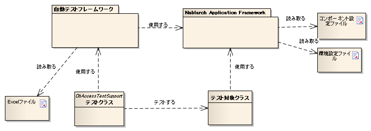

# 自動テストフレームワーク

## 特徴

## JUnit4ベース

自動テストフレームワークは、JUnit4をベースとしている。
各種アノテーション、assertメソッドやMatcherクラスなど、JUnit4で提供されている機能を使用する。

> **Tip:** JUnit 5の上で自動テストフレームワークを動かしたい場合は、 JUnit 5で自動テストフレームワークを動かす を参照のこと。

## テストデータの外部化

テストデータをExcelファイルに記述できる。
データベース準備データや期待するテスト結果などを記載したExcelファイルを
自動テストフレームワークのAPIを通じて使用できる。

## Nablarchに特化したテスト補助機能を提供

トランザクション制御やシステム日付設定など、Nablarchアプリケーションに特化したAPIを用意する。

## 自動テストフレームワークの構成


<table>
<thead>
<tr>
  <th>構成物</th>
  <th>説明</th>
  <th>作成者</th>
</tr>
</thead>
<tbody>
<tr>
  <td>テストクラス</td>
  <td>テスト処理を記述する。</td>
  <td>アプリケーションプログラマ</td>
</tr>
<tr>
  <td>テスト対象クラス</td>
  <td>テスト対象となるクラス。</td>
  <td>アプリケーションプログラマ</td>
</tr>
<tr>
  <td>Excelファイル</td>
  <td>テストデータを記載する。自動テストフレ</td>
  <td>アプリケーションプログラマ</td>
</tr>
<tr>
  <td></td>
  <td>ームワークを使用することにより、データ</td>
  <td></td>
</tr>
<tr>
  <td></td>
  <td>を読み取ることができる。</td>
  <td></td>
</tr>
<tr>
  <td>コンポーネント設定ファイル・</td>
  <td>テスト実行時の各種設定を記載する。</td>
  <td>アプリケーションプログラマ（個別のテス</td>
</tr>
<tr>
  <td>環境設定ファイル</td>
  <td></td>
  <td>トに固有の設定が必要な場合）</td>
</tr>
<tr>
  <td>自動テストフレームワーク</td>
  <td>テストに必要な機能を提供する。</td>
  <td>\－</td>
</tr>
<tr>
  <td>Nablarch Application</td>
  <td>フレームワーク本体（本機能の対象外）</td>
  <td>\－</td>
</tr>
<tr>
  <td>Framework</td>
  <td></td>
  <td></td>
</tr>
</tbody>
</table>

## テストメソッド記述方法

JUnit4のアノテーションを使用する。
テストメソッドに @Test アノテーションを付与する。


```java
public class SampleTest {

    @Test
    public void testSomething() {
        // テスト処理
    }
}
```
> **Tip:** @Beforeや@Afterなどのアノテーションも使用できる。これらのアノテーションを用いて、 テストメソッド前後にリソースの取得解放などの共通処理を行いたい場合は、 次の項を参照（ テスト実行前後に共通処理を行いたい。 ）。

## Excelによるテストデータ記述

データベースの準備データやデータベース検索結果などのデータを表すには、
Javaソースコードよりスプレッドシートのほうが可読性や編集のしやすさという点で有利である。
Excelファイルを使用することにより、このようなデータをスプレッドシート形式で扱うことができる。

## 命名規約

Excelファイル名、ファイルパスには推奨される規約が存在する。この規約に従うことにより、テストクラスで明示的にディレクトリ名やファイル名を指定してファイルを読み込む必要がなくなり、簡潔にテストソースコードを記述できる。また明示的にパスを指定することで任意の場所のExcelファイルを読み込むことも可能である。


#### パス、ファイル名に関する規約

ファイル名、パスに関して推奨される規約は以下の通り。

- Excelファイル名は、テストソースコードと同じ名前にする（拡張子のみ異なる）。

- Excelファイルを、テストソースコードと同じディレクトリに配置する。


例を以下に示す。

<table>
<thead>
<tr>
  <th>ファイルの種類</th>
  <th>配置ディレクトリ</th>
  <th>ファイル名</th>
</tr>
</thead>
<tbody>
<tr>
  <td>テストソースファイル</td>
  <td><PROJECT_ROOT>/test</td>
  <td>ExampleDbAcessTest.java</td>
</tr>
<tr>
  <td>Excelファイル</td>
  <td></td>
  <td>ExampleDbAcessTest.xlsx [#]_</td>
</tr>
</tbody>
</table>

Excel ファイルは、 Excel2003以前のファイル形式(拡張子 xls の形式)および Excel2007 以降のファイル形式(拡張子 xlsx の形式)に対応している。
#### Excelシート名に関する規約

Excelシートについては、以下の規約が推奨される。

- １テストメソッドにつき１シート用意する。

- シート名はテストメソッド名と同名にする。

例を以下に示す。

<table>
<tbody>
<tr>
  <td>テストメソッド</td>
  <td>@Test public void testInsert()</td>
</tr>
<tr>
  <td>Excelシート名</td>
  <td>testInsert</td>
</tr>
</tbody>
</table>

> **Tip:** シートに関する規約は、「制約」事項ではない。 テストメソッド名とExcelシート名が同名でなくても正しく動作する。 今後の機能追加は上記規約をデフォルトとして開発されるので、命名規約に準拠することを推奨する。 仮に命名規約を変更する場合であってもプロジェクト内で統一を図ること。

## シート内の構造

Excelシートの記述方法関する規約について説明する。
以下にシートの記述例を記載する。


シート内には、データベースに格納するデータやデータベース検索結果など、さまざまな種類のデータを記載できる。テストデータの種類を判別するために「データタイプ」というメタ情報をテストデータに付与する必要がある。「データタイプ」は、そのテストデータが何を表しているかを示す。

現状、以下のデータタイプが用意されている。

| データタイプ名 | 説明 | 設定する値 |
|---|---|---|
| SETUP_TABLE | テスト実行前にデータベースに登録するデータ | 登録対象のテーブル名 |
| EXPECTED_TABLE | テスト実行後の期待するデータベースのデータ 省略したカラムは、比較対象外となる。 | 確認対象のテーブル名 |
| EXPECTED_COMPLETE_TABLE | テスト実行後の期待するデータベースのデータ 省略したカラムには\ default_values_when_column_omitted       \ が設定されているものとして扱われる。 | 確認対象のテーブル名 |
| LIST_MAP | List<Map<String,String>>形式のデータ | シート内で一意になるID 期待値のID(任意の文字列) |
| SETUP_FIXED | 事前準備用の固定長ファイル | 準備ファイルの配置場所 |
| EXPECTED_FIXED | 期待値を示す固定長ファイル | 比較対象ファイルの配置場所 |
| SETUP_VARIABLE | 事前準備用の可変長ファイル | 準備ファイルの配置場所 |
| EXPECTED_VARIABLE | 期待値を示す可変長ファイル | 比較対象ファイルの配置場所 |
| MESSAGE | メッセージング処理のテストで使用するデータ | 固定値 \ [#]_\ |
| EXPECTED_REQUEST_HEADER_MESSAGES | 要求電文（ヘッダ）の期待値を示す固定長ファイル | リクエストID |
| EXPECTED_REQUEST_BODY_MESSAGES | 要求電文（本文）の期待値を示す固定長ファイル | リクエストID |
| RESPONSE_HEADER_MESSAGES | 応答電文（ヘッダ）を示す固定長ファイル | リクエストID |
| RESPONSE_BODY_MESSAGES | 応答電文（本文）を示す固定長ファイル | リクエストID |

\

\ `setUpMessages`\ または\ `expectedMessages`\
また、データの個数も複数記述できる。


データの種類に依らない共通の書式は以下の通り。

* データ1行目は「データタイプ=値」の形式で、データタイプと値を記載する。
* 2行目以降の書式はデータタイプにより異なる。

データタイプとは、そのデータが何を表すかを特定するための情報である。
例えばそのデータが、データベースに投入されるべきデータである場合は、データタイプ"SETUP_TABLE"を使用する。

例えば、以下のようにデータタイプを記載した場合、そのデータがCOMPOSERテーブルに準備データとして登録されるべきものであることを示している。


SETUP_TABLE=COMPOSER

<table>
<thead>
<tr>
  <th>NO</th>
  <th>FIRST_NAME</th>
  <th>LAST_NAME</th>
</tr>
</thead>
<tbody>
<tr>
  <td>00001</td>
  <td>Steve</td>
  <td>Reich</td>
</tr>
<tr>
  <td>00002</td>
  <td>Phillip</td>
  <td>Glass</td>
</tr>
</tbody>
</table>

## コメント

セル内に"//"から開始する文字列を記載した場合、そのセルから右のセルは全て読み込み対象外となる。テストデータ自体には含めたくないが、可読性を向上させるために付加情報を記載したい場合には、コメント機能が使用できる。

以下の例では、2行目でテーブルの論理名を、4行目末尾で期待する結果についてコメントしている。

EXPECTED_TABLE=PLAYER

<table>
<thead>
<tr>
  <th>NO</th>
  <th>FIRST_NAME</th>
  <th>LAST_NAME</th>
  <th>ADDRESS</th>
  <th></th>
</tr>
</thead>
<tbody>
<tr>
  <td>//番号</td>
  <td>名</td>
  <td>姓</td>
  <td>住所</td>
  <td></td>
</tr>
<tr>
  <td>0001</td>
  <td>Andres</td>
  <td>Segovia</td>
  <td>Spain</td>
  <td></td>
</tr>
<tr>
  <td>0002</td>
  <td>Julian</td>
  <td>Bream</td>
  <td>England</td>
  <td>// このレコードが追加される</td>
</tr>
</tbody>
</table>

## マーカーカラム

テストデータを記述する際、実際のデータには含めたくないがExcelシート上には記述しておきたい場合がある。\
前述の「コメント」を使用することにより、実際のデータには含まれない情報を記述できるが、\
「コメント」には、そのセルから右のセルを読み込み対象外にするという性質があるため、\
左端（または中央）のセルにはコメントを使用できない。

このような場合は、「マーカーカラム」を使用することで、実際のデータには含まれないが
Excelシートの見た目上は存在するデータを記述できる。

テストデータの見出し行において、\
**カラム名が半角角括弧で囲まれている場合、そのカラムは「マーカーカラム」とみなされる。**\
マーカーカラムに該当する列はテスト実行時には読み込まれない。

例えば、以下のようなテストデータがあるとする。

LIST_MAP=EXAMPLE_MARKER_COLUMN

<table>
<thead>
<tr>
  <th>[no]</th>
  <th>id</th>
  <th>name</th>
</tr>
</thead>
<tbody>
<tr>
  <td>1</td>
  <td>U0001</td>
  <td>山田</td>
</tr>
<tr>
  <td>2</td>
  <td>U0002</td>
  <td>田中</td>
</tr>
</tbody>
</table>

上記のテストデータは、半角角括弧で囲まれているカラム[no]が無視されるため、
テスト実行時には以下のテストデータと等価となる。

LIST_MAP=EXAMPLE_MARKER_COLUMN

<table>
<thead>
<tr>
  <th>id</th>
  <th>name</th>
</tr>
</thead>
<tbody>
<tr>
  <td>U0001</td>
  <td>山田</td>
</tr>
<tr>
  <td>U0002</td>
  <td>田中</td>
</tr>
</tbody>
</table>


ここではLIST_MAPの例を挙げたが、それ以外のデータタイプでも同様に使用できる。

## セルの書式

セルの書式には、文字列のみを使用する。
テストデータを作成する前に、全てのセルの書式を文字列に設定しておくこと。

罫線やセルの色付けについては任意に設定可能である。罫線やセルの色付けを行うことでデータが見やすくなり、レビュー品質や保守性の向上が期待できる。


> **Important:** | Excelファイルに文字列以外の書式でデータを記述した場合、正しくデータが読み取れなくなる。

## 日付の記述方法

日付は以下の形式で記述できる。

- yyyyMMddHHmmssSSS

- yyyy-MM-dd HH:mm:ss.SSS

以下のように時刻のミリ秒または全部を省略できる。

<table>
<thead>
<tr>
  <th>省略方法</th>
  <th>省略した場合の動作</th>
</tr>
</thead>
<tbody>
<tr>
  <td>| ミリ秒を省略</td>
  <td>ミリ秒として0を指定したものとして扱われる。</td>
</tr>
<tr>
  <td>| ・yyyMMddHHmmss</td>
  <td></td>
</tr>
<tr>
  <td>| ・yyy-MM-dd HH:mm:ss</td>
  <td></td>
</tr>
<tr>
  <td>| 時刻全部を省略</td>
  <td>時刻として0時0分0秒000を指定したものとして扱われる。</td>
</tr>
<tr>
  <td>| ・yyyMMdd</td>
  <td></td>
</tr>
<tr>
  <td>| ・yyy-MM-dd</td>
  <td></td>
</tr>
</tbody>
</table>

例を以下に示す。

<table>
<thead>
<tr>
  <th>記述例</th>
  <th>評価結果</th>
</tr>
</thead>
<tbody>
<tr>
  <td>20210123123456789</td>
  <td>2021年1月23日 12時34分56秒789</td>
</tr>
<tr>
  <td>20210123123456</td>
  <td>2021年1月23日 12時34分56秒000</td>
</tr>
<tr>
  <td>20210123</td>
  <td>2021年1月23日 00時00分00秒000</td>
</tr>
<tr>
  <td>2021-01-23 12:34:56.789</td>
  <td>2021年1月23日 12時34分56秒789</td>
</tr>
<tr>
  <td>2021-01-23 12:34:56</td>
  <td>2021年1月23日 12時34分56秒000</td>
</tr>
<tr>
  <td>2021-01-23</td>
  <td>2021年1月23日 00時00分00秒000</td>
</tr>
</tbody>
</table>

## セルへの特殊な記述方法

自動テストの利便性を向上させるために、いくつかの特殊記法を提供する。
下記表が、本フレームワークで提供する特殊な記述方法となっている。


<table>
<thead>
<tr>
  <th>記述方法 (セルに記述す\</th>
  <th>自動テスト内での値 [#]_\</th>
  <th>説明</th>
</tr>
<tr>
  <th>る値)</th>
  <th></th>
  <th></th>
</tr>
</thead>
<tbody>
<tr>
  <td>null</td>
  <td>null</td>
  <td>セル内に、「null」 **(半角で大文字、小文字の区別はしない)** と記述されて\</td>
</tr>
<tr>
  <td>Null</td>
  <td></td>
  <td>い場合や、期待値でnull値を設定したい場合に使用する。</td>
</tr>
<tr>
  <td>"null"</td>
  <td>文字列のnull</td>
  <td>文字列の前後がダブルクォート(半角、全角問わず)で囲われている場合は、前後\</td>
</tr>
<tr>
  <td>"NULL"</td>
  <td></td>
  <td></td>
</tr>
<tr>
  <td>"1⊔"</td>
  <td>1⊔</td>
  <td>にあるように 「"null"」や「"NULL"」と記述する。</td>
</tr>
<tr>
  <td>"⊔"</td>
  <td>⊔</td>
  <td>また、セルの値にスペースがあることを解りやすくする目的で、記述方法にあるよ</td>
</tr>
<tr>
  <td>"１△"</td>
  <td>１△</td>
  <td></td>
</tr>
<tr>
  <td>"△△"</td>
  <td>△△</td>
  <td></td>
</tr>
<tr>
  <td>"""</td>
  <td>"</td>
  <td></td>
</tr>
<tr>
  <td>"" [#]_</td>
  <td>空文字列</td>
  <td></td>
</tr>
<tr>
  <td>${systemTime}</td>
  <td>システム日時 [#]_</td>
  <td>システム日時を記載したい場合に使用する</td>
</tr>
<tr>
  <td>${updateTime}</td>
  <td></td>
  <td>${systemTime}の別名。特にデータベースのタイムスタンプ更新時の期待値として\</td>
</tr>
<tr>
  <td></td>
  <td></td>
  <td>使用する。</td>
</tr>
<tr>
  <td>${setUpTime}</td>
  <td>コンポーネント設定ファイルに</td>
  <td>データベースセットアップ時のタイムスタンプに、決まった値を使用したい場合\</td>
</tr>
<tr>
  <td></td>
  <td>記載された固定値</td>
  <td>に使用する。</td>
</tr>
<tr>
  <td>${文字種,文字数} [#]_</td>
  <td>指定した文字種を指定した文字</td>
  <td>使用可能な文字列は下記の通り。</td>
</tr>
<tr>
  <td></td>
  <td>数分まで増幅した値</td>
  <td></td>
</tr>
<tr>
  <td></td>
  <td></td>
  <td>半角英字,半角数字,半角記号,半角カナ,全角英字,全角数字,</td>
</tr>
<tr>
  <td></td>
  <td></td>
  <td>全角ひらがな,全角カタカナ,全角漢字,全角記号その他,外字</td>
</tr>
<tr>
  <td>${binaryFile:ファイルパ</td>
  <td>BLOB列に格納するバイナリデー</td>
  <td>BLOB列にファイルのデータを格納したい場合に使用する。</td>
</tr>
<tr>
  <td>ス}</td>
  <td>タ</td>
  <td>ファイルパスはExcelファイルからの相対パスで記述する。</td>
</tr>
<tr>
  <td>\\r</td>
  <td>\ *CR*\</td>
  <td>改行コードを明示的に記述する場合に使用する。 [#]_</td>
</tr>
<tr>
  <td>\\n</td>
  <td>\ *LF*\</td>
  <td></td>
</tr>
</tbody>
</table>


> **Tip:** **凡例**

*  ⊔ は、半角スペースの意
*  △は、全角スペースの意
* *CR* は、改行コードCR(0x0D)の意
* *LF* は、改行コードLF(0x0A)の意
.. [#]
セルから読み込み後に自動テストフレームワークにて変換される。

\


.. [#]

本記述方法を利用した場合であっても、文字列中のダブルクォートをエスケープする必要はない。
以下に例を示す。

<table>
<thead>
<tr>
  <th>記述例</th>
  <th>説明</th>
</tr>
</thead>
<tbody>
<tr>
  <td>"ab"c"</td>
  <td>ab"cとして扱われる。(前後のダブルクォートが除去される。)</td>
</tr>
<tr>
  <td>"abc""</td>
  <td>abc"として扱われる。(前後のダブルクォートが除去される。)</td>
</tr>
<tr>
  <td>ab"c</td>
  <td>ab"cとして扱われる。(前後がダブルクォートではないため、そのまま扱われる。)</td>
</tr>
<tr>
  <td>abc"</td>
  <td>abc"として扱われる。(前後がダブルクォートではないため、そのまま扱われる。)</td>
</tr>
</tbody>
</table>

\


.. [#]
この記法を使用することで、空行を表すことができる。
『\ テストデータに空行を記述したい\ 』の項を参照。

コンポーネント設定ファイルにて設定されたSystemTimeProvider実装クラスから取得したTimestampの文字列形式に変換される。\
具体的には、\ `2011-04-11 01:23:45.0` というような値に変換される。
\

.. [#]
本記法は単独でも使用可能であるし、組み合わせても使用できる。
以下に例を示す。

<table>
<thead>
<tr>
  <th>記述例</th>
  <th>変換される値の例</th>
  <th>説明</th>
</tr>
</thead>
<tbody>
<tr>
  <td>${半角英字,5}</td>
  <td>geDSfe</td>
  <td>半角英字5文字に変換される。</td>
</tr>
<tr>
  <td>${全角ひらがな,4}</td>
  <td>ぱさぇん</td>
  <td>全角ひらがな4文字に変換される。</td>
</tr>
<tr>
  <td>${半角数字,2}-{半角数字4}</td>
  <td>37-3425</td>
  <td>-以外が変換される。</td>
</tr>
<tr>
  <td>${全角漢字,4}123</td>
  <td>山川海森123</td>
  <td>末尾123以外が変換される。</td>
</tr>
</tbody>
</table>

.. [#]

Excelセル内の改行（Alt+Enter）は\ *LF*\ として扱われる。これは本機能とは関係のないExcelの仕様である。
改行コードLFを表したい場合は、単にセル内で改行（Alt+Enter）すればよい。

以下に例を示す。

<table>
<thead>
<tr>
  <th>記述例</th>
  <th>変換される値の例</th>
  <th>説明</th>
</tr>
</thead>
<tbody>
<tr>
  <td>こんにちは </td>
  <td>こんにちは\ *LF*\</td>
  <td>セル内の改行（Alt+Enter）は</td>
</tr>
<tr>
  <td>さようなら</td>
  <td>さようなら</td>
  <td>LF(0x0A)となる。</td>
</tr>
<tr>
  <td>こんにちは\\n</td>
  <td>こんにちは\ *LF*\</td>
  <td>'\\n'は本機能によりLF(0x0A)に</td>
</tr>
<tr>
  <td>さようなら</td>
  <td>さようなら</td>
  <td>変換される。</td>
</tr>
<tr>
  <td>こんにちは\\r </td>
  <td>こんにちは\ *CRLF*\</td>
  <td>'\\r'は本機能によりCR(0x0D)に</td>
</tr>
<tr>
  <td>さようなら</td>
  <td>さようなら</td>
  <td>変換される。セル内の改行</td>
</tr>
<tr>
  <td></td>
  <td></td>
  <td>（Alt+Enter）はLF(0x0A)となる。</td>
</tr>
</tbody>
</table>

## 注意事項

## テストメソッドの実行順序に依存しないテストを作成する

テストソースコード、テストデータ作成時には、テストメソッドの実行順序によって、テスト結果が変わらないように留意する。単に順序だけでなく、クラス単体でテストしても、複数まとめてテストしても同じ結果にならなければならない。


特に、本フレームワークではテスト中にコミットが行われるため、前後のテストによってデータベースの内容が変更される可能性が高い。\
よって、自テストクラスで必要となる事前条件については、全て自テストクラス内で準備するようにしておかなければならない。

これにより、以下のような効果が得られる。

* テストの実行順序によって偶然テストが失敗したり偶然成功する、という事態を防ぐ。
* そのテストのデータまたはソースコードだけで、事前条件が分かる。

マスタデータのような基本的に読み取り専用のテーブルの準備については、共通のExcelファイルを用意してそこに記載すること。テスト実行前に1回だけ実行するか、テスト実行前に事前に準備済みという前提でテストを実行するようにする。

この手法には、以下のようなメリットがある。

* マスタ系のデータを、プロジェクト全体で再利用できる。
* テストデータのメンテナンスが容易になる。
* テスト実行速度が上がる。

> **Tip:** マスタデータの投入には、\ マスタデータ投入ツール\ を使用する。\ また、\ 04_MasterDataRestore\ により、テスト内で発生したマスタデータの変更をテスト終了時に自動的に元の状態に戻すことができる。これにより、マスタデータに変更が必要なテストケースであっても、他のテストケースに影響無く実行できる。

## テストデータは全てExcelシートに記述する

Excelとテストソースコードとでテストデータが混在していると、可読性、保守性が低下してしまう。テストソースコード中にはテストデータを記載せず、テストデータは全てExcelシートに記載すること。

* Excelシートを見れば、テストケースのバリエーションを把握できる。
* テストデータはExcelシート、テストロジックはテストソースコードと役割分担が明確になる。
* Excelシートを読み込む構造にしておくことで、容易にテストケースを追加できる。
* テストソースコードの重複を大幅に削減できる(テストソースコード中に単純にリテラル値でデータを記載すると、データのバリエーションが増加すると重複したコードが作られてしまう)。

## 複数のデータタイプ使用時はデータタイプごとにまとめてデータを記述する

複数のデータタイプを使用する場合、使用するデータタイプごとにまとめてデータを記述すること。
複数のデータタイプを混在させてデータを記述してしまうと、データの読み込みが途中で終了しテストが正しく実行されない。

例えば、 以下のようにデータタイプを記述した場合、 `TABLE2` までのデータしか評価されず、
`TABLE3` 以降のデータに誤りがあってもテストは成功してしまう。

```text
EXPECTED_TABLE=TABLE1
:
EXPECTED_COMPLETE_TABLE=TABLE2
:
EXPECTED_TABLE=TABLE3
:
EXPECTED_COMPLETE_TABLE=TABLE4
:
```
全てのデータが正しく評価されるようにするには、
以下のようにデータタイプごとにまとめてデータを記述すること。

```text
EXPECTED_TABLE=TABLE1
:
EXPECTED_TABLE=TABLE3
:
EXPECTED_COMPLETE_TABLE=TABLE2
:
EXPECTED_COMPLETE_TABLE=TABLE4
:
```

## JUnit 5で自動テストフレームワークを動かす

## JUnit Vintage

JUnit 5には、JUnit Vintageというプロジェクトがある。
このプロジェクトは、JUnit 5の上でJUnit 4で書かれたテストを実行できるようにするための機能を提供している。
この機能を利用することで、自動テストフレームワークをJUnit 5の上で動かすことができる。

> **Important:** この機能は、あくまでJUnit 4のテストをJUnit 4として動かしているにすぎない。 したがって、この機能を使ったからといって、JUnit 4のテストの中でJUnit 5の機能が使えるわけではない。 この機能は、JUnit 4からJUnit 5への移行を段階的進めるための補助として利用できる。 JUnit 4からJUnit 5に移行するときの手順については、 [公式のガイド(外部サイト、英語)](https://junit.org/junit5/docs/5.11.0/user-guide/#migrating-from-junit4) を参照。
> **Tip:** JUnit 5のテストで自動テストフレームワークを使用する方法については、 JUnit 5用拡張機能 を参照。
以下で、JUnit Vintageを使用して自動テストフレームワークをJUnit 5で動かす方法について説明する。

## 前提条件

JUnit 5を使用するには、以下の条件を満たしている必要がある。

* maven-surefire-plugin が 2.22.0 以上であること

## 依存関係の追加

JUnit Vintageは、pom.xmlで以下２つのアーティファクトを依存関係に追加することで有効にできる。

* `org.junit.jupiter:junit-jupiter`
* `org.junit.vintage:junit-vintage-engine`

以下に、pom.xmlの記述例を記載する。

```xml
<dependencyManagement>
  <dependencies>
    ...

    <!-- バージョンを揃えるため、JUnitが提供しているbomを読み込む -->
    <dependency>
      <groupId>org.junit</groupId>
      <artifactId>junit-bom</artifactId>
      <version>5.8.2</version>
      <type>pom</type>
      <scope>import</scope>
    </dependency>
  </dependencies>
</dependencyManagement>

<dependencies>
  ...

  <!-- 以下の依存関係を追加する -->
  <dependency>
    <groupId>org.junit.jupiter</groupId>
    <artifactId>junit-jupiter</artifactId>
    <scope>test</scope>
  </dependency>
  <dependency>
    <groupId>org.junit.vintage</groupId>
    <artifactId>junit-vintage-engine</artifactId>
    <scope>test</scope>
  </dependency>
</dependencies>
```
以上の設定により、自動テストフレームワークをJUnit 5の上で動かすことができるようになる。
