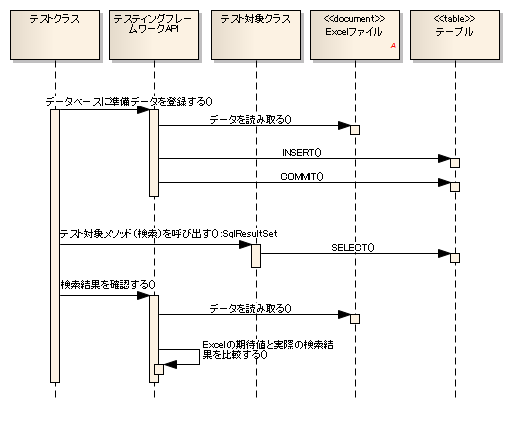
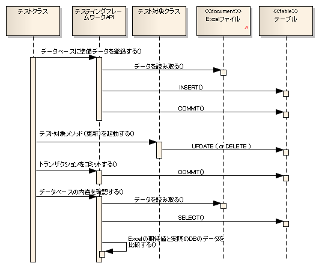

# データベースを使用するクラスのテスト

## 概要

データベースアクセスクラスなど、データベースを使用するクラスをテストする方法を記載する。


データベースを使用するクラスをテストする場合、本フレームワークで用意されたクラスを使用することでデータベースに関する操作（テストデータ投入、データ確認）を行うことができる。


# 全体像


## 主なクラス, リソース

<table>
<thead>
<tr>
  <th>名称</th>
  <th>役割</th>
  <th>作成単位</th>
</tr>
</thead>
<tbody>
<tr>
  <td>テストクラス</td>
  <td>テストロジックを実装する。\</td>
  <td>テスト対象クラスにつき１つ作成</td>
</tr>
<tr>
  <td></td>
  <td>DbAccessTestSupportを継承すること。</td>
  <td></td>
</tr>
<tr>
  <td>テストデータ（Excelファイル</td>
  <td>テーブルに格納する準備データや期待する結果\</td>
  <td>テストクラスにつき１つ作成</td>
</tr>
<tr>
  <td>）</td>
  <td>など、テストデータを記載する。</td>
  <td></td>
</tr>
<tr>
  <td>テスト対象クラス</td>
  <td>テストされるクラス。</td>
  <td>\－</td>
</tr>
<tr>
  <td>DbAccessTestSupport</td>
  <td>準備データ投入などデータベースを使用するテスト\</td>
  <td>\－</td>
</tr>
<tr>
  <td></td>
  <td>に必要な機能を提供する。また、テスト実行前後に\</td>
  <td></td>
</tr>
<tr>
  <td></td>
  <td>データベーストランザクションの開始・終了処理を\</td>
  <td></td>
</tr>
<tr>
  <td></td>
  <td>行う（ using_transactions ）。</td>
  <td></td>
</tr>
</tbody>
</table>

## 基本的なテスト方法

目的に応じた、本フレームワークのAPIの使用方法を以下に記載する。


# 参照系のテスト

参照系のテストにおいて、テスト対象クラスが期待通りにデータを取得していることを確認する場合、以下の手順でデータベースからの参照結果を確認できる。

#. データベースに準備データを登録する。
#. テスト対象クラスのメソッドを起動する。
#. 戻り値として受け取った検索結果が期待した値であるか確認する。

## シーケンス



## テストソースコード実装例

```java
public class DbAccessTestSample extends DbAccessTestSupport {

    /**
     * 全件検索のテスト。<br/>
     * 従業員テーブルに登録されたレコードを
     * 全件取得できることを確認する。
     */ 
    @Test
    public void testSelectAll() {

        // データベースに準備データを登録する。
        //引数にはシート名を記載する。
        setUpDb("testSelectAll");

        // テスト対象メソッドを起動する。
        EmployeeDbAcess target = new EmployeeDbAccess(); 
        SqlResultSet actual = target.selectAll();

        // 結果確認
        // Excelに記載した期待値と実際の値が等しいことを確認する
        // 引数には期待値を格納したシート名, 期待値のID, 実際の値を指定
        assertSqlResultSetEquals("testSelectAll", "expected", actual);
    }
}
```

## テストデータ記述例

## データベースに事前登録する準備データ

以下のようにデータを記載する。

* 1行目　：　SETUP_TABLE=<登録対象のテーブル名>

* 2行目　：　そのテーブルのカラム名

* 3行目～　：　登録するレコード（2行目のカラム名と対応）


SETUP_TABLE=EMPLOYEE

| ID | EMP_NAME | DEPT_CODE |
|---|---|---|
| 00001 | 山田太郎 | 0001 |
| 00002 | 田中一郎 | 0002 |

SETUP_TABLE=DEPT

| ID | DEPT_NAME |
|---|---|
| 0001 | 人事部 |
| 0002 | 総務部 |

## テスト実行後に期待する値

以下のようにデータを記載する。

* 1行目　：　LIST_MAP=<シート内で一意になる期待値のID(任意の文字列)>

* 2行目　：　SELECT文で指定したカラム名または別名

* 3行目～　：　検索結果（2行目のカラム名と対応）


LIST_MAP=expected

| ID | EMP_NAME | DEPT_NAME |
|---|---|---|
| 00001 | 山田太郎 | 人事部 |
| 00002 | 田中一郎 | 総務部 |


# 更新系のテスト

テスト対象クラスが期待通りにデータを更新していることを確認する場合、以下の手順でデータベースの更新結果を確認できる。


#. データベースに準備データを登録する。
#. テスト対象クラスのメソッドを起動する。
#. トランザクションをコミットする。
#. データベースの値が期待通り更新されていることを確認する。

> **Important:** Nablarch Application Frameworkでは複数種類のトランザクションを併用することが前提となっている。 そのため、テスト対象クラス実行後にデータベースの内容を確認する際には、 トランザクションをコミットしなければならない。トランザクションをコミットしない場合、 テスト結果の確認が正常に行われない。
> **Tip:** 参照系のテストの場合はコミットを行う必要はない。

## シーケンス



## テストソースコード実装例

```java
public class DbAccessTestSample extends DbAccsessTestSupport {
    @Test
    public void testDeleteExpired() {

        // データベースに準備データを登録する。
        // 引数にはシート名を記載する。
        setUpDb("testDeleteExpired");

        // テスト対象メソッドを起動する。
        EmployeeDbAcess target = new EmployeeDbAccess(); 
        SqlResultSet actual = target.deleteExpired();  // 期限切れデータを削除

        // トランザクションをコミット
        commitTransactions();

        // 結果確認
        // Excelに記載した期待値と実際の値が等しいことを確認する
        // 引数には期待値を格納したシート名, 実際の値を指定
        assertTableEquals("testDeleteExpired", actual);
    }
```

## テストデータ記述例

## データベースに事前登録する準備データ

以下のようにデータを記載する。

* 1行目　：　SETUP_TABLE=<登録対象のテーブル名>

* 2行目　：　そのテーブルのカラム名

* 3行目～　：　登録するレコード（2行目のカラム名と対応）


SETUP_TABLE=EMPLOYEE

| ID | EMP_NAME | EXPIRED |
|---|---|---|
| 00001 | 山田太郎 | TRUE |
| 00002 | 田中一郎 | FALSE |

## テスト実行後に期待する値

以下のようにデータを記載する。

* 1行目　：　EXPECTED_TABLE=<確認対象のテーブル名>

* 2行目　：　確認対象テーブルのカラム名

* 3行目～　：　期待する値

EXPECTED_TABLE=EMPLOYEE

| ID | EMP_NAME | EXPIRED |
|---|---|---|
| // CHAR(5) | VARCHAR(64) | BOOLEAN |
| 00002 | 田中一郎 | FALSE |

## データベーステストデータの省略記述方法

データベースの準備データおよび期待値を記述する際、\
テストに関係の無いカラムについては記述を省略できる。
省略したカラムには、自動テストフレームワークにより\ default_values_when_column_omitted\ が設定される。
この機能を使用することにより、テストデータの可読性が向上する。\
また、テーブル定義が変更された場合でも、関係無いカラムであればテストデータ修正作業は発生しなくなる為、\
保守性が向上する。

この機能は特に更新系テストケースに有効である。多くのカラムのうち１カラムだけが更新される場合、\
不要なカラムを記述する必要がなくなる。

> **Important:** データベース\ **検索結果**\ の期待値を記述する際は、\ 検索対象カラム全てを記述しなければならない\ （レコードの主キーだけを確認する、というような確認方法は不可）。 また、\ **登録系**\ テストの場合も、新規に登録されたレコードの全カラムを確認する必要があるので、\ カラムを省略できない。
# DBに準備データのカラムを省略する場合

データベース準備データを記述する際にカラムを省略すると、省略されたカラムには\
\ default_values_when_column_omitted\ が設定されているものとして扱われる。

ただし、\ **主キーカラムは省略できない**\ 。


# DB期待値のカラムを省略する場合

DB期待値から単純に無関係なカラムを省略すると、省略されたカラムは比較対象外となる。\
更新系テストの場合には、「無関係なカラムが更新されていないことを確認する」という観点も必要である。
この場合、データタイプに\ `EXPECTED_TABLE`\ ではなく、\ `EXPECTED_COMPLETE_TABLE`\ を使用する。
\ `EXPECTED_TABLE`\ を使用した場合、省略されたカラムは比較対象外となるが、\
`EXPECTED_COMPLETE_TABLE`\ を使用した場合は、省略されたカラムには\
デフォルト値\ が格納されているものとして\
比較が行われる。


# 具体例

全カラムを記載した場合と、関係のあるカラムのみを記載した場合の記述例を以下に示す。

## テストケース例

以下のテストケースを例として使用する。


**「有効期限」を過ぎたレコードは「削除フラグ」が1に更新されること。**\ [#]_

本テスト実施時の日付は2011/01/01とする。
使用するテーブル（SAMPLE_TABLE）には、以下のカラムがあるものとする。

| カラム名 | 説明 |
|---|---|
| PK1 | 主キー |
| PK2 | 主キー |
| COL_A | テスト対象の機能では使用しないカラム |
| COL_B | テスト対象の機能では使用しないカラム |
| COL_C | テスト対象の機能では使用しないカラム |
| COL_D | テスト対象の機能では使用しないカラム |
| 有効期限 | 有効期限を過ぎたデータが処理対象となる |
| 削除フラグ | 有効期限を過ぎたレコードの値を'1'に変更する |

## 省略せずに全カラムを記載した場合（悪い例）

全カラムが記載されており可読性に劣る\ [#]_\ 。
また、テーブル定義に変更があった場合、無関係なカラムであっても修正しなければならない。

カラムCOL_A, COL_B, COL_C, COL_Dは本テストケースに無関係である。
**準備データ**

SETUP_TABLE=SAMPLE_TABLE

<table>
<thead>
<tr>
  <th>PK_1</th>
  <th>PK_2</th>
  <th>COL_A</th>
  <th>COL_B</th>
  <th>COL_C</th>
  <th>COL_D</th>
  <th>有効期限</th>
  <th>削除フラグ</th>
</tr>
</thead>
<tbody>
<tr>
  <td>01</td>
  <td>0001</td>
  <td>1a</td>
  <td>1b</td>
  <td>1c</td>
  <td>1d</td>
  <td>20101231</td>
  <td>0</td>
</tr>
<tr>
  <td>02</td>
  <td>0002</td>
  <td>2a</td>
  <td>2b</td>
  <td>2c</td>
  <td>2d</td>
  <td>20110101</td>
  <td>0</td>
</tr>
</tbody>
</table>


**期待値**

EXPECTED_TABLE=SAMPLE_TABLE

<table>
<thead>
<tr>
  <th>PK_1</th>
  <th>PK_2</th>
  <th>COL_A</th>
  <th>COL_B</th>
  <th>COL_C</th>
  <th>COL_D</th>
  <th>有効期限</th>
  <th>削除フラグ</th>
</tr>
</thead>
<tbody>
<tr>
  <td>01</td>
  <td>0001</td>
  <td>1a</td>
  <td>1b</td>
  <td>1c</td>
  <td>1d</td>
  <td>20101231</td>
  <td>1</td>
</tr>
<tr>
  <td>02</td>
  <td>0002</td>
  <td>2a</td>
  <td>2b</td>
  <td>2c</td>
  <td>2d</td>
  <td>20110101</td>
  <td>0</td>
</tr>
</tbody>
</table>

## 関係のあるカラムのみを記載した場合（良い例）

関係のあるカラムのみを記載することで可読性、保守性が向上する。
このテストケースに関係のあるカラムは以下のとおり。

* レコードを一意に特定する為の主キーカラム(PK_1,PK_2)
* 更新対象レコードを抽出する条件となる「有効期限」カラム
* 更新対象となる「削除フラグ」カラム

また、テーブル定義に変更があった場合でも、無関係なカラムであれば影響を受けない。


**準備データ**

実行テストに関係あるカラムのみを記述している。

SETUP_TABLE=SAMPLE_TABLE

<table>
<thead>
<tr>
  <th>PK_1</th>
  <th>PK_2</th>
  <th>有効期限</th>
  <th>削除フラグ</th>
</tr>
</thead>
<tbody>
<tr>
  <td>01</td>
  <td>0001</td>
  <td>20101231</td>
  <td>0</td>
</tr>
<tr>
  <td>02</td>
  <td>0002</td>
  <td>20110101</td>
  <td>0</td>
</tr>
</tbody>
</table>


**期待値**

期待値を記述する際、\ `EXPECTED_TABLE`\ の代わりに\ `EXPECTED_COMPLETE_TABLE`\ を使用する。

EXPECTED_COMPLETE_TABLE=SAMPLE_TABLE

<table>
<thead>
<tr>
  <th>PK_1</th>
  <th>PK_2</th>
  <th>有効期限</th>
  <th>削除フラグ</th>
</tr>
</thead>
<tbody>
<tr>
  <td>01</td>
  <td>0001</td>
  <td>20101231</td>
  <td>1</td>
</tr>
<tr>
  <td>02</td>
  <td>0002</td>
  <td>20110101</td>
  <td>0</td>
</tr>
</tbody>
</table>


# デフォルト値

自動テストフレームワークのコンポーネント設定ファイルにて明示的に指定していない場合、\
デフォルト値には以下の値が使用される。

<table>
<thead>
<tr>
  <th>カラム</th>
  <th>デフォルト値</th>
</tr>
</thead>
<tbody>
<tr>
  <td>数値型</td>
  <td>0</td>
</tr>
<tr>
  <td>文字列型</td>
  <td>半角スペース</td>
</tr>
<tr>
  <td>日付型</td>
  <td>1970-01-01 00:00:00.0</td>
</tr>
</tbody>
</table>


# デフォルト値の変更方法

## 設定項目一覧

nablarch.test.core.db.BasicDefaultValuesクラスを使用し、
以下の値をコンポーネント設定ファイルで設定できる。

<table>
<thead>
<tr>
  <th>設定項目名</th>
  <th>説明</th>
  <th>設定値</th>
</tr>
</thead>
<tbody>
<tr>
  <td>charValue</td>
  <td>文字列型のデフォルト値</td>
  <td>1文字のASCII文字</td>
</tr>
<tr>
  <td>numberValue</td>
  <td>数値型のデフォルト値</td>
  <td>0または正の整数</td>
</tr>
<tr>
  <td>dateValue</td>
  <td>日付型のデフォルト値</td>
  <td>JDBCタイムスタンプエスケープ形式 (yyyy-mm-dd hh:mm:ss.fffffffff)</td>
</tr>
</tbody>
</table>

## コンポーネント設定ファイルの記述例

以下の設定値を使用する場合のコンポーネント設定ファイル記述例を示す。

<table>
<thead>
<tr>
  <th>設定項目名</th>
  <th>設定値</th>
</tr>
</thead>
<tbody>
<tr>
  <td>charValue</td>
  <td>a</td>
</tr>
<tr>
  <td>numberValue</td>
  <td>1</td>
</tr>
<tr>
  <td>dateValue</td>
  <td>2000-01-01 12:34:56.123456789</td>
</tr>
</tbody>
</table>


```xml
<!-- TestDataParser -->
<component name="testDataParser" class="nablarch.test.core.reader.BasicTestDataParser">
  <!-- データベースデフォルト値 -->
  <property name="defaultValues">
    <component class="nablarch.test.core.db.BasicDefaultValues">
      <property name="charValue" value="a"/>
      <property name="dateValue" value="2000-01-01 12:34:56.123456789"/>
      <property name="numberValue" value="1"/>
    </component>
  </property>
  <!-- 中略 -->
</component>
```

## 注意点

# setUpDbメソッドに関する注意点

* Excelファイルには必ずしも全カラムを記述する必要はない。
省略されたカラムには、デフォルト値が設定される。

* Excelファイルの１シート内に複数のテーブルを記述できる。
setUpDb(String sheetName)実行時、指定されたシート内のデータタイプ"SETUP_TABLE"全てが登録対象となる。


# assertTableEqualsメソッドに関する注意点

* 期待値の記述で省略されたカラムは、比較対象外となる。

* 比較実行時、レコードの順番が異なっていても主キーを突合して正しく比較ができる。
レコードの順序を意識して期待データを作成する必要はない。

* １シート内に複数のテーブルを記述できる。assertTableEquals(String sheetName)実行時、指定されたシート内のデータタイプ"EXPECTED_TABLE"であるデータが全て比較される。

* 更新日付のようなjava.sql.Timestamp型のフォーマットは"yyyy-mm-dd hh:mm:ss.fffffffff"である(fffffffffはナノ秒)。ナノ秒が設定されていない場合でも、フォーマット上は0ナノ秒として表示される。例えば、2010年1月1日12時34分56秒ジャストの場合、2010-01-01 12:34:56.0となる。Excelシートに期待値を記載する場合は、末尾の小数点＋ゼロを付与しておく必要がある。


# assertSqlResultSetEqualsメソッドに関する注意点

* SELECT文で指定された全てのカラム名（別名）が比較対象になる。ある特定のカラムを比較対象外にすることはできない。

* レコードの順序が異なる場合は、等価でないとみなす（アサート失敗）。
これは以下の理由による。

* SELECTで指定されたカラムに主キーが含まれているとは限らない為。
* SELECT実行時はORDER BY指定がなされる場合がほとんどであり、順序についても厳密に比較する必要がある為。

# クラス単体テストにおける登録・更新系テストの注意点

* 自動設定項目を利用してデータベースに登録・更新する際は、ThreadContextにリクエストIDとユーザIDが設定されている必要がある。テスト対象クラス起動前にこれらの値をThreadContextに設定しておくこと。
ThreadContextの設定方法については、次の項を参照。（  using_ThreadContext  ）

* デフォルト以外のトランザクションを使用する場合は、本フレームワークにトランザクション制御を行わせる必要がある。トランザクション制御の設定方法については、次の項を参照。（  using_transactions  ）

# 外部キーが設定されたテーブルにデータをセットアップしたい
master_data_backup と同じ機能を用いて、テーブルの親子関係を判断しデータを削除及び登録する。
詳細は MasterDataRestore-fk_key を参照。

# Excelファイルに記述できるカラムのデータ型に関する注意点
Excelファイルには、`SqlPStatement` で対応している型のカラムのみ
テストデータとして記述できる。

そのため、それ以外のデータ型(例えば、OracleのROWIDやPostgreSQLのOIDなど)のカラムはテストデータとして記述できない点に注意すること。
