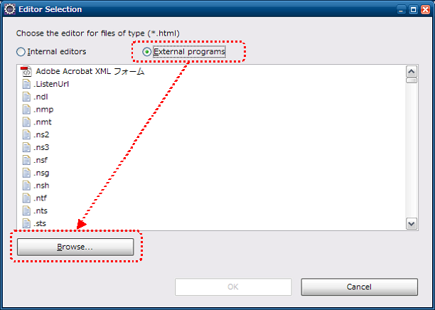
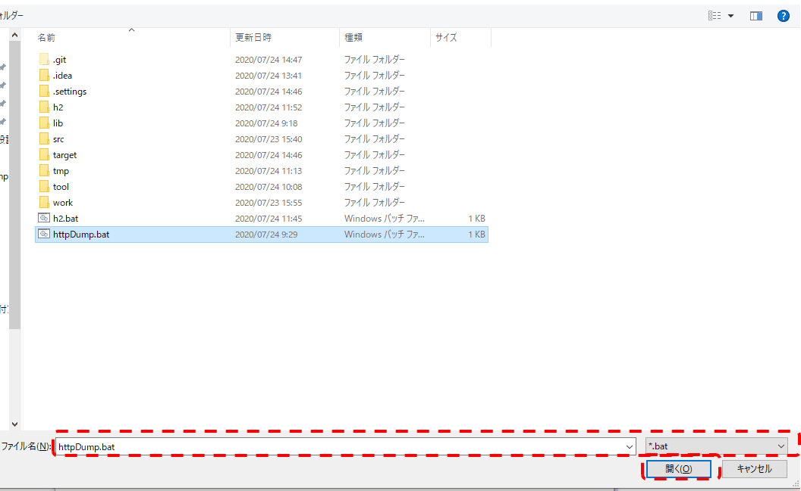
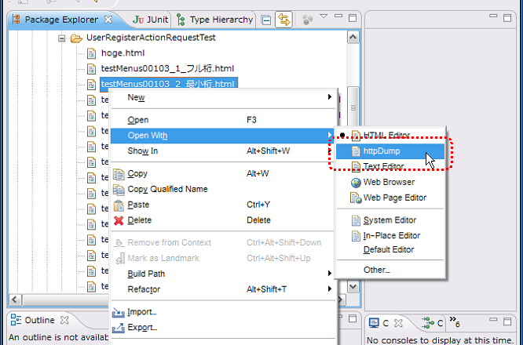

# リクエスト単体データ作成ツール インストールガイド

<details>
<summary>keywords</summary>

httpDump.bat, httpDump.sh, Windows Linux OS別選択, バッチファイル指定, HTMLファイル起動, Eclipse パッケージエクスプローラ, httpDumpで開く, 右クリック起動

</details>

index\ のインストール方法について説明する。

## 前提事項

本ツールを使用する際、以下の前提事項を満たす必要がある。

* 以下のツールがインストール済みであること

* Java
* Maven

* プロジェクトがMavenで管理されていること
* htmlファイルがブラウザに関連付けされていること
* ブラウザのプロキシ設定で、localhostが除外されていること

## 提供方法

本ツールは以下のjarにて提供する。

* nablarch-testing-XXX.jar
* nablarch-testing-jetty12-XXX.jar

そのため、pom.xmlのdependencies要素以下の記述があることを確認する。

```xml
<dependencies>
  <!-- 中略 -->
  <dependency>
    <groupId>com.nablarch.framework</groupId>
    <artifactId>nablarch-testing</artifactId>
    <scope>test</scope>
  </dependency>
  <dependency>
    <groupId>com.nablarch.framework</groupId>
    <artifactId>nablarch-testing-jetty12</artifactId>
    <scope>test</scope>
  </dependency>
  <!-- 中略 -->
</dependencies>
```
プロジェクトのディレクトリで以下のコマンドを実行し、jar ファイルをダウンロードする。

```text
mvn dependency:copy-dependencies -DoutputDirectory=lib
```
以下のファイルをプロジェクトのpom.xmlと同じディレクトリに配置する。

* [httpDump.bat](../../../knowledge/assets/testing-framework-02-SetUpHttpDumpTool/httpDump.bat)

## Eclipseとの連携

以下の設定をすることでEclipseから本ツールを起動できる。

## 設定画面起動

ツールバーから、ウィンドウ(Window)→設定(Prefernce)を選択する。
左側のペインから一般(General)→エディタ(Editors)→ファイルの関連付け(File Associations)
を選択、右側のペインから*.htmlを選択し、追加(Add)ボタンを押下する。


<details>
<summary>keywords</summary>

HttpDumpツール前提条件, Java Maven インストール要件, プロキシ設定 localhost除外, Mavenプロジェクト要件, ブラウザ関連付け

</details>

## 外部プログラム選択

ラジオボタンから外部プログラム(External program)を選択し、参照(Browse)ボタンを押下する。



<details>
<summary>keywords</summary>

nablarch-testing, nablarch-testing-jetty12, Maven依存関係, mvn dependency:copy-dependencies, httpDump.bat, JAR取得

</details>

## 起動用バッチファイル（シェルスクリプト）選択

Windowsの場合はバッチファイル(httpDump.bat)を、
Linuxの場合はシェルスクリプト(httpDump.sh)を選択する。



<details>
<summary>keywords</summary>

Eclipse設定, ファイルの関連付け, 外部エディタ登録, *.html, Eclipse Preference

</details>

## HTMLファイルからの起動方法

Eclipseのパッケージエクスプローラ等からHTMLファイルを右クリックし、
httpDumpで開くことでツールを起動できる。


.. |br| raw:: html

<br/>

<details>
<summary>keywords</summary>

外部プログラム設定, Eclipse エディタ選択, External program, Browse

</details>
