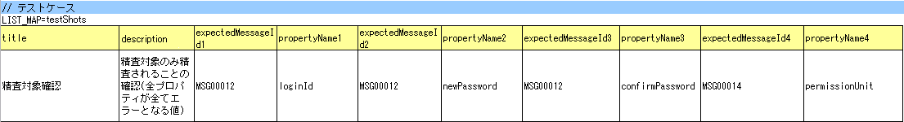
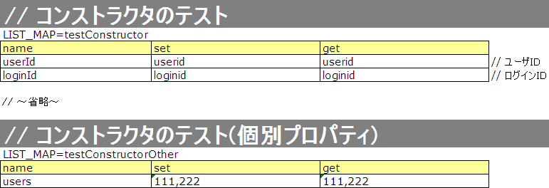

# Nablarch Validationに対応したForm/Entityのクラス単体テスト

本項では、入力値チェックを Nablarch Validation で実施しているFormおよびEntityクラス単体テスト(以下Form単体テストまたはEntity単体テスト)について説明する。
両者はほぼ同じように単体テストを行えるため、共通する内容についてはEntity単体テストをベースに説明し、特有の処理については個別に説明する。

> **Tip:** Form、Entityの責務については、各処理方式の責務配置を参照すること。 例： ウェブアプリケーションの責務配置 、 Nablarchバッチアプリケーションの責務配置

## Form/Entity単体テストの書き方

本項で例として使用したテストクラスとテストデータは以下のとおり(右クリック->保存でダウンロード)。

* [テストクラス(SystemAccountEntityTest.java)](../../../knowledge/assets/testing-framework-02-entityUnitTestWithNablarchValidation/SystemAccountEntityTest.java)
* [テストデータ(SystemAccountEntityTest.xlsx)](../../../knowledge/assets/testing-framework-02-entityUnitTestWithNablarchValidation/SystemAccountEntityTest.xlsx)
* [テスト対象クラス(SystemAccountEntity.java)](../../../knowledge/assets/testing-framework-02-entityUnitTestWithNablarchValidation/SystemAccountEntity.java)

## テストデータの作成

テストデータを記載したExcelファイルそのものの作成方法を説明する。テストデータを記載したExcelファイルは、テストソースコードと同じディレクトリに同じ名前で格納する(拡張子のみ異なる)。\
なお、後述する\
\ 精査のテストケース\ 、\
\ コンストラクタのテストケース\ 、\
\ setter、getterに対するテストケース\
のそれぞれが、1シートずつ使用する前提である。

テストデータの記述方法詳細については、\ ../../../06_TestFWGuide/01_Abstract\ 、\ ../../../06_TestFWGuide/02_DbAccessTest\ を参照。

なお、メッセージデータやコードマスタなどの、データベースに格納する静的マスタデータは、プロジェクトで管理されたデータがあらかじめ投入されている\
(これらのデータを個別のテストデータとして作成しない)前提である。

## テストクラスの作成

Form/Entity単体テストのテストクラスは、以下の条件を満たすように作成する。

* テストクラスのパッケージは、テスト対象のForm/Entityと同じとする。
* <Form/Entityクラス名>Testというクラス名でテストクラスを作成する。
* nablarch.test.core.db.EntityTestSupportを継承する。

```java
package nablarch.sample.management.user; // 【説明】パッケージはSystemAccountEntityと同じ

import java.util.HashMap;
import java.util.Map;

import org.junit.Test;

import nablarch.test.core.db.EntityTestSupport;

import static org.junit.Assert.assertArrayEquals;
import static org.junit.Assert.assertEquals;

/**
 * SystemAccountEntityクラスに対するテストを実行するクラス。<br/>
 * テスト内容はエクセルシート参照のこと。
 *
 * @author Miki Habu
 * @since 1.0
 */
public class SystemAccountEntityTest extends EntityTestSupport {
// 【説明】クラス名はSystemAccountEntityTestで、EntityTestSupportを継承する


// ～後略～
```
テストメソッドの記述方法は本項以降に記載されているコード例を参照。

## 文字種と文字列長の単項目精査テストケース

単項目精査に関するテストケースは、入力される文字種および文字列長に関するものがほとんどである。\
例えば、以下のようなプロパティがあるとする。

* プロパティ名「フリガナ」
* 最大文字列長は50文字
* 必須項目
* 全角カタカナのみを許容する

この場合、以下のようなテストケースを作成することになる。

| ケース | 観点 |
|---|---|
| 全角カタカナ50文字を入力し精査が成功する。 | 最大文字列長、文字種の確認 |
| 全角カタカナ51文字を入力し精査が失敗する。 | 最大文字列長の確認 |
| 全角カタカナ1文字を入力し精査が成功する。 | 最小文字列長、文字種の確認 |
| 空文字を入力し、精査が失敗する。 | 必須精査の確認 |
| 半角カタカナを入力し精査が失敗する。 | 文字種の確認\ [#]_\ |

\

同様に、半角英字、全角ひらがな、漢字...等が入力され精査が失敗するケースが必要である。
このように、単項目精査のテストケースは、ケース数が多くなりデータ作成の労力がかかる。\
そこで、単項目精査テスト専用のテスト方法を提供する。これにより以下の効果が見込まれる。

* 単項目精査のテストケース作成が容易になる。
* 保守性の高いテストデータが作成でき、レビューやメンテナンスが容易になる。


> **Tip:** 本テスト方法は、プロパティとして別のFormを保持するFormに対しては使用できない。その場合、独自に精査処理のテストを実装すること。 プロパティとして別のFormを保持するFormとは、以下の形式でプロパティにアクセスする親Formのこと。

```none
<親Form>.<子Form>.<子フォームのプロパティ名>
```
#### テストケース表の作成方法

以下のカラムを用意する。

<table>
<thead>
<tr>
  <th>カラム名</th>
  <th>記載内容</th>
</tr>
</thead>
<tbody>
<tr>
  <td>propertyName</td>
  <td>テスト対象のプロパティ名</td>
</tr>
<tr>
  <td>allowEmpty</td>
  <td>そのプロパティが未入力を許容するか</td>
</tr>
<tr>
  <td>min</td>
  <td>そのプロパティが入力値として許容する最小文字列長（</td>
</tr>
<tr>
  <td></td>
  <td>省略可）</td>
</tr>
<tr>
  <td>max</td>
  <td>そのプロパティが入力値として許容する最大文字列長</td>
</tr>
<tr>
  <td>messageIdWhenEmptyInput</td>
  <td>未入力時に期待するメッセージID（省略可） \ [#]_\</td>
</tr>
<tr>
  <td>messageIdWhenInvalidLength</td>
  <td>文字列長不適合時に期待するメッセージID（省略可）\ [#]_\</td>
</tr>
<tr>
  <td>messageIdWhenNotApplicable</td>
  <td>文字種不適合時に期待するメッセージID</td>
</tr>
<tr>
  <td>半角英字</td>
  <td>半角英字を許容するか</td>
</tr>
<tr>
  <td>半角数字</td>
  <td>半角数字を許容するか</td>
</tr>
<tr>
  <td>半角記号</td>
  <td>半角記号を許容するか</td>
</tr>
<tr>
  <td>半角カナ</td>
  <td>半角カナを許容するか</td>
</tr>
<tr>
  <td>全角英字</td>
  <td>全角英字を許容するか</td>
</tr>
<tr>
  <td>全角数字</td>
  <td>全角数字を許容するか</td>
</tr>
<tr>
  <td>全角ひらがな</td>
  <td>全角ひらがなを許容するか</td>
</tr>
<tr>
  <td>全角カタカナ</td>
  <td>全角カタカナを許容するか</td>
</tr>
<tr>
  <td>全角漢字</td>
  <td>全角漢字を許容するか</td>
</tr>
<tr>
  <td>全角記号その他</td>
  <td>全角記号その他を許容するか</td>
</tr>
<tr>
  <td>外字</td>
  <td>外字を許容するか</td>
</tr>
</tbody>
</table>


messageIdWhenEmptyInputを省略した場合は、 自動テストフレームワーク設定値 で設定したemptyInputMessageId
の値が使用される。
\

messageIdWhenInvalidLengthを省略した場合は、 自動テストフレームワーク設定値 で
設定したデフォルト値が使用される。省略時にどのデフォルト値が使用されるかは、max欄及びmin欄の記載によって決まり、以下の通り。
<table>
<thead>
<tr>
  <th>min欄の記載</th>
  <th>maxとminの比較</th>
  <th>省略時に使用されるデフォルト値</th>
</tr>
</thead>
<tbody>
<tr>
  <td>なし</td>
  <td>(該当なし)</td>
  <td>maxMessageId</td>
</tr>
<tr>
  <td>あり</td>
  <td>max > min</td>
  <td>maxAndMinMessageId（超過時）、underLimitMessageId（不足時）</td>
</tr>
<tr>
  <td>あり</td>
  <td>max = min</td>
  <td>fixLengthMessageId</td>
</tr>
</tbody>
</table>


許容するかどうかを記入するカラムには、以下の値を設定する。

| 設定内容 | 設定値 | 備考 |
|---|---|---|
| 許容する | o | 半角英小文字のオー |
| 許容しない | x | 半角英小文字のエックス |


具体例を以下に示す。


#### テストメソッドの作成方法


スーパクラスの以下のメソッドを起動する。

```java
void testValidateCharsetAndLength(Class entityClass, String sheetName, String id)
```
\

```java
// 【説明】～前略～
```
public class SystemAccountEntityTest extends EntityTestSupport {

/** テスト対象エンティティクラス */
private static final Class<SystemAccountEntity> ENTITY_CLASS = SystemAccountEntity.class;


/**
* 文字種および文字列長のテストケース
*/
@Test
public void testCharsetAndLength() {
// 【説明】テストデータを記載したシート名
String sheetName = "testCharsetAndLength";

// 【説明】テストデータのID
String id = "charsetAndLength";

// 【説明】テスト実行
testValidateCharsetAndLength(ENTITY_CLASS, sheetName, id);
}


// 【説明】～後略～


このメソッドを実行すると、テストデータの各行毎に以下の観点でテストが実行される。

<table>
<thead>
<tr>
  <th>観点</th>
  <th>入力値</th>
  <th>備考</th>
</tr>
</thead>
<tbody>
<tr>
  <td>文字種</td>
  <td>半角英字</td>
  <td>| max(最大文字列長)欄に記載した長さの文字列で</td>
</tr>
<tr>
  <td>文字種</td>
  <td>半角数字</td>
  <td></td>
</tr>
<tr>
  <td>文字種</td>
  <td>半角数字</td>
  <td></td>
</tr>
<tr>
  <td>文字種</td>
  <td>半角記号</td>
  <td></td>
</tr>
<tr>
  <td>文字種</td>
  <td>半角カナ</td>
  <td></td>
</tr>
<tr>
  <td>文字種</td>
  <td>全角英字</td>
  <td></td>
</tr>
<tr>
  <td>文字種</td>
  <td>全角数字</td>
  <td></td>
</tr>
<tr>
  <td>文字種</td>
  <td>全角ひらがな</td>
  <td></td>
</tr>
<tr>
  <td>文字種</td>
  <td>全角カタカナ</td>
  <td></td>
</tr>
<tr>
  <td>文字種</td>
  <td>全角漢字</td>
  <td></td>
</tr>
<tr>
  <td>文字種</td>
  <td>全角記号その他</td>
  <td></td>
</tr>
<tr>
  <td>文字種</td>
  <td>外字</td>
  <td></td>
</tr>
<tr>
  <td>未入力</td>
  <td>空文字</td>
  <td>| 長さ0の文字列</td>
</tr>
<tr>
  <td>最小文字列</td>
  <td>最小文字列長の文字列</td>
  <td>| 入力値は、o印を付けた文字種で構成される。</td>
</tr>
<tr>
  <td>最長文字列</td>
  <td>最長文字列長の文字列</td>
  <td>| 文字列長不足のテストは実行されない。</td>
</tr>
<tr>
  <td>文字列長不足</td>
  <td>最小文字列長－１の文字列</td>
  <td></td>
</tr>
<tr>
  <td>文字列長超過</td>
  <td>最大文字列長＋１の文字列</td>
  <td></td>
</tr>
</tbody>
</table>

## その他の単項目精査のテストケース

前述の、文字種と文字列長の単項目精査テストケースを使用すれば\
大部分の単項目精査がテストできるが、一部の精査についてはカバーできないものもある。
例えば、数値入力項目の範囲精査が挙げられる。


このような単項目精査のテストについても、簡易にテストできる仕組みを用意している。
各プロパティについて、１つの入力値と期待するメッセージIDのペアを記述することで、
任意の値で単項目精査のテストができる。


> **Tip:** 本テスト方法は、プロパティとして別のFormを保持するFormに対しては使用できない。その場合は、独自に精査処理のテストを実装すること。 プロパティとして別のFormを保持するFormとは、以下の形式でプロパティにアクセスする親Formのこと。

```none
<親Form>.<子Form>.<子フォームのプロパティ名>
```
#### テストケース表の作成方法

以下のカラムを用意する。

<table>
<thead>
<tr>
  <th>カラム名</th>
  <th>記載内容</th>
</tr>
</thead>
<tbody>
<tr>
  <td>propertyName</td>
  <td>テスト対象のプロパティ名</td>
</tr>
<tr>
  <td>case</td>
  <td>テストケースの簡単な説明</td>
</tr>
<tr>
  <td>input1\ [#]_</td>
  <td>入力値 [#]_</td>
</tr>
<tr>
  <td>messageId</td>
  <td>上記入力値で単項目精査した場合に、発生すると期待す</td>
</tr>
<tr>
  <td></td>
  <td>るメッセージID（精査エラーにならないことを期待する</td>
</tr>
<tr>
  <td></td>
  <td>場合は空欄）</td>
</tr>
</tbody>
</table>


ひとつのキーに対して複数のパラメータを指定する場合は、input2, input3 というようにカラムを増やす。
\

\ special_notation_in_cell\ の記法を使用することで、効率的に入力値を作成できる。
具体例を以下に示す。


#### テストメソッドの作成方法


スーパクラスの以下のメソッドを起動する。

```java
void testSingleValidation(Class entityClass, String sheetName, String id)
```
```java
// 【説明】～前略～

public class SystemAccountEntityTest extends EntityTestSupport {

     /** テスト対象エンティティクラス */
     private static final Class<SystemAccountEntity> ENTITY_CLASS = SystemAccountEntity.class;

     /**
      * 文字種および文字列長の単項目精査テストケース
      */
     // 【説明】～中略～

     /**							  
      * 単項目精査のテストケース（上記以外）		  
      */							  
     @Test						  
     public void testSingleValidation() {		  
         String sheetName = "testSingleValidation";	  
         String id = "singleValidation";			  
         testSingleValidation(ENTITY_CLASS, sheetName, id);
     }                                                     


      // 【説明】～後略～
```

## バリデーションメソッドのテストケース

上記までの単項目精査のテストでは、エンティティのセッターメソッドに付与されたアノテーションが\
正しいかテストされ、エンティティに実装したバリデーションメソッド\ [#]_\ は実行されていない。

その為、独自のバリデーションメソッドをエンティティに実装した場合は、
別途テストを作成する必要がある。


`@ValidateFor`\ アノテーションを付与したstaticメソッドのこと
#### テストケース表の作成

* IDは"testShots"固定とする。
* 以下のカラムを用意する。

<table>
<thead>
<tr>
  <th>カラム名</th>
  <th>記載内容</th>
</tr>
</thead>
<tbody>
<tr>
  <td>title</td>
  <td>テストケースのタイトル</td>
</tr>
<tr>
  <td>description</td>
  <td>テストケースの簡単な説明</td>
</tr>
<tr>
  <td>expectedMessageId\ *ｎ* \ [#]_</td>
  <td>期待するメッセージ（\ *ｎ*\ は1からの連番 ）</td>
</tr>
<tr>
  <td>propertyName\ *ｎ*</td>
  <td>期待するプロパティ（\ *ｎ*\ は1からの連番 ）</td>
</tr>
</tbody>
</table>

複数のメッセージを期待する場合、expectedMessageId2, propertyName2というように数値を増やして右側に追加していく。
* 入力パラメータ表の作成

* IDは"params"固定とする。
* 上記のテストケース表に対応する、入力パラメータ\ [#]_ \を1行ずつ記載する。

\

\ special_notation_in_cell\ の記法を使用することで、効率的に入力値を作成できる。
\

具体例を以下に示す。


#### テストケース、テストデータの作成


##### 精査対象確認

精査対象のプロパティを指定(\ Nablarch Validation\ 参照)した場合、\
その指定が正しいかどうか確認するケースを作成する。


全てのプロパティに対して、おのおの単項目精査でエラーとなるデータを用意する。\
精査対象プロパティの指定が正しければ、精査対象のプロパティだけが単項目精査になるはずである。\
よって、期待値として、全精査対象プロパティ名と、各プロパティ単項目精査エラー時のメッセージIDを記載する。\


> **Tip:** 精査対象プロパティが誤って精査対象から漏れていた場合、\ 期待したメッセージが出力されない為、メッセージIDのアサートが失敗する。\ また、精査対象でないプロパティが誤って精査対象となっていた場合は、\ 入力値が不正により単項目精査が失敗し、予期しないメッセージが出力される。\ これにより、精査対象の誤りを検知できる。
テストケース表には、全精査対象プロパティのプロパティ名と、\
そのプロパティ単項目精査エラーメッセージIDを記載する。


入力パラメータ表には、全てのプロパティに対してそれぞれ単項目精査エラーとなる値を記載する。


> **Tip:** Form単体テストのテストケースやテストデータを作成する際、\ **プロパティに保持している別のFormのプロパティ** を指定したいことがある。\ この場合、次のように指定できる。

* Formのコード例

```java
public class SampleForm {

    /** システムユーザ */
    private SystemUserEntity systemUser;

    /** 電話番号配列 */
    private UserTelEntity[] userTelArray;

    // 【説明】プロパティ以外は省略

}
```
* 保持しているFormのプロパティを指定する方法(SystemUserEntity.userIdを指定する場合)

```none
sampleForm.systemUser.userId
```
* Form配列の要素のプロパティを指定する方法(UserTelEntity配列の先頭要素のプロパティを指定する場合)

```none
sampleForm.userTelArray[0].telNoArea
```
##### 項目間精査など

項目間精査など、バリデーションメソッドの\ 精査対象確認\
で行った精査対象指定以外の動作確認を行うケースを作成する。

下図では、"newPasswordとconfirmPasswordが等しいこと"というバリデーションメソッドに対する正常系のケースを作成している。


#### テストメソッドの作成方法

これまでに作成したテストケース、データを使用するテストメソッドを以下に示す。\
下記コードの変数内容を変更するだけで、異なるEntityの精査のテストに対応できる。

```java
// ～前略～

/** テスト対象エンティティクラス */
private static final Class<SystemAccountEntity> ENTITY_CLASS = SystemAccountEntity.class;

// ～中略～
/**
 * {@link SystemAccountEntity#validateForRegisterUser(nablarch.core.validation.ValidationContext)} のテスト。
 */
@Test
public void testValidateForRegisterUser() {
    // 精査実行
    String sheetName = "testValidateForRegisterUser";
    String validateFor = "registerUser";
    testValidateAndConvert(ENTITY_CLASS, sheetName, validateFor);
}
```
// ～後略～

## コンストラクタに対するテストケース

Nablarch Validationで入力値チェックを実施しているEntityには、 バリデーションを実行する に記載の通り
`Map<String, Object>` を引数にとるコンストラクタが実装されており、このコンストラクタに対するテストを作成する必要がある。

コンストラクタに対するテストでは、引数に指定した値が、正しくプロパティに設定されているかを確認するケースを作成する。\
このとき対象となるプロパティは、Entityに定義されている全てのプロパティである。\
テストデータには、プロパティ名とそれに設定するデータと期待値(getterで取得した値と比較するデータ)を用意する。

下図では、以下のように各プロパティに値を指定している。
テストでは、コンストラクタにこれらの値の組み合わせを与えたとき、各プロパティに指定した値が設定されているか(getterを呼び出して、想定通りの値が取得できるか)確認している。

実際のテストコードでは、コンストラクタへの値の設定及び値の確認は、自動テストフレームワークで提供されるメソッド内で行われる。
詳細は、 テストコード を参照すること。


> **Tip:** Entityは自動生成されるため、アプリケーションで使用されないコンストラクタが生成される可能性がある。\ その場合リクエスト単体テストではテストできないため、Entity単体テストでコンストラクタに対するテストを必ず行うこと。 一方、一般的なFormの場合、アプリケーションで使用するコンストラクタのみを作成する。\ したがって、リクエスト単体テストでコンストラクタのテストを行うことができる。\ そのため、一般的なFormについては、クラス単体テストでコンストラクタのテストを行う必要はない。
#### Excelへの定義

上記設定値のテスト内容(抜粋)

| プロパティ | コンストラクタに設定する値 | 期待値(getterから取得される値 |
|---|---|---|
| userId | userid | userid |
| loginId | loginid | loginid |
| password | password | password |


このデータを使用するテストメソッドを以下に示す。

```java
// 【説明】～前略～

public class SystemAccountEntityTest extends EntityTestSupport {

     /** コンストラクタのテスト */
     @Test
     public void testConstructor() {
         Class<?> entityClass = SystemAccountEntity.class;
         String sheetName = "testAccessor";
         String id = "testConstructor";
         testConstructorAndGetter(entityClass, sheetName, id);
     }

}
```

> **Tip:** testConstructorAndGetterでテスト可能なプロパティの型(クラス)には制限がある。 下記型(クラス)に該当しない場合には、各テストクラスにてコンストラクタとgetterを明示的に呼び出してテストする必要がある。

* String及び、String配列
* BigDecimal及び、BigDecimal配列
* java.util.Date及び、java.util.Date配列(Excelへはyyyy-MM-dd形式もしくはyyyy-MM-dd HH:mm:ss形式で記述すること)
* valueOf(String)メソッドを持つクラス及び、その配列クラス(例えばIntegerやLong、java.sql.Dateやjava.sql.Timestampなど)

以下に、個別のテスト実施方法の例を示す。
この例では、Formが `List<String>` 型のプロパティ `users` を持っているとしている。


* Excelへのデータ記述例


* テストコード例

```java
/** コンストラクタのテスト */
@Test
public void testConstructor() {
    // 【説明】
    // 共通にテストが実施出来る項目は、testConstructorAndGetterを使用してテストを実施する。
    Class<?> entityClass = SystemAccountEntity.class;
    String sheetName = "testAccessor";
    String id = "testConstructor";
    testConstructorAndGetter(entityClass, sheetName, id);

    // 【説明】
    // 共通にテストが実施出来ない項目は、個別にテストを実施する。

    // 【説明】
    // getParamMapを呼び出し、個別にテストを行うプロパティのテストデータを取得する。
    // (テスト対象のプロパティが複数ある場合は、getListParamMapを使用する。)
    Map<String, String[]> data = getParamMap(sheetName, "testConstructorOther");

    // 【説明】Map<String, String[]>から、Entityのコンストラクタの引数であるMap<String, Object>へ変換する
    Map<String, Object> params = new HashMap<String, Object>();
    params.put("users", Arrays.asList(data.get("set")));

    // 【説明】上記で生成したMap<String, Object>を引数にEntityを生成する。
    SystemAccountEntity entity = new SystemAccountEntity(params);

    // 【説明】getterを呼び出し、期待値通りの値が返却されることを確認する。
    assertEquals(entity.getUsers(), Arrays.asList(data.get("get")));

}
```

## setter、getterに対するテストケース

setter、getterに対するテストケース を参照。

\

## 自動テストフレームワーク設定値

文字種と文字列長の単項目精査テストケース\ を実施する際に必要な初期値設定について説明する。


#### 設定項目一覧

`nablarch.test.core.entity.EntityTestConfiguration`\ クラスを使用し、\
以下の値をコンポーネント設定ファイルで設定する（全項目必須）。

<table>
<thead>
<tr>
  <th>設定項目名</th>
  <th>説明</th>
</tr>
</thead>
<tbody>
<tr>
  <td>maxMessageId</td>
  <td>最大文字列長超過時のメッセージID</td>
</tr>
<tr>
  <td>maxAndMinMessageId</td>
  <td>最長最小文字列長範囲外のメッセージID(可変長)</td>
</tr>
<tr>
  <td>fixLengthMessageId</td>
  <td>最長最小文字列長範囲外のメッセージID(固定長)</td>
</tr>
<tr>
  <td>underLimitMessageId</td>
  <td>文字列長不足時のメッセージID</td>
</tr>
<tr>
  <td>emptyInputMessageId</td>
  <td>未入力時のメッセージID</td>
</tr>
<tr>
  <td>characterGenerator</td>
  <td>文字列生成クラス \ [#]_\</td>
</tr>
</tbody>
</table>

`nablarch.test.core.util.generator.CharacterGenerator`\ の実装クラスを指定する。
このクラスがテスト用の入力値を生成する。
通常は、\ `nablarch.test.core.util.generator.BasicJapaneseCharacterGenerator`\ を使用すれば良い。
設定するメッセージIDは、バリデータの設定値と合致させる。

（以下の記述例を参照）


#### コンポーネント設定ファイルの記述例

以下の設定値を使用する場合のコンポーネント設定ファイル記述例を示す。

**【精査クラスのコンポーネント設定ファイル】**

```xml
<property name="validators">
  <list>
    <component class="nablarch.core.validation.validator.RequiredValidator">
      <property name="messageId" value="MSG00010"/>
    </component>
    <component class="nablarch.core.validation.validator.LengthValidator">
      <property name="maxMessageId" value="MSG00011"/>
      <property name="maxAndMinMessageId" value="MSG00011"/>
      <property name="fixLengthMessageId" value="MSG00023"/>
    </component>
    <!-- 中略 -->
</property>
```
**【テストのコンポーネント設定ファイル】**

```xml
<!-- エンティティテスト設定 -->
<component name="entityTestConfiguration" class="nablarch.test.core.entity.EntityTestConfiguration">
  <property name="maxMessageId"        value="MSG00011"/>
  <property name="maxAndMinMessageId"  value="MSG00011"/>
  <property name="fixLengthMessageId"  value="MSG00023"/>
  <property name="underLimitMessageId" value="MSG00011"/>
  <property name="emptyInputMessageId" value="MSG00010"/>
  <property name="characterGenerator">
    <component name="characterGenerator"
               class="nablarch.test.core.util.generator.BasicJapaneseCharacterGenerator"/>
  </property>
</component>
```
