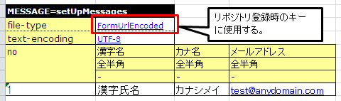

# 目的別API使用方法

## 概要

目的別のAPIの使用方法について説明する。


* Excelファイルから、入力パラメータや戻り値に対する期待値などを取得したい
* 同じテストメソッドをテストデータを変えて実行したい
* 一つのシートに複数テストケースのデータを記載したい
* システム日時を任意の値に固定したい
* シーケンスオブジェクトを使った採番のテストをしたい
* ThreadContextにユーザID、リクエストIDなどを設定したい
* 任意のディレクトリのExcelファイルを読み込みたい
* テスト実行前後に共通処理を行いたい。
* デフォルト以外のトランザクションを使用したい
* 本フレームワークのクラスを継承せずに使用したい
* クラスのプロパティを検証したい
* テストデータに空白、空文字、改行やnullを記述したい
* テストデータに空行を記述したい
* マスタデータを変更してテストを行いたい
* テストデータ読み込みディレクトリを変更したい
* メッセージング処理でテストデータに対し定型的な変換処理を追加したい

## Excelファイルから、入力パラメータや戻り値に対する期待値などを取得したい

テスト対象クラスのメソッドを呼び出す際の引数や、メソッドの戻り値をExcelファイルに記載しておくことができる。
記載したデータは、List-Map形式（List<Map<String, String>>の形式）で取得できる。

この形式でデータを取得する場合は、データタイプLIST_MAPを使用する。
LIST_MAP=<シート内で一意になるID（任意の文字列）>

データの2行目はMapのKeyと解釈される。
データの3行目以降はMapのValueと解釈される。

以下のメソッドにより、Map形式またはList-Map形式で、Excelファイルよりデータを取得できる。
第1引数にはシート名、第2引数にはIDを指定する。

* `TestSupport#getListMap(String sheetName, String id)`
* `DbAccessTestSupport#getListMap(String sheetName, String id)`

# テストソースコード実装例

```java
public class EmployeeComponentTest extends DbAccessTestSupport {

    @Test
    public void testGetName() {
       // Excelファイルからデータ取得
       List<Map<String, String>> parameters = getListMap("testGetName", "parameters");
       Map<String, String>> param = parameters.get(0);

       // 引数および期待値を取得
       String empNo = parameter.get("empNo");
       String expected = parameter.get("expected");

       // テスト対象メソッド起動
       EmployeeComponent target = new EmployeeComponent();
       String actual = target.getName(empNo);           

       // 結果確認          
       assertEquals(expected, actual);

       // ＜後略＞
    }
```
# Excelファイル記述例

LIST_MAP=parameters

| empNo | expected |
|---|---|
| 00001 | 山田太郎 |
| 00002 | 鈴木一郎 |

上記の表で取得可能なオブジェクトは、以下のコードで取得できるListと等価である。

```java
List<Map<String, String>> list = new ArrayList<Map<String, String>>();
Map<String, String> first = new HashMap<String, String>();
first.put("empNo","00001");
first.put("expected", "山田太郎");
list.add(first);
Map<String, String> second = new HashMap<String, String>();
second.put("empNo","00002");
map.put("expected", "鈴木一郎");
list.add(second);
```

<details>
<summary>keywords</summary>

TestSupport, DbAccessTestSupport, getListMap, LIST_MAP, List-Map形式, Excelデータ取得, テストパラメータ取得

</details>

## 同じテストメソッドをテストデータを変えて実行したい

同じテストメソッドをテストデータを変えて実行したい場合、前述のList-Map取得メソッドを使用して
テストをループさせる。これにより、Excelデータを追加するだけで、データバリエーションを増やすことができる。

以下の例では、前述のList-Map形式を使用して複数のテストを１つのメソッドで実行している。

# テストソースコード実装例

```java
public class EmployeeComponentTest extends DbAccessTestSupport {

    @Test
    public void testSelectByPk() {
       // 準備データ投入
       setUpDb("testSelectByPk");

       // Excelファイルからデータ取得
       List<Map<String, String>> parameters = getListMap("testGetName", "parameters");

       for (Map<String, String> param : parameters) {
           // 引数および期待値を取得
           String empNo = parameter.get("empNo");
           String expectedDataId = parameter.get("expectedDataId");

           // テスト対象メソッド起動
           EmployeeComponent target = new EmployeeComponent();
           SqlResultSet actual = target.selectByPk(empNo);           

           // 結果確認
           assertSqlResultSetEquals("testSelectByPk", expectedDataId, actual);
        }
    }
```
# Excelファイル記述例


// ループさせるデータ

LIST_MAP=parameters

| empNo | expectedDataId |
|---|---|
| 00001 | expected01 |
| 00002 | expected02 |


// データベースの準備データ

SETUP_TABLE=EMPLOYEE

| NO | NAME |
|---|---|
| 00001 | 山田太郎 |
| 00002 | 鈴木一郎 |


// 期待するデータその１

LIST_MAP=expected01

| NO | NAME |
|---|---|
| 00001 | 山田太郎 |


// 期待するデータその２

LIST_MAP=expected02

| NO | NAME |
|---|---|
| 00001 | 山田太郎 |


> **Important:** 更新系のテストを行う場合は、ループ内でsetUpDbメソッドを呼び出すこと。 そうでないと、テストの成否がデータの順番に依存してしまうからである。

<details>
<summary>keywords</summary>

getListMap, ループテスト, テストデータバリエーション, setUpDb, パラメータ化テスト

</details>

## 一つのシートに複数テストケースのデータを記載したい

１つのテスト対象メソッドに対して多くのテストケースが存在する場合、
１シート１テストケースという書き方をすると、シート数が増加して保守容易性が落ちることが懸念される。

テーブルデータをグルーピングするための情報（グループID）を付与することで、複数テストケースのデータをひとつのシートに混在させることができる。

サポートされるデータタイプは以下の通り。

* EXPECTED_TABLE
* SETUP_TABLE


書式は以下の通り。

データタイプ[グループID]=テーブル名


例えば、2種類のテストケースのデータ(case_001,case_002)を混在させる場合は、以下のように記載する。

テストクラス側では、前述のAPIと同名のオーバーロードメソッドに引数グループIDを渡す。
これにより、指定したグループIDのデータのみを処理対象にできる。


# テストソースコード実装例

```java
// DBにデータ登録（グループIDが"case_001"のものだけ登録対象になる）
setUpDb("testUpdate", "case_001");


// 結果確認（グループIDが"case_001"のものだけassert対象になる）
assertTableEquals("データベース更新結果確認", "testUpdate", "case_001");
```
# Excelファイル記述例

// ケース001:従業員の所属を変更する。

SETUP_TABLE[case_001]=EMPLOYEE_TABLE

| ID | EMP_NAME | DEPT_CODE |
|---|---|---|
| // CHAR(5) | VARCHAR(64) | CHAR(4) |
| 00001 | 山田太郎 | 0001 |
| 00002 | 田中一郎 | 0002 |


EXPECTED_TABLE[case_001]=EMPLOYEE_TABLE

| ID | EMP_NAME | DEPT_CODE |  |
|---|---|---|---|
| // CHAR(5) | VARCHAR(64) | CHAR(4) |  |
| 00001 | 山田太郎 | 0001 |  |
| 00002 | 田中一郎 | 0010 | //更新 |


// ケース002:従業員の氏名を変更する。

SETUP_TABLE[case_002]=EMPLOYEE_TABLE

| ID | EMP_NAME | DEPT_CODE |
|---|---|---|
| // CHAR(5) | VARCHAR(64) | CHAR(4) |
| 00001 | 山田太郎 | 0001 |
| 00002 | 田中一郎 | 0002 |


EXPECTED_TABLE[case_002]=EMPLOYEE_TABLE

| ID | EMP_NAME | DEPT_CODE |  |
|---|---|---|---|
| // CHAR(5) | VARCHAR(64) | CHAR(4) |  |
| 00001 | 佐藤太郎 | 0001 | //更新 |
| 00002 | 田中一郎 | 0002 |  |

# 注意事項

複数のグループIDのデータを記述する際は、 複数のデータタイプ使用時はデータタイプごとにまとめてデータを記述する のようにグループIDごとにまとめて記述すること。
グループIDごとにまとめて記述しないとデータの読み込みが途中で終了しテストが正しく実行されない。

<details>
<summary>keywords</summary>

グループID, EXPECTED_TABLE, SETUP_TABLE, setUpDb, assertTableEquals, 複数テストケース, シート管理

</details>

## システム日時を任意の値に固定したい

登録日時や更新日時などのシステム日付を設定する項目の場合、普通にテストを実行すると日によって想定結果が変わるため、自動テストで設定値が正しいことを確認できない。
そこで、本フレームワークではシステム日付に固定値を設定する機能を提供する。この機能を使用することにより、システム日付を設定する項目も自動テストで設定値が正しいことを確認できる。

Nablarch Application Frameworkでは、SystemTimeProviderインタフェースの実装クラスがシステム日時を提供する。この実装クラスを、固定値を返すテスト用クラスに差し替えることにより、任意のシステム日時を返すことができる。


# 設定ファイル例

コンポーネント設定ファイルにて、SystemTimeProviderインタフェースの実装クラスを指定する箇所に
FixedSystemTimeProviderを指定し、そのプロパティに任意の日時を設定する。
例えば、システム日時を2010年9月14日12時34分56秒とする場合は以下のように設定する。

```xml
<component name="systemTimeProvider"
    class="nablarch.test.FixedSystemTimeProvider">
  <property name="fixedDate" value="20100913123456" />
</component>
```
<table>
<thead>
<tr>
  <th>property名</th>
  <th>設定内容</th>
</tr>
</thead>
<tbody>
<tr>
  <td>fixedDate</td>
  <td>指定したい日時を以下のフォーマットいずれかに合致する文字列で指定する。</td>
</tr>
<tr>
  <td></td>
  <td>* yyyyMMddHHmmss (12桁)</td>
</tr>
<tr>
  <td></td>
  <td>* yyyyMMddHHmmssSSS (15桁)</td>
</tr>
</tbody>
</table>

```java
// システム日時を取得
SystemTimeProvider provider = (SystemTimeProvider) SystemRepository.getObject("systemTimeProvider");      
Date now = provider.getDate();
```

<details>
<summary>keywords</summary>

FixedSystemTimeProvider, SystemTimeProvider, SystemRepository, fixedDate, システム日時固定, テスト用固定日時, 採番, シーケンス, IdGenerator, 採番テスト, ThreadContext, スレッドコンテキスト, ThreadContext.setObject, リクエストスコープ, TestDataParser, テストデータ解析, データファイル読み込み, JUnit, @Test, @Rule, @ClassRule, アノテーション, トランザクション, transaction, TransactionManager, コミット, ロールバック, テストサポートクラス, ユーティリティ, テストヘルパー, assertProperties, Beanアサート, プロパティ検証, Excel期待値, テストデータ, NULLデータ, 空文字, コメント行, 空行, 空文字, NULL, テストデータ空行, マスタデータ, SETUP_TABLE, マスタデータ投入, テスト用マスタ, テストデータディレクトリ, baseDir, データファイルパス, テストリソース, テストデータ変換, データ変換, TestDataConverter, 型変換, OracleSequenceIdGenerator, FastTableIdGenerator, シーケンスオブジェクト採番, テーブル採番, 採番テスト, idGenerator, IdGenerator, ThreadContext, setThreadContextValues, DbAccessTestSupport, TestSupport, ユーザID設定, リクエストID設定, 自動設定項目, TestDataParser, getListMap, Excelファイル読み込み, 別ディレクトリ, SystemRepository, @Before, @After, @BeforeClass, @AfterClass, テスト前後共通処理, JUnit4, @BeforeClass, @AfterClass, スーパークラス継承, メソッドオーバーライド, アノテーション注意点, DbAccessTestSupport, トランザクション制御, beginTransactions, endTransactions, トランザクション自動制御, DbAccessTestSupport, 委譲, beginTransactions, endTransactions, フレームワーク非継承, getClass, assertObjectPropertyEquals, assertObjectArrayPropertyEquals, assertObjectListPropertyEquals, HttpRequestTestSupport, プロパティ検証, special_notation_in_cell, 空白, 空文字, 改行, null, テストデータ特殊文字, 空行, テストデータ, ダブルクォーテーション, special_notation_in_cell, 可変長ファイル, SETUP_VARIABLE, マスタデータ, 04_MasterDataRestore, マスタデータ変更テスト, テストデータディレクトリ, how_to_change_test_data_dir, テストデータ配置場所変更, nablarch.test.resource-root, テストデータディレクトリ変更, 複数ディレクトリ指定, セミコロン区切り, VM引数指定, nablarch.test.core.file.TestDataConverter, TestDataConverter_<データ種別>, URLエンコーディング変換, テストデータ変換処理, file-type, FormUrlEncodedTestDataConverter

</details>

## シーケンスオブジェクトを使った採番のテストをしたい

シーケンスオブジェクトを使用して値の採番処理を行った場合、次に採番される値が事前に予測できないため期待値を設定できない。
そこで、本フレームワークではシーケンスオブジェクトを使用した採番処理を設定ファイルの変更のみでテーブル採番に置き換える機能を提供する。
この機能を使用することで、正しく採番処理を行なっていることを確認できる。

手順は以下のとおり。

| ① 準備データをテーブルにセットアップする。
| ② 期待値はテーブルに設定した値を元に設定する。

以下に設定例及び使用例を示す。

# 設定ファイルの例
この例では、下記のように本番用の設定ファイルにシーケンスオブジェクトの採番定義がされているとする。

```xml
<!-- シーケンスオブジェクトを使用した採番設定 -->
<component name="idGenerator" class="nablarch.common.idgenerator.OracleSequenceIdGenerator">
    <property name="idTable">
        <map>
            <entry key="1101" value="SEQ_1"/> <!-- ID1採番用 -->
            <entry key="1102" value="SEQ_2"/> <!-- ID2採番用 -->
            <entry key="1103" value="SEQ_3"/> <!-- ID3採番用 -->
            <entry key="1104" value="SEQ_4"/> <!-- ID4採番用 -->
        </map>
    </property>
</component>
```
この場合、テスト用の設定ファイルでは、上記本番用の設定をテーブル採番用の設定で上書きする。

```xml
<!-- シーケンスオブジェクトの採番設定をテーブルを使用した採番設定に置き換える -->
<component name="idGenerator" class="nablarch.common.idgenerator.FastTableIdGenerator">
    <property name="tableName" value="TEST_SBN_TBL"/>
    <property name="idColumnName" value="ID_COL"/>
    <property name="noColumnName" value="NO_COL"/>
    <property name="dbTransactionManager" ref="dbTransactionManager" / >
</component>
```
.. tip :: テーブル採番用の設定値の詳細は、\ `IdGenerator`\ を参照すること。

# Excelファイル記述例

採番対象ID:1101を採番する処理をテストする場合を例に説明する。

| // 準備データ
| // 採番用テーブル
| SETUP_TABLE=TEST_SBN_TBL

| ID_COL | NO_COL |
|---|---|
| 1101 | 100 |

> **Tip:** 採番用テーブルに準備データを設定する。 準備データでは、テスト範囲内で使用する採番対象のレコードのみを設定する。
| // 期待値
| // 採番用テーブル
| EXPECTED_TABLE=TEST_SBN_TBL

| ID_COL | NO_COL |
|---|---|
| 1101 | 101 |

| // 期待値
| // 採番した値が登録されるテーブル(USER_IDに採番された値が登録される。)
| EXPECTED_TABLE=USER_INFO

| USER_ID | KANJI_NAME | KANA_NAME |
|---|---|---|
| 0000000101 | 漢字名 | ｶﾅﾒｲ |

> **Tip:** 本記述例では、テスト内で1度のみ採番処理が行われていることを想定している。 このため、期待値は「準備データの値 + 1」となっている。

## ThreadContextにユーザID、リクエストIDなどを設定したい

Nablarch Application Frameworkでは、通常ThreadContextにてユーザIDやリクエストIDがあらかじめ設定されている。データベースアクセスクラスの自動テストを行う場合、フレームワークを経由せず、テストクラスからテスト対象クラスを直接起動するため、ThreadContextには値が設定されていない。


Excelファイルに設定する値を記述して下記メソッドを呼び出すことで、ThreadContextに値を設定できる。

* `TestSupport#setThreadContextValues(String sheetName, String id)`
* `DbAccessTestSupport#setThreadContextValues(String sheetName, String id)`


> **Tip:** 特に自動設定項目を使用してデータベースを登録・更新する際は、ThreadContextにリクエストIDとユーザIDが設定されている必要がある。テスト対象クラス起動前にこれらの値をThreadContextに設定しておくこと。
# テストソースコード実装例

```java
public class DbAccessTestSample extends DbAccessTestSupport {
    // ＜中略＞
    @Test
    public void testInsert() {
        // ThreadContextに値を設定する（シート名、IDを指定）
        setThreadContextValues("testSelect", "threadContext");            

       // ＜後略＞
```
# テストデータ記述例

シート[testInsert]に以下のようにデータを記載する。(IDは任意）

LIST_MAP=threadContext

| USER_ID | REQUEST_ID | LANG |
|---|---|---|
| U00001 | RS000001 | ja_JP |

## 任意のディレクトリのExcelファイルを読み込みたい

テストソースコードと同じディレクトリに存在するExcelファイルであれば、
シート名を指定するだけで読み込み可能であるが、別のディレクトリに存在するファイルを
読み込みたい場合は、TestDataParser実装クラスを直接使用することで取得できる。

"/foo/bar/"に存在する"Buz.xlsx"というファイルからデータを読み込む場合の例を以下に示す。

# テストソースコード実装例

```java
TestDataParser parser = (TestDataParser) SystemRepository.getObject("testDataParser");
List<Map<String, String>> list = parser.getListMap("/foo/bar/Baz.xlsx", "sheet001", "params");
```

## テスト実行前後に共通処理を行いたい。

JUnit4で用意されたアノテーション(@Before, @After, @BeforeClass, @AfterClass)を使用することで、
テスト実行前後に共通処理を実行させることができる。

# 注意事項

上記のアノテーションを使用する際は、以下の点に注意すること。

## @BeforeClass, @AfterClass使用時の注意点

* サブクラスにて、スーパークラスと同名の名前、同じアノテーションを付与のメソッドを作成しないこと。
同名のメソッドに同種のアノテーションを付与した場合、スーパークラスのメソッドは起動されなくなる。

```java
public class TestSuper {
    @BeforeClass
    public static void setUpBeforeClass() {
        System.out.println("super");   // 表示されない。
    }
}

public class TestSub extends TestSuper {   

    @BeforeClass               
    public static void setUpBeforeClass() {
        // スーパークラスのメソッドを上書き
    }                      

    @Test                  
    public void test() {           
        System.out.println("test");    
    }                      
}                                          
```
上記のTestSubを実行した場合、「test」と表示される。

## デフォルト以外のトランザクションを使用したい

データベースアクセスクラスの単体テストを行う場合、テストクラスからデータベースアクセスクラスを起動する。
通常、データベースアクセスクラスではトランザクションを制御しないので、テストクラス側でトランザクションを制御する必要がある。

トランザクション制御は定型処理であるため、テスティングフレームワークにてトランザクションを制御する機構を用意している。プロパティファイルにトランザクション名を記載しておけば、テスティングフレームワークは、テストメソッド実行前にトランザクション開始、テストメソッド終了後にトランザクションを終了する。
この機構を利用することにより、個別のテストにて、テスト実行前に明示的にトランザクションを開始する必要がなくなる。また、トランザクション終了処理漏れもなくなる。


この機能を利用する手順は以下の通り。
* テストクラスにてDbAccessTestSupportを継承する（これにより、スーパークラスの@Before、@Afterメソッドが自動的に呼び出される）。

## 本フレームワークのクラスを継承せずに使用したい

通常、テストクラス作成時は本フレームワークで用意されているスーパークラスを継承すればよいが、
別のクラスを継承しなければならない等の理由で、本フレームワークのスーパークラスを継承できない場合がある。この場合、本フレームワークのスーパークラスをインスタンス化し、処理を委譲することで代替可能である。

委譲を使用する場合、コンストラクタにテストクラス自身のClassインスタンスを渡す必要がある。
また、前処理(@Before)メソッド、後処理(@After)メソッドについては、明示的に呼び出す必要がある。

# テストソースコード実装例

```java
public class SampleTest extends AnotherSuperClass {

    /** DbAccessテストサポート */
    private DbAccessTestSupport dbSupport
          = new DbAccessTestSupport(getClass());

    /** 前処理 */
    @Before
    public void setUp() {
        // DbSupportの前処理を起動
        dbSupport.beginTransactions();
    }

    /** 後処理 */
    @After
    public void tearDown() {
        // DbSupportの後処理を起動
        dbSupport.endTransactions();
    }

    @Test
    public void test() {
        // データベースに準備データ投入
        dbSupport.setUpDb("test");

        // ＜中略＞
        dbSupport.assertSqlResultSetEquals("test", "id", actual);
    }
}
```

## クラスのプロパティを検証したい

テスト対象クラスのプロパティの検証を、容易に実装できる。

テストデータの記述方法は、 Excelファイルから、入力パラメータや戻り値に対する期待値などを取得したい で記載した方法と同様に記載する。

データの意味は、2行目が プロパティ名、3行目以降が検証時に使用するプロパティの値となる。

以下のメソッドにより、プロパティの持つ値がExcelファイルに記載したデータとなっていることを検証できる。
第1引数にはエラー時に表示するメッセージ、第2引数にはシート名、第3引数にはID、第4引数に検証対象のクラス、クラスの配列、クラスのリストのいずれかを指定する。

* `HttpRequestTestSupport#assertObjectPropertyEquals(String message, String sheetName, String id, Object actual)`
* `HttpRequestTestSupport#assertObjectArrayPropertyEquals(String message, String sheetName, String id, Object[] actual)`
* `HttpRequestTestSupport#assertObjectListPropertyEquals(String message, String sheetName, String id, List<?> actual)`


# テストソースコード実装例


```java
public class UserUpdateActionRequestTest extends HttpRequestTestSupport {

    @Test
    public void testRW11AC0301Normal() {
        execute("testRW11AC0301Normal", new BasicAdvice() {
            @Override
            public void afterExecute(TestCaseInfo testCaseInfo, 
                    ExecutionContext context) {
                String message = testCaseInfo.getTestCaseName();
                String sheetName = testCaseInfo.getSheetName();

                UserForm form = (UserForm) context.getRequestScopedVar("user_form");
                UsersEntity users = form.getUsers();

                // users のプロパティ kanjiName,kanaName,mailAddress を検証。
                assertObjectPropertyEquals(message, sheetName, "expectedUsers", users);
            }
        }
    }
```
# Excelファイル記述例

LIST_MAP=expectedUsers

| kanjiName | kanaName | mailAddress |
|---|---|---|
| 漢字氏名 | カナシメイ | test@anydomain.com |

## テストデータに空白、空文字、改行やnullを記述したい

special_notation_in_cell を参照。


\

## テストデータに空行を記述したい

可変長ファイルを扱う場合等で、テストデータに空行を含めたい場合がある。
全くの空行は無視されるため、special_notation_in_cell の
ダブルクォーテーションを使用して\ `""`\ のように空文字列を記述することで、
空行を表すことができる。

以下の例では、2レコード目が空行となる。

**SETUP_VARIABLE=/path/to/file.csv**

＜中略＞

<table>
<thead>
<tr>
  <th>name</th>
  <th>address</th>
</tr>
</thead>
<tbody>
<tr>
  <td>山田</td>
  <td>東京都</td>
</tr>
<tr>
  <td>""</td>
  <td></td>
</tr>
<tr>
  <td>田中</td>
  <td>大阪府</td>
</tr>
</tbody>
</table>

> **Tip:** 空行を表す場合、全てのセルを\ `""`\ で埋める必要はない。 行のうちのいずれか1セルだけでよい。可読性を考慮し、 左端のセルに\ `""`\ を記載することを推奨する。

## マスタデータを変更してテストを行いたい

04_MasterDataRestore を参照

## テストデータ読み込みディレクトリを変更したい

デフォルトの設定では、テストデータは\ `test/java`\ 配下から読み込まれる。

プロジェクトのディレクトリ構成に応じて、テストデータディレクトリを変更する必要がある場合、
コンポーネント設定ファイルに以下の設定を追加する\ [#]_\ 。

| キー                         値 |  |
|---|---|
| nablarch.test.resource-root | テスト実行時のカレントディレクトリからの相対パス セミコロン(;)区切りで複数指定可 \ [#]_\ |

\


設定例を以下に示す。

```bash
nablarch.test.resource-root=path/to/test-data-dir
```
\

複数のディレクトリからテストデータを読み込みたい場合は、
セミコロンで区切ることにより複数指定できる。
設定例を以下に示す。

```text
nablarch.test.resource-root=test/online;test/batch
```
\

.. [#]
一時的に設定を変更する場合は、設定ファイルを変更しなくても、
テスト実行時のVM引数指定を追加することで代替可能である。

【例】 \ `-Dnablarch.test.resource-root=path/to/test-data-dir`\

\

.. [#]
複数のディレクトリを指定した場合、同名のテストデータが存在した場合、
最初に発見されたテストデータが読み込まれる。

## メッセージング処理でテストデータに対し定型的な変換処理を追加したい

テストデータ用のExcelに記述されたデータはデフォルトでは指定されたエンコーディングを使用してバイト列に変換されるのみである。
例えばURLエンコーディングされたデータが他システムから連携される場合、URLエンコーディングされたデータをExcelに記述する必要があるが、
可読性や保守性、作業効率といった面で現実的ではない。

以下のインタフェースを実装し、システムリポジトリに登録することでURLエンコーディングのような定型的な変換処理を追加できる。

# 実装するインタフェース

* `nablarch.test.core.file.TestDataConverter`

# システムリポジトリ登録内容

| キー | 値 |
|---|---|
| TestDataConverter_<データ種別> | 上記インタフェースを実装したクラスのクラス名。 |
|  | データ種別はテストデータのfile-typeに指定した値。 |

# システムリポジトリ登録例

```xml
<!-- テストデータコンバータ定義 -->
<component name="TestDataConverter_FormUrlEncoded" 
           class="please.change.me.test.core.file.FormUrlEncodedTestDataConverter"/>
```
# Excelファイル記述例


上記で指定したコンバータでセル内の各データにURLエンコーディングを行うように実装した場合、
テストフレームワーク内部では以下のデータを記述した場合と同様に扱われる。


.. |br| raw:: html

<br />
