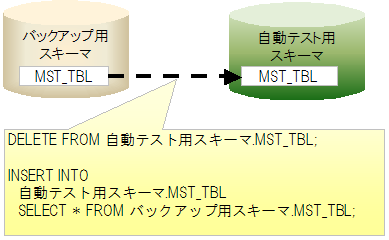

# マスタデータ復旧機能

<details>
<summary>keywords</summary>

バックアップスキーマ作成, マスタデータ復旧, データ投入, 復旧対象テーブル, 外部キー, slow test, テーブル削除挿入順序, 親子関係, nablarch.suppress-table-sort, MasterDataRestorer, nablarch.test.core.db.MasterDataRestorer, backupSchema, tablesTobeWatched, testEventListeners, 監視対象テーブル, コンポーネント設定, MasterDataRestorer$SqlLogWatchingFormatter, nablarch.test.core.db.MasterDataRestorer$SqlLogWatchingFormatter, NopLogWriter, nablarch.test.core.log.NopLogWriter, BasicLoggerFactory, nablarch.core.log.basic.BasicLoggerFactory, StandardOutputLogWriter, nablarch.core.log.basic.StandardOutputLogWriter, SQLログ, app-log.properties, log.properties

</details>

## 概要

通常の場合、テスト行う際にマスタデータを書き換えることはない。
しかし、マスタメンテナンス機能等のテストでは、マスタデータを変更しないと
実施できないテストケースが存在する。例えば、存在するはずのデータが存在しなかった場合のような
異常系テストケースでは、マスタデータからレコードを削除する必要がある。

テスト中にマスタデータを変更した場合、それ以降のテストクラスのテストでは、
マスタデータが意図しない状態になっている為にテストが失敗することがある。


このような、マスタデータ変更による意図しないテスト失敗を防止するため、
自動テスト中にマスタデータが更新された場合、そのテストメソッドが終了した時点で、
マスタデータを元の状態に復旧する機能を提供する。

## 特徴

* テストの実行順序に依存せずに、常に正しい状態のマスタデータでテストできる。
* マスタデータ復旧は自動で行われるので、各テストクラスで復旧処理、復旧用データを用意する必要ない。
* バックアップ用スキーマからテーブル毎に一括で復旧するので、1件ずつINSERTする場合に比べて高速に復旧できる。

## 必要となるスキーマ

本機能を使用するにあたり、以下の２つのスキーマが必要となる。

| スキーマ | 説明 |
|---|---|
| 自動テスト用スキーマ | 自動テストに使用するスキーマ。 |
| バックアップ用スキーマ | 復旧に使用するためのマスタデータを保存しておくためのスキーマ。 |

## 動作イメージ

自動テストフレームワークはコンポーネント設定ファイルより、監視対象テーブル名一覧を取得する。
テスト実行中、自動テストフレームワークはSQLログを監視することにより、\
監視対象テーブルを変更するSQL文が発行されたかどうかを検出する。


監視対象テーブルを変更するSQL文が発行された場合、テストメソッド終了後に変更があったテーブルを復旧する。
テーブルを復旧する際、いったんテーブル内のレコードを全件削除する。
その後、バックアップ用スキーマのテーブルからレコードを全件挿入する。



## 環境構築

以下の環境構築を実施し、自動テストフレームワークのマスタデータ復旧機能を有効にする。

## バックアップ用スキーマの作成、データ投入

マスタデータ復旧用スキーマを作成する。
マスタデータ復旧用スキーマに自動テスト用のスキーマと同じテーブルを作成し復旧用のデータを投入しておく。

> **Tip:** マスタデータ復旧用スキーマには全てのテーブルを作成する必要はない。 マスタデータ復旧対象とするテーブルのみ存在すればよい（復旧対象以外のテーブルがあっても問題ない）。

<details>
<summary>keywords</summary>

マスタデータ復旧, マスタデータ変更, テスト失敗防止, テストメソッド終了, 異常系テスト

</details>

## 外部キーが設定されたテーブルを使用する場合について

外部キーが設定されたテーブルに対してデータを復旧する場合には、親子関係を意識して復旧処理を行う必要がある。
このため、本機能ではデフォルトの動作としてJDBCの機能を用いて親子関係を取得・構築し、
削除処理は子テーブルから、挿入処理は親テーブルから順に行うよう制御している。

しかし、テーブル数が膨大なプロジェクトの場合、JDBCの機能を元に親子関係を構築する処理が原因で、slow test問題が発生する場合がある。
この問題を回避するために、JDBC機能を使用するのではなく、記述順 (設定例 を参照)を元にテーブルの削除及び挿入処理を行う機能を提供している。

記述順を元にマスタデータを復旧させたい場合には、環境設定ファイルに以下を追加する。

```jproperties
nablarch.suppress-table-sort=true
```

<details>
<summary>keywords</summary>

テスト実行順序, 自動復旧, 高速復旧, バックアップスキーマ, 一括復旧

</details>

## コンポーネント設定ファイルに監視対象テーブルを記載

自動テスト用のコンポーネント設定ファイルに、監視対象テーブルを列挙する。


#### 設定項目一覧

| 設定項目名 | 説明 | デフォルト値 |
|---|---|---|
| backupSchema | マスタデータ復旧用スキーマ名を記載する。 | なし |
| tablesTobeWatched | 監視対象とするテーブル名をリスト形式で列挙する。 | なし |
| testEventListeners | テストイベントリスナーの一覧。 ここにマスタデータ復旧クラス(nablarch.test.core.db.MasterDataRestorer)を登録することで、 テストメソッド終了時にマスタデータが行われるようになる。 | なし |

#### 設定例

```xml
<!-- マスタデータ復旧クラス -->
<component name="masterDataRestorer"
           class="nablarch.test.core.db.MasterDataRestorer">
  <!-- バックアップスキーマ -->
  <property name="backupSchema" value="nablarch_test_master"/>
  <!-- 監視対象テーブル一覧 -->
  <property name="tablesTobeWatched">
    <list>
      <value>MESSAGE</value>
      <value>ID_GENERATE</value>
      <value>BUSINESS_DATE</value>
      <value>PERMISSION_UNIT</value>
      <value>REQUEST</value>
      <value>PERMISSION_UNIT_REQUEST</value>
    </list>
  </property>
</component>
```

<details>
<summary>keywords</summary>

自動テスト用スキーマ, バックアップ用スキーマ, 必要スキーマ, 2つのスキーマ

</details>

## ログ出力設定

本機能ではSQLログを監視することにより、マスタデータへの変更を検出する。\
よって、そのためのログ出力が必要である。


#### app-log.properties

`sqlLogFormatter`\ のクラス名に、本機能の提供クラスを指定する。

```none
sqlLogFormatter.className=nablarch.test.core.db.MasterDataRestorer$SqlLogWatchingFormatter
```
#### log.properties

log.propertiesにSQLログをデバッグレベル以上で出力する設定をする。
以下の例では、SQLログを標準出力に表示させないよう専用のロガー（何もしないロガー）を
設定している

```none
# ロガーファクトリ実装クラス								 
loggerFactory.className=nablarch.core.log.basic.BasicLoggerFactory			 

# ログライター名									 
writerNames=stdout,nop									 

#デバッグ用の標準出力									 
writer.stdout.className=nablarch.core.log.basic.StandardOutputLogWriter			 
writer.nop.className=nablarch.test.core.log.NopLogWriter   # 【説明】何もしないロガー	 

# 利用可能なロガー名順序								 
availableLoggersNamesOrder=sql,root							 

#全てのロガー取得を対象に、DEBUGレベル以上を標準出力に出力する。			 
loggers.root.nameRegex=.*								 
loggers.root.level=DEBUG								 
loggers.root.writerNames=stdout								 

#ロガー名に"SQL"を指定したロガー取得を対象に、DEBUGレベル以上を出力する。		 
loggers.sql.nameRegex=SQL								 
loggers.sql.level=DEBUG      # 【説明】DEBUGレベル以上に設定すること			 
loggers.sql.writerNames=nop                                                              
```

<details>
<summary>keywords</summary>

監視対象テーブル, SQLログ監視, 全件削除, 全件挿入, 復旧メカニズム, コンポーネント設定ファイル

</details>
