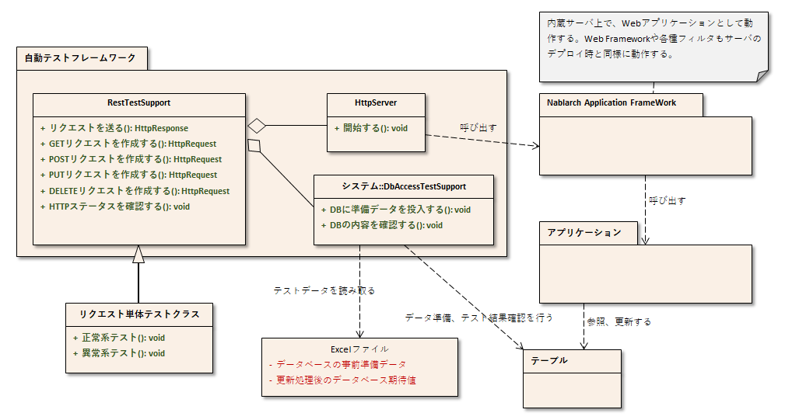

# リクエスト単体テスト（RESTfulウェブサービス）

## 概要

リクエスト単体テスト(REST)では、 リクエスト単体テスト(ウェブアプリケーション) 同様、内蔵サーバを使用してテストを行う。
RESTfulウェブサービス用実行基盤のみ、必要なモジュールが他の実行基盤より多くなるため、 モジュール一覧 に記載のモジュールを
依存関係に追加する必要がある。

## 全体像



## 主なクラス, リソース

<table>
<thead>
<tr>
  <th>名称</th>
  <th>役割</th>
  <th>作成単位</th>
</tr>
</thead>
<tbody>
<tr>
  <td>リクエスト単体テストクラス</td>
  <td>テストロジックを実装する。</td>
  <td>テスト対象クラス(Action)につき１つ作成</td>
</tr>
<tr>
  <td>テストデータ（Excelファイル）</td>
  <td>テーブルに格納する準備データや期待する結果、\</td>
  <td>必要に応じてテストクラスにつき１つ作成</td>
</tr>
<tr>
  <td></td>
  <td>HTTPパラメータなど、テストデータを記載する。</td>
  <td></td>
</tr>
<tr>
  <td>テスト対象クラス(Action)</td>
  <td>テスト対象のクラス</td>
  <td>取引につき1クラス作成</td>
</tr>
<tr>
  <td></td>
  <td>(Action以降の業務ロジックを実装する各クラスを含む)</td>
  <td></td>
</tr>
<tr>
  <td>DbAccessTestSupport</td>
  <td>準備データ投入などデータベースを使用するテストに\</td>
  <td>\－</td>
</tr>
<tr>
  <td></td>
  <td>必要な機能を提供する。</td>
  <td></td>
</tr>
<tr>
  <td>HttpServer</td>
  <td>内蔵サーバ。サーブレットコンテナとして動作する。</td>
  <td>\－</td>
</tr>
<tr>
  <td>RestTestSupport</td>
  <td>内蔵サーバの起動やリクエスト単体テストで必要とな\</td>
  <td>\－</td>
</tr>
<tr>
  <td></td>
  <td>るステータスコードのアサートを提供する。</td>
  <td></td>
</tr>
</tbody>
</table>

## モジュール一覧

```xml
<!--  テスティングフレームワーク本体  -->
<dependency>
  <groupId>com.nablarch.framework</groupId>
  <artifactId>nablarch-testing-rest</artifactId>
  <scope>test</scope>
</dependency>
<!--  テスティングフレームワークで使用するデフォルト設定  -->
<dependency>
  <groupId>com.nablarch.configuration</groupId>
  <artifactId>nablarch-testing-default-configuration</artifactId>
  <scope>test</scope>
</dependency>
<!--  テスティングフレームワークで使用する内蔵サーバの実装  -->
<dependency>
  <groupId>com.nablarch.framework</groupId>
  <artifactId>nablarch-testing-jetty12</artifactId>
  <scope>test</scope>
</dependency>
```
> **Important:** `nablarch-testing-rest` は `nablarch-testing` (テスティングフレームワーク) に依存している。 上記のモジュールを依存に追加することで テスティングフレームワーク のAPIも同時に使用できる。

## 設定

アーキタイプからブランクプロジェクトを作成した場合、 `src/test/resources/unit-test.xml` に
テスティングフレームワークの設定がされている。RESTfulウェブサービス向けテスティングフレームワークの
設定を追加するためデフォルト設定で提供している以下の設定ファイルを読み込む。

```xml
<import file="nablarch/test/rest-request-test.xml"/>
```
リクエスト単体テストの設定は 各種設定値 を参照。

> **Tip:** Nablarch5u18以降のアーキタイプから RESTfulウェブサービス の ブランクプロジェクトを作成した場合上記が既に設定されている。 ウェブプロジェクト や バッチプロジェクト では追加が必要となる。

## 構造

## SimpleRestTestSupport

リクエスト単体テスト用に用意されたスーパークラス。リクエスト単体テスト用のメソッドを用意している。
データベース関連機能が不要な場合は後述の `RestTestSupport` ではなくこちらのクラスを使用する。
事前準備補助機能 、 実行 、 結果確認 については以下の `RestTestSupport` と同じ機能を持つ。

> **Tip:** RestTestSupportを使用する場合、`dbInfo` または `testDataParser` のコンポーネントを準備する必要がある。 データベースへの依存が不要な場合は、`SimpleRestTestSupport` を使用することでコンポーネント定義を簡略化できる。

## RestTestSupport

リクエスト単体テスト用に用意されたスーパークラス。リクエスト単体テスト用のメソッドを用意している。
`SimpleRestTestSupport` を継承し、データベース関連機能を持つ。

## データベース関連機能

データベースに関する機能は、 `RestTestSupport` クラスから `DbAccessTestSupport` クラスに処理を委譲することで実現している。
`DbAccessTestSupport` クラスの詳細は、\ 02_DbAccessTest\ を参照。

ただし、 `DbAccessTestSupport` のうち以下のメソッドは、\
リクエスト単体テスト(REST)では不要であり、アプリケーションプログラマに誤解を与えないよう、\
意図的に委譲していない。

* `public void beginTransactions()`
* `public void commitTransactions()`
* `public void endTransactions()`
* `public void setThreadContextValues(String sheetName, String id)`
* `public void assertSqlResultSetEquals(String message, String sheetName, String id, SqlResultSet actual)`
* `public void assertSqlRowEquals(String message, String sheetName, String id, SqlRow actual)`

> **Important:** 利用者の利便性を考慮し、データベース関連機能を委譲している。\ しかしRESTfulウェブサービスの単体テストにおいては、委譲された `assertTableEquals` などを使って データベースのテーブル内容を確認するテストより、サービスとして公開されたAPIに問い合わせることで データベースに依存することなくシステムが持つデータを確認するテストを推奨する。

## 事前準備補助機能

内蔵サーバへのリクエスト送信には、 `HttpRequest` のインスタンスが必要となる。\
`RestTestSupport` クラスでは、 `HttpRequest` をリクエスト単体テスト用に拡張した\
`RestMockHttpRequest` のオブジェクトを簡単に作成できるよう\
5つのメソッドを用意している。\

```java
RestMockHttpRequest get(String uri)
RestMockHttpRequest post(String uri)
RestMockHttpRequest put(String uri)
RestMockHttpRequest patch(String uri)
RestMockHttpRequest delete(String uri)
```
引数には、以下の値を引き渡す。

* テスト対象となるリクエストURI

これらのメソッドでは、受け取ったリクエストURIを元に `RestMockHttpRequest` インスタンスを生成し、\
メソッド名に応じたHTTPメソッドを設定した上で返却する。\
リクエストパラメータなどURI以外のデータを設定したい場合は、\
本メソッド呼び出しにより取得したインスタンスに対してデータを設定するとよい。

また上記以外のHTTPメソッドで `RestMockHttpRequest` のオブジェクトを作成したい場合は以下のメソッドを使用する。

```java
RestMockHttpRequest newRequest(String httpMethod, String uri)
```
第1引数にはHTTPメソッドを、第2引数にはテスト対象となるリクエストURIを引き渡す。

> **Tip:** `RestMockHttpRequest` は流れるようなインターフェイスでパラメータなどを設定できるよう メソッドをオーバーライドして自身のインスタンスを返すようにしてある。 使用できるメソッドの詳細は `Javadoc` を参照 リクエストを構築する例

```java
RestMockHttpRequest request = post("/projects")
                                  .setHeader("Authorization","Bearer token")
                                  .setCookie(cookie);
```

## 実行

`RestTestSupport`  にある下記のメソッドを呼び出すことで、\
内蔵サーバが起動されリクエストが送信される。

```java
HttpResponse sendRequest(HttpRequest request)
```

## 結果確認

#### ステータスコード

`RestTestSupport` にある下記のメソッドを呼び出すことで、\
レスポンスのHTTPステータスコードが想定通りであることを確認する。

```java
void assertStatusCode(String message, HttpResponse.Status expected, HttpResponse response);
```
引数には、以下の値を引き渡す。

* アサート失敗時のメッセージ
* 期待するステータス( `HttpResponse.Status` のEnum)
* 内蔵サーバから返却された `HttpResponse` インスタンス


期待するステータスコードとレスポンスのステータスコードが一致しなかった場合\
アサート失敗となる。


#### レスポンスボディ

レスポンスボディの検証についてはフレームワークでは仕組みを用意していない。
各プロジェクトの要件に合わせて [JSONAssert(外部サイト、英語)](https://jsonassert.skyscreamer.org/) や
[json-path-assert(外部サイト、英語)](https://github.com/json-path/JsonPath/tree/master/json-path-assert) 、
[XMLUnit(外部サイト、英語)](https://github.com/xmlunit/user-guide/wiki) などのライブラリを使用すること。

> **Tip:** \ RESTfulウェブサービスのブランクプロジェクト\ を作成した場合 上記の [JSONAssert(外部サイト、英語)](https://jsonassert.skyscreamer.org/) 、 [json-path-assert(外部サイト、英語)](https://github.com/json-path/JsonPath/tree/master/json-path-assert) 、 [XMLUnit(外部サイト、英語)](https://github.com/xmlunit/user-guide/wiki) がpom.xmlに記載されている。 必要に応じてライブラリの削除や差し替えを行うこと。
**レスポンスボディ検証の補助機能**

レスポンスボディの検証をする際に、期待されるボディをJSONファイルやXMLファイルとして用意したい場合がある。
JSONAssertのように外部ライブラリが期待値として `String` しか引数に受け付けない場合に対応するため
`RestTestSupport` にはファイルを読み込み `String` に変換するメソッドを用意している。

```java
String readTextResource(String fileName)
```
このメソッドでは、以下のようにテストクラスと同じ名前のディレクトリにあるリソースから
引数で指定したファイル名でファイルを読み込み `String` に変換する。

<table>
<thead>
<tr>
  <th>ファイルの種類</th>
  <th>配置ディレクトリ</th>
  <th>ファイル名</th>
</tr>
</thead>
<tbody>
<tr>
  <td>テストクラスソースファイル</td>
  <td><PROJECT_ROOT>/test/java/com/example/</td>
  <td>SampleTest.java</td>
</tr>
<tr>
  <td>レスポンスボディの期待値ファイル</td>
  <td><PROJECT_ROOT>/test/resources/com/example/SampleTest</td>
  <td>response.json(引数のfileNameに指定)</td>
</tr>
</tbody>
</table>

## 各種設定値

環境設定に依存する設定値については、コンポーネント設定ファイルで変更できる。\
設定可能な項目を以下に示す。

## コンポーネント設定ファイル設定項目一覧

<table>
<thead>
<tr>
  <th>設定項目名</th>
  <th>説明</th>
  <th>デフォルト値</th>
</tr>
</thead>
<tbody>
<tr>
  <td>webBaseDir</td>
  <td>ウェブアプリケーションのルートディレクトリ\ [#]_\</td>
  <td>src/main/webapp</td>
</tr>
<tr>
  <td>webFrontControllerKey</td>
  <td>Webフロントコントローラーのリポジトリキー\ [#]_\</td>
  <td>webFrontController</td>
</tr>
</tbody>
</table>

PJ共通のwebモジュールが存在する場合、このプロパティにカンマ区切りでディレクトリを設定する。
複数指定された場合、先頭から順にリソースが読み込まれる。
以下に例を示す。
.. code-block:: xml
  <component name="restTestConfiguration" class="nablarch.test.core.http.RestTestConfiguration">
    <property name="webBaseDir" value="/path/to/web-a/,/path/to/web-common"/>
この場合、web-a、web-commonの順にリソースが探索される。
ウェブアプリケーション実行基盤とウェブサービス実行基盤をひとつのWarで実行する場合など
Webフロントコントローラー をデフォルトの"webFrontController"以外の名前で
コンポーネント登録する場合がある。
そのような場合は、このプロパティにウェブサービスで使用するWebフロントコントローラーのリポジトリキーを設定することで
内蔵サーバで実行されるハンドラを制御できる。
以下に例を示す。
ウェブアプリケーション実行基盤用のWebフロントコントローラー( `webFrontController` )と
ウェブサービス実行基盤用のWebフロントコントローラー( `jaxrsController` )が登録されているコンポーネント定義。
.. code-block:: xml
  <!-- ハンドラキュー構成 -->
  <component name="webFrontController" class="nablarch.fw.web.servlet.WebFrontController">
    <property name="handlerQueue">
      <list>
        <component class="nablarch.fw.web.handler.HttpCharacterEncodingHandler"/>
        <component class="nablarch.fw.handler.GlobalErrorHandler"/>
        <component class="nablarch.common.handler.threadcontext.ThreadContextClearHandler"/>
        <component class="nablarch.fw.web.handler.HttpResponseHandler"/>
        ・
        ・
        ・
        (略)
      </list>
    </property>
  </component>
  <component name="jaxrsController" class="nablarch.fw.web.servlet.WebFrontController">
    <property name="handlerQueue">
      <list>
        <component class="nablarch.fw.web.handler.HttpCharacterEncodingHandler"/>
        <component class="nablarch.fw.handler.GlobalErrorHandler"/>
        <component class="nablarch.fw.jaxrs.JaxRsResponseHandler"/>
        ・
        ・
        ・
        (略)
      </list>
    </property>
  </component>
デフォルト設定でRESTfulウェブサービス実行基盤向けテスティングフレームワークを使用すると
"webFrontController"が使用されるため、ウェブアプリケーション向けのWebフロントコントローラーが実行される。
以下のように設定を上書きすることでウェブサービス向けのWebフロントコントローラーを使用できる。
.. code-block:: xml
  <import file="nablarch/test/rest-request-test.xml"/>
  <!--  デフォルトのコンポーネント定義をimport後に上書きする。-->
  <component name="restTestConfiguration" class="nablarch.test.core.http.RestTestConfiguration">
    <property name="webFrontControllerKey" value="jaxrsController"/>
