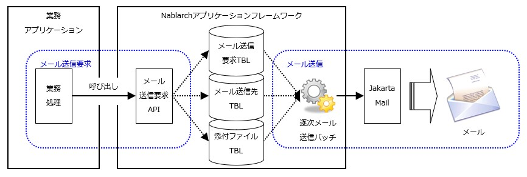

# リクエスト単体テストの実施方法(メール送信)

**公式ドキュメント**: [リクエスト単体テストの実施方法(メール送信)](https://nablarch.github.io/docs/LATEST/doc/development_tools/testing_framework/guide/development_guide/05_UnitTestGuide/02_RequestUnitTest/mail.html)

## メール送信処理の構造とテスト範囲

[メール送信](libraries-mail.json) を使用した業務アプリケーションはメール送信要求APIを呼び出すだけである。

リクエスト単体テストの範囲: メール送信要求が正常に受け付けられデータベースに格納されることを確認するところまで。

keywords

メール送信テスト範囲, リクエスト単体テスト, メール送信要求API, データベース格納確認

## テストの実施方法

メール送信に関してリクエスト単体テストで確認すべき内容: [各テーブル（メール送信要求テーブル、メール送信先テーブル、メール添付ファイルテーブル）](libraries-mail.json) に正しく格納されること。

期待する上記3テーブルの状態をExcelシートに記述する。

keywords

メール送信要求テーブル, メール送信先テーブル, メール添付ファイルテーブル, Excelシート, テスト実施方法, テーブル格納確認

