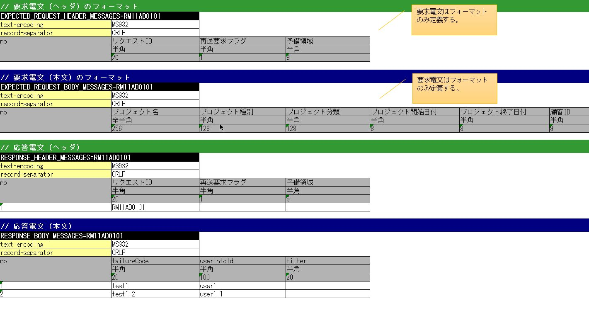

# 同期応答メッセージ送信処理を伴う取引単体テストの実施方法

**公式ドキュメント**: [1](https://nablarch.github.io/docs/LATEST/doc/development_tools/testing_framework/guide/development_guide/05_UnitTestGuide/03_DealUnitTest/send_sync.html) [2](https://github.com/nablarch/nablarch-testing/blob/main/src/main/java/nablarch/test/core/file/BasicDataTypeMapping.java)

## モックアップクラスを使用した取引単体テストの実施方法

同期応答メッセージ送信処理を伴うウェブアプリケーションで取引単体テストを行う場合は、Nablarchが提供するモックアップクラスを使用する。

モックアップクラスは以下の機能を提供する。

- **任意の応答電文を返却する機能**: 送信キューおよび受信キューに接続することなく、取引単体テストに必要な応答電文を返却できる
- **要求電文をログに出力する機能**: 同期送信された要求電文をログに出力し、正常性の確認やエビデンスとして使用できる
- **障害系のテストを行う機能**: タイムアウトエラーやメッセージ送受信エラーを発生させ、障害系のテストができる

モックアップクラスを使用すればキューを用意する必要がなく、特別なミドルウェアのインストールや環境設定なしに取引単体テストを行える。

応答電文のフォーマット・データ、要求電文のフォーマットをExcelファイルに定義する。ExcelファイルはリクエストIDごとに用意し、ファイル名はリクエストIDと一致させる（例: リクエストID「RM21AA0101」→ファイル名「RM21AA0101.xlsx」）。ファイルの配置ディレクトリは設定ファイルに定義する（`send_sync_test_data_path` 参照）。

> **注意**: ここでのリクエストIDは送信先システムの機能を一意に識別するID。ウェブアプリケーション/バッチのリクエストIDとは意味が異なる。このIDに基づき、電文フォーマットおよびキュー名が決定する。

## Excelファイルの書き方

- シート名は「message」固定
- 返却する応答電文のFW制御ヘッダ・本文のフォーマットを定義する
- 返却する応答電文のFW制御ヘッダ・本文のデータを定義する
- 要求電文のFW制御ヘッダ・本文のフォーマットのみ定義する（データは不要）

Excelファイルに定義した応答電文のフォーマットおよびデータは、モックアップクラスが返却する応答電文を生成するために使用される。また要求電文のフォーマットは、モックアップクラスが要求電文のログを出力するために使用される。



## 電文のフォーマットおよびデータの記載方法

電文のフォーマットおよびデータは「識別子行・ディレクティブ行（複数可）・no行」の構造で記載し、no行にはフィールド名称・データ型・フィールド長・データを縦に並べる。

| 名称 | 説明 |
|------|------|
| 識別子 | 電文の種類を示すID。書式: 要求電文ヘッダ=`EXPECTED_REQUEST_HEADER_MESSAGES=リクエストID`、要求電文本文=`EXPECTED_REQUEST_BODY_MESSAGES=リクエストID`、応答電文ヘッダ=`RESPONSE_HEADER_MESSAGES=リクエストID`、応答電文本文=`RESPONSE_BODY_MESSAGES=リクエストID` |
| ディレクティブ行 | ディレクティブを記載。`file-type`（固定長のみ対応のため不要）と`record-length`（フィールド長でパディングするため不要）は記述不要 |
| no | ディレクティブ行の下の行に必ず「no」を記載する |
| フィールド名称 | フィールド名称をフィールドの数だけ記載する |
| データ型 | 「半角英字」のように日本語名称で記述する。マッピングは`BasicDataTypeMapping`のメンバ変数`DEFAULT_TABLE`参照 |
| フィールド長 | フィールド長をフィールドの数だけ記載する。「-」を記載した場合はデータの記載内容を元にサイズを自動計算する |
| データ | 応答電文の場合のみ記載する。複数件の応答電文を返却する場合は次の行に続けてデータを記載する |

> **ヒント**: フィールド名称・データ型・フィールド長は外部インタフェース設計書からコピー＆ペーストして効率良く作成できる。ペースト時に「**行列を入れ替える**」オプションにチェックすること。

## Excelファイルの再読み込み

モックアップクラスは、Excelファイルのタイムスタンプが更新された場合にファイルを再読み込みする機能を提供する。

通常、応答電文を返却するたびにnoのインクリメントが行われ、アプリケーションサーバが起動している間はnoの値が初期化されない。Excelファイルの編集や上書きによりタイムスタンプを更新することで、サーバ起動中にExcelファイルの再読み込みができる。これにより手動でファイルを編集してテストをやり直すケースや、同じデータで繰り返しテストを行うケースに対応できる。

## 障害系のテスト

応答電文の本文の表の最初のフィールドに「errorMode:」から始まる特定の値を設定することで、障害系のテストを行える。

| 最初のフィールドに設定する値 | 障害内容 | フレームワークの動作 |
|------------------------------|----------|---------------------|
| `errorMode:timeout` | メッセージ送信中にタイムアウトエラーが発生する場合のテスト | sendSyncメソッドの戻り値としてnullを返却する |
| `errorMode:msgException` | メッセージ送受信エラーが発生する場合のテスト | MessagingExceptionをスローする |

## 要求電文のログ出力

要求電文のログはMap形式とCSV形式で出力される。Map形式はデバッグ用、CSV形式はエビデンス取得用。

Map形式ログ例:
```
2011-10-26 13:16:10.958 MESSAGING_SEND_MAP request id=[RM11AD0101]. following message has been sent: 
  message fw header = {requestId=RM11AD0101, testCount=, resendFlag=0, reserved=}
  message body      = {authors=test3, title=test1, publisher=test2}
```

CSV形式ログ例:
```
2011-10-26 13:16:10.958 MESSAGING_SEND_CSV request id=[RM11AD0102]. following message has been sent: 
header: 
"requestId","testCount","resendFlag","reserved"
"RM11AD0102","","0",""
body: 
"authors","title","publisher"
"test3","test1","test2"
```

log.properties設定例:
```properties
# CSV形式のメッセージログのライタ（./messaging-evidence.logに出力する）
writer.MESSAGING_CSV.className=nablarch.core.log.basic.FileLogWriter
writer.MESSAGING_CSV.filePath=./messaging-evidence.log
writer.MESSAGING_CSV.formatter.className=nablarch.core.log.basic.BasicLogFormatter
writer.MESSAGING_CSV.formatter.format=$message$

# CSV形式のメッセージログのロガー
loggers.MESSAGING_CSV.nameRegex=MESSAGING_CSV
loggers.MESSAGING_CSV.level=DEBUG
loggers.MESSAGING_CSV.writerNames=MESSAGING_CSV

# Map形式のメッセージログのロガー
loggers.MESSAGING_MAP.nameRegex=MESSAGING_MAP
loggers.MESSAGING_MAP.level=DEBUG
loggers.MESSAGING_MAP.writerNames=stdout,appFile
```

<details>
<summary>keywords</summary>

Excelファイル設定, 応答電文フォーマット, リクエストID, message シート, send_sync_test_data_path, MockMessagingProvider, EXPECTED_REQUEST_HEADER_MESSAGES, EXPECTED_REQUEST_BODY_MESSAGES, RESPONSE_HEADER_MESSAGES, RESPONSE_BODY_MESSAGES, errorMode:timeout, errorMode:msgException, MessagingException, Excelファイル再読み込み, 障害系テスト, 要求電文ログ出力, BasicDataTypeMapping, FileLogWriter, BasicLogFormatter

</details>

## フレームワークで使用するクラスの設定

フレームワークで使用するクラスの設定は取引単体テストでのみ必要であり、テスト用プロファイルに設定する。通常はアーキテクトが設定し、アプリケーションプログラマが設定する必要はない。

## モックアップクラスの設定

コンポーネント設定ファイルに`MockMessagingProvider`を設定する。

```xml
<!-- モックのメッセージングプロバイダ -->
<component name="messagingProvider"
           class="nablarch.test.core.messaging.MockMessagingProvider">
</component>
```

## Excelファイルの配置場所の設定

コンポーネント設定ファイルで`sendSyncTestData`キーを使いExcelファイルの配置場所のパスを設定する（アンカー: `send_sync_test_data_path`）。

```xml
<component name="filePathSetting"
         class="nablarch.core.util.FilePathSetting" autowireType="None">
   <property name="basePathSettings">
     <map>
       <!-- Excelファイルの配置場所のパスを指定する -->
       <entry key="sendSyncTestData" value="file:///C:/nablarch/workspace/Nablarch_sample/test/message" />
       <entry key="format" value="classpath:web/format" /> 
     </map>
   </property>
   <property name="fileExtensions">
     <map>
       <!-- Excelファイルの拡張子（xlsx）を定義する -->
       <entry key="sendSyncTestData" value="xlsx" />
       <entry key="format" value="fmt" />
     </map>
   </property>
</component>
```

> **推奨**: 配置ディレクトリのパスはクラスパス（`classpath:`）ではなくファイルシステムのパス（`file:`）で指定することを推奨する。ファイルシステムのパスを指定することで、サーバ起動中に直接Excelファイルを編集してテストできる。

## テストデータ解析クラスの設定

コンポーネント設定ファイルに`BasicTestDataParser`と`PoiXlsReader`を設定する。`messagingTestInterpreters`リストには`NullInterpreter`、`QuotationTrimmer`、`CompositeInterpreter`（内部に`BasicJapaneseCharacterInterpreter`を含む）を設定する。

```xml
<!-- TestDataParser -->
<component name="messagingTestDataParser" class="nablarch.test.core.reader.BasicTestDataParser">
  <property name="testDataReader">
    <component name="xlsReaderForPoi" class="nablarch.test.core.reader.PoiXlsReader"/>
  </property>
  <property name="interpreters" ref="messagingTestInterpreters" />
</component>
<!-- テストデータ記法の解釈を行うクラス群 -->
<list name="messagingTestInterpreters">
  <component class="nablarch.test.core.util.interpreter.NullInterpreter"/>
  <component class="nablarch.test.core.util.interpreter.QuotationTrimmer"/>
  <component class="nablarch.test.core.util.interpreter.CompositeInterpreter">
    <property name="interpreters">
      <list>
        <component class="nablarch.test.core.util.interpreter.BasicJapaneseCharacterInterpreter"/>
      </list>
    </property>
  </component>
</list>
```

## pom.xmlへの依存追加

以下のdependencyをpom.xmlへ追加する。

```xml
<dependency>
  <groupId>com.nablarch.framework</groupId>
  <artifactId>nablarch-testing</artifactId>
  <exclusions>
    <exclusion>
      <groupId>org.mortbay.jetty</groupId>
      <artifactId>*</artifactId>
    </exclusion>
    <exclusion>
      <groupId>com.google.code.findbugs</groupId>
      <artifactId>*</artifactId>
    </exclusion>
  </exclusions>
</dependency>
```

<details>
<summary>keywords</summary>

MockMessagingProvider, BasicTestDataParser, PoiXlsReader, nablarch-testing, sendSyncTestData, filePathSetting, コンポーネント設定, pom.xml, テストプロファイル, NullInterpreter, QuotationTrimmer, CompositeInterpreter, BasicJapaneseCharacterInterpreter, FilePathSetting

</details>
