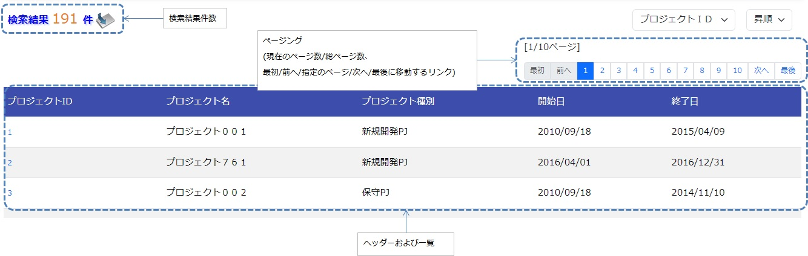
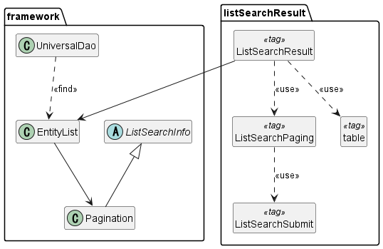
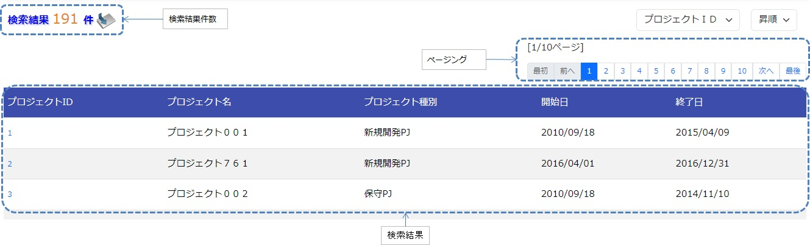
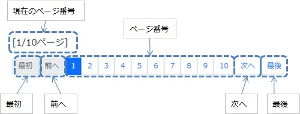
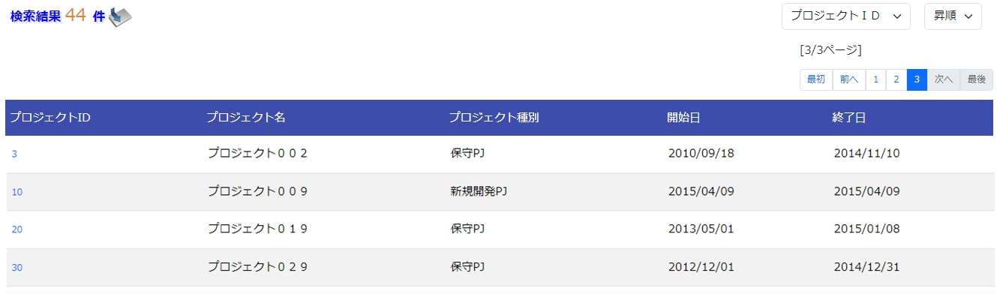
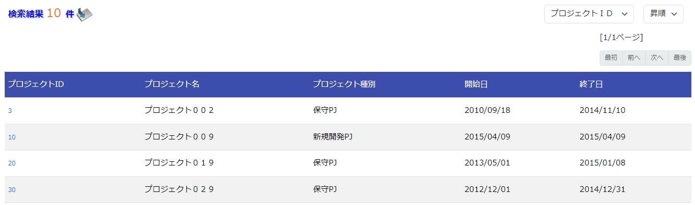
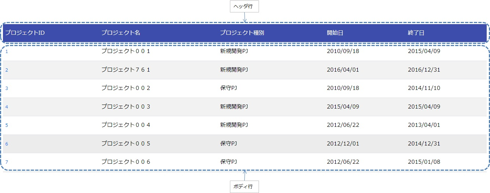
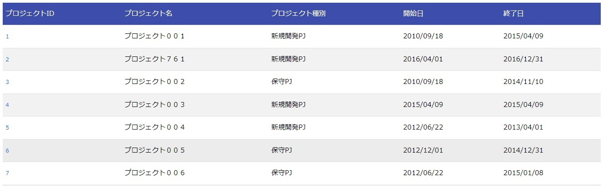

# 検索結果の一覧表示

## 概要

本サンプルは、検索結果の一覧表示を行うタグファイルの実装サンプルである。

[ソースコード](https://github.com/nablarch/nablarch-biz-sample-all/tree/main/nablarch-list-search-result)

<details>
<summary>keywords</summary>

検索結果件数表示, ページング, universal_dao連携, 一覧表示タグファイル

</details>

## 提供パッケージ

本サンプルは、以下のパッケージで提供される。

*resources/META-INF/tags/*\ **listSearchResult**

<details>
<summary>keywords</summary>

listSearchResult, タグファイル提供パッケージ, resources/META-INF/tags, nablarch-biz-sample-all, nablarch-list-search-result

</details>

## 概要

ここでは、検索結果の一覧表示を行うタグファイルの実装サンプルを提供する。
タグファイルは、ユニバーサルDAO の検索機能と連携して、次の機能を提供する。

* 検索結果件数の表示機能
* 検索結果を指定件数毎に表示する機能(以降はページングと称す)

一覧画面の出力例を示す。



|

<details>
<summary>keywords</summary>

検索結果件数表示, ページング, universal_dao連携, 一覧表示タグファイル

</details>

## 構成

本サンプルの構成を示す。

# クラス図

ページングを実現したい場合、フレームワークが提供するクラスとサンプル提供のタグファイルがページングに必要な処理を行うため、\
アプリケーションプログラマはページングを作り込みせずに実現できる。



<details>
<summary>keywords</summary>

UniversalDao, ListSearchInfo, Pagination, EntityList, listSearchResult, listSearchPaging, listSearchSubmit, table, クラス構成, タグファイル一覧

</details>

## フレームワークが提供するクラスとタグファイルの責務

\a) フレームワーク

| クラス名                        概要 |  |
|---|---|
| UniversalDao | 汎用的なDAO機能を提供するクラス。基本的な使い方は、ユニバーサルDAO を参照。 |
| ListSearchInfo | 一覧検索用の情報を保持する抽象クラス。 |
| Pagination | ListSearchInfoを継承した具象クラス。 |
| EntityList | ユニバーサルDAOから返される結果リストの保持クラス。 |

\b) タグファイル

| タグ名                          概要 |  |
|---|---|
| listSearchResult | 検索結果の一覧表示を行うタグ。 |
| listSearchPaging | ページングを出力するタグ。 |
| listSearchSubmit | ページングのサブミット要素を出力するタグ。 |
| table | テーブルを出力するタグ。 |

|

## UniversalDaoクラス

`UniversalDao` クラスは、複数件の検索結果をEntityListとして返すAPIを持つ。
ページング機能を使う際は、ページングを行う を参照。

<details>
<summary>keywords</summary>

UniversalDao, nablarch.common.dao.UniversalDao, EntityList, ページング機能, 検索結果取得

</details>

## ListSearchInfoクラス

ListSearchInfoクラスは、一覧検索用の情報を保持する抽象クラスである。
ページネーションのためのページ数や検索条件に一致した件数などのフィールドおよびアクセッサメソッドは、本クラスで定義する。
詳細は、 `nablarch.core.db.support.ListSearchInfo` を参照。

<details>
<summary>keywords</summary>

ListSearchInfo, nablarch.core.db.support.ListSearchInfo, 一覧検索情報, ページネーション情報, 抽象クラス

</details>

## Paginationクラス

Paginationクラスは、ListSearchInfoを継承し、ページネーションの情報を参照するために使用される。

<details>
<summary>keywords</summary>

Pagination, ListSearchInfo, ページネーション情報参照

</details>

## EntityListクラス

EntityListクラスは、UniversalDaoから返される結果リストの保持クラス。
java.util.ArrayListクラスを継承し、Paginationクラスのインスタンスをフィールドに持つ。

<details>
<summary>keywords</summary>

EntityList, Pagination, java.util.ArrayList, 検索結果リスト保持

</details>

## listSearchResultタグ

listSearchResultタグ は、検索結果のリストを表示するタグである。\
listSearchResultタグで出力する画面要素を下記に示す。



# listSearchResultタグの主要な属性
listSearchResultタグの主要な属性を下記に示す。全ての属性の詳細については、 listSearchResultタグ を参照。

resultSetName属性で指定された検索結果がリクエストスコープに存在しない場合、listSearchResultタグは何も出力しない。\
検索画面の初期表示が何も出力されないケースに該当する。

| 属性 | 説明 |
|---|---|

<details>
<summary>keywords</summary>

listSearchResult, 検索結果一覧表示, resultSetName, リクエストスコープ, 初期表示

</details>

## 全体

searchFormName                         検索フォームをリクエストスコープから取得する際に使用する名前。|br|
検索フォームは検索条件とページングのためのページ番号を保持する。
一括削除確認画面など、一覧表示のみを行う場合は指定しない。

<details>
<summary>keywords</summary>

searchFormName, 検索フォーム, リクエストスコープ取得, ページ番号, 検索条件

</details>

## 検索結果件数

useResultCount                         検索結果件数を表示するか否か。|br|
デフォルトはtrue。

<details>
<summary>keywords</summary>

useResultCount, 検索結果件数表示, デフォルトtrue, resultCountCss, resultCountFragment, resultCountプロパティ, useResultCount, resultCountFragment, resultCountCss, 検索結果件数, paginationのresultCountプロパティ, 件数表示カスタマイズ

</details>

## ページング

usePaging                              ページングを表示するか否か。|br|
デフォルトはtrue。|br|
searchUri                              ページングのサブミット要素に使用するURI。|br|
ページングを表示する場合は必ず指定すること。

<details>
<summary>keywords</summary>

usePaging, searchUri, ページング表示, サブミット要素URI, pagingPosition, pagingCss, pageNumber, ページング, ページネーション, 検索条件URI, 前へ, 次へ, ページ切り替え, usePaging, pageNumber, ページング, searchUri, ページング時の検索条件, 検索結果が減少, ProjectSearchForm, c:url, c:param, pagingPosition

</details>

## 検索結果

resultSetName(必須)                    `ユニバーサルDAOの検索結果` をリクエストスコープから取得する際に使用する名前。検索結果には、ページネーションのためのページ数や検索条件に一致した件数なども含まれる。
headerRowFragment                      ヘッダ行のJSPフラグメント。ヘッダ行については、 検索結果 を参照。|br|
bodyRowFragment                        ボディ行のJSPフラグメント。ボディ行については、 検索結果 を参照。


# 検索結果件数
検索結果件数は、useResultCount属性にtrue(デフォルトはtrue)が指定され、検索結果がリクエストスコープに存在する場合に表示される。
検索結果件数は、デフォルトでは下記の書式で出力される。

```jsp
検索結果 <%-- paginationのresultCountプロパティ --%>件
```
デフォルトの書式を変更したい場合は、resultCountFragment属性にJSPフラグメントを指定する。\
resultCountFragment属性の指定例を下記に示す。

```jsp
<app:listSearchResult resultSetName="searchResult" useResultCount="true">

   <%-- resultCountFragment属性にJSPフラグメントを指定する。 --%>
   <jsp:attribute name="resultCountFragment">
     [サーチ結果 <n:write name="searchResult.pagination.resultCount" />件]
   </jsp:attribute>

   <%-- その他の属性は省略。 --%>

</app:listSearchResult>
```
上記指定後の検索結果件数の書式を下記に示す。

```jsp
[サーチ結果 <%-- paginationのresultCountプロパティ --%>件]
```

# ページング
ページングは、usePaging属性にtrue(デフォルトはtrue)が指定された場合に表示される。\

ページング機能を使用する場合、searchFormNameで指定するフォームがpageNumberという名前でページ番号を受け取るよう実装すること。
例を下記に示す。

```java
public class ProjectSearchForm {

  @Required
  @Domain("pageNumber")
  private String pageNumber;

  public String getPageNumber(){
    return this.pageNumber;
  }

  public void setPageNumber(String pageNumber){
    this.pageNumber = pageNumber;
  }

  // その他の属性は省略。
}
```
ページングの画面要素を下記に示す。\
ページングは、現在のページ番号とページを移動するためのサブミット要素から構成される。

|


|

ページング全体は、検索結果件数が1件以上の場合に表示される。\
ページング全体が表示される前提で、ページングの画面要素の表示について下記に示す。

| ページングの画面要素 | 説明 |
|---|---|
| 現在のページ番号 | useCurrentPageNumber属性にtrueを指定した場合に表示される。 |
| 最初、前へ、次へ、最後 | 現在のページ番号から各画面要素が示すページに遷移可能な場合は、サブミット可能な状態で表示される。遷移不可の場合はラベルで表示される。 |
| ページ番号 | ページ番号全体(1..n)は、総ページ数が2以上の場合のみ表示される。 |

ページングの画面要素で指定可能な属性のうち、代表的なものを下記に示す。
全ての属性の詳細については、 listSearchResultタグ を参照。

* 各画面要素の使用有無
* 各画面要素のラベル(最初、前へ、次へ、最後など)
* 現在のページ番号はJSPフラグメントによる変更
* ページ番号はページ番号をラベルに使用するため変更不可

**ページング時の検索条件**

ページング時の検索条件は、検索条件をパラメータにセットしたURIを組み立て、searchUri属性に渡すことで実現できる。
検索条件にプロジェクト名を指定する場合の例を、下記に示す。

```jsp
<%@ taglib prefix="c" uri="jakarta.tags.core" %>
<%@ taglib prefix="app" tagdir="/WEB-INF/tags/listSearchResult" %>

<%-- 現在の検索結果の表示に使用した検索条件をパラメータとして持つURIを、変数としてpageスコープに登録する。
     この変数は、<app:listSearchResult>タグのページング用のURIとして使用される。--%>
<c:url value="/action/project/list" var="uri" context="/">
   <%-- 検索フォームから取得したプロジェクト名をセットする。 --%>
   <c:param name="searchForm.projectName" value="${searchForm.projectName}"/>
</c:url>

<%-- searchUri属性に渡す。 --%>
<app:listSearchResult resultSetName="searchResult" searchUri="${uri}"

<%-- その他の属性は省略。 --%>
```
|

**ページング使用時に検索結果が減少した場合の動作**

ここでは、ページングの各サブミット要素で検索結果ページを切り替えている最中に、他のユーザオペレーションなどにより、\
検索結果が減少した場合の動作について解説する。

本フレームワークでは、指定されたページ番号に基づき検索を実施し、ページングの各画面要素を表示する。\
下記に検索結果が減少した場合のページングの動作例を示す。

前提として、検索結果の取得件数(1ページの表示件数)は20件とする。

まず、検索結果が44件であったとする。下記は3ページ目を選択した後のページングの表示である。

|


|

次に、検索結果が10件に減少した状態で、「前へ」を選択した場合のページングの表示と表示内容の説明を示す。\
2ページ目に対する検索結果としてページングの各画面要素が表示される。

|


|

| ページングの画面要素 | 表示内容の説明 |
|---|---|
| 現在のページ番号 | 2ページ目が指定され、検索結果が20件以下のため、2/1ページとなる。 |
| 最初、前へ | 現在2ページ目で検索結果が10件のため、前のページに遷移可能となりリンクで表示される。 |
| 次へ、最後 | 現在2ページ目で検索結果が10件のため、次のページに遷移不可となりラベルで表示される。 |
| ページ番号 | 検索結果が10件で総ページ数が1のため、ページ番号は表示されない。 |

現在のページ番号とサブミット要素の対応が取れているため、操作不能な状態にならず、\
サブミット要素を選択することで検索結果のページに遷移可能である。\
(もちろん検索フォームから検索しなおせば、1ページ目からの検索結果となる)

次に「前へ」を選択した後のページングの表示を示す。現在のページ番号と総ページ数の対応が正常な状態に戻る。

|


|


# 検索結果
検索結果の画面要素を下記に示す。\
検索結果は、列見出しを表示するヘッダ行と、行データを表示するボディ行から構成される。


検索結果は、検索結果がリクエストスコープに存在する場合は常に表示される。\
検索結果が0件の場合は、ヘッダ行のみ表示される。

ヘッダ行とボディ行は、それぞれheaderRowFragment属性、bodyRowFragment属性にJSPフラグメントで指定する。\
ボディ行のJSPフラグメントは、検索結果のループ内(JSTLのc:forEachタグ)で呼び出され評価される。\
このため、ボディ行のJSPフラグメントで行データ(c:forEachタグのvar属性)とステータス(c:forEachタグのstatus属性)にアクセスするために、\
下記の属性を設けている。

| 属性 | 説明 |
|---|---|
| varRowName | ボディ行のフラグメントで行データ(c:forEachタグのvar属性)を参照する際に使用する変数名。\|br\| |
|  | デフォルトは"row"。\|br\| |
| varStatusName | ボディ行のフラグメントでステータス(c:forEachタグのstatus属性)を参照する際に使用する変数名。\|br\| |
|  | デフォルトは"status"。 |
|  | .. tip:: |
|  | n:writeタグを使用してステータスにアクセスすると、n:writeタグとEL式でアクセス方法が異なるために\ |
|  | エラーが発生し値を取得できない。\ |
|  | n:setタグを使用してステータスにアクセスすることで、このエラーを回避できる。\ |
|  | 下記に使用例を示す。 |
|  | .. code-block:: jsp |
|  | <n:set var="rowCount" value="${status.count}" /> |
|  | <n:write name="rowCount" /> |
| varCountName | ステータス(c:forEachタグのstatus属性)のcountプロパティを参照する際に使用する変数名。\|br\| |
|  | デフォルトは"count"。\|br\| |
| varRowCountName | 検索結果のカウント(検索結果の取得開始位置＋ステータスのカウント)を参照する際に使用する変数名。\|br\| |
|  | デフォルトは"rowCount"。 |

さらに、ボディ行では、1行おきに背景色を変えたい場合に対応するために、ボディ行のclass属性を指定する下記の属性を設けている。

| 属性 | 説明 |
|---|---|
| varOddEvenName | ボディ行のclass属性を参照する際に使用する変数名。\|br\| |
|  | この変数名は、1行おきにclass属性の値を変更したい場合に使用する。\|br\| |
|  | デフォルトは"oddEvenCss"。\|br\| |
| oddValue | ボディ行の奇数行に使用するclass属性。\|br\| |
|  | デフォルトは"nablarch_odd"。\|br\| |
| evenValue | ボディ行の偶数行に使用するclass属性。\|br\| |
|  | デフォルトは"nablarch_even"。 |

プロジェクト検索の指定例を下記に示す。タグファイルのプレフィックスは app とする。

```jsp
<app:listSearchResult resultSetName="searchResult">

   <%-- ヘッダ行のJSPフラグメント指定。 --%>
   <jsp:attribute name="headerRowFragment">
       <tr>
           <th>プロジェクトID</th>
           <th>プロジェクト名</th>
           <th>プロジェクト種別</th>
           <th>開始日</th>
           <th>終了日</th>
       </tr>
   </jsp:attribute>

   <%-- ボディ行のJSPフラグメント指定。 --%>
   <jsp:attribute name="bodyRowFragment">
       <tr class="info">
           <td>
               <%-- デフォルトの変数名"row"を使用して行データにアクセスする --%>
               <n:a href="/action/project/show/${row.projectId}">
                   <n:write name="row.projectId"/>
               </n:a>
           </td>
           <td>
               <n:write name="row.projectName" />
           </td>
           <td>
               <c:forEach var="projectType" items="<%= ProjectType.values() %>">
                   <c:if test="${projectType.code == row.projectType}">
                       <n:write name="projectType.label" />
                   </c:if>
               </c:forEach>
           </td>
           <td>
               <n:write value="${n:formatByDefault('dateTime', row.projectStartDate)}" />
           </td>
           <td>
               <n:write value="${n:formatByDefault('dateTime', row.projectEndDate)}" />
           </td>
       </tr>
   </jsp:attribute>
</app:listSearchResult>
```
上記指定後の検索結果を下記に示す。




<details>
<summary>keywords</summary>

showResult, resultSetName, resultSetCss, headerRowFragment, bodyRowFragment, varRowName, varStatusName, varCountName, varRowCountName, varOddEvenName, oddValue, evenValue, EntityList, 検索結果テーブル, ボディ行, ヘッダ行, listSearchResult, 検索結果表示, headerRowFragment, bodyRowFragment, varRowName, varStatusName, varCountName, varRowCountName, varOddEvenName, EntityList, JSPフラグメント, ボディ行, ヘッダ行, resultSetName, headerRowFragment, bodyRowFragment, varRowName, varStatusName, varCountName, varRowCountName, varOddEvenName, oddValue, evenValue, EntityList, 検索結果表示, 奇数偶数行CSS, n:setタグ, 0件の場合ヘッダ行のみ, c:forEach

</details>

## 業務アプリケーションへのサンプル実装(タグファイル)の取り込み方法

下記の通り、listSearchResultパッケージを業務アプリケーションに配置する。

コピー元
*META-INF/tags/*\ **listSearchResult**

コピー先
業務アプリケーションの /WEB-INF/tags ディレクトリ

<details>
<summary>keywords</summary>

listSearchResult, タグファイル配置, WEB-INF/tags, META-INF/tags, サンプル実装取り込み

</details>

## タグリファレンス

# listSearchResultタグ
listSearchResultタグは、検索結果の一覧表示を行う。
画面要素毎に属性を下記に示す。

|


|

| 属性 | 説明 |
|---|---|

<details>
<summary>keywords</summary>

listSearchResultタグ, タグリファレンス, 検索結果一覧表示, 属性一覧, listSearchResultWrapperCss, searchFormName, useResultCount, resultCountCss, resultCountFragment, usePaging, pagingPosition, pagingCss, searchUri

</details>

## 全体

listSearchResultWrapperCss             ページング付きテーブル全体(検索結果件数、ページング、検索結果)をラップするdivタグのclass属性。|br|
デフォルトは"nablarch_listSearchResultWrapper"。
searchFormName                         検索フォームをリクエストスコープから取得する際に使用する名前。|br|
検索フォームは検索条件とページングのためのページ番号を保持する。
一括削除確認画面など、一覧表示のみを行う場合は指定しない。

<details>
<summary>keywords</summary>

searchFormName, 検索フォーム, リクエストスコープ取得, ページ番号, 検索条件

</details>

## 検索結果件数

useResultCount                         検索結果件数を表示するか否か。|br|
デフォルトはtrue。
resultCountCss                         検索結果件数をラップするdivタグのclass属性。|br|
デフォルトは"nablarch_resultCount"。
resultCountFragment                    検索結果件数を出力するJSPフラグメント。|br|
デフォルトは"検索結果 <paginationのresultCountプロパティ>件"。

<details>
<summary>keywords</summary>

useResultCount, 検索結果件数表示, デフォルトtrue, resultCountCss, resultCountFragment, resultCountプロパティ, useResultCount, resultCountFragment, resultCountCss, 検索結果件数, paginationのresultCountプロパティ, 件数表示カスタマイズ

</details>

## ページング

usePaging                              ページングを表示するか否か。|br|
デフォルトはtrue。
pagingPosition                         ページングの表示位置。|br|
下記のいずれかを指定する。|br|
top(上側のみ) |br|
bottom(下側のみ) |br|
both(両方) |br|
none(表示なし) |br|
デフォルトはtop。
pagingCss                              ページングのサブミット要素(前へ、次へなど)全体をラップするdivタグのclass属性。 |br|
デフォルトは"nablarch_paging"。
searchUri                              ページングのサブミット要素に使用するURI。|br|
ページングを表示する場合は必ず指定すること。

|


|

| 属性 | 説明 |
|---|---|

<details>
<summary>keywords</summary>

usePaging, searchUri, ページング表示, サブミット要素URI, pagingPosition, pagingCss, pageNumber, ページング, ページネーション, 検索条件URI, 前へ, 次へ, ページ切り替え, usePaging, pageNumber, ページング, searchUri, ページング時の検索条件, 検索結果が減少, ProjectSearchForm, c:url, c:param, pagingPosition

</details>

## 現在のページ番号

useCurrentPageNumber                   現在のページ番号を使用するか否か。|br|
デフォルトはtrue。
currentPageNumberCss                   現在のページ番号をラップするdivタグのclass属性。|br|
デフォルトは"nablarch_currentPageNumber"。
currentPageNumberFragment              現在のページ番号を出力するJSPフラグメント。|br|
デフォルトは"[<paginationのpageNumberプロパティ>/<paginationのpageCountプロパティ>ページ]"。

<details>
<summary>keywords</summary>

useCurrentPageNumber, currentPageNumberCss, currentPageNumberFragment, ページ番号表示, pageCountプロパティ

</details>

## 最初

useFirstSubmit                         最初のページに遷移するサブミットを使用するか否か。|br|
デフォルトはfalse。
firstSubmitCss                         最初のページに遷移するサブミットをラップするdivタグのclass属性。|br|
デフォルトは"nablarch_firstSubmit"。
firstSubmitLabel                       最初のページに遷移するサブミットに使用するラベル。|br|
デフォルトは"最初"。
firstSubmitName                        最初のページに遷移するサブミットに使用するタグのname属性。|br|
デフォルトは"firstSubmit"。|br|
ページングの表示位置を表すサフィックス(上側は"_top"、下側は"_bottom")を付けて出力する。|br|
例えば、デフォルトかつ表示位置が上側の場合は"firstSubmit_top"となる。

<details>
<summary>keywords</summary>

useFirstSubmit, firstSubmitCss, firstSubmitLabel, firstSubmitName, 最初のページ遷移, _top, _bottom

</details>

## 前へ

usePrevSubmit                          前のページに遷移するサブミットを使用するか否か。|br|
デフォルトはtrue。
prevSubmitCss                          前のページに遷移するサブミットをラップするdivタグのclass属性。|br|
デフォルトは"nablarch_prevSubmit"。
prevSubmitLabel                        前のページに遷移するサブミットに使用するラベル。|br|
デフォルトは"前へ"。
prevSubmitName                         前のページに遷移するサブミットに使用するタグのname属性。|br|
デフォルトは"prevSubmit"。|br|
ページングの表示位置を表すサフィックス(上側は"_top"、下側は"_bottom")を付けて出力する。|br|
例えば、デフォルトかつ表示位置が上側の場合は"prevSubmit_top"となる。

<details>
<summary>keywords</summary>

usePrevSubmit, prevSubmitCss, prevSubmitLabel, prevSubmitName, 前のページ遷移, prevSubmit_top, prevSubmit_bottom

</details>

## ページ番号(ページ番号をラベルとして使用するためラベル指定がない)

usePageNumberSubmit                    ページ番号のページに遷移するサブミットを使用するか否か。|br|
デフォルトはfalse。
pageNumberSubmitCss                    ページ番号のページに遷移するサブミットをラップするdivタグのclass属性。|br|
デフォルトは"nablarch_pageNumberSubmit"。
pageNumberSubmitName                   ページ番号のページに遷移するサブミットに使用するタグのname属性。|br|
デフォルトは"pageNumberSubmit"。|br|
ページ番号とページングの表示位置を表すサフィックス(上側は"_top"、下側は"_bottom")を付けて出力する。|br|
例えば、デフォルトかつ表示位置が上側でページ番号が3の場合は"pageNumberSubmit3_top"となる。

<details>
<summary>keywords</summary>

usePageNumberSubmit, pageNumberSubmitCss, pageNumberSubmitName, ページング, ページ番号サブミット, ページ番号遷移

</details>

## 次へ

useNextSubmit                          次のページに遷移するサブミットを使用するか否か。|br|
デフォルトはtrue。
nextSubmitCss                          次のページに遷移するサブミットをラップするdivタグのclass属性。|br|
デフォルトは"nablarch_nextSubmit"。
nextSubmitLabel                        次のページに遷移するサブミットに使用するラベル。|br|
デフォルトは"次へ"。
nextSubmitName                         次のページに遷移するサブミットに使用するタグのname属性。|br|
デフォルトは"nextSubmit"。|br|
ページングの表示位置を表すサフィックス(上側は"_top"、下側は"_bottom")を付けて出力する。|br|
例えば、デフォルトかつ表示位置が上側の場合は"nextSubmit_top"となる。

<details>
<summary>keywords</summary>

useNextSubmit, nextSubmitCss, nextSubmitLabel, nextSubmitName, 次のページ, ページングサブミット, 次へボタン

</details>

## 最後

useLastSubmit                          最後のページに遷移するサブミットを使用するか否か。|br|
デフォルトはfalse。
lastSubmitCss                          最後のページに遷移するサブミットをラップするdivタグのclass属性。|br|
デフォルトは"nablarch_lastSubmit"。
lastSubmitLabel                        最後のページに遷移するサブミットに使用するラベル。|br|
デフォルトは"最後"。
lastSubmitName                         最後のページに遷移するサブミットに使用するタグのname属性。|br|
デフォルトは"lastSubmit"。 |br|
ページングの表示位置を表すサフィックス(上側は"_top"、下側は"_bottom")を付けて出力する。|br|
例えば、デフォルトかつ表示位置が上側の場合は"lastSubmit_top"となる。

|


|

| 属性 | 説明 |
|---|---|

<details>
<summary>keywords</summary>

useLastSubmit, lastSubmitCss, lastSubmitLabel, lastSubmitName, 最後のページ, ページングサブミット, 最後ボタン

</details>

## 検索結果

showResult                             検索結果を表示するか否か。デフォルトはtrue。
resultSetName(必須)                    `ユニバーサルDAOの検索結果` をリクエストスコープから取得する際に使用する名前。検索結果には、ページネーションのためのページ数や検索条件に一致した件数なども含まれる。
resultSetCss                           検索結果テーブルのclass属性。|br|
デフォルトは"nablarch_resultSet"。
headerRowFragment                      ヘッダ行のJSPフラグメント。
bodyRowFragment                        ボディ行のJSPフラグメント。
varRowName                             ボディ行のフラグメントで行データ(c:forEachタグのvar属性)を参照する際に使用する変数名。|br|
デフォルトは"row"。
varStatusName                          ボディ行のフラグメントでステータス(c:forEachタグのstatus属性)を参照する際に使用する変数名。|br|
デフォルトは"status"。

> **Tip:** n:writeタグを使用してステータスにアクセスすると、n:writeタグとEL式でアクセス方法が異なるために\ エラーが発生し値を取得できない。\ n:setタグを使用してステータスにアクセスすることで、このエラーを回避できる。\ 下記に使用例を示す。 .. code-block:: jsp <n:set var="rowCount" value="${status.count}" /> <n:write name="rowCount" />
varCountName                           ステータス(c:forEachタグのstatus属性)のcountプロパティを参照する際に使用する変数名。|br|
デフォルトは"count"。
varRowCountName                        検索結果のカウント(検索結果の取得開始位置＋ステータスのカウント)を参照する際に使用する変数名。|br|
デフォルトは"rowCount"。
varOddEvenName                         ボディ行のclass属性を参照する際に使用する変数名。|br|
この変数名は、1行おきにclass属性の値を変更したい場合に使用する。|br|
デフォルトは"oddEvenCss"。
oddValue                               ボディ行の奇数行に使用するclass属性。|br|
デフォルトは"nablarch_odd"。
evenValue                              ボディ行の偶数行に使用するclass属性。|br|
デフォルトは"nablarch_even"。


.. |br| raw:: html

<br />

<details>
<summary>keywords</summary>

showResult, resultSetName, resultSetCss, headerRowFragment, bodyRowFragment, varRowName, varStatusName, varCountName, varRowCountName, varOddEvenName, oddValue, evenValue, EntityList, 検索結果テーブル, ボディ行, ヘッダ行, listSearchResult, 検索結果表示, headerRowFragment, bodyRowFragment, varRowName, varStatusName, varCountName, varRowCountName, varOddEvenName, EntityList, JSPフラグメント, ボディ行, ヘッダ行, resultSetName, headerRowFragment, bodyRowFragment, varRowName, varStatusName, varCountName, varRowCountName, varOddEvenName, oddValue, evenValue, EntityList, 検索結果表示, 奇数偶数行CSS, n:setタグ, 0件の場合ヘッダ行のみ, c:forEach

</details>
