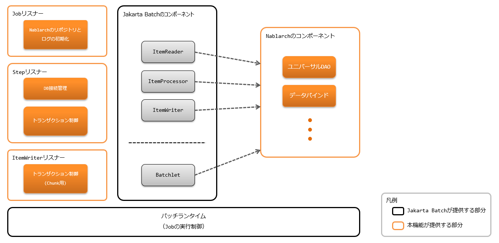
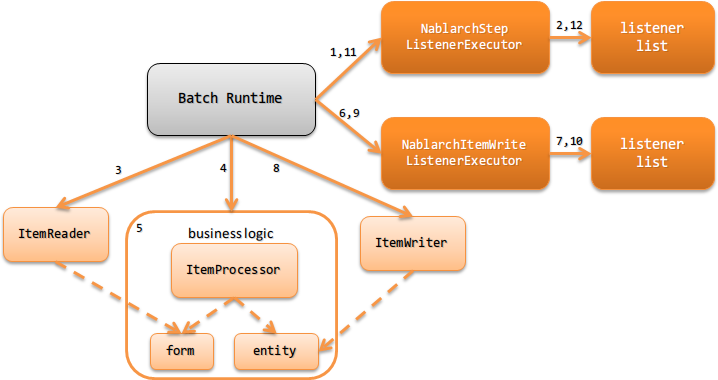

# アーキテクチャ概要

## 概要

## バッチアプリケーションの構成

|jsr352| に準拠したバッチアプリケーションを実行するためには、 |jsr352| の実装が必要となる。
実装は、主に以下の2つから選択することになるが、ドキュメントが豊富であること及びMaven Centralからライブラリを取得出来る手軽さから [jBeret(外部サイト、英語)](https://jberet.gitbooks.io/jberet-user-guide/content/) の使用を推奨する。

* [jBeret(外部サイト、英語)](https://jberet.gitbooks.io/jberet-user-guide/content/)
* [互換実装のjBatch(外部サイト、英語)](https://github.com/WASdev/standards.jsr352.jbatch)

以下に構成を示す。


> **Important:** JobContext及びStepContextの一時領域( `TransientUserData` )を使用することは グローバル領域に値を保持することと同義となるため、アプリケーション側で使用してはならない。 なお、StepContextの一時領域については、 `StepScoped` でステップ内で値を共有をするために使用しているため、 アプリケーション側ではStepContextの一時領域は使用できない。
> **Tip:** Jakarta Batchに準拠したバッチアプリケーション\のアーキテクチャは、\ |jsr352|\ で定められた構成に準拠しているため、\ Nablarchアプリケーションフレームワークの\ アーキテクチャ\ に記載されているような、\ ハンドラを用いたアーキテクチャとは異なっている。 Jakarta Batchに準拠したバッチアプリケーション\ では、ハンドラで行われるような横断的な処理（ログ出力やトランザクション制御等）は、 |jsr352|\ で規定されているリスナーを用いることで実現されている。 ただし、リスナーは既定のタイミングで起動されるものであり、入力、出力に対して直接処理を行うものではない点がハンドラとは異なっている。\ このためリスナーでは、ハンドラで実現されているような入力値のフィルタ処理や変換処理などを行うことはできない。

<details>
<summary>keywords</summary>

jBeret, jBatch, Jakarta Batch, JSR352, TransientUserData, StepScoped, nablarch.fw.batch.ee.cdi.StepScoped, バッチ実装選択, リスナーアーキテクチャ, JobContext, StepContext

</details>

## バッチの種類

|jsr352| では、バッチの実装方法として `Batchlet` と `Chunk` の2種類の方法がある。
どちらのタイプを使用するのが適切かは、以下を参照しバッチごとに判断すること。


Batchlet
タスク指向の場合にBatchletタイプのバッチを実装する。

例えば、外部システムからのファイル取得や、SQL1つで処理が完結するような処理が該当する。


Chunk
ファイルやデータベースなどの入力データソースからレコードを読み込み業務処理を実行する場合にChunkタイプのバッチを実装する。

<details>
<summary>keywords</summary>

Batchlet, Chunk, バッチ種別選択, タスク指向, ItemReader, ItemProcessor, ItemWriter, ファイル取得, レコード処理

</details>

## バッチアプリケーションの処理の流れ

<details>
<summary>keywords</summary>

NablarchStepListenerExecutor, nablarch.fw.batch.ee.listener.step.NablarchStepListenerExecutor, Batchlet処理フロー, Batchlet, NablarchStepListenerExecutor, NablarchItemWriteListenerExecutor, nablarch.fw.batch.ee.listener.step.NablarchStepListenerExecutor, nablarch.fw.batch.ee.listener.chunk.NablarchItemWriteListenerExecutor, Chunk処理フロー, ItemReader, ItemProcessor, ItemWriter, Form, Entity, 例外ハンドリング, batch status, exit status, Jakarta Batch例外処理, log_adaptor, jsr352-failure_monitoring, ログ設定, ロギングフレームワーク

</details>

## Batchlet

Batchletタイプのバッチアプリケーションの処理の流れを以下に示す。


1. Jakarta BatchのBatch RuntimeからBatchletステップ実行前のコールバック処理として `NablarchStepListenerExecutor` が呼び出される。
2. Batchletステップ実行前のリスナーを順次実行する。
3. Jakarta BatchのBatch Runtimeから `Batchlet` が実行される。
4. `Batchlet` では業務ロジックを実行する。(Batchletの責務配置は、 Batchletの責務配置 を参照)
5. Jakarta BatchのBatch RuntimeからBatchletステップ実行後のコールバック処理として `NablarchStepListenerExecutor` が呼び出される。
6. Batchletステップ実行後のリスナーを順次実行する。(No2とは逆順に実行する)

## Chunk

Chunkタイプのバッチアプリケーションの処理の流れを以下に示す。


1. Jakarta BatchのBatch RuntimeからChunkステップ実行前のコールバック処理として `NablarchStepListenerExecutor` が呼び出される。

2. Chunkステップ実行前のリスナーを順次実行する。

3. Jakarta BatchのBatch RuntimeからChunkステップの `ItemReader` が実行される。 |br|
`ItemReader` では、入力データソースからデータを読み込む。

4. Jakarta BatchのBatch RuntimeからChunkステップの `ItemProcessor` が実行される。 |br|

5. `ItemProcessor` は、 `Form` や `Entity` を使って業務ロジックを実行する。 |br|
※データーベースに対するデータの書き込みや更新はここでは実施しない。

6. Jakarta BatchのBatch Runtimeから `ItemWriter` 実行前のコールバック処理として `NablarchItemWriteListenerExecutor` が呼び出される。

7. `ItemWriter` 実行前のリスナーを順次実行する。

8. Jakarta BatchのBatch RuntimeからChunkステップの `ItemWriter` が実行される。 |br|
`ItemWriter` では、テーブルへの登録(更新、削除)やファイル出力処理などの結果反映処理を行う。

9. Jakarta BatchのBatch Runtimeから `ItemWriter` 実行後のコールバック処理として `NablarchItemWriteListenerExecutor` が呼び出される。

10. `ItemWriter` 実行後のリスナーを順次実行する。(No7とは逆順で実行する)

11. Jakarta BatchのBatch RuntimeからChunkステップ実行後のコールバック処理として `NablarchStepListenerExecutor` が呼び出される。

12. Chunkステップ実行後のリスナーを順次実行する。(No2とは逆順に実行する)

※No3からNo10は、入力データソースのデータが終わるまで繰り返し実行される。

Chunkステップの責務配置については、 Chunkの責務配置 を参照

## 例外(エラー含む)発生時の処理の流れ

バッチ実行中に例外が発生した場合、Nablarchでは例外の捕捉は行わずJakarta Batchの実装側で例外ハンドリングを行う方針としている。
これは、Jakarta Batchに準拠したバッチアプリケーション特有の振る舞いであり、他の基盤( Webアプリケーション や Nablarchバッチアプリケーション など)とは異なる振る舞いである点に注意すること。

> **Tip:** Jakarta Batchに準拠したバッチアプリケーションがこのようなアーキテクチャを採用した理由は以下の通り。 Jakarta Batchに準拠したバッチアプリケーションは、Jakarta Batch上でNablarchを使用するためのコンポーネントのみの提供であり、実行制御自体はJakarta Batch実装によって行われる。 このため、Nablarchにより全ての例外を捕捉し処理を行うことは不可能であり、例外制御がNablarchとJakarta Batchで分散することで設計などが複雑化するのを防ぐためこのような方針としている。
#### 例外発生時のバッチの状態
上述したように、例外発生時の制御は全てJakarta Batchの実装が行う。
このため、例外発生時のバッチの状態(batch statusやexit status)については、 |jsr352| の仕様を参照すること。
また、例外の種類に応じたリトライや継続有無などもジョブ定義に従った動作となる。ジョブ定義の詳細は、 |jsr352| の仕様を参照すること。

例外発生後のJavaプロセスから戻されるリターンコードについては、 障害監視 を参照。

#### ログ出力
Jakarta Batchの実装で補足された例外の情報は、Jakarta Batchの実装によりログ出力される。
ログの設定(フォーマットや出力先などの設定)は、Jakarta Batch実装が使用しているロギングフレームワークのマニュアルなどを参照して行うこと。

なお、アプリケーションで明示的に出力するエラーログ等をJakarta Batchと同じログファイルに出力したい場合には、
logアダプタ を使用してJakarta Batchの実装とロギングフレームワークを統一することで対応できる。

## バッチアプリケーションで使用するリスナー

|jsr352| に準拠したバッチアプリケーションでは、 |jsr352| の仕様で定められているリスナーを使用してNablarchのハンドラ相当のことを実現する。

標準では、以下のリスナーを提供してる。

ジョブレベルリスナー
ジョブの起動及び終了直前にコールバックされるリスナー

* `ジョブの起動、終了ログを出力するリスナー`
* `同一ジョブの多重起動防止リスナー`

ステップレベルリスナー
ステップの実行前及び実行後にコールバックされるリスナー

* `ステップの開始、終了ログを出力するリスナー`
* `データベースへ接続するリスナー`
* `トランザクションを制御するリスナー`

ItemWriterレベルのリスナー
`ItemWriter` の実行前及び実行後にコールバックされるリスナー

* `Chunkの進捗ログを出力するリスナー(非推奨)`
(進捗ログで出力される内容 を使用して進捗ログを出力すること)

* `トランザクションを制御するリスナー`

> **Tip:** |jsr352| で規定されているリスナーは、複数設定した場合の実行順を保証しないことが仕様上明記されている。 このため、Nablarchでは以下の点に対応することで、リスナーを指定した順で実行出来るよう対応している。 * 各レベルのリスナーには、リスナーの実行順を保証するリスナーのみを設定する * リスナーの実行順を保証するリスナーは、 システムリポジトリ からリスナーリストを取得し、定義順にリスナーを実行する。 実際のリスナーの定義方法は、 リスナーの指定方法 を参照。

<details>
<summary>keywords</summary>

JobProgressLogListener, DuplicateJobRunningCheckListener, StepProgressLogListener, DbConnectionManagementListener, StepTransactionManagementListener, ChunkProgressLogListener, ItemWriteTransactionManagementListener, ジョブレベルリスナー, ステップレベルリスナー, ItemWriterレベルリスナー, リスナー実行順保証, 多重起動防止

</details>

## 最小のリスナー構成

最小のリスナー構成を以下に示す。この構成でプロジェクト要件を満たすことができない場合は、リスナーの追加などにより対応すること。

| No. | リスナー | ジョブ起動直前の処理 | ジョブ終了直前の処理 |
|---|---|---|---|
| 1 | `ジョブの起動、終了ログを出力するリスナー` | 起動するジョブ名をログに出力する。 | ジョブ名称とバッチステータスをログに出力する。 |
| No. | リスナー | ステップ実行前の処理 | ステップ実行後の処理 |
|---|---|---|---|
| 1 | `ステップの開始、終了ログを出力するリスナー` | 実行するステップ名称をログに出力する。 | ステップ名称とステップステータスをログに出力する。 |
| 2 | `データベースへ接続するリスナー` | DB接続を取得する。 | DB接続を解放する。 |
| 3 | `トランザクションを制御するリスナー` | トランザクションを開始する。 | トランザクションを終了(commit or rollback)する。 |
| No. | リスナー | `ItemWriter` 実行前の処理 | `ItemWriter` 実行後の処理 |
|---|---|---|---|
| 1 | `トランザクションを制御するリスナー` [#chunk_tran]_ |  | トランザクションを終了(commit or rollback)する。 |
`ItemWriter` レベルのリスナーで行うトランザクション制御は、ステップレベルで開始されたトランザクションに対して行う。

<details>
<summary>keywords</summary>

最小リスナー構成, JobProgressLogListener, StepProgressLogListener, DbConnectionManagementListener, StepTransactionManagementListener, ItemWriteTransactionManagementListener, DB接続管理, トランザクション制御

</details>

## リスナーの指定方法

各レベルに対してリスナーリストを定義する方法について説明する。

リスナーリストを定義するには、以下の手順が必要になる。

1.  |jsr352| で規定されているジョブ定義を表すxmlファイルに、リスナーの実行順を保証するリスナーを設定する。
2. コンポーネント設定ファイルにリスナーリストの設定をする。

ジョブ定義ファイルへの設定
```xml
<job id="chunk-integration-test" xmlns="https://jakarta.ee/xml/ns/jakartaee" version="2.0">
  <listeners>
    <!-- ジョブレベルのリスナー -->
    <listener ref="nablarchJobListenerExecutor" />
  </listeners>

  <step id="myStep">
    <listeners>
      <!-- ステップレベルのリスナー -->
      <listener ref="nablarchStepListenerExecutor" />
      <!-- ItemWriterレベルのリスナー -->
      <listener ref="nablarchItemWriteListenerExecutor" />
    </listeners>

    <chunk item-count="10">
      <reader ref="stringReader">
        <properties>
          <property name="max" value="25" />
        </properties>
      </reader>
      <processor ref="createEntityProcessor" />
      <writer ref="batchOutputWriter" />
    </chunk>
  </step>
</job>
```
コンポーネント設定ファイルへの設定
```xml
<!-- デフォルトのジョブレベルのリスナーリスト -->
<list name="jobListeners">
  <component class="nablarch.fw.batch.ee.listener.job.JobProgressLogListener" />
  <component class="nablarch.fw.batch.ee.listener.job.DuplicateJobRunningCheckListener">
    <property name="duplicateProcessChecker" ref="duplicateProcessChecker" />
  </component>
</list>

<!-- デフォルトのステップレベルのリスナーリスト -->
<list name="stepListeners">
  <component class="nablarch.fw.batch.ee.listener.step.StepProgressLogListener" />
  <component class="nablarch.fw.batch.ee.listener.step.DbConnectionManagementListener">
    <property name="dbConnectionManagementHandler">
      <component class="nablarch.common.handler.DbConnectionManagementHandler" />
    </property>
  </component>
  <component class="nablarch.fw.batch.ee.listener.step.StepTransactionManagementListener" />
</list>

<!-- デフォルトのItemWriterレベルのリスナーリスト -->
<list name="itemWriteListeners">
  <component 
      class="nablarch.fw.batch.ee.listener.chunk.ChunkProgressLogListener" />
  <component 
      class="nablarch.fw.batch.ee.listener.chunk.ItemWriteTransactionManagementListener" />
</list>

<!-- デフォルトのジョブレベルのリスナーリストの上書き -->
<list name="sample-job.jobListeners">
  <component class="nablarch.fw.batch.ee.listener.job.JobProgressLogListener" />
</list>

<!-- デフォルトのステップレベルのリスナーリストの上書き -->
<!-- 本設定は「sample-step」ステップの実行時に適用される -->
<list name="sample-job.sample-step.stepListeners">
  <component class="nablarch.fw.batch.ee.listener.step.StepProgressLogListener" />
</list>
```
ポイント
* デフォルトのジョブレベルのリスナーリストのコンポーネント名は、 `jobListeners` とする。
* デフォルトのステップレベルのリスナーリストのコンポーネント名は、 `stepListeners` とする。
* デフォルトのItemWriterレベルのリスナーリストのコンポーネント名は、 `itemWriteListeners` とする。
* デフォルトのリスナーリスト定義を上書きする場合は、コンポーネント名を「ジョブ名称 + "." + 上書き対象のコンポーネント名」とする。 |br|
例えば、「sample-job」でジョブレベルの定義を上書きする場合は、コンポーネント名を `sample-job.jobListeners` としてリスナーリストを定義する。
* 特定のステップでデフォルトのリスナーリスト定義を上書きする場合は、コンポーネント名を「ジョブ名称 + "." + ステップ名称 + "." + 上書き対象のコンポーネント名」とする。 |br|
例えば、「sample-job」で定義されている「sample-step」で、デフォルトのステップレベルのリスナーリスト定義を上書きする場合は、コンポーネント名を `sample-job.sample-step.stepListeners` としてリスナーリストを定義する。
* 特定のステップで上書き出来るリスナーリストは、ステップレベルとItemWriterレベルのリスナーリストのみである。

.. |jsr352| raw:: html

<a href="https://jakarta.ee/specifications/batch/" target="_blank">Jakarta Batch(外部サイト、英語)</a>

.. |br| raw:: html

<br />

<details>
<summary>keywords</summary>

jobListeners, stepListeners, itemWriteListeners, リスナー定義, ジョブ定義XML, コンポーネント設定, リスナーリスト上書き, nablarchJobListenerExecutor, nablarchStepListenerExecutor, nablarchItemWriteListenerExecutor, DbConnectionManagementHandler, nablarch.common.handler.DbConnectionManagementHandler

</details>
