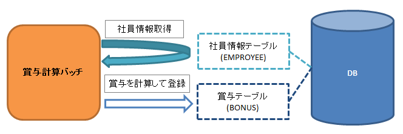

# データを導出するバッチの作成(Chunkステップ)

Exampleアプリケーションを元に、既存データから計算を行い新たにデータを導出する [Chunkステップ](../../processing-pattern/jakarta-batch/jakarta-batch-architecture.md#jsr352-batch-type-chunk) 方式のバッチを解説する。

作成する機能の概要

動作確認手順
1. 登録対象テーブル(賞与テーブル)のデータを削除

  H2のコンソールから下記SQLを実行し、賞与テーブルのデータを削除する。

  ```sql
  TRUNCATE TABLE BONUS;
  ```
2. 賞与計算バッチを実行

  コマンドプロンプトから賞与計算バッチを実行する。

```bash
$cd {nablarch-example-batch-eeシステムリポジトリ}
$mvn exec:java -Dexec.mainClass=nablarch.fw.batch.ee.Main ^
    -Dexec.args=bonus-calculate
```

1. バッチ実行後の状態の確認

H2のコンソールから下記SQLを実行し、賞与情報が登録されたことを確認する。

```sql
SELECT * FROM BONUS;
```

## データを導出する

既存データから新たにデータを導出するバッチの実装方法を以下の順に説明する。

1. [入力データソースからデータを読み込む](../../processing-pattern/jakarta-batch/jakarta-batch-getting-started-chunk.md#getting-started-chunk-read)
2. [業務ロジックを実行する](../../processing-pattern/jakarta-batch/jakarta-batch-getting-started-chunk.md#getting-started-chunk-business-logic)
3. [永続化処理を行う](../../processing-pattern/jakarta-batch/jakarta-batch-getting-started-chunk.md#getting-started-chunk-persistence)
4. [JOB設定ファイルを作成する](../../processing-pattern/jakarta-batch/jakarta-batch-getting-started-chunk.md#getting-started-chunk-job)

処理フローについては、 [Chunkステップのバッチの処理フロー](../../processing-pattern/jakarta-batch/jakarta-batch-architecture.md#jsr352-batch-flow-chunk) を参照。
責務配置については [Chunkステップの責務配置](../../processing-pattern/jakarta-batch/jakarta-batch-application-design.md#jsr352-chunk-design) を参照。

バッチ処理は、 <a href="https://jakarta.ee/specifications/batch/" target="_blank">Jakarta Batch(外部サイト、英語)</a> で規定されたインターフェースの実装に加えて、トランザクション制御などの共通的な処理を提供するリスナーによって構成する。
リスナーの詳細は [バッチアプリケーションで使用するリスナー](../../processing-pattern/jakarta-batch/jakarta-batch-architecture.md#jsr352-listener) 及び [リスナーの指定方法](../../processing-pattern/jakarta-batch/jakarta-batch-architecture.md#jsr352-listener) を参照。

### 入力データソースからデータを読み込む

計算に必要なデータを取得する処理を実装する。

1. [フォームの作成](../../processing-pattern/jakarta-batch/jakarta-batch-getting-started-chunk.md#getting-started-chunk-form)
2. [ItemReaderの作成](../../processing-pattern/jakarta-batch/jakarta-batch-getting-started-chunk.md#getting-started-chunk-reader)

フォームの作成
Chunkステップでは、 ItemReader と
ItemProcessor とのデータ連携にフォームを使用する。

EmployeeForm.java
```java
public class EmployeeForm {

    //一部のみ抜粋

    /** 社員ID */
    private Long employeeId;

    /**
     * 社員IDを返します。
     *
     * @return 社員ID
     */
    public Long getEmployeeId() {
        return employeeId;
    }

    /**
     * 社員IDを設定します。
     *
     * @param employeeId 社員ID
     */
    public void setEmployeeId(Long employeeId) {
        this.employeeId = employeeId;
    }
}
```

ItemReaderの作成
AbstractItemReader を継承し、データの読み込みを行う。

| インタフェース名 | 責務 |
|---|---|
| ItemReader | データの読み込みを行う。  空実装を提供する AbstractItemReader を継承する。  * ItemReader#open * ItemReader#readItem * ItemReader#close |

EmployeeSearchReader.java
```java
@Dependent
@Named
public class EmployeeSearchReader extends AbstractItemReader {

    /** 社員情報のリスト */
    private DeferredEntityList<EmployeeForm> list;

    /** 社員情報を保持するイテレータ */
    private Iterator<EmployeeForm> iterator;

    @Override
    public void open(Serializable checkpoint) throws Exception {
        list = (DeferredEntityList<EmployeeForm>) UniversalDao.defer()
                .findAllBySqlFile(EmployeeForm.class, "SELECT_EMPLOYEE");
        iterator = list.iterator();
    }

    @Override
    public Object readItem() {
        if (iterator.hasNext()) {
            return iterator.next();
        }
        return null;
    }

    @Override
    public void close() throws Exception {
        list.close();
    }
}
```
EmployeeForm.sql
```java
SELECT_EMPLOYEE=
SELECT
    EMPLOYEE.EMPLOYEE_ID,
    EMPLOYEE.FULL_NAME,
    EMPLOYEE.BASIC_SALARY,
    EMPLOYEE.GRADE_CODE,
    GRADE.BONUS_MAGNIFICATION,
    GRADE.FIXED_BONUS
FROM
    EMPLOYEE
INNER JOIN GRADE ON EMPLOYEE.GRADE_CODE = GRADE.GRADE_CODE
```
この実装のポイント
* Named と Dependent をクラスに付与する。
  詳細は、 [BatchletのNamedとDependentの説明](../../processing-pattern/jakarta-batch/jakarta-batch-getting-started-batchlet.md#getting-started-batchlet-cdi) を参照。
* open メソッドで処理対象のデータを読み込む。
* SQLファイルの配置場所や作成方法などは、 [任意のSQL(SQLファイル)で検索する](../../component/libraries/libraries-universal-dao.md#universal-dao-sql-file) を参照。
* 大量のデータを読み込む場合は、メモリの逼迫を防ぐために UniversalDao#defer を使用して
  検索結果を [遅延ロード](../../component/libraries/libraries-universal-dao.md#universal-dao-lazy-load) する。
* readItem メソッドで読み込んだデータから一行分のデータを返却する。
  このメソッドで返却したオブジェクトが、後続する ItemProcessor の processItem メソッドの引数として与えられる。

### 業務ロジックを実行する

賞与の計算等の業務ロジックを実装する。

ItemProcessorの作成
ItemProcessor を実装し、
業務ロジックを行う(永続化処理は ItemWriter の責務であるため実施しない)。

| インタフェース名 | 責務 |
|---|---|
| ItemProcessor | 一行分のデータに対する業務処理を行う。  * ItemProcessor#processItem |

BonusCalculateProcessor.java
```java
@Dependent
@Named
public class BonusCalculateProcessor implements ItemProcessor {

    @Override
    public Object processItem(Object item) {

        EmployeeForm form = (EmployeeForm) item;
        Bonus bonus = new Bonus();
        bonus.setEmployeeId(form.getEmployeeId());
        bonus.setPayments(calculateBonus(form));

        return bonus;
    }

    /**
     * 社員情報をもとに賞与計算を行う。
     *
     * @param form 社員情報Form
     * @return 賞与
     */
    private static Long calculateBonus(EmployeeForm form) {
        if (form.getFixedBonus() == null) {
            return form.getBasicSalary() * form.getBonusMagnification() / 100;
        } else {
            return form.getFixedBonus();
        }
    }
}
```
この実装のポイント
* processItem メソッドで一定数( [JOB設定ファイルを作成する](../../processing-pattern/jakarta-batch/jakarta-batch-getting-started-chunk.md#getting-started-chunk-job) にて設定方法を解説)のエンティティを返却した時点で、
  後続する ItemWriter の writeItems メソッドが実行される。

### 永続化処理を行う

DB更新等の、永続化処理を実装する。

ItemWriterの作成
ItemWriter を実装し、データの永続化を行う。

| インタフェース名 | 責務 |
|---|---|
| ItemWriter | データを永続化する。  * ItemWriter#writeItems |

BonusWriter.java
```java
@Dependent
@Named
public class BonusWriter extends AbstractItemWriter {

    @Override
    public void writeItems(List<Object> items) {
        UniversalDao.batchInsert(items);
    }
}
```
この実装のポイント
* UniversalDao#batchInsert を使用してエンティティのリストを一括登録する。
* writeItems メソッド実行後にトランザクションがコミットされ、新たなトランザクションが開始される。
* writeItems メソッド実行後、バッチ処理が readItem メソッド実行から繰り返される。

### JOB設定ファイルを作成する

JOBの実行設定を記載したファイルを作成する。

bonus-calculate.xml
```xml
<job id="bonus-calculate" xmlns="https://jakarta.ee/xml/ns/jakartaee" version="2.0">
  <listeners>
    <listener ref="nablarchJobListenerExecutor" />
  </listeners>

  <step id="step1">
    <listeners>
      <listener ref="nablarchStepListenerExecutor" />
      <listener ref="nablarchItemWriteListenerExecutor" />
    </listeners>

    <chunk item-count="1000">
      <reader ref="employeeSearchReader" />
      <processor ref="bonusCalculateProcessor" />
      <writer ref="bonusWriter" />
    </chunk>
  </step>
</job>
```
この実装のポイント
* ジョブ定義ファイルは /src/main/resources/META-INF/batch-jobs/ 配下に配置する。
* job 要素 の id 属性で、ジョブ名称を指定する。
* chunk 要素の item-count 属性で writeItems 一回当たりで処理する件数を設定する。
* 設定ファイルの詳細な記述方法は <a href="https://jakarta.ee/specifications/batch/" target="_blank">Jakarta Batch(外部サイト、英語)</a> を参照。
