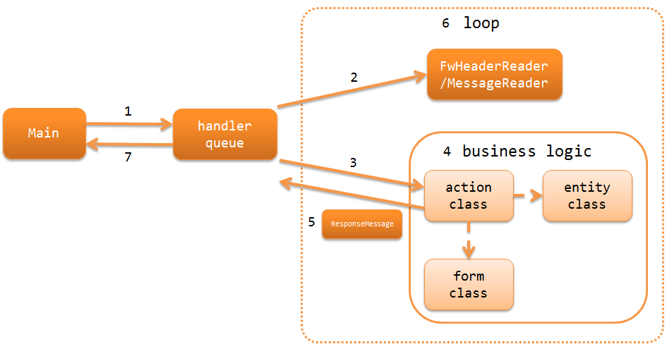

# アーキテクチャ概要

## 概要

MOMメッセージングでは、外部から送信される要求電文に対し、
電文中のリクエストIDに対応するアクションを実行する機能を提供する。
なお、ここでは、MOMメッセージングに使うメッセージキューのことをMQと称す。

MOMメッセージングは、以下の2つに分かれる。

同期応答メッセージング
業務処理の実行結果をもとに、要求電文に対する応答電文を作成してMQに送信する。
オーソリ業務のような即時応答を必要とする場合に使用する。

応答不要メッセージング
応答電文の送信は行わず、MQから受信した要求電文の内容をDB上のテーブルに格納する。
業務処理は、このテーブルを入力とする後続バッチによって実行する。
バッチについては、 db_messaging を参照すること。

> **Tip:** 応答不要メッセージングは、電文の内容をテーブルに格納するという、極めて単純な処理となるため、 フレームワークが提供するアクションクラスをそのまま使用できる。 その場合、必要な情報を設定するだけでよく、コーディングは不要である。
> **Important:** MOMメッセージングで扱える形式は、 汎用データフォーマット の固定長データのみである。
MOMメッセージングでは、メッセージの送受信にライブラリのMOMメッセージング機能を使用している。
詳細は MOMメッセージング を参照。

## MOMメッセージングの構成

MOMメッセージングの構成は、 Nablarchバッチアプリケーション とまったく同じである。
Nablarchバッチアプリケーションの構成 を参照。

keywords

MOMメッセージング, 同期応答メッセージング, 応答不要メッセージング, 固定長データ, メッセージキュー, MQ, db_messaging, mom_system_messaging, data_format

## 要求電文によるアクションとリクエストIDの指定

MOMメッセージングでは、要求電文中の特定のフィールドをリクエストIDとして使用する。
この場合、ウェブアプリケーションなどのリクエストパスとは異なり、リクエストIDには階層構造が含まれないので、
リクエストディスパッチハンドラ を使用し、アクションクラスのパッケージやクラス名のサフィックスを設定で指定し、
リクエストIDに対応するクラスにディスパッチを行う。

リクエストIDは要求電文中のフレームワーク制御ヘッダ部に含める必要がある。
詳細は、  フレームワーク制御ヘッダ を参照。

keywords

リクエストID, フレームワーク制御ヘッダ, request_path_java_package_mapping, アクションディスパッチ, mom_system_messaging-fw_header

## MOMメッセージングの処理の流れ

MOMメッセージングが要求電文を受信し、応答電文を返却するまでの処理の流れを以下に示す。
応答不要メッセージングでは、応答電文を返却しない点のみ異なる。

1. 共通起動ランチャ(Main) がハンドラキュー(handler queue)を実行する。
2. データリーダ(
`FwHeaderReader`
/
`MessageReader`
)がメッセージキューを監視し、受信した電文を読み込み、要求電文を1件ずつ提供する。
3. ハンドラキューに設定された
Nablarchバッチアプリケーションの構成 が、
要求電文の特定フィールドに含まれるリクエストIDを元に処理すべきアクションクラス(action class)を特定し、
ハンドラキューの末尾に追加する。
4. アクションクラス(action class)は、フォームクラス(form class)やエンティティクラス(entity class)を使用して、
要求電文1件ごとの業務ロジック(business logic) を実行する。
5. アクションクラス(action class)は、応答電文を表す
`ResponseMessage` を返却する。
6. プロセス停止要求があるまで2～5を繰り返す。
7. ハンドラキューに設定された
`ステータスコード→プロセス終了コード変換ハンドラ(StatusCodeConvertHandler)` が、
処理結果のステータスコードをプロセス終了コードに変換し、
MOMメッセージングの処理結果としてプロセス終了コードが返される。

keywords

FwHeaderReader, MessageReader, ResponseMessage, StatusCodeConvertHandler, 処理フロー, ハンドラキュー, MOMメッセージング処理の流れ

## MOMメッセージングで使用するハンドラ

Nablarchでは、MOMメッセージングを構築するために必要なハンドラを標準で幾つか提供している。
プロジェクトの要件に従い、ハンドラキューを構築すること。
(要件によっては、プロジェクトカスタムなハンドラを作成することになる)

各ハンドラの詳細は、リンク先を参照すること。

リクエストやレスポンスの変換を行うハンドラ
* ステータスコード→プロセス終了コード変換ハンドラ
* データリードハンドラ

プロセスの実行制御を行うハンドラ
* プロセス多重起動防止ハンドラ
* マルチスレッド実行制御ハンドラ
* リトライハンドラ
* リクエストスレッド内ループ制御ハンドラ
* プロセス停止制御ハンドラ
* リクエストディスパッチハンドラ

メッセージングに関連するハンドラ
* メッセージングコンテキスト管理ハンドラ
* 電文応答制御ハンドラ
* 再送電文制御ハンドラ

データベースに関連するハンドラ
* データベース接続管理ハンドラ
* トランザクション制御ハンドラ

エラー処理に関するハンドラ
* グローバルエラーハンドラ

その他
* スレッドコンテキスト変数管理ハンドラ
* スレッドコンテキスト変数削除ハンドラ
* ServiceAvailabilityCheckHandler

keywords

ハンドラキュー, 最小ハンドラ構成, 同期応答メッセージング, 応答不要メッセージング, 2相コミット, message_reply_handler, transaction_management_handler, ProcessStop, webspheremq_adaptor

## 同期応答メッセージングの最小ハンドラ構成

同期応答メッセージングを構築する際の、必要最小限のハンドラキューを以下に示す。
これをベースに、プロジェクト要件に従ってNablarchの標準ハンドラやプロジェクトで作成したカスタムハンドラを追加する。

| No. | ハンドラ | スレッド | 往路処理 | 復路処理 | 例外処理 |
|---|---|---|---|---|---|
| 1 | ステータスコード→プロセス終了コード変換ハンドラ | メイン |  | ステータスコードをプロセス終了コードに変換する。 |  |
| 2 | グローバルエラーハンドラ | メイン |  |  | 実行時例外、またはエラーの場合、ログ出力を行う。 |
| 3 | マルチスレッド実行制御ハンドラ | メイン | サブスレッドを作成し、後続ハンドラの処理を並行実行する。 | 全スレッドの正常終了まで待機する。 | 処理中のスレッドが完了するまで待機し起因例外を再送出する。 |
| 4 | リトライハンドラ | サブ |  |  | リトライ可能な実行時例外を捕捉し、かつリトライ上限に達していなければ後続のハンドラを再実行する。 |
| 5 | メッセージングコンテキスト管理ハンドラ | サブ | MQ接続を取得する。 | MQ接続を解放する。 |  |
| 6 | データベース接続管理ハンドラ | サブ | DB接続を取得する。 | DB接続を解放する。 |  |
| 7 | リクエストスレッド内ループ制御ハンドラ | サブ | 後続のハンドラを繰り返し実行する。 | ハンドラキューの内容を復旧しループを継続する。 | プロセス停止要求か致命的なエラーが発生した場合のみループを停止する。 |
| 8 | スレッドコンテキスト変数削除ハンドラ | サブ |  | スレッドコンテキスト変数管理ハンドラ でスレッドローカル上に設定した値を全て削除する。 |  |
| 9 | スレッドコンテキスト変数管理ハンドラ | サブ | コマンドライン引数からリクエストID、ユーザID等のスレッドコンテキスト変数を初期化する。 |  |  |
| 10 | プロセス停止制御ハンドラ | サブ | リクエストテーブル上の処理停止フラグがオンであった場合は、後続ハンドラの処理は行なわずにプロセス停止例外( `ProcessStop` )を送出する。 |  |  |
| 11 | 電文応答制御ハンドラ | サブ |  | 後続ハンドラから返される応答電文の内容をもとに電文を作成してMQに送信する。 | エラーの内容をもとに電文を作成してMQに送信する。 |
| 12 | データリードハンドラ | サブ | データリーダを使用して要求電文を1件読み込み、後続ハンドラの引数として渡す。 また 実行時ID を採番する。 |  | 読み込んだ電文をログ出力した後、元例外を再送出する。 |
| 13 | リクエストディスパッチハンドラ | サブ | 要求電文に含まれるリクエストIDをもとに呼び出すアクションを決定する。 |  |  |
| 14 | トランザクション制御ハンドラ | サブ | トランザクションを開始する。 | トランザクションをコミットする。 | トランザクションをロールバックする。 |

## 応答不要メッセージングの最小ハンドラ構成

応答不要メッセージングを構築する際の、必要最小限のハンドラキューを以下に示す。
これをベースに、プロジェクト要件に従ってNablarchの標準ハンドラやプロジェクトで作成したカスタムハンドラを追加する。

応答不要メッセージングの最小ハンドラ構成は、以下のハンドラを除けば同期応答メッセージングと同じである。

* 電文応答制御ハンドラ
* 再送電文制御ハンドラ

> **Important:** 応答不要メッセージングでは、電文の保存に失敗した場合にエラー応答を送信できないので、 取得した電文を一旦キューに戻した後で既定回数に達するまでリトライする。 このため、DBに対する登録処理とキューに対する操作を1つのトランザクションとして扱う必要がある(2相コミット制御)。 具体的には、 トランザクション制御ハンドラ の設定を変更し、2相コミットに対応した実装に差し替える必要がある。 Nablarchでは、IBM MQ を使用した2相コミット用のアダプタを予め提供している。 詳細は、 IBM MQアダプタ を参照。
| No. | ハンドラ | スレッド | 往路処理 | 復路処理 | 例外処理 |
|---|---|---|---|---|---|
| 1 | ステータスコード→プロセス終了コード変換ハンドラ | メイン |  | ステータスコードをプロセス終了コードに変換する。 |  |
| 2 | グローバルエラーハンドラ | メイン |  |  | 実行時例外、またはエラーの場合、ログ出力を行う。 |
| 3 | マルチスレッド実行制御ハンドラ | メイン | サブスレッドを作成し、後続ハンドラの処理を並行実行する。 | 全スレッドの正常終了まで待機する。 | 処理中のスレッドが完了するまで待機し起因例外を再送出する。 |
| 4 | リトライハンドラ | サブ |  |  | リトライ可能な実行時例外を捕捉し、かつリトライ上限に達していなければ後続のハンドラを再実行する。 |
| 5 | メッセージングコンテキスト管理ハンドラ | サブ | MQ接続を取得する。 | MQ接続を解放する。 |  |
| 6 | データベース接続管理ハンドラ | サブ | DB接続を取得する。 | DB接続を解放する。 |  |
| 7 | リクエストスレッド内ループ制御ハンドラ | サブ | 後続のハンドラを繰り返し実行する。 | ハンドラキューの内容を復旧しループを継続する。 | プロセス停止要求か致命的なエラーが発生した場合のみループを停止する。 |
| 8 | スレッドコンテキスト変数削除ハンドラ | サブ |  | スレッドコンテキスト変数管理ハンドラ でスレッドローカル上に設定した値を全て削除する。 |  |
| 9 | スレッドコンテキスト変数管理ハンドラ | サブ | コマンドライン引数からリクエストID、ユーザID等のスレッドコンテキスト変数を初期化する。 |  |  |
| 10 | プロセス停止制御ハンドラ | サブ | リクエストテーブル上の処理停止フラグがオンであった場合は、後続ハンドラの処理は行なわずにプロセス停止例外( `ProcessStop` )を送出する。 |  |  |
| 11 | トランザクション制御ハンドラ | サブ | トランザクションを開始する。 | トランザクションをコミットする。 | トランザクションをロールバックする。 |
| 12 | データリードハンドラ | サブ | データリーダを使用して要求電文を1件読み込み、後続ハンドラの引数として渡す。 また 実行時ID を採番する。 |  | 読み込んだ電文をログ出力した後、元例外を再送出する。 |
| 13 | リクエストディスパッチハンドラ | サブ | 要求電文に含まれるリクエストIDをもとに呼び出すアクションを決定する。 |  |  |

## MOMメッセージングで使用するデータリーダ

Nablarchでは、MOMメッセージングを構築するために必要なデータリーダを標準で幾つか提供している。
各データリーダの詳細は、リンク先を参照すること。

* `FwHeaderReader (電文からフレームワーク制御ヘッダの読み込み)`
* `MessageReader (MQから電文の読み込み)`

> **Tip:** 上記のデータリーダでプロジェクトの要件を満たせない場合は、 extdoc:`DataReader <nablarch.fw.DataReader>` インタフェースを実装したクラスを プロジェクトで作成して対応する。

keywords

FwHeaderReader, MessageReader, DataReader, データリーダ, 電文読み込み

## MOMメッセージングで使用するアクション

Nablarchでは、MOMメッセージングを構築するために必要なアクションクラスを標準で幾つか提供している。
各アクションクラスの詳細は、リンク先を参照すること。

* `MessagingAction (同期応答メッセージング用アクションのテンプレートクラス)`
* `AsyncMessageReceiveAction (応答不要メッセージングのアクションクラス)`

keywords

MessagingAction, AsyncMessageReceiveAction, アクションクラス, 同期応答メッセージング, 応答不要メッセージング

