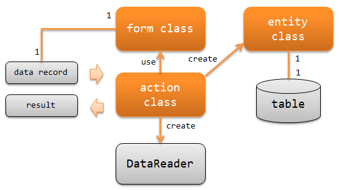

# アプリケーションの責務配置

keywords

DataReader, Result, Result.Success, アクションクラス, フォームクラス, エンティティクラス, バリデーション, 責務配置, バッチ設計

Nablarchバッチアプリケーションを作成する際に実装すべきクラスとその責務について説明する。

**クラスとその責務**

アクションクラス(action class)
アクションクラスは、2つのことを行う。

* 入力データの読み込みに使う `DataReader` を生成する。
* `DataReader` が読み込んだデータレコードを元に業務ロジックを実行し、
`Result` を返却する。

例えば、ファイルの取り込みバッチであれば、業務ロジックとして以下の処理を行う。

- データレコードからフォームクラスを作成して、バリデーションを行う。
- フォームクラスからエンティティクラスを作成して、データベースにデータを追加する。
- 処理結果として `Success` を返す。

フォームクラス(form class)
`DataReader`
が読み込んだデータレコードをマッピングするクラス。

データレコードをバリデーションするためのアノテーションの設定や相関バリデーションのロジックを持つ。
外部からの入力データによっては、階層構造(formがformを持つ)となる場合もある。

フォームクラスのプロパティは全て `String` で定義する
プロパティを `String` とすべき理由は、 Bean Validation を参照。
ただし、バイナリ項目の場合はバイト配列で定義する。

> **Tip:** 外部から連携されるファイルなど、入力データが安全でない場合に、 バリデーションを行いフォームクラスを作成する。 データベースなど、入力データが安全な場合は、フォームクラスを使用せず、 データレコードからエンティティクラスを作成して業務ロジックを実行すればよい。
エンティティクラス(entity class)
テーブルと1対1で対応するクラス。カラムに対応するプロパティを持つ。
