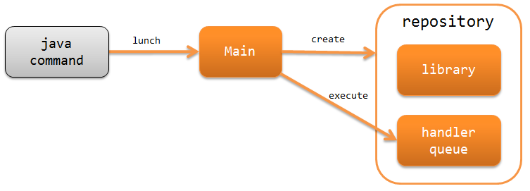
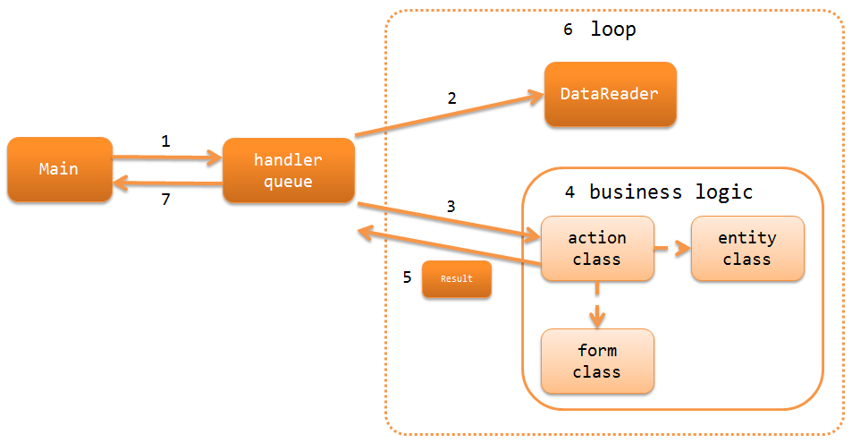

# アーキテクチャ概要

## 概要

Nablarchバッチアプリケーションでは、
DBやファイルに格納されたデータレコード1件ごとに処理を繰り返し実行する
バッチ処理を構築するための機能を提供している。

Nablarchバッチアプリケーションは、以下の2つに分かれる。


都度起動バッチ
日次や月次など、定期的にプロセスを起動してバッチ処理を実行する。


常駐バッチ
プロセスを起動しておき、一定間隔でバッチ処理を実行する。
例えば、オンライン処理で作成された要求データを定期的に一括処理するような場合に使用する。

> **Important:** 常駐バッチは、マルチスレッドで実行しても、処理が遅いスレッドの終了を他のスレッドが待つことにより、 要求データの取り込み遅延が発生する可能性がある。 このため、 新規開発プロジェクトでは、常駐バッチではなく、上記問題が発生しない `db_messaging` を使用することを推奨する。 また、既存プロジェクトにおいては、常駐バッチをこのまま稼働させることはできるが、 上記問題が発生する可能性がある場合(既に発生している場合)には、 db_messaging への変更を検討すること。

## Nablarchバッチアプリケーションの構成

Nablarchバッチアプリケーションは、javaコマンドから直接起動する\
スタンドアロンのアプリケーションとして実行する。
以下にNablarchバッチアプリケーションの構成を示す。


main (Main)
Nablarchバッチアプリケーションの起点となるメインクラス。
javaコマンドから直接起動し、システムリポジトリやログの初期化処理を行い、
ハンドラキューを実行する。

## リクエストパスによるアクションとリクエストIDの指定

Nablarchバッチアプリケーションでは、コマンドライン引数(-requestPath)で、
実行するアクションとリクエストIDを指定する。

```properties
# 書式
-requestPath=アクションのクラス名/リクエストID

# 指定例
-requestPath=com.sample.SampleBatchAction/BATCH0001
```
リクエストIDは、各バッチプロセスの識別子として用いられる。
同一の業務アクションクラスを実行するプロセスを複数起動する場合などは、このリクエストIDが識別子となる。

## Nablarchバッチアプリケーションの処理の流れ

Nablarchバッチアプリケーションが入力データを読み込み、処理結果を返却するまでの処理の流れを以下に示す。


1. 共通起動ランチャ(Main) がハンドラキュー(handler queue)を実行する。
2. `データリーダ(DataReader)` が入力データを読み込み、
データレコードを1件ずつ提供する。
3. ハンドラキューに設定された
`ディスパッチハンドラ(DispatchHandler)` が、
コマンドライン引数(-requestPath)で指定するリクエストパスを元に処理すべきアクションクラス(action class)を特定し、
ハンドラキューの末尾に追加する。
4. アクションクラス(action class)は、フォームクラス(form class)やエンティティクラス(entity class)を使用して、
データレコード1件ごとの業務ロジック(business logic) を実行する。
5. アクションクラス(action class)は、処理結果を示す `Result` を返却する。
6. 処理対象データがなくなるまで2～5を繰り返す。
7. ハンドラキューに設定された
`ステータスコード→プロセス終了コード変換ハンドラ(StatusCodeConvertHandler)` が、
処理結果のステータスコードをプロセス終了コードに変換し、
バッチアプリケーションの処理結果としてプロセス終了コードが返される。

## Nablarchバッチアプリケーションで使用するハンドラ

Nablarchでは、バッチアプリケーションを構築するために必要なハンドラを標準で幾つか提供している。
プロジェクトの要件に従い、ハンドラキューを構築すること。(要件によっては、プロジェクトカスタムなハンドラを作成することになる)

各ハンドラの詳細は、リンク先を参照すること。

リクエストやレスポンスの変換を行うハンドラ
* status_code_convert_handler
* data_read_handler

バッチの実行制御を行うハンドラ
* duplicate_process_check_handler
* request_path_java_package_mapping
* multi_thread_execution_handler
* loop_handler
* dbless_loop_handler
* retry_handler
* process_resident_handler
* process_stop_handler

データベースに関連するハンドラ
* database_connection_management_handler
* transaction_management_handler

エラー処理に関するハンドラ
* global_error_handler

その他
* thread_context_handler
* thread_context_clear_handler
* ServiceAvailabilityCheckHandler
* file_record_writer_dispose_handler

<details>
<summary>keywords</summary>

status_code_convert_handler, data_read_handler, duplicate_process_check_handler, request_path_java_package_mapping, multi_thread_execution_handler, loop_handler, dbless_loop_handler, retry_handler, process_resident_handler, process_stop_handler, database_connection_management_handler, transaction_management_handler, global_error_handler, thread_context_handler, thread_context_clear_handler, ServiceAvailabilityCheckHandler, file_record_writer_dispose_handler, ProcessStop, ハンドラキュー構成, 都度起動バッチ, 常駐バッチ, 最小ハンドラ構成, マルチスレッド実行

</details>

## 都度起動バッチの最小ハンドラ構成

都度起動バッチを構築する際の、必要最小限のハンドラキューを以下に示す。
これをベースに、プロジェクト要件に従ってNablarchの標準ハンドラやプロジェクトで作成したカスタムハンドラを追加する。

DBに接続する場合は以下の構成となる。

| No. | ハンドラ | スレッド | 往路処理 | 復路処理 | 例外処理 |
|---|---|---|---|---|---|
| 1 | status_code_convert_handler | メイン |  | ステータスコードをプロセス終了コードに変換する。 |  |
| 2 | global_error_handler | メイン |  |  | 実行時例外、またはエラーの場合、ログ出力を行う。 |
| 3 | database_connection_management_handler (初期処理/終了処理用) | メイン | DB接続を取得する。 | DB接続を解放する。 |  |
| 4 | transaction_management_handler (初期処理/終了処理用) | メイン | トランザクションを開始する。 | トランザクションをコミットする。 | トランザクションをロールバックする。 |
| 5 | request_path_java_package_mapping | メイン | コマンドライン引数をもとに呼び出すアクションを決定する。 |  |  |
| 6 | multi_thread_execution_handler | メイン | サブスレッドを作成し、後続ハンドラの処理を並行実行する。 | 全スレッドの正常終了まで待機する。 | 処理中のスレッドが完了するまで待機し起因例外を再送出する。 |
| 7 | database_connection_management_handler (業務処理用) | サブ | DB接続を取得する。 | DB接続を解放する。 |  |
| 8 | loop_handler | サブ | 業務トランザクションを開始する。 | コミット間隔毎に業務トランザクションをコミットする。 また、データリーダ上に処理対象データが残っていればループを継続する。 | 業務トランザクションをロールバックする。 |
| 9 | data_read_handler | サブ | データリーダを使用してレコードを1件読み込み、後続ハンドラの引数として渡す。 また 実行時ID を採番する。 |  | 読み込んだレコードをログ出力した後、元例外を再送出する。 |
DBに接続しない場は、DB接続関連ハンドラが不要であるのと、ループ制御ハンドラでトランザクション制御が不要であるため、以下の構成となる。

| No. | ハンドラ | スレッド | 往路処理 | 復路処理 | 例外処理 |
|---|---|---|---|---|---|
| 1 | status_code_convert_handler | メイン |  | ステータスコードをプロセス終了コードに変換する。 |  |
| 2 | global_error_handler | メイン |  |  | 実行時例外、またはエラーの場合、ログ出力を行う。 |
| 3 | request_path_java_package_mapping | メイン | コマンドライン引数をもとに呼び出すアクションを決定する。 |  |  |
| 4 | multi_thread_execution_handler | メイン | サブスレッドを作成し、後続ハンドラの処理を並行実行する。 | 全スレッドの正常終了まで待機する。 | 処理中のスレッドが完了するまで待機し起因例外を再送出する。 |
| 5 | dbless_loop_handler | サブ |  | データリーダ上に処理対象データが残っていればループを継続する。 |  |
| 6 | data_read_handler | サブ | データリーダを使用してレコードを1件読み込み、後続ハンドラの引数として渡す。 また 実行時ID を採番する。 |  | 読み込んだレコードをログ出力した後、元例外を再送出する。 |

## 常駐バッチの最小ハンドラ構成

常駐バッチを構築する際の、必要最小限のハンドラキューを以下に示す。
これをベースに、プロジェクト要件に従ってNablarchの標準ハンドラやプロジェクトで作成したカスタムハンドラを追加する。

常駐バッチの最小ハンドラ構成は、以下のハンドラがメインスレッド側に追加されている点を除けば都度起動バッチと同じである。

* thread_context_handler ( process_stop_handler のために必要)
* thread_context_clear_handler
* retry_handler
* process_resident_handler
* process_stop_handler

| No. | ハンドラ | スレッド | 往路処理 | 復路処理 | 例外処理 |
|---|---|---|---|---|---|
| 1 | status_code_convert_handler | メイン |  | ステータスコードをプロセス終了コードに変換する。 |  |
| 2 | thread_context_clear_handler | メイン |  | thread_context_handler でスレッドローカル上に設定した値を全て削除する。 |  |
| 3 | global_error_handler | メイン |  |  | 実行時例外、またはエラーの場合、ログ出力を行う。 |
| 4 | thread_context_handler | メイン | コマンドライン引数からリクエストID、ユーザID等のスレッドコンテキスト変数を初期化する。 |  |  |
| 5 | retry_handler | メイン |  |  | リトライ可能な実行時例外を捕捉し、かつリトライ上限に達していなければ後続のハンドラを再実行する。 |
| 6 | process_resident_handler | メイン | データ監視間隔ごとに後続のハンドラを繰り返し実行する。 | ループを継続する。 | ログ出力を行い、実行時例外が送出された場合はリトライ可能例外にラップして送出する。 エラーが送出された場合はそのまま再送出する。 |
| 7 | process_stop_handler | メイン | リクエストテーブル上の処理停止フラグがオンであった場合は、後続ハンドラの処理は行なわずにプロセス停止例外( `ProcessStop` )を送出する。 |  |  |
| 8 | database_connection_management_handler (初期処理/終了処理用) | メイン | DB接続を取得する。 | DB接続を解放する。 |  |
| 9 | transaction_management_handler (初期処理/終了処理用) | メイン | トランザクションを開始する。 | トランザクションをコミットする。 | トランザクションをロールバックする。 |
| 10 | request_path_java_package_mapping | メイン | コマンドライン引数をもとに呼び出すアクションを決定する。 |  |  |
| 11 | multi_thread_execution_handler | メイン | サブスレッドを作成し、後続ハンドラの処理を並行実行する。 | 全スレッドの正常終了まで待機する。 | 処理中のスレッドが完了するまで待機し起因例外を再送出する。 |
| 12 | database_connection_management_handler (業務処理用) | サブ | DB接続を取得する。 | DB接続を解放する。 |  |
| 13 | loop_handler | サブ | 業務トランザクションを開始する。 | コミット間隔毎に業務トランザクションをコミットする。 また、データリーダ上に処理対象データが残っていればループを継続する。 | 業務トランザクションをロールバックする。 |
| 14 | data_read_handler | サブ | データリーダを使用してレコードを1件読み込み、後続ハンドラの引数として渡す。 また 実行時ID を採番する。 |  | 読み込んだレコードをログ出力した後、元例外を再送出する。 |

## Nablarchバッチアプリケーションで使用するデータリーダ

Nablarchでは、バッチアプリケーションを構築するために必要なデータリーダを標準で幾つか提供している。
各データリーダの詳細は、リンク先を参照すること。

* `DatabaseRecordReader (データベース読み込み)`
* `FileDataReader (ファイル読み込み)`
* `ValidatableFileDataReader (バリデージョン機能付きファイル読み込み)`
* `ResumeDataReader (レジューム機能付き読み込み)`

> **Tip:** 上記のデータリーダでプロジェクトの要件を満たせない場合は、 extdoc:`DataReader <nablarch.fw.DataReader>` インタフェースを実装したクラスを プロジェクトで作成して対応する。
> **Important:** 標準で提供している `FileDataReader (ファイル読み込み)` 、 `ValidatableFileDataReader (バリデージョン機能付きファイル読み込み)` では、データへのアクセスに data_format を使用している。データへのアクセスに data_bind を使用する場合は、これらのデータリーダを使用しないこと。

<details>
<summary>keywords</summary>

DatabaseRecordReader, FileDataReader, ValidatableFileDataReader, ResumeDataReader, DataReader, データリーダ, データベース読み込み, ファイル読み込み, レジューム機能, バリデーション付きファイル読み込み

</details>

## Nablarchバッチアプリケーションで使用するアクション

Nablarchでは、バッチアプリケーションを構築するために必要なアクションクラスを標準で幾つか提供している。
各アクションクラスの詳細は、リンク先を参照すること。

* `BatchAction (汎用的なバッチアクションのテンプレートクラス)`
* `FileBatchAction (ファイル入力のバッチアクションのテンプレートクラス)`
* `NoInputDataBatchAction (入力データを使用しないバッチアクションのテンプレートクラス)`
* `AsyncMessageSendAction (応答不要メッセージ送信用のアクションクラス)`

> **Important:** 標準で提供している `FileBatchAction (ファイル入力のバッチアクションのテンプレートクラス)` では、データへのアクセスに data_format を使用している。データへのアクセスに data_bind を使用する場合は、他のアクションクラスを使用すること。

<details>
<summary>keywords</summary>

BatchAction, FileBatchAction, NoInputDataBatchAction, AsyncMessageSendAction, バッチアクション, ファイル入力バッチ, 入力データなしバッチ, 応答不要メッセージ送信, 都度起動バッチ, 常駐バッチ, スタンドアロンアプリケーション, db_messaging, Mainクラス, ハンドラキュー, バッチ種別選択, requestPath, リクエストID, コマンドライン引数, アクションクラス指定, バッチプロセス識別子, DataReader, DispatchHandler, StatusCodeConvertHandler, Result, 処理フロー, ハンドラキュー, プロセス終了コード, ステータスコード変換

</details>
