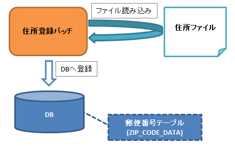

# ファイルをDBに登録するバッチの作成

Exampleアプリケーションを元に、ファイルをDBに登録するバッチを解説する。

作成する機能の概要

住所ファイル登録バッチ実行手順
1. 登録対象テーブルのデータを削除する

H2のコンソールから下記SQLを実行し、データ登録対象テーブルのデータを削除する。

```sql
TRUNCATE TABLE ZIP_CODE_DATA;
```
2. 住所ファイル登録バッチを実行する

コマンドプロンプトから下記コマンドを実行する。

```bash
$cd {nablarch-example-batchリポジトリ}
$mvn exec:java -Dexec.mainClass=nablarch.fw.launcher.Main ^
    -Dexec.args="'-requestPath' 'ImportZipCodeFileAction/ImportZipCodeFile' '-diConfig' 'classpath:import-zip-code-file.xml' '-userId' '105'"
```
3. ファイルの内容がDBに登録されたことを確認する

H2のコンソールから下記SQLを実行し、住所情報が登録されていることを確認する。

```sql
SELECT * FROM ZIP_CODE_DATA;
```

## ファイルをDBに登録する

ファイルをDBに登録するバッチの作成方法について、
入力データソースからのデータ読み込み
と 業務ロジックの実行 に分けて解説する。

処理フローについては、 Nablarchバッチの処理フロー を参照。
責務配置については Nablarchバッチの責務配置 を参照。

住所ファイル登録バッチのハンドラ構成については `import-zip-code-file.xml` を参照。

## 入力データソースからデータを読み込む

入力データソースからデータを読み込む処理について解説する。

#. 入力ファイルを受け付けるフォームの作成
#. データリーダの作成


入力ファイルを受け付けるフォームを作成
データバインド を用いてCSV(住所ファイル)をバインドするフォームを作成する。

ZipCodeForm.java
```java
@Csv(properties = {/** プロパティ定義は省略 **/}, type = CsvType.CUSTOM)
@CsvFormat(charset = "UTF-8", fieldSeparator = ',',
        ignoreEmptyLine = true, lineSeparator = "\r\n", quote = '"',
        quoteMode = QuoteMode.NORMAL, requiredHeader = false, emptyToNull = true)
public class ZipCodeForm {

    // 一部項目のみ抜粋

    /** 全国地方公共団体コード */
    @Domain("localGovernmentCode")
    @Required
    private String localGovernmentCode;

    /**
     * 郵便番号（5桁）を返します。
     *
     * @return 郵便番号（5桁）
     */
    public String getZipCode5digit() {
        return zipCode5digit;
    }

    /**
     * 行数を保持するカラム
     */
    private Long lineNumber;

    /**
     * 行数を取得する。
     *
     * @return 行数
     */
    @LineNumber
    public Long getLineNumber() {
        return lineNumber;
    }

    // その他のセッタ及びゲッタは省略

}
```
この実装のポイント
* データバインド を用いてフォームにCSVをバインドするため、`Csv`
及び `CsvFormat` を付与する。
* Bean Validation を実施するために、バリデーション用のアノテーションを付与する。
* 行数プロパティを定義し、ゲッタに `LineNumber` を付与することで、
対象データが何行目のデータであるかを自動的に設定できる。


データリーダの作成
ファイルを読み込んで一行ずつ業務アクションメソッドへ引き渡す、 `DataReader` の実装クラスを作成する。

ZipCodeFileReader.java
```java
public class ZipCodeFileReader implements DataReader<ZipCodeForm> {

    /**
     * 読み込むファイルの名称
     */
    private static final String FILE_NAME = "importZipCode";

    /**
     * 処理対象のデータを返すイテレータ
     */
    private ObjectMapperIterator<ZipCodeForm> iterator;

    /**
     * 業務ハンドラが処理する一行分のデータを返却する。
     *
     * @param ctx 実行コンテキスト
     * @return 一行分のデータ
     */
    @Override
    public ZipCodeForm read(ExecutionContext ctx) {
        if (iterator == null) {
            initialize();
        }
        return iterator.next();
    }

    /**
     * 次行があるかどうかを返す。
     *
     * @param ctx 実行コンテキスト
     * @return 次行がある場合は {@code true} 、ない場合は {@code false}
     */
    @Override
    public boolean hasNext(ExecutionContext ctx) {
        if (iterator == null) {
            initialize();
        }
        return iterator.hasNext();
    }

    /**
     * 終了処理。
     * <p/>
     * {@link ObjectMapperIterator#close()} を呼び出す。
     * @param ctx 実行コンテキスト
     */
    @Override
    public void close(ExecutionContext ctx) {
        iterator.close();
    }

    /**
     * 初期化処理。
     * <p/>
     * イテレータを生成する。
     * @throws RuntimeException ファイルの読み込みに失敗した場合
     */
    private void initialize() {
        FilePathSetting filePathSetting = FilePathSetting.getInstance();
        File zipCodeFile = filePathSetting.getFileWithoutCreate("csv-input", FILE_NAME);

        // ファイルの読み出しに使用するイテレータを生成
        try {
            iterator
                = new ObjectMapperIterator<>(ObjectMapperFactory.create(ZipCodeForm.class,
                    new FileInputStream(zipCodeFile)));
        } catch (FileNotFoundException e) {
            throw new IllegalStateException(e);
        }
    }
}
```
この実装のポイント
* `read` メソッドに一行分のデータを返却する処理を実装する。`read` メソッドで読み込んだデータが業務アクションハンドラへ引き渡される。
* `hasNext` メソッドに次行の有無を判定する処理を実装する。このメソッドが `false` を返却するとファイルの読み込み処理は終了となる。
* `close` メソッドにファイルの読み込み終了後のストリームのclose処理を実装する。

> **Tip:** extdoc:`ObjectMapper <nablarch.common.databind.ObjectMapper>` のように `hasNext` メソッドを持たないクラスからデータを読み込む場合、イテレータを作成することでデータリーダの実装をシンプルにできる上、 データ読み込み処理をバッチごとに実装する手間を省くことができる。 イテレータの実装に関してはExampleアプリケーションの `ObjectMapperIterator.java` の実装を参照。

## 業務ロジックを実行する

業務ロジックを実行する部分について解説する。

#. 業務アクションの作成


業務アクションの作成
`BatchAction` を継承し、業務アクションクラスを作成する。

ImportZipCodeFileAction.java
```java
public class ImportZipCodeFileAction extends BatchAction<ZipCodeForm> {

    /**
     * {@link com.nablarch.example.app.batch.reader.ZipCodeFileReader}
     * から渡された一行分の情報をDBに登録する。
     * <p/>
     * メソッド実行時に{@link com.nablarch.example.app.batch.interceptor.ValidateData}
     * がインターセプトされるため、このメソッドには常にバリデーション済みの
     * {@param inputData} が引き渡される。
     *
     * @param inputData 一行分の住所情報
     * @param ctx       実行コンテキスト
     * @return 結果オブジェクト
     */
    @Override
    @ValidateData
    public Result handle(ZipCodeForm inputData, ExecutionContext ctx) {

        ZipCodeData data = BeanUtil.createAndCopy(ZipCodeData.class, inputData);
        UniversalDao.insert(data);

        return new Result.Success();
    }

    /**
     * リーダを作成する。
     *
     * @param ctx 実行コンテキスト
     * @return リーダーオブジェクト
     */
    @Override
    public DataReader<ZipCodeForm> createReader(ExecutionContext ctx) {
        return new ZipCodeFileReader();
    }
}
```
この実装のポイント
* `handle` メソッドに、データリーダから渡された一行分のデータに対する処理を実装する。
* `UniversalDao#insert` を使用して住所エンティティをデータベースに登録する。
* `createReader` メソッドでは使用するデータリーダクラスのインスタンスを返却する。

> **Tip:** Bean Validation を実行するロジックにバッチごとの差はないため、Exampleアプリケーションではインターセプタを作成してバリデーション処理を共通化している。 インターセプタの実装に関しては、Exampleアプリケーションの `ValidateData.java` の実装を参照。
