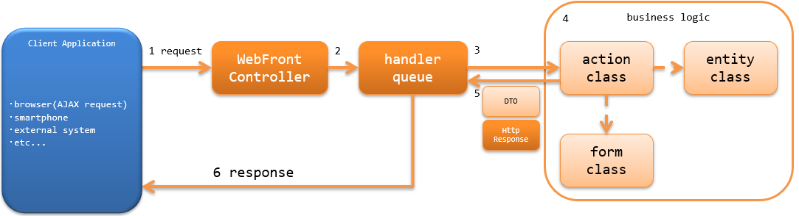

# アーキテクチャ概要

## 概要

Nablarchでは、Jakarta RESTful Web Servicesのリソースクラスを作るのと同じように、ウェブアプリケーションの業務アクションを使用して
RESTfulウェブサービスを作成する機能（Jakarta RESTful Web Servicesサポート）を提供する。

> **Tip:** 本機能は、Nablarch5までは「JAX-RSサポート」という名称だった。 しかし、Java EEがEclipse Foundationに移管され仕様名が変わったことに伴い「Jakarta RESTful Web Servicesサポート」という名称に変更された。 変更されたのは名称のみで、機能的な差は無い。 その他、Nablarch6で名称が変更された機能については Nablarch5と6で名称が変更になった機能について を参照のこと。
Jakarta RESTful Web Servicesサポートは、Nablarchのウェブアプリケーションをベースとする。
そのため、Jakarta RESTful Web Servicesで使用できる@Contextアノテーションを使用したServletリソースのインジェクションやJakarta Contexts and Dependency Injectionなどは使用できない。
以下に、Jakarta RESTful Web Servicesサポートで使用できるアノテーションを示す。

- Produces(レスポンスのメディアタイプの指定)
- Consumes(リクエストのメディアタイプの指定)
- Valid(リクエストに対するBeanValidationの実行)

Jakarta RESTful Web ServicesとJakarta RESTful Web Servicesサポートとの機能比較は、 restful_web_service_functional_comparison を参照。

> **Important:** Jakarta RESTful Web Servicesサポートでは、クライアントサイドの機能は提供しない。 Jakarta RESTful Web Servicesのクライアントを使用する必要がある場合は、Jakarta RESTful Web Servicesの実装(JerseyやRESTEasyなど)を使用すること。

## RESTfulウェブサービスの構成

Nablarchウェブアプリケーションと同じ構成となる。
詳細は、 ウェブアプリケーションの構成 を参照。

keywords

Jakarta RESTful Web Servicesサポート, @Produces, @Consumes, @Valid, ウェブサービス構成, クライアントサイド制限, 使用可能アノテーション, Servletリソースインジェクション, Jakarta CDI

## RESTfulウェブサービスの処理の流れ

RESTfulウェブサービスがリクエストを処理し、レスポンスを返却するまでの処理の流れを以下に示す。

1. Webフロントコントローラ ( `jakarta.servlet.Filter` の実装クラス)がrequestを受信する。
2. Webフロントコントローラ は、requestに対する処理をハンドラキュー(handler queue)に委譲する。
3. ハンドラキューに設定されたディスパッチハンドラ(`DispatchHandler`) が、URIを元に処理すべきアクションクラス(action class)を特定しハンドラキューの末尾に追加する。
4. アクションクラス(action class)は、フォームクラス(form class)やエンティティクラス(entity class)を使用して業務ロジック(business logic) を実行する。 |br|
各クラスの詳細は、 RESTFulウェブサービスの責務配置 を参照。

5. action classは、処理結果を示すDTOや `HttpResponse` を作成し返却する。
6. ハンドラキュー内のHTTPレスポンスハンドラ(`JaxRsResponseHandler`)が、 `HttpResponse` をクライアントに返却するレスポンスに変換し、クライアントへ応答を返す。 |br|
なお、アクションクラス(action class)の処理結果がフォームクラス(form class)の場合には、 `BodyConvertHandler` により `HttpResponse` に変換される。 |br|
変換される `HttpResponse` のボディの形式は、 アクションクラス(action class)に設定されたメディアタイプとなる。

keywords

WebFrontController, DispatchHandler, JaxRsResponseHandler, BodyConvertHandler, HttpResponse, 処理フロー, ハンドラキュー, jakarta.servlet.Filter

## RESTfulウェブサービスで使用するハンドラ

Nablarchでは、RESTfulウェブサービスを構築するために必要なハンドラを標準で幾つか提供している。
プロジェクトの要件に従い、ハンドラキューを構築すること。(要件によっては、プロジェクトカスタムなハンドラを作成することになる)

各ハンドラの詳細は、リンク先を参照すること。

リクエストやレスポンスの変換を行うハンドラ
* Jakarta RESTful Web Servicesレスポンスハンドラ
* リクエストボディ変換ハンドラ

データベースに関連するハンドラ
* データベース接続管理ハンドラ
* トランザクション制御ハンドラ

リクエストの検証を行うハンドラ
* Jakarta RESTful Web Servcies Bean Validationハンドラ
* CSRFトークン検証ハンドラ

エラー処理に関するハンドラ
* グローバルエラーハンドラ

その他のハンドラ
* リクエストURIとアクションを紐付けるハンドラ
* ヘルスチェックエンドポイントハンドラ

keywords

最小ハンドラ構成, JaxRsResponseHandler, BodyConvertHandler, JaxRsBeanValidationHandler, global_error_handler, router_adaptor, RoutesMapping, JaxRsMethodBinderFactory, jaxrs_adaptor, ハンドラキュー設定

## 最小ハンドラ構成

NablarchでRESTfulウェブサービスを構築する際の、必要最小限のハンドラキューを以下に示す。
これをベースに、プロジェクト要件に従ってNablarchの標準ハンドラやプロジェクトで作成したカスタムハンドラを追加する。

| No. | ハンドラ | 往路処理 | 復路処理 | 例外処理 |
|---|---|---|---|---|
| 1 | グローバルエラーハンドラ |  |  | 実行時例外、またはエラーの場合、ログ出力を行う。 |
| 2 | Jakarta RESTful Web Servicesレスポンスハンドラ |  | レスポンスの書き込み処理を行う。 | 例外(エラー)に対応したレスポンスの生成と書き込み処理とログ出力処理を行う。 |
| 3 | データベース接続管理ハンドラ | DB接続を取得する。 | DB接続を解放する。 |  |
| 4 | トランザクション制御ハンドラ | トランザクションを開始する。 | トランザクションをコミットする。 | トランザクションをロールバックする。 |
| 5 | リクエストURIとアクションを紐付けるハンドラ | リクエストパスをもとに呼び出すアクション(メソッド)を決定する。 |  |  |
| 6 | リクエストボディ変換ハンドラ | request bodyをアクションで受け付けるフォームクラスに変換する。 | アクションの処理結果のフォームの内容をresponse bodyに変換する。 |  |
| 7 | Jakarta RESTful Web Servcies Bean Validationハンドラ | No6で変換したフォームクラスに対してバリデーションを実行する。 |  |  |
> **Tip:** `リクエストURIとアクションを紐付けるハンドラ <router_adaptor>` より後ろに設定するハンドラは、 ハンドラキューに直接設定するのではなく リクエストURIとアクションを紐付けるハンドラ に対して設定する。 Jakarta RESTful Web Servicesアダプタ を使用した場合、自動的に リクエストボディ変換ハンドラ と Jakarta RESTful Web Servcies Bean Validationハンドラ がハンドラキューに追加される。 リクエストボディ変換ハンドラ と Jakarta RESTful Web Servcies Bean Validationハンドラ 以外のハンドラを設定したい場合や、サポートするメディアタイプを増やしたい場合は、 以下の設定例や Jakarta RESTful Web Servicesアダプタ の実装を参考にハンドラキューを構築すること。 .. code-block:: xml <component name="webFrontController" class="nablarch.fw.web.servlet.WebFrontController"> <property name="handlerQueue"> <list> <!-- 前段のハンドラは省略 --> <!-- リクエストURIとアクションを紐付けるハンドラの設定 --> <component name="packageMapping" class="nablarch.integration.router.RoutesMapping"> <!-- ハンドラ以外の設定値は省略 --> <property name="methodBinderFactory"> <component class="nablarch.fw.jaxrs.JaxRsMethodBinderFactory"> <property name="handlerList"> <list> <!-- リクエストURIとアクションを紐付けるハンドラ以降のハンドラキューの設定 ※各クラスの設定値は省略 --> <component class="nablarch.fw.jaxrs.BodyConvertHandler"> <!-- サポートするメディアタイプのコンバータを設定する --> </component> <component class="nablarch.fw.jaxrs.JaxRsBeanValidationHandler" /> </list> </property> </component> </property> </component> </list> </property> </component>
.. |br| raw:: html

 
