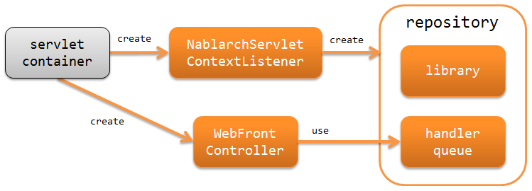

# アーキテクチャ概要

## 概要

Nablarchでは、HTMLをベースとした画面UIを持つウェブアプリケーションを構築するための機能を提供している。

## ウェブアプリケーションの構成

Nablarchではウェブアプリケーションを構築する場合、ServletAPIの使用を前提としている。
以下にNablarchにおけるウェブアプリケーションの構成を示す。

nablarch_servlet_context_listener (NablarchServletContextListener)
システムリポジトリやログの初期化処理を行うサーブレットコンテキストリスナー。

web_front_controller (WebFrontController)
受け取ったリクエストに対する処理をハンドラキューに委譲するサーブレットフィルタ。

keywords

NablarchServletContextListener, WebFrontController, ウェブアプリケーション構成, サーブレットコンテキストリスナー, ハンドラキュー, ServletAPI

## ウェブアプリケーションの処理の流れ

ウェブアプリケーションがリクエストを処理し、レスポンスを返却するまでの処理の流れを以下に示す。

1. web_front_controller ( `jakarta.servlet.Filter` の実装クラス)がrequestを受信する。
2. web_front_controller は、requestに対する処理をハンドラキュー(handler queue)に委譲する。
3. ハンドラキューに設定されたディスパッチハンドラ(`DispatchHandler`) が、URIを元に処理すべきaction classを特定しハンドラキューの末尾に追加する。
4. アクションクラス(action class)は、フォームクラス(form class)やエンティティクラス(entity class)を使用して業務ロジック(business logic) を実行する。
各クラスの詳細は、 application_design を参照。

5. action classは、処理結果を示す `HttpResponse` を作成し返却する。
6. ハンドラキュー内のHTTPレスポンスハンドラ(`HttpResponseHandler`)が、 `HttpResponse` をクライアントに返却するレスポンスに変換する。例えば、JSPのServlet Forwardなど。
7. responseが返却される。

keywords

WebFrontController, DispatchHandler, HttpResponse, HttpResponseHandler, リクエスト処理フロー, ディスパッチハンドラ, アクションクラス, jakarta.servlet.Filter

## ウェブアプリケーションで使用するハンドラ

Nablarchでは、ウェブアプリケーションを構築するために必要なハンドラを標準で幾つか提供している。
プロジェクトの要件に従い、ハンドラキューを構築すること。(要件によっては、プロジェクトカスタムなハンドラを作成することになる)

各ハンドラの詳細は、リンク先を参照すること。

リクエストやレスポンスの変換を行うハンドラ
* http_character_encoding_handler
* http_response_handler
* forwarding_handler
* multipart_handler
* session_store_handler
* normalize_handler
* secure_handler

リクエストのフィルタリングを行うハンドラ
* service_availability
* permission_check_handler

データベースに関連するハンドラ
* database_connection_management_handler
* transaction_management_handler

リクエストの検証を行うハンドラ
* csrf_token_verification_handler

エラー処理に関するハンドラ
* http_error_handler
* global_error_handler

その他
* http_request_java_package_mapping
* nablarch_tag_handler
* thread_context_handler
* thread_context_clear_handler
* http_access_log_handler
* file_record_writer_dispose_handler
* health_check_endpoint_handler

keywords

ハンドラキュー構成, 最小ハンドラ構成, 文字エンコーディング, セッションストア, CSRFトークン検証, トランザクション管理, router_adaptor, セキュリティヘッダ

## 最小ハンドラ構成

Nablarchでウェブアプリケーションを構築する際の、必要最小限のハンドラキューを以下に示す。
これをベースに、プロジェクト要件に従ってNablarchの標準ハンドラやプロジェクトで作成したカスタムハンドラを追加する。

| No. | ハンドラ | 往路処理 | 復路処理 | 例外処理 |
|---|---|---|---|---|
| 1 | http_character_encoding_handler | リクエストとレスポンスに文字エンコーディングを設定する。 |  |  |
| 2 | global_error_handler |  |  | 実行時例外、またはエラーの場合、ログ出力を行う。 |
| 3 | http_response_handler |  | サーブレットフォーワード、リダイレクト、レスポンス書き込みのいずれかを行う。 | 実行時例外、またはエラーの場合、既定のエラーページを表示する。 |
| 4 | secure_handler |  | レスポンスオブジェクト(`HttpResponse`)にセキュリティ関連のレスポンスヘッダを設定する。 |  |
| 5 | multipart_handler | リクエストがマルチパート形式の場合、その内容を一時ファイルに保存する。 | 保存した一時ファイルを削除する。 |  |
| 6 | session_store_handler | セッションストアから内容を読み込む。 | セッションストアに内容を書き込む。 |  |
| 7 | normalize_handler | リクエストパラメータのノーマライズ処理を行う。 |  |  |
| 8 | forwarding_handler |  | 遷移先が内部フォーワードの場合、後続のハンドラを再実行する。 |  |
| 9 | http_error_handler |  |  | 例外の種類に応じたログ出力とレスポンスの生成を行う。 |
| 10 | nablarch_tag_handler | Nablarchカスタムタグの動作に必要な事前処理を行う。 |  |  |
| 11 | database_connection_management_handler | DB接続を取得する。 | DB接続を解放する。 |  |
| 12 | transaction_management_handler | トランザクションを開始する。 | トランザクションをコミットする。 | トランザクションをロールバックする。 |
| 13 | router_adaptor | リクエストパスをもとに呼び出すアクションを決定する。 |  |  |
