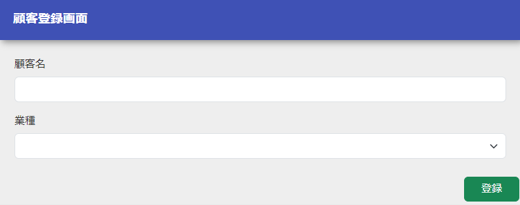
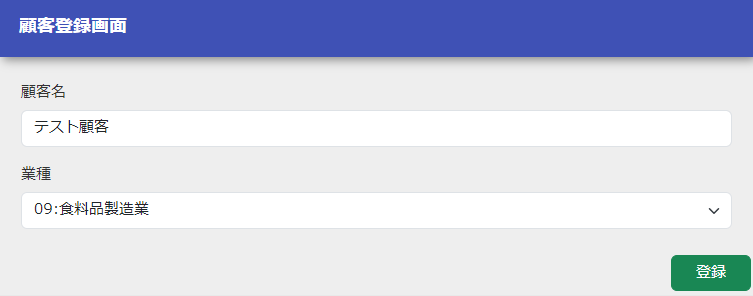
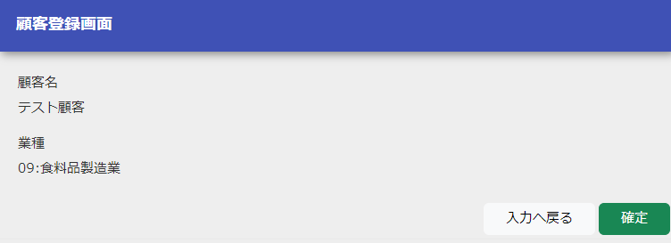

# 登録内容確認画面から登録画面へ戻る

<details>
<summary>keywords</summary>

ClientAction, SessionUtil, BeanUtil, nablarch.core.beans.BeanUtil, HttpResponse, HttpRequest, ExecutionContext, Client, ClientForm, EntityList, Industry, UniversalDao, 確認画面から戻る, セッションストア, 内部フォーワード, フォーム変換, 登録画面戻る

</details>

本章では、登録内容確認画面から登録画面へ戻る処理について解説する。

前へ

登録画面へ戻る処理の実装
`ClientAction` に登録画面へ戻る処理を行うメソッドを追加する。

ClientAction.java
```java
public HttpResponse back(HttpRequest request, ExecutionContext context) {

    Client client = SessionUtil.get(context, "client");

    ClientForm form = BeanUtil.createAndCopy(ClientForm.class, client);
    context.setRequestScopedVar("form", form);

    return new HttpResponse("forward://input");
}

public HttpResponse input(HttpRequest request, ExecutionContext context) {

    SessionUtil.delete(context, "client");

    EntityList<Industry> industries = UniversalDao.findAll(Industry.class);
    context.setRequestScopedVar("industries", industries);

    return new HttpResponse("/WEB-INF/view/client/create.jsp");
}
```
この実装のポイント
*  セッションストア から顧客情報を取得する。
* 取得した顧客情報を登録画面に表示するため、`BeanUtil` を使用して顧客エンティティをフォームに変換し、リクエストスコープに登録する。
* レスポンスオブジェクトの遷移先を、初期表示処理への内部フォーワードとする
(登録画面を表示する際、再度プルダウンに表示する業種情報を取得するため)。
* 初期表示処理で セッションストア へ登録したオブジェクトを削除する(戻るボタンを押下せずにヘッダメニューから直接登録画面に遷移された場合等を考慮)。

動作確認を行う
1. 登録画面を表示する。


2. 顧客名に全角文字列、業種に任意の値を選択して「登録」ボタンを押下する。


3. 確認画面にて「入力へ戻る」ボタンを押下する。


4. 登録画面が表示され、`2` で入力した値が画面に表示されていることを確認する。


次へ
