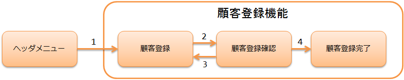
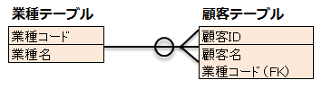

# 登録機能の作成(ハンズオン形式)

## 概要

Nablarchを使用したウェブアプリケーションでの登録機能の開発方法を、
Exampleアプリケーションへ顧客情報の登録機能の実装を実際に行いながら解説する。

作成する機能の説明
1. ヘッダメニューの「顧客登録」リンクを押下する。

## 顧客登録機能の仕様

顧客登録機能の各処理と、URL及び業務アクションメソッドのマッピングを以下に示す。

| NO. | 処理名 | URL | Action | HTTPメソッド |
|---|---|---|---|---|
| 1 | 初期表示 | /action/client/ | ClientAction#input | GET |
| 2 | 登録内容の確認 | /action/client/confirm | ClientAction#confirm | POST |
| 3 | 登録画面に戻る | /action/client/back | ClientAction#back | POST |
| 4 | 登録処理の実行 | /action/client/create | ClientAction#create | POST |

使用するテーブルの定義を以下に示す。

----

登録機能の解説は以下4章で構成される。

keywords

ClientAction, 顧客登録, 登録機能, URLマッピング, アクションメソッド, HTTPメソッド

