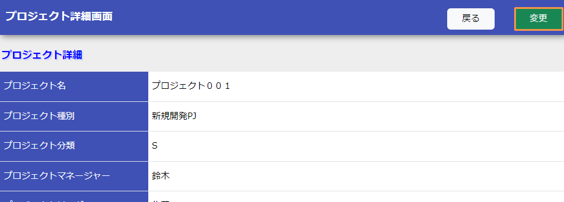
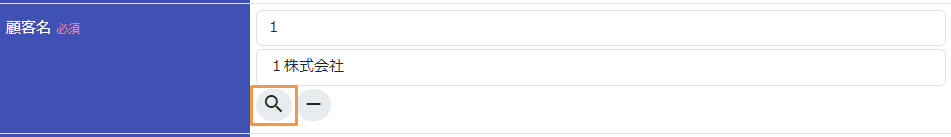
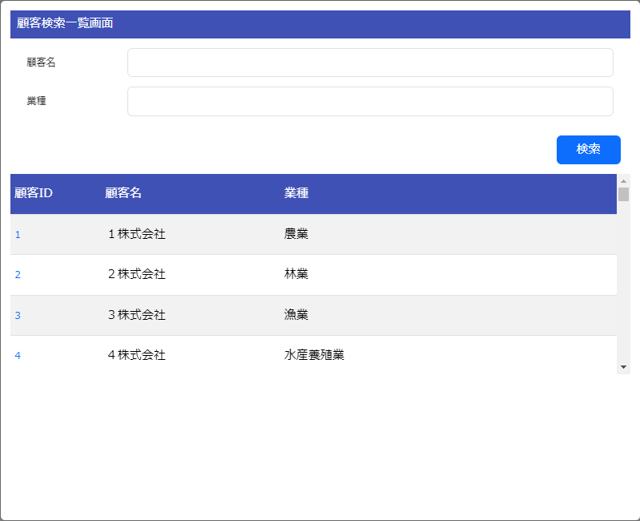
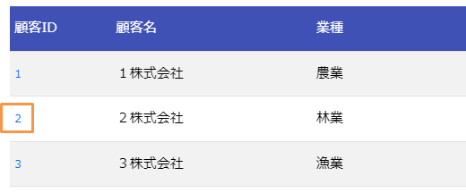
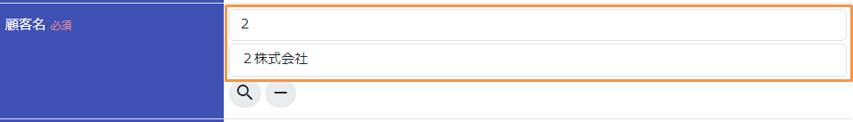

# ポップアップ画面の作成

Exampleアプリケーションを元にポップアップ画面の作成方法を解説する。

ポップアップ画面は、 tag-submit_popup に記載がある通り別ウィンドウ化ではなくダイアログ形式で作成する。

作成する機能の説明
1. プロジェクト詳細画面の変更ボタンを押下する。

2. 顧客欄の検索ボタンを押下する。

3. 顧客検索画面がダイアログで表示される。検索ボタンを押下する。

4. 検索結果の顧客IDのリンクを押下する。

5. 顧客検索画面が閉じられ、プロジェクト変更画面の顧客ID及び顧客名に選択した値が設定される。

## ポップアップ(ダイアログ)画面を表示する

ポップアップ(ダイアログ)の表示はOSS(Bootstrap)を使用して実現している。
詳細は、 [Bootstrapのドキュメント(外部サイト)](https://getbootstrap.jp/docs/5.3/getting-started/introduction/) を参照。

業務アクションメソッドの作成
顧客を検索し、選択の結果を親画面に引き渡す。

本機能は、ダイアログからのAjax呼び出しにより検索処理を実現している。
アクションクラスの実装方法については、 restful_web_service を参照。

ポップアップ画面のJSPの作成
jQueryを使用して、Ajax呼び出しの結果を元にDOMを構築し結果を表示する。
jQueryを使用しているため、詳細な解説は省略する。

jQueryについては、 [ドキュメント(外部サイト、英語)](https://jquery.com/) を参照。

ポップアップ画面から親ウィンドウへ値を引き渡すJavaScript関数の作成
jQueryを使用してダイアログ内の情報を顧客名と顧客ID部に設定する。
jQueryを使用しているため、詳細な解説は省略する。

jQueryについては、 [ドキュメント(外部サイト、英語)](https://jquery.com/) を参照。

ポップアップ画面の解説は以上。

Getting Started TOPページへ
