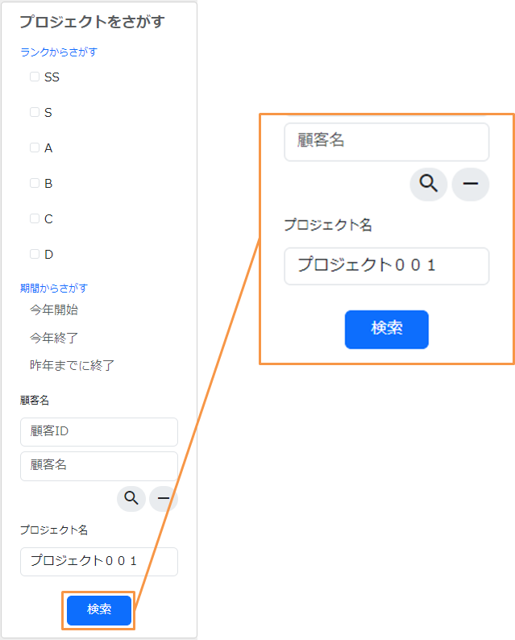
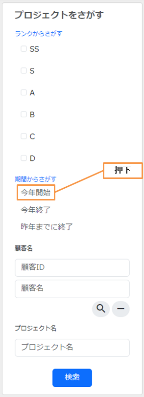
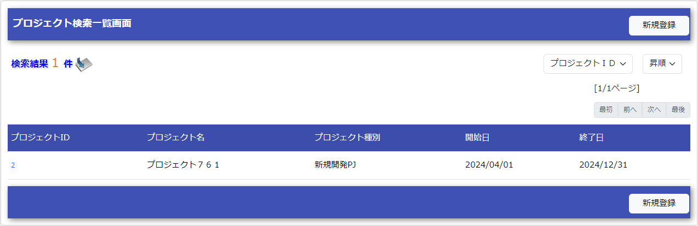

# 検索機能の作成

Exampleアプリケーションを元に検索機能を解説する。

作成する機能の説明
1. サイドメニュー「プロジェクト名」欄に検索条件を入力し、検索ボタンを押下する。


2. プロジェクト名で検索した結果が表示される。


3. プロジェクト名をクリアし、「期間からさがす」欄の「今年開始」リンクを押下する。


4. プロジェクト開始日が今年となっているプロジェクトが表示される。



## 検索する

検索機能の基本的な実装方法を、以下の順に説明する。

#. フォームの作成
#. 検索条件入力部分のJSPの作成
#. 検索条件Beanの作成
#. 検索に使用するSQLの作成
#. 業務アクションの実装
#. 検索結果表示部分の作成


フォームの作成
検索条件を受け付けるフォームを作成する。

ProjectSearchForm.java
```java
public class ProjectSearchForm extends SearchFormBase implements Serializable {

    // 一部のみ抜粋

    /** プロジェクト名 */
    @Domain("projectName")
    private String projectName;

    /** プロジェクト開始日（FROM） */
    @Domain("date")
    private String projectStartDateBegin;

    // ゲッタ及びセッタは省略
```
この実装のポイント
* 入力値を受け付けるプロパティは、全てString型で宣言する。詳細は バリデーションルールの設定方法 を参照。


検索条件入力部分のJSPの作成
検索条件入力部分のJSPを作成する。

/src/main/webapp/WEB-INF/view/common/sidemenu.jsp
```jsp
<n:form method="GET" action="list">
    <!-- 省略 -->
    <label for="projectName" class="control-label mb-3">プロジェクト名</label>
    <div>
        <n:text
                id="projectName"
                name="searchForm.projectName"
                size="25"
                maxlength="64"
                cssClass="form-control form-control-lg"
                errorCss="input-error"
                placeholder="プロジェクト名"/>
        <n:error errorCss="message-error" name="searchForm.projectName" />
    </div>
    <!-- 省略 -->
    <div align="center">
        <input type="submit" id="search" class="btn btn-lg btn-primary" value="検索" />
    </div>
</n:form>
```
この実装のポイント
* リクエストをGETで送信する場合は、 formタグ の `method` 属性にGETを指定する。
さらに、GETの場合、ボタンやリンクにカスタムタグを使用できないので、HTMLでボタンやリンクを作成する。詳細は tag-using_get を参照。


検索条件Beanの作成
検索条件を設定し ユニバーサルDAO へ引き渡すBeanを作成する。
Beanのプロパティは、対応する条件カラムの定義(型)と互換性のある型とする こと。

ProjectSearchDto.java
```java
public class ProjectSearchDto implements Serializable {

    // 一部のみ抜粋

    /** プロジェクト名 */
    private String projectName;

    /** プロジェクト開始日付(FROM） */
    private java.sql.Date projectStartDateBegin;

    // ゲッタ及びセッタは省略
```
この実装のポイント
* フォームから検索条件Beanへの値の移送は、 `BeanUtil` を使用する。
`BeanUtil` は、プロパティ名が同一の項目を移送するため、
検索条件に使用する項目のプロパティ名は、フォームと検索条件Beanで合わせる必要がある。
* `BeanUtil` を用いて値を移送する場合は、互換性のある型であれば、
プロパティを型変換した上で移送できる。詳細は BeanUtilの型変換ルール を参照。
* Beanのプロパティは、対応するカラムの型に合わせたJavaの型で定義する。


検索に使用するSQLの作成
検索に使用するSQLを作成する。

Project.sql
```none
SEARCH_PROJECT =
SELECT
    PROJECT_ID,
    PROJECT_NAME,
    PROJECT_TYPE,
    PROJECT_CLASS,
    PROJECT_START_DATE,
    PROJECT_END_DATE,
    VERSION
FROM
    PROJECT
WHERE
    USER_ID = :userId
    AND $if(clientId)     {CLIENT_ID = :clientId}
    AND $if(projectName) {PROJECT_NAME LIKE  :%projectName%}
    AND $if(projectType) {PROJECT_TYPE = :projectType}
    AND $if(projectClass) {PROJECT_CLASS IN (:projectClass[])}
    AND $if(projectStartDateBegin) {PROJECT_START_DATE >= :projectStartDateBegin}
    AND $if(projectStartDateEnd) {PROJECT_START_DATE <= :projectStartDateEnd}
    AND $if(projectEndDateBegin) {PROJECT_END_DATE >= :projectEndDateBegin}
    AND $if(projectEndDateEnd) {PROJECT_END_DATE <= :projectEndDateEnd}
$sort(sortId){
    (idAsc PROJECT_ID)
    (idDesc PROJECT_ID DESC)
    (nameAsc PROJECT_NAME, PROJECT_ID)
    (nameDesc PROJECT_NAME DESC, PROJECT_ID DESC)
    (startDateAsc PROJECT_START_DATE, PROJECT_ID)
    (startDateDesc PROJECT_START_DATE DESC, PROJECT_ID DESC)
    (endDateAsc PROJECT_END_DATE, PROJECT_ID)
    (endDateDesc PROJECT_END_DATE DESC, PROJECT_ID DESC)
}
```
この実装のポイント
* SQLインジェクションを防ぐため、SQLは外部ファイルに記述する。詳細は SQLをファイルで管理する を参照。
* Beanのプロパティ名を使って、SQLに値をバインドする。詳細は Beanオブジェクトを入力としてSQLを実行する を参照。
* 検索画面で入力された項目のみを条件に含める場合には、 $if 構文を使用してSQL文を構築 する。
* ソートキーを画面から選択可能とする場合には、 $sort 構文を使用してSQL文を構築 する。


業務アクションの実装
業務アクションに、検索処理を実装する。

業務アクションメソッドの作成
画面から与えられた検索条件を元に検索するメソッドを作成する。

ProjectAction.java
```java
@InjectForm(form = ProjectSearchForm.class, prefix = "searchForm", name = "searchForm")
@OnError(type = ApplicationException.class, path = "/WEB-INF/view/project/index.jsp")
public HttpResponse list(HttpRequest request, ExecutionContext context) {

    ProjectSearchForm searchForm = context.getRequestScopedVar("searchForm");
    ProjectSearchDto searchCondition =
            BeanUtil.createAndCopy(ProjectSearchDto.class, searchForm);

    List<Project> searchList = searchProject(searchCondition, context);
    context.setRequestScopedVar("searchResult", searchList);

    return new HttpResponse("/WEB-INF/view/project/index.jsp");
}
```
この実装のポイント
* 検索条件は、外部からの入力値で安全である保証がないため、
`InjectForm` を付与してバリデーションを行う。
* `InjectForm` によるバリデーションが済んだフォームは、
リクエストスコープから取り出すことができる。
* フォームの値を `BeanUtil` を使用して検索条件Beanにコピーする。

データベースを検索するプライベートメソッドの作成
このメソッドでは、前述のSQLを指定してデータベースを検索する。

ProjectAction.java
```java
private List<Project> searchProject(ProjectSearchDto searchCondition,
                                    ExecutionContext context) {

    LoginUserPrincipal userContext = SessionUtil.get(context, "userContext");
    searchCondition.setUserId(userContext.getUserId());

    return UniversalDao
            .page(searchCondition.getPageNumber())
            .per(20L)
            .findAllBySqlFile(Project.class, "SEARCH_PROJECT", searchCondition);
}
```
この実装のポイント
* 前述のSQL文を実行するには、`UniversalDao#findAllBySqlFile` の第二引数として、
SQLID (前述のSQLの場合は"SEARCH_PROJECT")を指定する。
* ページング用の検索は、 `UniversalDao#per` メソッド、
及び `UniversalDao#page` を用いて行うことができる。
詳細は ページングのために検索範囲を絞る を参照。


検索結果表示部分の作成
リクエストスコープに登録された検索結果を画面に表示する処理を、JSPに実装する。

/src/main/webapp/WEB-INF/view/project/index.jsp
```jsp
<!-- 検索結果 -->
<app:listSearchResult>
<!-- app:listSearchResultの属性値指定は省略 -->
<!-- 省略 -->
    <jsp:attribute name="headerRowFragment">
        <tr>
            <th>プロジェクトID</th>
            <th>プロジェクト名</th>
            <th>プロジェクト種別</th>
            <th>開始日</th>
            <th>終了日</th>
        </tr>
    </jsp:attribute>
    <jsp:attribute name="bodyRowFragment">
        <tr class="info">
            <td>
                <!-- プロジェクトIDを追加したURLを作成する -->
                <!-- プロジェクト詳細画面へ遷移する -->
                <n:a href="show/${row.projectId}">
                    <n:write name="row.projectId"/>
                </n:a>
            </td>
            <!-- 省略 -->
            <td>
                <n:write name="row.projectName" />
            </td>
            <!-- 省略 -->
            <td>
                <n:write name="row.projectStartDate" valueFormat="dateTime{yyyy/MM/dd}"/>
            </td>
            <!-- 省略 -->
        </tr>
    </jsp:attribute>
</app:listSearchResult>
```
この実装のポイント
* 詳細画面へ遷移するリンクなど、GETリクエストのURLにパラメータを含めたい場合は、JSTLの `<c:url>` タグやEL式を使って作成する。
* Exampleアプリケーションでは、ルーティングを以下のように設定しているため、末尾にプロジェクトIDを付与したURLが「 `ProjectAction#show` 」に紐づけられる。
詳細は [ライブラリのREADMEドキュメント(外部サイト)](https://github.com/kawasima/http-request-router/blob/master/README.ja.md) を参照。

routes.xml
```xml
<routes>
      <match path="/action/:controller/:action/:projectId">
          <requirements>
              <requirement name="projectId" value="\d+$" />
          </requirements>
      </match>
  <!-- その他の設定は省略 -->
</routes>
```
* 値を出力するために、 writeタグ を用いる。
値を「日付」や「金額」等の形式でフォーマットして出力したい場合は、 `valueFormat` 属性で形式を指定する。詳細は tag-format_value を参照。
* `<app:listSearchResult>` の使用方法については 検索結果の一覧表示 を参照。


検索機能の解説は以上。

Getting Started TOPページへ
