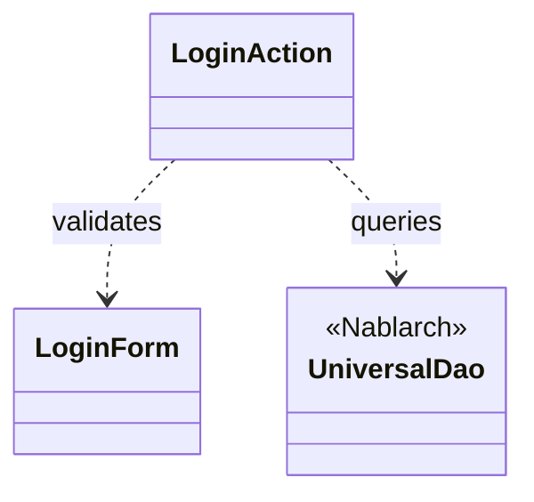
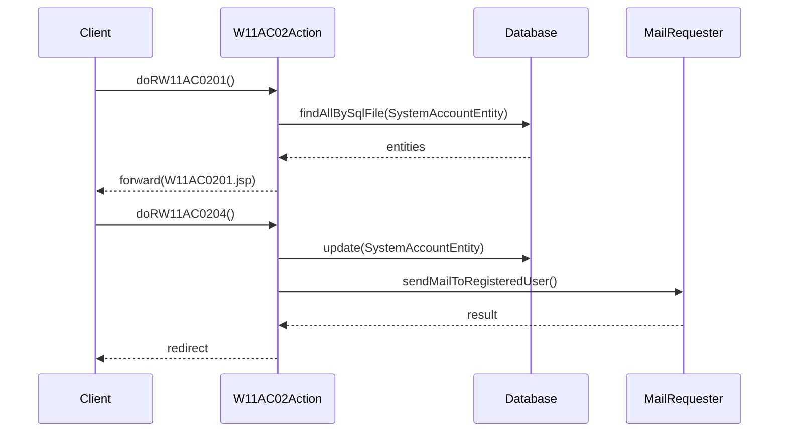
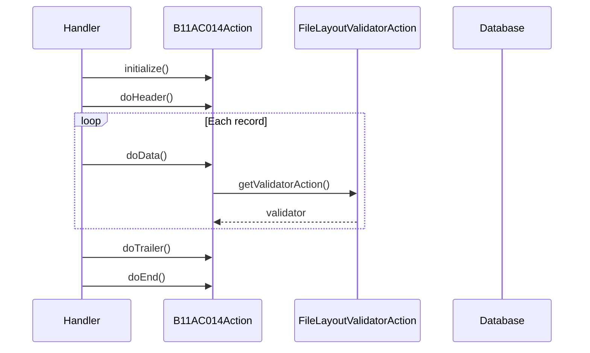

# Code Analysis Workflow

Analyze existing code, trace dependencies, generate structured documentation.

## Overview

**Input**: User's request (target code specification)

**Output**: Documentation file (Markdown + Mermaid diagrams) in `.nabledge/YYYYMMDD/`

**Tools**: Read, Bash, Write

> **Bash usage**: For file operations (search, read, grep), always use Bash scripts — never raw `find`, `ls`, or `grep` commands.

## Example execution

**User request**: "I want to understand LoginAction"

**Step 2**: Find `LoginAction.java`, read it, extract dependencies: LoginForm, SystemAccountEntity, UniversalDao, ExecutionContext

**Step 3**: Search knowledge → `universal-dao.json`, `data-bind.json`

**Step 4**: Read template → prefill script → skeleton diagrams → write documentation

**Output**: `.nabledge/20260210/code-analysis-LoginAction.md` — 5 components, 2 diagrams, 2 knowledge sections, ~2m

---

## Process flow

### Step 0: Confirm analysis target

Check whether the user's invocation explicitly names a specific class or file.

- If specified → save as `target` and proceed to Step 1
- If not specified → output the following and wait for the user's response:

  "解析対象のクラスまたはファイルを指定してください (例: ImportZipCodeFileAction)"

  Save the user's answer as `target`.

**Do NOT infer or assume a target from context, history, or file system.**

### Step 1: Record start time

**Tool**: Bash

```bash
bash .claude/skills/nabledge-6/scripts/record-start.sh
```

**Output example**:
```
Start time recorded: 2026-02-10 14:54:00
Output directory: .nabledge/20260210
```

### Step 2: Identify target and analyze dependencies

**Tools**: Bash (find-file.sh, read-file.sh)

1. **Parse `target`** — determine scope: specific class, feature, or package

2. **Find target files**:
   ```bash
   bash .claude/skills/nabledge-6/scripts/find-file.sh "<TargetClass>.java"
   ```

3. **Read target files**:
   ```bash
   bash .claude/skills/nabledge-6/scripts/read-file.sh "<path/to/file.java>"
   ```
   Pass paths exactly as returned by find-file.sh.

4. **Extract dependencies** from file content:
   - Imports → External dependencies
   - Field types, method parameters → Direct dependencies
   - Method calls → Behavioral dependencies

5. **Classify dependencies**:
   - Project code (proman-*): Trace further
   - Nablarch framework: Note for knowledge search
   - Others (JDK, third-party): Note but don't trace

6. **Determine trace depth**:
   - Default: Trace project code until reaching framework/entities/utilities
   - Stop at Nablarch framework boundaries
   - Stop at Entity classes (pure data objects)

7. **Build dependency graph** (mental model):
   ```
   LoginAction
   ├─→ LoginForm (Form, validation)
   ├─→ SystemAccountEntity (Entity, data)
   ├─→ UniversalDao (Nablarch, DB access)
   └─→ ExecutionContext (Nablarch, request context)
   ```

8. **Categorize components**: Action/Controller, Form, Entity, Service/Logic, Utility, Handler, Configuration

9. **Identify Nablarch components** for knowledge search: class names, method names, annotation names

**Output**: Target files list, dependency graph, Nablarch class/method/annotation names identified

### Step 3: Search Nablarch knowledge

**Tools**: workflows/keyword-search.md, Bash (scripts/read-sections.sh)

1. **Execute keyword search**:
   - Use Nablarch class/method/annotation names from Step 2 as `{keywords}`
   - Execute `workflows/keyword-search.md`
   - Output: `{results: [{file, section_id, relevance}]}`

2. **Collect knowledge file basenames** for Step 4.2:
   - Extract unique `file` values; use basenames only (no path, no extension)
   - Example: `libraries-universal_dao,libraries-data_bind`

3. **Collect knowledge content** for documentation:
   - Extract all `{file}:{section_id}` pairs from results
   - Pass to `scripts/read-sections.sh`:
     ```bash
     bash .claude/skills/nabledge-6/scripts/read-sections.sh "file1.json:s1" "file2.json:s3" ...
     ```
   - Read all results (up to 10 sections; if more, prioritize sections whose titles directly match Nablarch class names from Step 2)

4. **Build sections_metadata** for Step 4.4 `**詳細**:` links:
   - For each section in the `read-sections.sh` output, extract three values from two different lines:
     - `file` (JSON path): from the `=== <file> : sN ===` delimiter line (e.g. `component/libraries/libraries-universal-dao.json`)
     - `page_title`: text before ` > ` in the `# <page_title> > <section_title>` header line
     - `section_title`: text after ` > ` in the `# <page_title> > <section_title>` header line
   - Compute `docs_path`: take `file` (e.g. `component/libraries/libraries-universal-dao.json`), prepend `../../.claude/skills/nabledge-6/docs/`, replace `.json` with `.md` → e.g. `../../.claude/skills/nabledge-6/docs/component/libraries/libraries-universal-dao.md`
   - Save as `sections_metadata`: list of `{file, page_title, section_title, docs_path}`

**Output**: Knowledge file basenames for Step 4.2, knowledge content for documentation, `sections_metadata` for Step 4.4

### Step 4: Generate and output documentation

**Tools**: Read, Bash (prefill script, mermaid script), Write

#### 4.1 Read template and guide

**MUST READ FIRST**:
```bash
cat .claude/skills/nabledge-6/workflows/code-analysis/template.md \
    .claude/skills/nabledge-6/workflows/code-analysis/template-guide.md
```

Extract: all `{{placeholder}}` variables, section structure and order, component table format, Nablarch Usage structure, link generation rules.

**Do NOT read `code-analysis-template-examples.md`** — examples are inlined in Step 4.4.

#### 4.2 Pre-fill deterministic placeholders

```bash
bash .claude/skills/nabledge-6/scripts/prefill-template.sh \
  --target-name "<target-name>" \
  --target-desc "<one-line-description>" \
  --modules "<module1, module2>" \
  --source-files "File1.java,File2.java" \
  --knowledge-files "libraries-universal_dao,libraries-data_bind"
```

**Parameters**:
- `target-name`: Target code name (e.g., "LoginAction")
- `target-desc`: One-line description (e.g., "login authentication processing")
- `modules`: Affected modules (e.g., "proman-web, proman-common")
- `source-files`: Comma-separated basenames (e.g., "LoginAction.java,LoginForm.java")
  - Pass basenames only; script resolves paths and disambiguates multiple matches
- `knowledge-files`: Comma-separated basenames without extension (e.g., "libraries-universal_dao")
  - Pass basenames only; script resolves paths and disambiguates multiple matches
  - Official docs URLs are automatically extracted from knowledge JSON files

**After the script completes**:
- Find the `Output: <path>` line and save as `OUTPUT_PATH` — **all subsequent steps depend on this value**
- Verify: output file created at that path, script output contains "Pre-filled placeholders (9/17):", no stderr errors
- **If any check fails**: report to user and halt

Pre-filled placeholders (9): `{{target_name}}`, `{{generation_date}}`, `{{generation_time}}`, `{{target_description}}`, `{{modules}}`, `{{output_path}}`, `{{source_files_links}}`, `{{knowledge_base_links}}`, `{{official_docs_links}}`

#### 4.3 Generate Mermaid skeletons

**Class diagram skeleton**:
```bash
bash .claude/skills/nabledge-6/scripts/generate-mermaid-skeleton.sh \
  --source-files "<file1.java,file2.java>" --diagram-type class
```

**Sequence diagram skeleton**:
```bash
bash .claude/skills/nabledge-6/scripts/generate-mermaid-skeleton.sh \
  --source-files "<main-file.java>" --diagram-type sequence --main-class "<MainClass>"
```

Validate each output: Mermaid syntax valid (starts with `classDiagram` / `sequenceDiagram`), all source classes represented, basic structure present. If invalid, report to user and halt.

**Store both outputs in working memory as `CLASS_DIAGRAM_SKELETON` and `SEQUENCE_DIAGRAM_SKELETON` before proceeding — Step 4.4 requires them.**

#### 4.4 Build documentation content

**Output budget** (MANDATORY — total 10–15 KB):

| Section | Budget |
|---------|--------|
| overview_content | 200–400 chars |
| dependency_graph | 15–30 lines |
| component_summary_table | 1 line per component |
| flow_content | 300–600 chars (main flow + helper/private methods one level deep) |
| flow_sequence_diagram | 20–40 lines |
| components_details | 300–500 chars per component, max 3 key methods |
| nablarch_usage | 200–400 chars per component, max 3 important points |

**When over budget** (priority order): reduce components_details → limit nablarch_usage to 3 points → reduce alt/loop in sequence diagram.

**CRITICAL: All diagram work REFINES skeletons from Step 4.3. REFINE, not REGENERATE.**

---

**Class diagram (classDiagram)**

Retrieve `CLASS_DIAGRAM_SKELETON` from working memory. Then refine:

1. Add `<<Nablarch>>` stereotype to framework classes (UniversalDao, ExecutionContext, etc.)
2. Replace generic labels with specific relationship types:
   - Data: "validates", "serializes", "queries", "persists"
   - Lifecycle: "creates", "initializes", "configures"
   - Control: "invokes", "delegates to", "calls back"
   - **Avoid**: "uses", "calls", "has"
3. Verify key dependencies shown: direct field injection, main business logic path, transaction/validation, core framework classes
4. Use `classDiagram` syntax (NOT `graph TD`); class names only (no methods/fields); inheritance `--|>`, dependencies `..>`

**If > 15 classes**, drop in priority order: peripheral imports (drop first) → other project helpers → Nablarch utility classes → keep target class, main-path classes, and central framework classes.

**Example**:

```mermaid
classDiagram
    class LoginAction
    class LoginForm
    class UniversalDao {
        <<Nablarch>>
    }
    LoginAction ..> LoginForm : validates
    LoginAction ..> UniversalDao : queries
```

---

**Sequence diagram (sequenceDiagram)**

Retrieve `SEQUENCE_DIAGRAM_SKELETON` from working memory. Then refine:

1. Replace generic arrows with specific Java method names (e.g., `doRW11AC0201()`, `validate()`)
   — **use Java method names, not HTTP paths**
2. Add error handling with `alt`/`else` blocks where applicable
3. Add loops with `loop` blocks for repetitive operations
4. Add `Note over` for complex logic

**Example (web action pattern)**:

```mermaid
sequenceDiagram
    participant Client
    participant Action as W11AC02Action
    participant DB as Database
    participant Mail as MailRequester

    Client->>Action: doRW11AC0201()
    Action->>DB: findAllBySqlFile(SystemAccountEntity)
    DB-->>Action: entities
    Action-->>Client: forward(W11AC0201.jsp)

    Client->>Action: doRW11AC0204()
    Action->>DB: update(SystemAccountEntity)
    Action->>Mail: sendMailToRegisteredUser()
    Mail-->>Action: result
    Action-->>Client: redirect
```

**Example (batch action pattern)**:

```mermaid
sequenceDiagram
    participant Handler
    participant Action as B11AC014Action
    participant Validator as FileLayoutValidatorAction
    participant DB as Database

    Handler->>Action: initialize()
    Handler->>Action: doHeader()
    loop Each record
        Handler->>Action: doData()
        Action->>Validator: getValidatorAction()
        Validator-->>Action: validator
    end
    Handler->>Action: doTrailer()
    Handler->>Action: doEnd()
```

---

**Component summary table**:
```markdown
| Component | Role | Type | Dependencies |
|-----------|------|------|--------------|
| LoginAction | Login processing | Action | LoginForm, UniversalDao |
```

**Component details** (for each component):
- Component name and role
- Key methods with line references (`:42-58` format)
- Dependencies
- File path with relative link + line references

**Nablarch usage** (for each component):
- Class name and description
- Code example
- Important points with prefixes: ✅ Must do / ⚠️ Caution / 💡 Benefit / 🎯 When to use / ⚡ Performance
- Usage in this code (with line references)
- Knowledge base link

#### 4.5 Construct, verify, and write

**Prerequisite**: Extract `DATE_PORTION` (e.g., `20260210`) from `OUTPUT_PATH` captured in Step 4.2.

**Execute the following as one continuous operation — do NOT split into separate tool calls:**

1. Read pre-filled template at `$OUTPUT_PATH` (9 placeholders filled, 8 remaining)
2. Construct complete document in memory — replace the 8 LLM-generated placeholders:
   - `{{DURATION_PLACEHOLDER}}`: write the literal string `{{DURATION_PLACEHOLDER}}` exactly as-is — finalize-output.sh performs the substitution
   - `{{overview_content}}`, `{{dependency_graph}}`, `{{component_summary_table}}`, `{{flow_content}}`, `{{flow_sequence_diagram}}`, `{{components_details}}`, `{{nablarch_usage}}`
   - For diagram placeholders: use refined skeletons from working memory
   - Verify before writing: all sections present in template order, no section numbers, no unreplaced `{{...}}` except `{{DURATION_PLACEHOLDER}}`, diagrams refined (not regenerated)
3. Write complete file to the actual expanded path from `OUTPUT_PATH` (do not pass `$OUTPUT_PATH` literally — use the actual path string). If write fails, report to user and halt.
4. Calculate duration and update file:
   ```bash
   bash .claude/skills/nabledge-6/scripts/finalize-output.sh "<target-name>" "<DATE_PORTION>"
   ```
   If sed fails, inform user of the calculated duration for manual edit.
5. Inform user: output path and actual duration.

**Output**: `.nabledge/YYYYMMDD/code-analysis-<target-name>.md`

---

## Error handling

- **Target code not found**: Ask user for clarification, suggest similar files
- **Dependency analysis too complex**: Ask user to narrow scope
- **Output file already exists**: Ask user whether to overwrite
- **No Nablarch knowledge found**: Note in documentation, proceed with code analysis only
