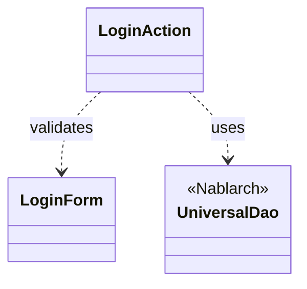
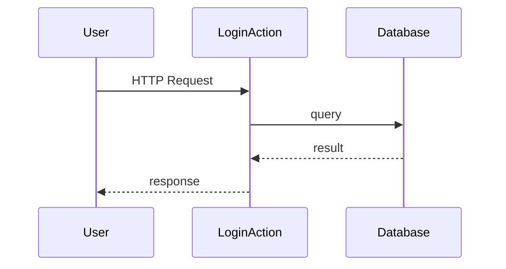

# Code Analysis Workflow

Analyze existing code, trace dependencies, generate structured documentation.

## Overview

**Purpose**:
1. Identify target code and trace dependencies
2. Search relevant Nablarch knowledge
3. Generate documentation

**Input**: User's request (target code specification)

**Output**: Documentation file (Markdown + Mermaid diagrams) in .nabledge/YYYYMMDD/

**Tools**: Read, Glob, Grep, Bash with jq, Write

## Process flow

### Step 0: Record start time (CRITICAL)

**Tool**: Bash

**Action** - Store start time with unique session ID in output directory:
```bash
OUTPUT_DIR=".nabledge/$(date '+%Y%m%d')"
mkdir -p "$OUTPUT_DIR"
UNIQUE_ID="$(date '+%s%3N')-$$"
echo "$UNIQUE_ID" > "$OUTPUT_DIR/.nabledge-code-analysis-id"
date '+%s' > "$OUTPUT_DIR/.nabledge-code-analysis-start-$UNIQUE_ID"
echo "Start time recorded: $(date '+%Y-%m-%d %H:%M:%S')"
echo "Session ID: $UNIQUE_ID"
echo "Output directory: $OUTPUT_DIR"
```

**Output example**:
```
Start time recorded: 2026-02-10 14:54:00
Session ID: 1707559440123-12345
Output directory: .nabledge/20260210
```

**IMPORTANT**:
- Session ID stored in: `.nabledge/YYYYMMDD/.nabledge-code-analysis-id`
- Start time stored in: `.nabledge/YYYYMMDD/.nabledge-code-analysis-start-$UNIQUE_ID`
- UNIQUE_ID format: `{millisecond_timestamp}-{process_PID}`
- Epoch time (seconds since 1970) for accurate duration calculation
- Step 3.5 reads session ID from output directory
- Files stored in same directory as code analysis output
- Keyword search results stored in same directory: `.nabledge/YYYYMMDD/.keyword-search-results.json`
- All intermediate and final outputs must stay in .nabledge/YYYYMMDD/ directory

**Why this matters**: `{{analysis_duration}}` placeholder must contain actual elapsed time. Users compare against "Cooked for X" time in IDE.

---

### Step 1: Identify target and analyze dependencies

**Tools**: AskUserQuestion (if needed), Read, Glob, Grep

**Action** (two-pass approach to control scope):

#### Pass 1: Structure analysis (target file ONLY)

1. **Parse user request** to understand target scope:
   - Specific class (e.g., "LoginAction")
   - Specific feature (e.g., "ログイン機能")
   - Package (e.g., "web.action配下")

2. **Ask clarifying questions** if scope is unclear

3. **Find target files** using Glob or Grep

4. **Read the MAIN target file** (one file only) and extract dependencies by name:
   - Import statements → Class names and packages
   - Field declarations → Type names
   - Method parameters → Parameter types
   - Method calls → Called method names

   **RULE**: In this pass, extract dependency NAMES ONLY from the target file.
   Do NOT read any dependency file contents yet.

5. **Classify dependencies** (by name and package, without reading files):
   - Project code (proman-*): Record for potential deep-dive in Pass 2
   - Nablarch framework: Record for knowledge search
   - JDK/Jakarta EE: Record but don't trace
   - Third-party libraries: Record but don't trace

6. **Build dependency graph** (from target file information only):
   ```
   LoginAction
   ├─→ LoginForm (Form) — inferred from import + field type
   ├─→ SystemAccountEntity (Entity) — inferred from import + "Entity" suffix
   ├─→ UniversalDao (Nablarch) — inferred from nablarch package
   └─→ ExecutionContext (Nablarch) — inferred from nablarch package
   ```

7. **Categorize components** by role:
   - Action/Controller, Form, Entity, Service/Logic, Utility, Handler, Configuration
   - Role inference uses: class name suffix, package name, usage pattern in target

#### Pass 2: Selective deep-dive (budgeted)

8. **Evaluate which dependency files need reading** using these rules:

   | Dependency type | Action | Reason |
   |-----------------|--------|--------|
   | Entity / DTO | Do NOT read | Target file's import + field usage is sufficient |
   | Form | Do NOT read | Annotations visible in target, validation details come from knowledge |
   | Service / Logic | Grep public methods ONLY | `grep "^\s*public " ServiceFile.java` (do NOT read full file) |
   | Complex config | Grep class definition ONLY | `grep "^public class\|^\s*public " ConfigFile.java` |

   **Budget**: Read at most **2 dependency files** via Grep (partial extraction only).
   Full file reads of dependencies are NOT permitted in Step 1.

   **Why this budget**: Measurement data shows reading ProjectDto.java (269 lines) adds 12-30s
   of variability with no improvement in final output quality. Dependency details needed for
   Step 3 documentation can be read at that point (deferred reading).

9. **Identify Nablarch components** for knowledge search:
   - UniversalDao, ValidationUtil, ExecutionContext, Handler chain, etc.

10. **Extract key concepts** for knowledge search:
    - Technical terms: DAO, トランザクション, ハンドラ
    - Operations: 検索, 登録, 更新, バリデーション
    - Patterns: CRUD, pagination, error handling

**Output**: Target file content, dependency graph (name-based), component list with Nablarch components identified, list of deferred reads (files that may need reading in Step 3)

### Step 2: Search Nablarch knowledge

**Tools**: Read (index.toon), Bash with jq (keyword-search workflow)

**Action**: Batch process knowledge searches for all Nablarch components.

#### 2.0: Extract search parameters (CONTEXT BOUNDARY)

Before starting knowledge search, distill Step 1 results into a compact parameter set.
All subsequent search steps use ONLY these parameters, not the full Step 1 context.

**Extract the following** (write them out explicitly before proceeding):

- **nablarch_components**: List of Nablarch class names from Step 1 (max 8)
  - Example: ["UniversalDao", "ExecutionContext", "ObjectMapper", "FilePathSetting"]
- **technical_terms**: Japanese/English technical terms (max 6)
  - Example: ["DAO", "バッチ", "CSV出力", "ファイルパス"]
- **operation_patterns**: What the code does (max 4)
  - Example: ["検索", "出力", "データ変換"]

**Rules**:
- Combined total: max 18 items across all three lists
- If Step 1 identified more items, prioritize by relevance to target code's main function
- These parameters are the ONLY input to the keyword search that follows

**Why this boundary**: Embedded knowledge search runs 36% slower than standalone (33.4s vs 24.6s)
because of accumulated context from Step 1. This explicit extraction step keeps the search lightweight.

**Batch processing**:

1. **Build L1/L2 keywords from search parameters above** (not from full Step 1 context):
   - L1 (technical domains): Derived from nablarch_components + technical_terms
   - L2 (specific functions): Derived from operation_patterns + component-specific terms
   - Example: ["UniversalDao", "ExecutionContext", "ValidationUtil", "DbAccessException"]

2. **Combine keywords for batch search**:
   - Merge component names + technical terms from all components
   - Extract L1/L2 keywords for all components at once

   **Bash script example for keyword combination**:
   ```bash
   # Declare arrays for combined keywords
   declare -a l1_all l2_all

   # UniversalDao component keywords
   l1_all+=("DAO" "UniversalDao" "O/Rマッパー")
   l2_all+=("CRUD" "検索" "登録" "更新" "ページング")

   # ExecutionContext component keywords
   l1_all+=("ExecutionContext" "コンテキスト")
   l2_all+=("リクエスト処理" "データ取得")

   # ValidationUtil component keywords
   l1_all+=("ValidationUtil" "Bean Validation")
   l2_all+=("検証" "エラー" "例外処理")

   # Remove duplicates and prepare for keyword-search workflow
   l1_keywords=($(printf '%s\n' "${l1_all[@]}" | sort -u))
   l2_keywords=($(printf '%s\n' "${l2_all[@]}" | sort -u))
   ```

   **Result** - Combined keywords ready for keyword-search:
     - L1: ["DAO", "UniversalDao", "O/Rマッパー", "ExecutionContext", "コンテキスト", "ValidationUtil", "Bean Validation"]
     - L2: ["CRUD", "検索", "登録", "更新", "ページング", "リクエスト処理", "データ取得", "検証", "エラー", "例外処理"]

3. **Execute keyword-search workflow**:
   - Read `workflows/keyword-search.md`
   - Follow the workflow with combined keywords for all components
   - Expected output: 20-30 candidate sections covering all components

4. **Execute section-judgement workflow**:
   - Read `workflows/section-judgement.md`
   - Follow the workflow with candidate sections from step 3
   - Expected output: Filtered sections (High and Partial relevance only)

5. **Group knowledge by component** after receiving results:
   - Parse returned sections and map to original components
   - Extract unique file paths from section-judgement output
   - Example mappings:
     - UniversalDao → [.claude/skills/nabledge-6/knowledge/features/libraries/universal-dao.json]
     - ValidationUtil → [.claude/skills/nabledge-6/knowledge/features/libraries/data-bind.json]

6. **Collect knowledge file basenames** for Step 3.2:
   - Extract unique knowledge files from section-judgement output
   - Use basenames only (filename without path and extension)
   - Example: `universal-dao,data-bind,web-application`
   - prefill-template.sh will automatically search and include all matches
   - If multiple files with same name exist, script adds category path to labels for disambiguation
   - Deduplicate: Multiple sections may come from same file
   - Format as comma-separated list for --knowledge-files parameter

7. **Collect knowledge content** for documentation:
   - API usage patterns
   - Configuration requirements
   - Code examples
   - Error handling
   - Best practices

**Output**: Full JSON file paths for Step 3.2, and relevant knowledge sections with API usage, patterns, and best practices

### Step 3: Generate and output documentation

**Tools**: Read (template files), Bash (prefill script, mermaid script), Write

**Action**:

#### 3.1: Read template and guide

**MUST READ FIRST** (use single cat command for efficiency):
```bash
cat .claude/skills/nabledge-6/assets/code-analysis-template.md \
    .claude/skills/nabledge-6/assets/code-analysis-template-guide.md \
    .claude/skills/nabledge-6/assets/code-analysis-template-examples.md
```

**Extract from templates**:
- All `{{placeholder}}` variables
- Section structure and order (DO NOT deviate)
- Component Summary Table format
- Nablarch Usage structure with important points (✅ ⚠️ 💡 🎯 ⚡)
- Link generation rules (relative paths + line references)

#### 3.2: Pre-fill deterministic placeholders

**Tool**: Bash (.claude/skills/nabledge-6/scripts/prefill-template.sh)

**Action**: Execute prefill script to pre-populate 8 deterministic placeholders:

```bash
# Execute prefill script (now calculates output path internally)
# Capture output path from the script's final "Output: <path>" line
OUTPUT_PATH=$(.claude/skills/nabledge-6/scripts/prefill-template.sh \
  --target-name "<target-name>" \
  --target-desc "<one-line-description>" \
  --modules "<module1, module2>" \
  --source-files "File1.java,File2.java" \
  --knowledge-files "universal-dao,data-bind,web-application" \
  | grep "^Output: " | cut -d' ' -f2)

echo "Output file: $OUTPUT_PATH"
```

**Parameters**:
- `target-name`: Target code name (e.g., "LoginAction")
- `target-desc`: One-line description (e.g., "ログイン認証処理")
- `modules`: Affected modules (e.g., "proman-web, proman-common")
- `source-files`: Comma-separated source file basenames from Step 1
  - Example: "LoginAction.java,LoginForm.java"
  - **Important**: Pass basenames only (e.g., 'File.java'). Script handles paths defensively but workflows should use basenames.
  - Script searches from project root and includes all matches
  - If multiple files found, directory path added to labels for disambiguation
- `knowledge-files`: Comma-separated knowledge file basenames from Step 2
  - Example: "universal-dao,data-bind" (extension .json is optional)
  - **Important**: Pass basenames without extension (e.g., 'universal-dao'). Script handles paths and .json extension defensively but workflows should use basenames.
  - Script searches in .claude/skills/nabledge-6/knowledge/ and includes all matches
  - Automatically converts .json paths to .md paths
  - If multiple files found, category path added to labels for disambiguation

**Automatic behavior**:
- **Output path**: Script automatically generates output path: `.nabledge/YYYYMMDD/code-analysis-<target-name>.md`
- **Official docs**: Official documentation URLs are automatically extracted from `official_doc_urls` field in knowledge JSON files

**File Resolution**:
- Script searches automatically by basename
- Warns if not found (link omitted, processing continues)
- Includes all matches if multiple files found (with path disambiguation in labels)

**Pre-filled placeholders (8/16)**:
- `{{target_name}}`: From target-name parameter
- `{{generation_date}}`: Current date (auto-generated)
- `{{generation_time}}`: Current time (auto-generated)
- `{{target_description}}`: From target-desc parameter
- `{{modules}}`: From modules parameter
- `{{source_files_links}}`: Generated from source-files parameter
- `{{knowledge_base_links}}`: Generated from knowledge-files parameter
- `{{official_docs_links}}`: Automatically extracted from knowledge JSON files' `official_doc_urls` field

**Output**: Template file with 8 placeholders pre-filled, 8 remaining for LLM

**Error handling**: If script fails:
- Check error message on stderr for specific issue
- Common causes: missing template file, invalid file paths, permission errors
- Verify all source files exist and are readable
- If script succeeds but output is incorrect, verify parameters match expected format

**Validation**: After script completes, verify:
- Output file was created at specified path
  - **If missing**: Check stderr for errors, report to user, HALT workflow
- Script reported "8/16" placeholders filled
  - **If different**: Read output file to inspect which placeholders failed, report to user, HALT workflow
- No error messages on stderr
  - **If errors present**: Report full stderr output to user, HALT workflow

#### 3.3: Generate Mermaid diagram skeletons

**Tool**: Bash (.claude/skills/nabledge-6/scripts/generate-mermaid-skeleton.sh)

**Action**: Generate diagram skeletons to reduce LLM workload:

**Class Diagram Skeleton**:
```bash
.claude/skills/nabledge-6/scripts/generate-mermaid-skeleton.sh \
  --source-files "<file1.java,file2.java>" \
  --diagram-type class
```

**Sequence Diagram Skeleton**:
```bash
.claude/skills/nabledge-6/scripts/generate-mermaid-skeleton.sh \
  --source-files "<main-file.java>" \
  --diagram-type sequence \
  --main-class "<MainClass>"
```

**Output**: Mermaid diagram syntax with:
- Class diagram: class names, basic relationships (extends, implements, uses)
- Sequence diagram: participants, basic flow structure

**LLM refinement needed**:
- Add `<<Nablarch>>` annotations to framework classes
- Add relationship labels (e.g., "validates", "uses", "creates")
- Add detailed method calls and error handling in sequence diagrams
- Add notes and annotations for complex logic

**Error handling**: If script fails:
- Check error message on stderr for specific issue
- Common causes: source file not found, invalid diagram type, parse errors
- Verify all source files are valid Java files
- If output is incomplete, script may have encountered parse error (check file syntax)

**Validation**: After script completes, verify:
- Mermaid syntax is valid (starts with "classDiagram" or "sequenceDiagram")
  - **If invalid**: Report syntax error to user, HALT workflow
- All source files' classes are represented
  - **If missing classes**: Report which classes are missing, HALT workflow
- Basic structure is present (classes/participants + relationships/flow)
  - **If incomplete**: Report what's missing (e.g., "no relationships", "no participants"), HALT workflow

**Storage**: Save outputs for use in Steps 3.4 and 3.5:
- Store class diagram output as `CLASS_DIAGRAM_SKELETON` in working memory
- Store sequence diagram output as `SEQUENCE_DIAGRAM_SKELETON` in working memory
- You will retrieve these skeletons in the following steps

#### 3.4: Build documentation content

**CRITICAL**: All diagram work REFINES skeletons from Step 3.3. REFINE, not REGENERATE.

**Refinement**:
- Start with skeleton structure (classes, participants, relationships present)
- Add semantic information (annotations, labels, control flow)
- Preserve skeleton-generated base structure

**Permitted actions**:
- Add annotations/stereotypes (e.g., `<<Nablarch>>`)
- Add or improve relationship labels (e.g., "validates", "uses", "creates")
- Add control flow elements (`alt`/`else`, `loop`, `Note over`)
- Add missing relationships discovered during analysis
- Fix incorrect relationship types (`--` vs `..`)

**Prohibited actions**:
- Delete skeleton and create new diagram from scratch
- Reorder existing participants/classes
- Remove skeleton-generated relationships
- Change diagram type (class to sequence)

**Exception**: If skeleton is malformed, report error and request manual intervention.

**Refinement workflow**:

**For class diagrams**:
1. Retrieve `CLASS_DIAGRAM_SKELETON` from working memory (saved in Step 3.3)
2. Add `<<Nablarch>>` stereotype to framework classes (UniversalDao, ExecutionContext, etc.)
3. Replace generic labels with specific relationship types (see criteria below)
4. Verify all key dependencies are present (see key dependency criteria below)
5. Preserve all skeleton structure (classes, basic relationships)

**For sequence diagrams**:
1. Retrieve `SEQUENCE_DIAGRAM_SKELETON` from working memory (saved in Step 3.3)
2. Replace generic arrows with specific method names ("execute()", "validate()")
3. Add error handling branches using `alt`/`else` blocks where applicable
4. Add loops for repetitive operations using `loop` blocks
5. Add explanatory notes using `Note over` syntax for complex logic
6. Preserve all skeleton structure (participants, basic flow)

**Dependency diagram** (Mermaid classDiagram):

**Step 1**: Retrieve skeleton from working memory
- Retrieve `CLASS_DIAGRAM_SKELETON` saved in Step 3.3
- This skeleton already contains class names and basic relationships

**Step 2**: Refine skeleton:
- Add `<<Nablarch>>` stereotype to framework classes
- Add specific relationship labels:
  - Data operations: "validates", "serializes", "queries", "persists"
  - Lifecycle operations: "creates", "initializes", "configures"
  - Control flow: "invokes", "delegates to", "calls back"
  - Avoid generic labels: "uses", "calls", "has"
- Verify key dependencies shown:
  - Direct field injection or constructor parameter
  - Method called in primary business logic path
  - Required for transaction or validation
  - Framework class enabling core functionality

**Example**:

```mermaid
classDiagram
    class LoginAction
    class LoginForm
    class UniversalDao {
        <<Nablarch>>
    }

    LoginAction ..> LoginForm : validates
    LoginAction ..> UniversalDao : uses
```

**Key points**:
- Start with skeleton (reduces generation time)
- Use `classDiagram` syntax (NOT `graph TD`)
- Show class names only (NO methods/fields)
- Show inheritance with `--|>`, dependencies with `..>`
- Mark framework classes with `<<Nablarch>>`

**Component summary table**:
```markdown
| Component | Role | Type | Dependencies |
|-----------|------|------|--------------|
| LoginAction | ログイン処理 | Action | LoginForm, UniversalDao |
```

**Flow description with sequence diagram** (Mermaid sequenceDiagram):

**Step 1**: Retrieve skeleton from working memory
- Retrieve `SEQUENCE_DIAGRAM_SKELETON` saved in Step 3.3
- This skeleton already contains participants and basic flow structure

**Step 2**: Refine skeleton with semantic information:
- Add detailed method calls with specific method names (e.g., "execute()", "validate()" instead of generic "request")
- Add error handling branches using `alt`/`else` blocks where applicable
- Add loops for repetitive operations using `loop` blocks
- Add explanatory notes using `Note over` syntax for complex logic

**Example**:

```mermaid
sequenceDiagram
    participant User
    participant Action as LoginAction
    participant DB as Database

    User->>Action: HTTP Request
    Action->>DB: query
    DB-->>Action: result
    Action-->>User: response
```

**Key points**:
- Start with skeleton (reduces generation time)
- Use `->>` for calls, `-->>` for returns
- Use `alt`/`else` for error handling
- Use `loop` for repetition
- Use `Note over` to explain logic

**Component details**:
- Component name and role
- Key methods with line references (`:42-58` format)
- Dependencies
- File path with relative link + line references

**Nablarch usage** (for each component):
- Class name and description
- Code example
- Important points with prefixes: ✅ Must do / ⚠️ Caution / 💡 Benefit / 🎯 When to use / ⚡ Performance
- Usage in this code
- Knowledge base link

**See detailed examples**: assets/code-analysis-template-examples.md

#### 3.5: Fill remaining placeholders and output

1. **Read pre-filled template**: Use Read tool on the file created in Step 3.2
   - File path: `$OUTPUT_PATH` (captured from script output in Step 3.2)
   - This file already contains 8/16 placeholders filled (deterministic content)

2. **Construct complete content**: Build the full document content in memory by:
   - Keeping all pre-filled content from Step 3.2 (8 deterministic placeholders)
   - Replacing 8 remaining placeholders with generated content (see list below)
   - Using refined skeletons from Step 3.3 for diagram placeholders

   **Placeholders to fill** (LLM-generated content):
   - `{{DURATION_PLACEHOLDER}}`: Leave as-is (filled after Write completes in Step 5)
   - `{{overview_content}}`: Overview section (generate)
   - `{{dependency_graph}}`: Mermaid classDiagram (refine skeleton from Step 3.3)
   - `{{component_summary_table}}`: Component table (generate)
   - `{{flow_content}}`: Flow description (generate)
   - `{{flow_sequence_diagram}}`: Mermaid sequenceDiagram (refine skeleton from Step 3.3)
   - `{{components_details}}`: Detailed analysis (generate)
   - `{{nablarch_usage}}`: Framework usage with important points (generate)

   **Already pre-filled (from Step 3.2, keep as-is)**:
   - `{{target_name}}`: Target code name
   - `{{generation_date}}`: Current date
   - `{{generation_time}}`: Current time
   - `{{target_description}}`: One-line description
   - `{{modules}}`: Affected modules
   - `{{source_files_links}}`: Source file links
   - `{{knowledge_base_links}}`: Knowledge base links
   - `{{official_docs_links}}`: Official docs links

   **Important**: For diagram placeholders, retrieve refined skeletons from working memory (`CLASS_DIAGRAM_SKELETON` and `SEQUENCE_DIAGRAM_SKELETON` from Step 3.3).

3. **Verify template compliance** before writing:
   - All template sections present
   - Section order matches template
   - NO section numbers (1., 2., etc.)
   - NO additional sections outside template
   - All placeholders replaced (except {{DURATION_PLACEHOLDER}})
   - Relative links with line references
   - Knowledge base links included
   - Mermaid diagrams refined from skeletons (not regenerated)

4. **Write complete file**: Use Write tool with full document content
   - File path: `$OUTPUT_PATH` (captured from Step 3.2)
   - Content: Complete document with all 16 placeholders filled (8 pre-filled + 8 generated)
   - This will overwrite the pre-filled template from Step 3.2 with the complete version
   - Write tool requires prior Read (already done in step 1)

   **Validation checkpoint**: Before proceeding to Step 5, verify:
   - Write operation succeeded (no error message)
     - **If failed**: Report error to user, HALT workflow
   - Output file path matches expected location
     - **If wrong path**: Report actual path to user, HALT workflow
   - File size is reasonable (typically 10-50 KB for code analysis docs)
     - **If too small (<5 KB)**: Likely missing content, report to user, HALT workflow
     - **If too large (>100 KB)**: Possible duplicate content, report to user, HALT workflow

5. **Calculate duration and update file** (IMMEDIATE execution after Write):

   **CRITICAL SEQUENCING**: Execute time calculation and file update in a single Bash tool call using `&&` to ensure no operations occur between them.

   Execute single bash script to fill duration placeholder:
   ```bash
   # Set output directory path
   OUTPUT_DIR=".nabledge/YYYYMMDD"  # Replace with actual date

   # Retrieve session ID from Step 0
   UNIQUE_ID=$(cat "$OUTPUT_DIR/.nabledge-code-analysis-id" 2>/dev/null || echo "")

   # Get current time
   end_time=$(date '+%s')

   # Calculate duration with error handling
   START_TIME_FILE="$OUTPUT_DIR/.nabledge-code-analysis-start-$UNIQUE_ID"
   if [ -z "$UNIQUE_ID" ] || [ ! -f "$START_TIME_FILE" ]; then
     echo "WARNING: Start time file not found. Duration will be set to '不明'."
     duration_text="不明"
   else
     start_time=$(cat "$START_TIME_FILE")
     duration_seconds=$((end_time - start_time))

     # Format as Japanese text
     if [ $duration_seconds -lt 60 ]; then
       duration_text="約${duration_seconds}秒"
     else
       minutes=$((duration_seconds / 60))
       seconds=$((duration_seconds % 60))
       duration_text="約${minutes}分${seconds}秒"
     fi
   fi

   # Replace duration placeholder in the output file
   sed -i "s/{{DURATION_PLACEHOLDER}}/$duration_text/g" "$OUTPUT_DIR/code-analysis-<target>.md"

   # Clean up temp files
   rm -f "$START_TIME_FILE"
   rm -f "$OUTPUT_DIR/.nabledge-code-analysis-id"

   # Output for user
   echo "Duration: $duration_text"
   ```

   **Replace in command**:
   - `YYYYMMDD`: Actual date directory
   - `<target>`: Actual target name

   **IMPORTANT**:
   - Execute immediately after Step 4 with no other operations between them
   - This script handles: session ID retrieval, duration calculation, and file update
   - **Error handling**: If start time file is missing, duration is set to "不明" (unknown) with warning message
   - Script continues execution even if duration calculation fails, ensuring placeholder is always replaced
   - If sed fails (permission error, file locked, etc.), inform user of the calculated duration so they can manually edit the file

6. **Inform user**: Show output path and actual duration
6. **Inform user**: Show output path and actual duration

**Output**: Documentation file at .nabledge/YYYYMMDD/code-analysis-<target-name>.md

## Output template

**Template file**: `.claude/skills/nabledge-6/assets/code-analysis-template.md`
**Template guide**: `.claude/skills/nabledge-6/assets/code-analysis-template-guide.md`
**Template examples**: `.claude/skills/nabledge-6/assets/code-analysis-template-examples.md`

The template provides structured format with sections:
1. Header (date/time, duration, modules)
2. Overview
3. Architecture (class diagram + component table)
4. Flow (description + sequence diagram)
5. Components (detailed analysis)
6. Nablarch Framework Usage (with important points)
7. References (source files, knowledge base, official docs)

## Error handling

**See SKILL.md "Error Handling Policy" section for comprehensive guidelines.**

Key scenarios:
- **Target code not found**: Ask user for clarification, suggest similar files
- **Dependency analysis too complex**: Ask user to narrow scope
- **Output file already exists**: Ask user whether to overwrite
- **No Nablarch knowledge found**: Note in documentation, proceed with code analysis only

## Best practices

**Template compliance**:
- Read template file before generating content
- Never add section numbers
- Never add sections outside template structure
- Integrate additional info into existing sections as subsections
- Verify compliance before output

**Scope management**:
- Start narrow, expand if needed
- Ask user before expanding
- Document scope boundaries

**Dependency tracing**:
- Stop at framework boundaries
- Stop at Entity classes
- Focus on project-specific code

**Knowledge integration**:
- Only use knowledge from knowledge files
- Cite sources (file + section)
- Don't supplement with external knowledge

**Documentation quality**:
- Keep explanations concise
- Use diagrams for complex relationships
- Provide actionable information
- Link to sources for details

## Example execution

**User request**: "LoginActionを理解したい"

**Step 1**: Identify target and analyze
- Target: LoginAction.java
- Dependencies: LoginForm, SystemAccountEntity, UniversalDao, ExecutionContext
- Components: Action (LoginAction), Form (LoginForm), Entity (SystemAccountEntity), Nablarch (UniversalDao, ExecutionContext)

**Step 2**: Search Nablarch knowledge
- UniversalDao → universal-dao.json:overview, crud sections
- Bean Validation → data-bind.json:validation section

**Step 3**: Generate and output
- Read template files
- Build classDiagram and sequenceDiagram
- Create component summary table
- Write component details with line references
- Write Nablarch usage with important points (✅ ⚠️ 💡)
- Apply template with all placeholders
- Output: .nabledge/20260210/code-analysis-login-action.md

**Summary**: 5 components, 2 diagrams, 2 Nablarch knowledge sections, duration ~2分
