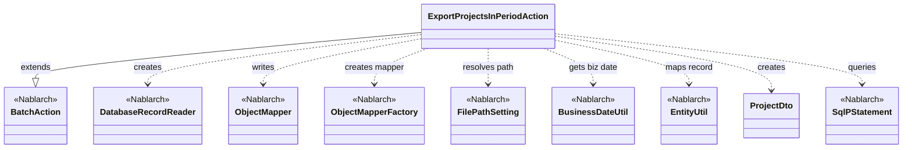
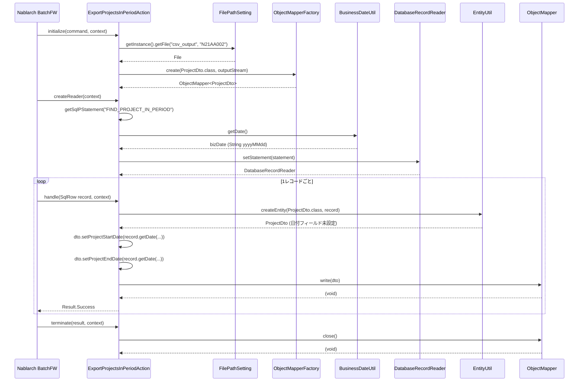

# Code Analysis: ExportProjectsInPeriodAction

**Generated**: 2026-03-07 15:02:26
**Target**: 期間内プロジェクト一覧CSV出力の都度起動バッチアクション
**Modules**: proman-batch
**Analysis Duration**: 約5分5秒

---

## Overview

`ExportProjectsInPeriodAction` は、Nablarch 都度起動バッチアプリケーションのアクションクラス。業務日付を基準に「進行中のプロジェクト（開始日 ≤ 業務日付 ≤ 終了日）」をデータベースから読み込み、CSV ファイルとして出力する。

主要な構成要素は3つ。(1) `BatchAction<SqlRow>` を継承したアクションクラス本体、(2) CSV フォーマットをアノテーションで定義した `ProjectDto`、(3) 検索 SQL を保持する `ExportProjectsInPeriodAction.sql`。

Nablarch のバッチフレームワークが `initialize` → `createReader` → `handle`（レコード数分繰り返し） → `terminate` の順に各メソッドを呼び出す。

---

## Architecture

### Dependency Graph



**Note**: This diagram uses Mermaid `classDiagram` syntax to show class names and their relationships. Use `--|>` for inheritance (extends/implements) and `..>` for dependencies (uses/creates).

### Component Summary

| Component | Role | Type | Dependencies |
|-----------|------|------|--------------|
| ExportProjectsInPeriodAction | 期間内プロジェクト一覧CSV出力バッチアクション | Action | DatabaseRecordReader, ObjectMapper, FilePathSetting, BusinessDateUtil, EntityUtil |
| ProjectDto | プロジェクト情報CSV出力用DTO（フォーマットアノテーション付き） | Bean | なし |
| FIND_PROJECT_IN_PERIOD | 業務日付を基準に進行中プロジェクトを検索するSQL | SQL | なし |

---

## Flow

### Processing Flow

バッチフレームワークが以下の順序でメソッドを呼び出す。

1. **initialize**: `FilePathSetting` で出力先CSVファイルパスを取得し、`ObjectMapperFactory` で `ProjectDto` 用 `ObjectMapper` を生成する。
2. **createReader**: `getSqlPStatement("FIND_PROJECT_IN_PERIOD")` でSQL文を取得し、`BusinessDateUtil.getDate()` で取得した業務日付を開始日・終了日の両パラメータにセットして `DatabaseRecordReader` を返す。
3. **handle**（1レコードごと）: `EntityUtil.createEntity` で `SqlRow` を `ProjectDto` に変換する。日付型フィールド（`PROJECT_START_DATE`, `PROJECT_END_DATE`）は型変換の制約から個別にsetterを呼ぶ。`mapper.write(dto)` でCSVに1行出力し、`Result.Success` を返す。
4. **terminate**: `mapper.close()` でバッファをフラッシュし、ファイルリソースを解放する。

### Sequence Diagram



---

## Components

### ExportProjectsInPeriodAction

**ファイル**: [ExportProjectsInPeriodAction.java](../../.lw/nab-official/v6/nablarch-system-development-guide/Sample_Project/Source_Code/proman-project/proman-batch/src/main/java/com/nablarch/example/proman/batch/project/ExportProjectsInPeriodAction.java)

**役割**: `BatchAction<SqlRow>` を継承した都度起動バッチアクション。DBから1レコードずつ読み込んでCSVに書き出す。

**主要メソッド**:

- `initialize(CommandLine, ExecutionContext)` [L43-54]: `FilePathSetting` でCSV出力先ファイルを取得し `ObjectMapper` を初期化する。
- `createReader(ExecutionContext)` [L56-65]: `FIND_PROJECT_IN_PERIOD` SQLに業務日付をバインドして `DatabaseRecordReader` を生成・返却する。
- `handle(SqlRow, ExecutionContext)` [L67-75]: `EntityUtil` で `SqlRow` → `ProjectDto` 変換後、日付フィールドを手動でセットし `mapper.write(dto)` でCSV出力する。
- `terminate(Result, ExecutionContext)` [L77-80]: `mapper.close()` でリソース解放する。

**依存関係**:
- Nablarch: `BatchAction`, `DatabaseRecordReader`, `ObjectMapper`, `ObjectMapperFactory`, `FilePathSetting`, `BusinessDateUtil`, `EntityUtil`, `SqlPStatement`, `SqlRow`, `ExecutionContext`
- Project: `ProjectDto`

**実装のポイント**:
- `EntityUtil.createEntity` は型が一致するフィールドのみ自動マッピングするため、`Date` 型の `projectStartDate` / `projectEndDate` は `record.getDate()` で取得して手動セットしている（L71-72のコメント参照）。

---

### ProjectDto

**ファイル**: [ProjectDto.java](../../.lw/nab-official/v6/nablarch-system-development-guide/Sample_Project/Source_Code/proman-project/proman-batch/src/main/java/com/nablarch/example/proman/batch/project/ProjectDto.java)

**役割**: CSV出力用データ転送オブジェクト。`@Csv`・`@CsvFormat` アノテーションでCSVフォーマットを宣言的に定義する。

**主要定義**:

- クラスアノテーション [L15-21]: `@Csv(type=CUSTOM, properties=[...], headers=[...])` でプロパティ順とヘッダ名を指定。`@CsvFormat(...)` で区切り文字・文字コード・クォートモードを指定。
- 日付フィールドのsetter [L138-140, L154-156]: `java.util.Date` 型で受け取り `DateUtil.formatDate` で `"yyyy/MM/dd"` 形式の文字列に変換してフィールドにセットする。

**依存関係**: なし（純粋なデータオブジェクト）

---

### FIND_PROJECT_IN_PERIOD (SQL)

**ファイル**: [ExportProjectsInPeriodAction.sql](../../.lw/nab-official/v6/nablarch-system-development-guide/Sample_Project/Source_Code/proman-project/proman-batch/src/main/resources/com/nablarch/example/proman/batch/project/ExportProjectsInPeriodAction.sql)

**役割**: `project` テーブルから業務日付を含む期間のプロジェクトを取得する。

**検索条件**: `project_start_date <= ? AND project_end_date >= ?`（?は業務日付）

**並び順**: `project_start_date, project_end_date, project_name`

---

## Nablarch Framework Usage

### BatchAction

**クラス**: `nablarch.fw.action.BatchAction`

**説明**: 都度起動バッチ・常駐バッチ共通の汎用アクションテンプレートクラス。`initialize`、`createReader`、`handle`、`terminate` の4メソッドをオーバーライドしてバッチ処理を実装する。

**使用方法**:
```java
public class MyBatchAction extends BatchAction<SqlRow> {
    @Override
    protected void initialize(CommandLine command, ExecutionContext context) { /* 前処理 */ }

    @Override
    public DataReader<SqlRow> createReader(ExecutionContext context) {
        return new DatabaseRecordReader();
    }

    @Override
    public Result handle(SqlRow record, ExecutionContext context) {
        // 1レコードの処理
        return new Result.Success();
    }

    @Override
    protected void terminate(Result result, ExecutionContext context) { /* 後処理 */ }
}
```

**重要ポイント**:
- 💡 **DB to FILE パターン**: `DatabaseRecordReader` でDBを読み込み、ObjectMapperでファイル出力する典型パターン
- ✅ **terminate でリソース解放**: `ObjectMapper.close()` は必ず `terminate()` で呼ぶこと
- 🎯 **都度起動バッチ向け**: 定期起動のバッチ処理に適している

**このコードでの使い方**:
- `ExportProjectsInPeriodAction` が `BatchAction<SqlRow>` を継承し、4メソッドをオーバーライド

**詳細**: [Nablarch Batch Architecture](../../.claude/skills/nabledge-6/docs/processing-pattern/nablarch-batch/nablarch-batch-architecture.md)

---

### ObjectMapper / ObjectMapperFactory

**クラス**: `nablarch.common.databind.ObjectMapper`, `nablarch.common.databind.ObjectMapperFactory`

**説明**: CSVやTSV、固定長データをJava Beansとして扱う機能を提供する。Java Beansクラスに定義されたアノテーション（`@Csv`, `@CsvFormat`）をもとにデータを書き込む。

**使用方法**:
```java
ObjectMapper<ProjectDto> mapper = ObjectMapperFactory.create(ProjectDto.class, outputStream);
mapper.write(dto);
mapper.close();
```

**重要ポイント**:
- ✅ **必ず `close()` を呼ぶ**: バッファをフラッシュしリソースを解放する。`terminate()` での実施が適切
- ⚠️ **スレッドアンセーフ**: 複数スレッドで同一インスタンスを共有する場合は同期処理が必要
- 💡 **アノテーション駆動**: `@Csv`, `@CsvFormat` でフォーマットを宣言的に定義できる

**このコードでの使い方**:
- `initialize()` で `ObjectMapperFactory.create(ProjectDto.class, outputStream)` により生成（L50）
- `handle()` で `mapper.write(dto)` により1レコード出力（L73）
- `terminate()` で `mapper.close()` によりリソース解放（L79）

**詳細**: [Libraries Data_bind](../../.claude/skills/nabledge-6/docs/component/libraries/libraries-data_bind.md)

---

### DatabaseRecordReader

**クラス**: `nablarch.fw.reader.DatabaseRecordReader`

**説明**: DBからレコードを1件ずつ読み込む標準データリーダ。`SqlPStatement` をセットし、`DataReadHandler` が `handle` メソッドを繰り返し呼び出す際の入力データ源となる。

**使用方法**:
```java
DatabaseRecordReader reader = new DatabaseRecordReader();
SqlPStatement statement = getSqlPStatement("FIND_PROJECT_IN_PERIOD");
statement.setDate(1, bizDate);
reader.setStatement(statement);
return reader;
```

**重要ポイント**:
- 🎯 **DB入力バッチの標準リーダ**: DB to FILE バッチ処理での標準的なデータ読み込み手段
- ✅ **createReader でインスタンス生成**: `BatchAction.createReader()` をオーバーライドして返す

**このコードでの使い方**:
- `createReader()` で `DatabaseRecordReader` を生成し、SQL文と業務日付パラメータをセット（L58-64）

**詳細**: [Handlers Data_read_handler](../../.claude/skills/nabledge-6/docs/component/handlers/handlers-data_read_handler.md)

---

### FilePathSetting

**クラス**: `nablarch.core.util.FilePathSetting`

**説明**: 論理名とベースパスの対応関係を管理し、論理ファイル名から実際のファイルパスを解決する。コンポーネント設定ファイルで `basePathSettings` と `fileExtensions` を設定して使用する。

**使用方法**:
```java
FilePathSetting filePathSetting = FilePathSetting.getInstance();
File output = filePathSetting.getFile("csv_output", "N21AA002");
```

**重要ポイント**:
- 💡 **論理名でファイルパスを管理**: 環境差異（開発/本番）をコンポーネント設定で吸収できる
- ✅ **コンポーネント名は `filePathSetting` 固定**: 設定ファイルのコンポーネント名を変えてはいけない
- ⚠️ **classpathスキーム非推奨**: JBoss/WildFly環境では動作しないため `file` スキームを使うこと

**このコードでの使い方**:
- `initialize()` で `FilePathSetting.getInstance().getFile("csv_output", "N21AA002")` により出力ファイルを取得（L45-47）

**詳細**: [Libraries File_path_management](../../.claude/skills/nabledge-6/docs/component/libraries/libraries-file_path_management.md)

---

### BusinessDateUtil

**クラス**: `nablarch.core.date.BusinessDateUtil`

**説明**: システムリポジトリに登録された `BusinessDateProvider` から業務日付を取得するユーティリティクラス。業務日付はDBテーブルで管理され、障害時の再実行時にシステムプロパティで上書きも可能。

**使用方法**:
```java
String bizDateStr = BusinessDateUtil.getDate(); // yyyyMMdd 形式の文字列
Date bizDate = new Date(DateUtil.getDate(bizDateStr).getTime());
```

**重要ポイント**:
- 🎯 **バッチ処理での日付基準**: 業務日付はシステム日時ではなくビジネス上の「今日」を表す
- 💡 **再実行対応**: システムプロパティ `-DBasicBusinessDateProvider.<区分>=yyyyMMdd` で日付を上書きできる

**このコードでの使い方**:
- `createReader()` で `BusinessDateUtil.getDate()` → `DateUtil.getDate()` → `java.sql.Date` に変換して SQL パラメータにセット（L60-61）

**詳細**: [Libraries Date](../../.claude/skills/nabledge-6/docs/component/libraries/libraries-date.md)

---

## References

### Source Files

- [ExportProjectsInPeriodAction.java (.lw/nab-official/v6/nablarch-system-development-guide/en/Sample_Project/Source_Code/proman-project/proman-batch/src/main/java/com/nablarch/example/proman/batch/project)](../../.lw/nab-official/v6/nablarch-system-development-guide/en/Sample_Project/Source_Code/proman-project/proman-batch/src/main/java/com/nablarch/example/proman/batch/project/ExportProjectsInPeriodAction.java) - ExportProjectsInPeriodAction
- [ExportProjectsInPeriodAction.java (.lw/nab-official/v6/nablarch-system-development-guide/Sample_Project/Source_Code/proman-project/proman-batch/src/main/java/com/nablarch/example/proman/batch/project)](../../.lw/nab-official/v6/nablarch-system-development-guide/Sample_Project/Source_Code/proman-project/proman-batch/src/main/java/com/nablarch/example/proman/batch/project/ExportProjectsInPeriodAction.java) - ExportProjectsInPeriodAction
- [ProjectDto.java (.lw/nab-official/v6/nablarch-system-development-guide/en/Sample_Project/Source_Code/proman-project/proman-batch/src/main/java/com/nablarch/example/proman/batch/project)](../../.lw/nab-official/v6/nablarch-system-development-guide/en/Sample_Project/Source_Code/proman-project/proman-batch/src/main/java/com/nablarch/example/proman/batch/project/ProjectDto.java) - ProjectDto
- [ProjectDto.java (.lw/nab-official/v6/nablarch-system-development-guide/Sample_Project/Source_Code/proman-project/proman-batch/src/main/java/com/nablarch/example/proman/batch/project)](../../.lw/nab-official/v6/nablarch-system-development-guide/Sample_Project/Source_Code/proman-project/proman-batch/src/main/java/com/nablarch/example/proman/batch/project/ProjectDto.java) - ProjectDto
- [ExportProjectsInPeriodAction.sql (.lw/nab-official/v6/nablarch-system-development-guide/en/Sample_Project/Source_Code/proman-project/proman-batch/src/main/resources/com/nablarch/example/proman/batch/project)](../../.lw/nab-official/v6/nablarch-system-development-guide/en/Sample_Project/Source_Code/proman-project/proman-batch/src/main/resources/com/nablarch/example/proman/batch/project/ExportProjectsInPeriodAction.sql) - ExportProjectsInPeriodAction
- [ExportProjectsInPeriodAction.sql (.lw/nab-official/v6/nablarch-system-development-guide/Sample_Project/Source_Code/proman-project/proman-batch/src/main/resources/com/nablarch/example/proman/batch/project)](../../.lw/nab-official/v6/nablarch-system-development-guide/Sample_Project/Source_Code/proman-project/proman-batch/src/main/resources/com/nablarch/example/proman/batch/project/ExportProjectsInPeriodAction.sql) - ExportProjectsInPeriodAction

### Knowledge Base (Nabledge-6)

- [Nablarch Batch Architecture](../../.claude/skills/nabledge-6/docs/processing-pattern/nablarch-batch/nablarch-batch-architecture.md)
- [Libraries Data_bind](../../.claude/skills/nabledge-6/docs/component/libraries/libraries-data_bind.md)
- [Libraries File_path_management](../../.claude/skills/nabledge-6/docs/component/libraries/libraries-file_path_management.md)
- [Handlers Data_read_handler](../../.claude/skills/nabledge-6/docs/component/handlers/handlers-data_read_handler.md)
- [Libraries Date](../../.claude/skills/nabledge-6/docs/component/libraries/libraries-date.md)

### Official Documentation

- [Architecture](https://nablarch.github.io/docs/LATEST/doc/application_framework/application_framework/batch/nablarch_batch/architecture.html)
- [AsyncMessageSendAction](https://nablarch.github.io/docs/LATEST/javadoc/nablarch/fw/messaging/action/AsyncMessageSendAction.html)
- [BasicBusinessDateProvider](https://nablarch.github.io/docs/LATEST/javadoc/nablarch/core/date/BasicBusinessDateProvider.html)
- [BasicSystemTimeProvider](https://nablarch.github.io/docs/LATEST/javadoc/nablarch/core/date/BasicSystemTimeProvider.html)
- [BatchAction](https://nablarch.github.io/docs/LATEST/javadoc/nablarch/fw/action/BatchAction.html)
- [BeanUtil](https://nablarch.github.io/docs/LATEST/javadoc/nablarch/core/beans/BeanUtil.html)
- [BusinessDateProvider](https://nablarch.github.io/docs/LATEST/javadoc/nablarch/core/date/BusinessDateProvider.html)
- [BusinessDateUtil](https://nablarch.github.io/docs/LATEST/javadoc/nablarch/core/date/BusinessDateUtil.html)
- [CsvDataBindConfig](https://nablarch.github.io/docs/LATEST/javadoc/nablarch/common/databind/csv/CsvDataBindConfig.html)
- [CsvFormat](https://nablarch.github.io/docs/LATEST/javadoc/nablarch/common/databind/csv/CsvFormat.html)
- [Csv](https://nablarch.github.io/docs/LATEST/javadoc/nablarch/common/databind/csv/Csv.html)
- [Data Bind](https://nablarch.github.io/docs/LATEST/doc/application_framework/application_framework/libraries/data_io/data_bind.html)
- [Data Read Handler](https://nablarch.github.io/docs/LATEST/doc/application_framework/application_framework/handlers/standalone/data_read_handler.html)
- [DataBindConfig](https://nablarch.github.io/docs/LATEST/javadoc/nablarch/common/databind/DataBindConfig.html)
- [DataReadHandler](https://nablarch.github.io/docs/LATEST/javadoc/nablarch/fw/handler/DataReadHandler.html)
- [DataReader.NoMoreRecord](https://nablarch.github.io/docs/LATEST/javadoc/nablarch/fw/DataReader.NoMoreRecord.html)
- [DataReader](https://nablarch.github.io/docs/LATEST/javadoc/nablarch/fw/DataReader.html)
- [DatabaseRecordReader](https://nablarch.github.io/docs/LATEST/javadoc/nablarch/fw/reader/DatabaseRecordReader.html)
- [Date](https://nablarch.github.io/docs/LATEST/doc/application_framework/application_framework/libraries/date.html)
- [DispatchHandler](https://nablarch.github.io/docs/LATEST/javadoc/nablarch/fw/handler/DispatchHandler.html)
- [ExecutionContext](https://nablarch.github.io/docs/LATEST/javadoc/nablarch/fw/ExecutionContext.html)
- [Field](https://nablarch.github.io/docs/LATEST/javadoc/nablarch/common/databind/fixedlength/Field.html)
- [File Path Management](https://nablarch.github.io/docs/LATEST/doc/application_framework/application_framework/libraries/file_path_management.html)
- [FileBatchAction](https://nablarch.github.io/docs/LATEST/javadoc/nablarch/fw/action/FileBatchAction.html)
- [FileDataReader](https://nablarch.github.io/docs/LATEST/javadoc/nablarch/fw/reader/FileDataReader.html)
- [FilePathSetting](https://nablarch.github.io/docs/LATEST/javadoc/nablarch/core/util/FilePathSetting.html)
- [FileResponse](https://nablarch.github.io/docs/LATEST/javadoc/nablarch/common/web/download/FileResponse.html)
- [FixedLengthDataBindConfigBuilder](https://nablarch.github.io/docs/LATEST/javadoc/nablarch/common/databind/fixedlength/FixedLengthDataBindConfigBuilder.html)
- [FixedLengthDataBindConfig](https://nablarch.github.io/docs/LATEST/javadoc/nablarch/common/databind/fixedlength/FixedLengthDataBindConfig.html)
- [FixedLength](https://nablarch.github.io/docs/LATEST/javadoc/nablarch/common/databind/fixedlength/FixedLength.html)
- [LineNumber](https://nablarch.github.io/docs/LATEST/javadoc/nablarch/common/databind/LineNumber.html)
- [MultiLayoutConfig.RecordIdentifier](https://nablarch.github.io/docs/LATEST/javadoc/nablarch/common/databind/fixedlength/MultiLayoutConfig.RecordIdentifier.html)
- [MultiLayout](https://nablarch.github.io/docs/LATEST/javadoc/nablarch/common/databind/fixedlength/MultiLayout.html)
- [NoInputDataBatchAction](https://nablarch.github.io/docs/LATEST/javadoc/nablarch/fw/action/NoInputDataBatchAction.html)
- [ObjectMapperFactory](https://nablarch.github.io/docs/LATEST/javadoc/nablarch/common/databind/ObjectMapperFactory.html)
- [ObjectMapper](https://nablarch.github.io/docs/LATEST/javadoc/nablarch/common/databind/ObjectMapper.html)
- [Package-summary](https://nablarch.github.io/docs/LATEST/javadoc/nablarch/common/databind/fixedlength/converter/package-summary.html)
- [PartInfo](https://nablarch.github.io/docs/LATEST/javadoc/nablarch/fw/web/upload/PartInfo.html)
- [ProcessStopHandler.ProcessStop](https://nablarch.github.io/docs/LATEST/javadoc/nablarch/fw/handler/ProcessStopHandler.ProcessStop.html)
- [Result](https://nablarch.github.io/docs/LATEST/javadoc/nablarch/fw/Result.html)
- [ResumeDataReader](https://nablarch.github.io/docs/LATEST/javadoc/nablarch/fw/reader/ResumeDataReader.html)
- [StatusCodeConvertHandler](https://nablarch.github.io/docs/LATEST/javadoc/nablarch/fw/handler/StatusCodeConvertHandler.html)
- [SystemTimeProvider](https://nablarch.github.io/docs/LATEST/javadoc/nablarch/core/date/SystemTimeProvider.html)
- [SystemTimeUtil](https://nablarch.github.io/docs/LATEST/javadoc/nablarch/core/date/SystemTimeUtil.html)
- [ValidatableFileDataReader](https://nablarch.github.io/docs/LATEST/javadoc/nablarch/fw/reader/ValidatableFileDataReader.html)

---

**Note**: This documentation was generated by the code-analysis workflow of the nabledge-6 skill.
