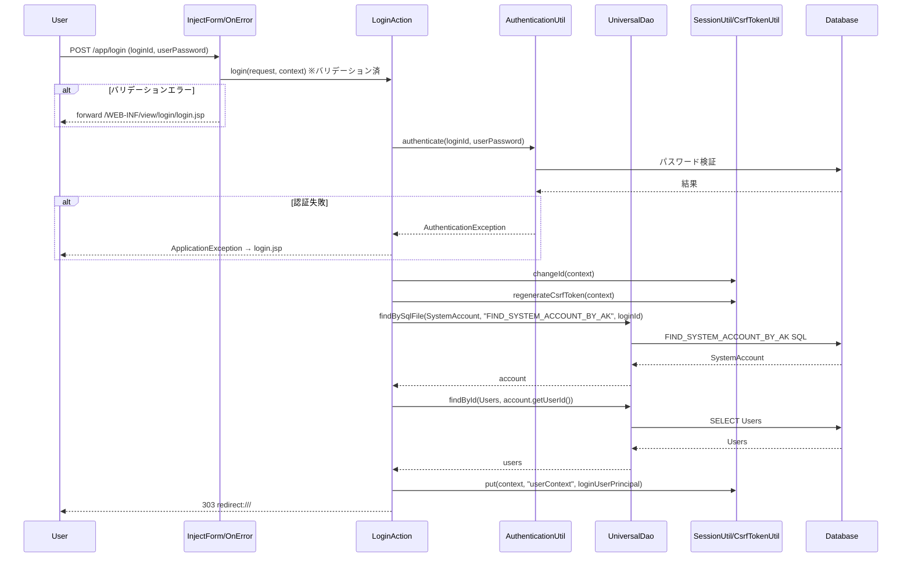

# Code Analysis: LoginAction

**Generated**: 2026-03-07 15:10:46
**Target**: ログイン・ログアウト認証アクション
**Modules**: proman-web
**Analysis Duration**: 約5分8秒

---

## Overview

`LoginAction`はproman-webアプリケーションのログイン・ログアウト機能を担うアクションクラスである。システム利用者の認証処理（ログインID・パスワード検証）、セッション管理（セッションID変更・CSRFトークン再生成）、ログインユーザ情報のセッション保存、およびログアウト時のセッション無効化を実装する。

Nablarchインターセプタ（`@InjectForm`による入力値バインドとバリデーション、`@OnError`によるエラー時のビュー制御）を活用し、シンプルなビジネスロジックに集中した構造になっている。認証の実装は`AuthenticationUtil`に委譲し、ユーザ情報の取得には`UniversalDao`のSQLファイル検索を使用する。

---

## Architecture

### Dependency Graph

```mermaid
classDiagram
    class LoginAction
    class LoginForm {
        <<Form>>
    }
    class AuthenticationUtil {
        <<Utility>>
    }
    class LoginUserPrincipal {
        <<ValueObject>>
    }
    class UniversalDao {
        <<Nablarch>>
    }
    class SessionUtil {
        <<Nablarch>>
    }
    class CsrfTokenUtil {
        <<Nablarch>>
    }
    class SystemAccount {
        <<Entity>>
    }
    class Users {
        <<Entity>>
    }

    LoginAction ..> LoginForm : validates
    LoginAction ..> AuthenticationUtil : delegates to
    LoginAction ..> UniversalDao : queries
    LoginAction ..> SessionUtil : invokes
    LoginAction ..> CsrfTokenUtil : invokes
    LoginAction ..> LoginUserPrincipal : creates
    UniversalDao ..> SystemAccount : persists
    UniversalDao ..> Users : persists
```



**Note**: This diagram uses Mermaid `classDiagram` syntax to show class names and their relationships. Use `--|>` for inheritance (extends/implements) and `..>` for dependencies (uses/creates).

### Component Summary

| Component | Role | Type | Dependencies |
|-----------|------|------|--------------|
| LoginAction | ログイン・ログアウト処理 | Action | LoginForm, AuthenticationUtil, UniversalDao, SessionUtil, CsrfTokenUtil, LoginUserPrincipal |
| LoginForm | ログイン入力値バインド・バリデーション | Form | なし |
| AuthenticationUtil | パスワード認証委譲ユーティリティ | Utility | PasswordAuthenticator (SystemRepository) |
| LoginUserPrincipal | ログインユーザ情報値オブジェクト | ValueObject | なし |
| SystemAccount | システムアカウントエンティティ | Entity | なし |
| Users | ユーザエンティティ | Entity | なし |

---

## Flow

### Processing Flow

ログインリクエストは以下の順序で処理される。

1. **入力値バインド・バリデーション** (`@InjectForm`インターセプタ): リクエストパラメータを`LoginForm`にバインドし、`@Required`・`@Domain`アノテーションでバリデーションを実行する。バリデーションエラーの場合、`@OnError`インターセプタがログイン画面にフォワードする。
2. **認証** (`AuthenticationUtil.authenticate`): `LoginForm`からログインIDとパスワードを取得し、`PasswordAuthenticator`に委譲して認証する。認証失敗時は`AuthenticationException`をキャッチし、`ApplicationException`に変換してスローする。
3. **セッション更新** (`SessionUtil.changeId`, `CsrfTokenUtil.regenerateCsrfToken`): 認証成功後、セッションID変更とCSRFトークン再生成を行いセッション固定攻撃を防ぐ。
4. **ユーザ情報取得** (`UniversalDao.findBySqlFile`, `UniversalDao.findById`): SQLファイル`FIND_SYSTEM_ACCOUNT_BY_AK`でシステムアカウントを取得し、さらにユーザ情報を取得して`LoginUserPrincipal`を生成する。
5. **セッション保存・リダイレクト** (`SessionUtil.put`): ユーザコンテキストをセッションに格納し、トップ画面（`/`）に303リダイレクトする。

ログアウトは`SessionUtil.invalidate`でセッションを破棄し、ログイン画面にリダイレクトする。

### Sequence Diagram



---

## Components

### LoginAction

**ファイル**: [LoginAction.java](../../.lw/nab-official/v6/nablarch-system-development-guide/Sample_Project/Source_Code/proman-project/proman-web/src/main/java/com/nablarch/example/proman/web/login/LoginAction.java)

**役割**: ログイン・ログアウトを担うアクションクラス。Nablarchのハンドラキュー上で動作し、インターセプタで横断的処理（バリデーション・エラーハンドリング）を委譲する。

**主要メソッド**:

- `index(HttpRequest, ExecutionContext)` (L38-40): ログイン画面を表示する。単純にlogin.jspにフォワードするのみ。
- `login(HttpRequest, ExecutionContext)` (L49-71): ログイン処理本体。`@InjectForm`・`@OnError`インターセプタを付与。認証→セッション更新→ユーザ情報取得→リダイレクトを実行。
- `createLoginUserContext(String)` (L79-93): プライベートメソッド。ログインIDを受け取り、`UniversalDao`でシステムアカウントとユーザ情報を取得して`LoginUserPrincipal`を生成する。
- `logout(HttpRequest, ExecutionContext)` (L102-106): セッション無効化後、ログイン画面にリダイレクト。

**依存コンポーネント**: LoginForm, AuthenticationUtil, UniversalDao, SessionUtil, CsrfTokenUtil, LoginUserPrincipal, SystemAccount, Users

---

### LoginForm

**ファイル**: [LoginForm.java](../../.lw/nab-official/v6/nablarch-system-development-guide/Sample_Project/Source_Code/proman-project/proman-web/src/main/java/com/nablarch/example/proman/web/login/LoginForm.java)

**役割**: ログイン入力値（ログインID・パスワード）をバインドするフォームクラス。`@Required`と`@Domain`アノテーションで入力バリデーションを宣言的に定義する。

**主要フィールド**:
- `loginId` (L23): `@Required` + `@Domain("loginId")` でバリデーション
- `userPassword` (L28): `@Required` + `@Domain("userPassword")` でバリデーション

**依存コンポーネント**: なし（Nablarchバリデーションアノテーションのみ）

---

### AuthenticationUtil

**ファイル**: [AuthenticationUtil.java](../../.lw/nab-official/v6/nablarch-system-development-guide/Sample_Project/Source_Code/proman-project/proman-web/src/main/java/com/nablarch/example/proman/web/common/authentication/AuthenticationUtil.java)

**役割**: 認証処理を`PasswordAuthenticator`に委譲するユーティリティクラス。`SystemRepository`からコンポーネントを取得し、疎結合な認証実装を実現する。

**主要メソッド**:
- `authenticate(String, String)` (L62-66): `SystemRepository`から`authenticator`コンポーネントを取得し、`PasswordAuthenticator.authenticate()`を呼び出す。
- `encryptPassword(String, String)` (L44-47): パスワード暗号化ユーティリティ（LoginActionからは直接使用されていない）。

**依存コンポーネント**: PasswordAuthenticator, PasswordEncryptor (SystemRepository経由)

---

### LoginUserPrincipal

**ファイル**: [LoginUserPrincipal.java](../../.lw/nab-official/v6/nablarch-system-development-guide/Sample_Project/Source_Code/proman-project/proman-web/src/main/java/com/nablarch/example/proman/web/common/authentication/context/LoginUserPrincipal.java)

**役割**: ログインユーザ情報を保持する値オブジェクト。`Serializable`を実装してセッションへの格納を可能にする。

**主要フィールド**: userId, kanjiName, pmFlag, lastLoginDateTime

**依存コンポーネント**: なし

---

## Nablarch Framework Usage

### UniversalDao

**クラス**: `nablarch.common.dao.UniversalDao`

**説明**: JPAアノテーションを付与したEntityクラスを使って、SQLを自動生成またはSQLファイルから実行するデータベースアクセス機能。

**使用方法**:
```java
// SQLファイルを使った検索（LoginActionで使用）
SystemAccount account = UniversalDao.findBySqlFile(
    SystemAccount.class,
    "FIND_SYSTEM_ACCOUNT_BY_AK",
    new Object[]{loginId}
);

// 主キーで検索（LoginActionで使用）
Users users = UniversalDao.findById(Users.class, account.getUserId());
```

**重要ポイント**:
- ✅ **SQLファイルパスはEntityのFQCNから自動導出**: `com.example.SystemAccount`の場合、`com/example/SystemAccount.sql`が使われる。SQL IDに`#`を含めることで別ファイルのSQLを指定することも可能。
- ⚠️ **`findBySqlFile`は単一件ヒットを期待**: 0件・複数件の場合は例外。ログイン処理では一意なログインIDで検索するため問題ないが、設計上注意が必要。
- 💡 **トランザクション管理は不要**: `UniversalDao`のCRUD操作はNablarchのトランザクション制御ハンドラが自動管理する。

**このコードでの使い方**:
- `createLoginUserContext()`内でログインIDをキーにシステムアカウントを取得（L80-82）
- 取得したアカウントのユーザIDでユーザ情報を取得（L83）

**詳細**: [Libraries Universal_dao](../../.claude/skills/nabledge-6/docs/component/libraries/libraries-universal_dao.md)

---

### @InjectForm / @OnError（Nablarchインターセプタ）

**クラス**: `nablarch.common.web.interceptor.InjectForm` / `nablarch.fw.web.interceptor.OnError`

**説明**: Nablarchのインターセプタ機能。ハンドラキューに動的に追加される横断的処理ハンドラで、アクションメソッドにアノテーションを付与するだけで機能する。

**使用方法**:
```java
@OnError(type = ApplicationException.class, path = "/WEB-INF/view/login/login.jsp")
@InjectForm(form = LoginForm.class)
public HttpResponse login(HttpRequest request, ExecutionContext context) {
    LoginForm form = context.getRequestScopedVar("form");
    // バリデーション済みのformが取得可能
}
```

**重要ポイント**:
- ✅ **インターセプタの実行順序**: Nablarchデフォルトでは `OnDoubleSubmission` → `UseToken` → `OnErrors` → `OnError` → `InjectForm` の順。`InjectForm`が最後に実行されるためバリデーション後にフォームがセットされる。
- ⚠️ **実行順序は設定ファイルで明示**: JVM依存にならないよう、`Interceptor.Factory`設定で実行順を明示すること。
- 💡 **アクションクラスの責務集中**: バリデーションや例外ハンドリングをインターセプタに委譲することでアクションのビジネスロジックがシンプルになる。

**このコードでの使い方**:
- `login()`メソッドに`@InjectForm(form = LoginForm.class)`を付与（L50）: リクエストパラメータのバインドとバリデーションを自動実行、バリデーション済みフォームを`"form"`スコープ変数にセット
- `login()`メソッドに`@OnError(type = ApplicationException.class, ...)`を付与（L49）: `ApplicationException`発生時にlogin.jspへフォワード

**詳細**: [About Nablarch Architecture](../../.claude/skills/nabledge-6/docs/about/about-nablarch/about-nablarch-architecture.md)

---

### SessionUtil / CsrfTokenUtil

**クラス**: `nablarch.common.web.session.SessionUtil` / `nablarch.common.web.csrf.CsrfTokenUtil`

**説明**: セッション管理とCSRF対策のユーティリティクラス。

**使用方法**:
```java
// ログイン成功後のセッション固定攻撃対策
SessionUtil.changeId(context);              // セッションID変更
CsrfTokenUtil.regenerateCsrfToken(context); // CSRFトークン再生成

// セッションへのデータ格納
SessionUtil.put(context, "userContext", userContext);

// ログアウト時のセッション破棄
SessionUtil.invalidate(context);
```

**重要ポイント**:
- ✅ **ログイン成功後は必ずセッションIDを変更**: セッション固定攻撃対策としてIPAセキュリティチェックリスト4-(iv)-aで必須とされている（ただしNablarchはExampleでの実装例として提供）。
- ✅ **CSRFトークンはセッションID変更後に再生成**: セッション更新と同時にCSRFトークンも更新することでCSRF攻撃を防ぐ。
- ⚠️ **`invalidate()`はセッション全体を破棄**: ログアウト時にすべてのセッション情報が消去される。

**このコードでの使い方**:
- 認証成功直後に`SessionUtil.changeId(context)`でセッションID変更（L65）
- `CsrfTokenUtil.regenerateCsrfToken(context)`でCSRFトークン再生成（L66）
- `SessionUtil.put(context, "userContext", userContext)`でユーザコンテキストを格納（L69）
- `logout()`で`SessionUtil.invalidate(context)`を呼び出してセッション無効化（L103）

**詳細**: [Security Check](../../.claude/skills/nabledge-6/docs/check/security-check/security-check.md)

---

## References

### Source Files

- [LoginAction.java (.lw/nab-official/v6/nablarch-system-development-guide/en/Sample_Project/Source_Code/proman-project/proman-web/src/main/java/com/nablarch/example/proman/web/login)](../../.lw/nab-official/v6/nablarch-system-development-guide/en/Sample_Project/Source_Code/proman-project/proman-web/src/main/java/com/nablarch/example/proman/web/login/LoginAction.java) - LoginAction
- [LoginAction.java (.lw/nab-official/v6/nablarch-system-development-guide/Sample_Project/Source_Code/proman-project/proman-web/src/main/java/com/nablarch/example/proman/web/login)](../../.lw/nab-official/v6/nablarch-system-development-guide/Sample_Project/Source_Code/proman-project/proman-web/src/main/java/com/nablarch/example/proman/web/login/LoginAction.java) - LoginAction
- [LoginForm.java (.lw/nab-official/v6/nablarch-system-development-guide/en/Sample_Project/Source_Code/proman-project/proman-web/src/main/java/com/nablarch/example/proman/web/login)](../../.lw/nab-official/v6/nablarch-system-development-guide/en/Sample_Project/Source_Code/proman-project/proman-web/src/main/java/com/nablarch/example/proman/web/login/LoginForm.java) - LoginForm
- [LoginForm.java (.lw/nab-official/v6/nablarch-system-development-guide/Sample_Project/Source_Code/proman-project/proman-web/src/main/java/com/nablarch/example/proman/web/login)](../../.lw/nab-official/v6/nablarch-system-development-guide/Sample_Project/Source_Code/proman-project/proman-web/src/main/java/com/nablarch/example/proman/web/login/LoginForm.java) - LoginForm
- [AuthenticationUtil.java (.lw/nab-official/v6/nablarch-system-development-guide/en/Sample_Project/Source_Code/proman-project/proman-web/src/main/java/com/nablarch/example/proman/web/common/authentication)](../../.lw/nab-official/v6/nablarch-system-development-guide/en/Sample_Project/Source_Code/proman-project/proman-web/src/main/java/com/nablarch/example/proman/web/common/authentication/AuthenticationUtil.java) - AuthenticationUtil
- [AuthenticationUtil.java (.lw/nab-official/v6/nablarch-system-development-guide/Sample_Project/Source_Code/proman-project/proman-web/src/main/java/com/nablarch/example/proman/web/common/authentication)](../../.lw/nab-official/v6/nablarch-system-development-guide/Sample_Project/Source_Code/proman-project/proman-web/src/main/java/com/nablarch/example/proman/web/common/authentication/AuthenticationUtil.java) - AuthenticationUtil
- [LoginUserPrincipal.java (.lw/nab-official/v6/nablarch-system-development-guide/en/Sample_Project/Source_Code/proman-project/proman-web/src/main/java/com/nablarch/example/proman/web/common/authentication/context)](../../.lw/nab-official/v6/nablarch-system-development-guide/en/Sample_Project/Source_Code/proman-project/proman-web/src/main/java/com/nablarch/example/proman/web/common/authentication/context/LoginUserPrincipal.java) - LoginUserPrincipal
- [LoginUserPrincipal.java (.lw/nab-official/v6/nablarch-system-development-guide/Sample_Project/Source_Code/proman-project/proman-web/src/main/java/com/nablarch/example/proman/web/common/authentication/context)](../../.lw/nab-official/v6/nablarch-system-development-guide/Sample_Project/Source_Code/proman-project/proman-web/src/main/java/com/nablarch/example/proman/web/common/authentication/context/LoginUserPrincipal.java) - LoginUserPrincipal

### Knowledge Base (Nabledge-6)

- [Libraries Universal_dao](../../.claude/skills/nabledge-6/docs/component/libraries/libraries-universal_dao.md)
- [About Nablarch Architecture](../../.claude/skills/nabledge-6/docs/about/about-nablarch/about-nablarch-architecture.md)
- [Security Check](../../.claude/skills/nabledge-6/docs/check/security-check/security-check.md)

### Official Documentation


- [252](https://fintan.jp/page/252/)
- [Architecture](https://nablarch.github.io/docs/LATEST/doc/application_framework/application_framework/nablarch/architecture.html)
- [BasicDaoContextFactory](https://nablarch.github.io/docs/LATEST/javadoc/nablarch/common/dao/BasicDaoContextFactory.html)
- [ConnectionFactory](https://nablarch.github.io/docs/LATEST/javadoc/nablarch/core/db/connection/ConnectionFactory.html)
- [DatabaseMetaDataExtractor](https://nablarch.github.io/docs/LATEST/javadoc/nablarch/common/dao/DatabaseMetaDataExtractor.html)
- [Date](https://nablarch.github.io/docs/LATEST/javadoc/java/sql/Date.html)
- [DeferredEntityList](https://nablarch.github.io/docs/LATEST/javadoc/nablarch/common/dao/DeferredEntityList.html)
- [Dialect](https://nablarch.github.io/docs/LATEST/javadoc/nablarch/core/db/dialect/Dialect.html)
- [EntityList](https://nablarch.github.io/docs/LATEST/javadoc/nablarch/common/dao/EntityList.html)
- [GenerationType](https://nablarch.github.io/docs/LATEST/javadoc/jakarta/persistence/GenerationType.html)
- [H2Dialect](https://nablarch.github.io/docs/LATEST/javadoc/nablarch/core/db/dialect/H2Dialect.html)
- [InjectForm](https://nablarch.github.io/docs/LATEST/javadoc/nablarch/common/web/interceptor/InjectForm.html)
- [Integer](https://nablarch.github.io/docs/LATEST/javadoc/java/lang/Integer.html)
- [Interceptor.Factory](https://nablarch.github.io/docs/LATEST/javadoc/nablarch/fw/Interceptor.Factory.html)
- [Long](https://nablarch.github.io/docs/LATEST/javadoc/java/lang/Long.html)
- [OnDoubleSubmission](https://nablarch.github.io/docs/LATEST/javadoc/nablarch/common/web/token/OnDoubleSubmission.html)
- [OnError](https://nablarch.github.io/docs/LATEST/javadoc/nablarch/fw/web/interceptor/OnError.html)
- [OnErrors](https://nablarch.github.io/docs/LATEST/javadoc/nablarch/fw/web/interceptor/OnErrors.html)
- [OptimisticLockException](https://nablarch.github.io/docs/LATEST/javadoc/jakarta/persistence/OptimisticLockException.html)
- [Pagination](https://nablarch.github.io/docs/LATEST/javadoc/nablarch/common/dao/Pagination.html)
- [SimpleDbTransactionManager](https://nablarch.github.io/docs/LATEST/javadoc/nablarch/core/db/transaction/SimpleDbTransactionManager.html)
- [TransactionFactory](https://nablarch.github.io/docs/LATEST/javadoc/nablarch/core/transaction/TransactionFactory.html)
- [Universal Dao](https://nablarch.github.io/docs/LATEST/doc/application_framework/application_framework/libraries/database/universal_dao.html)
- [UniversalDao.Transaction](https://nablarch.github.io/docs/LATEST/javadoc/nablarch/common/dao/UniversalDao.Transaction.html)
- [UniversalDao](https://nablarch.github.io/docs/LATEST/javadoc/nablarch/common/dao/UniversalDao.html)
- [UseToken](https://nablarch.github.io/docs/LATEST/javadoc/nablarch/common/web/token/UseToken.html)

---

**Note**: This documentation was generated by the code-analysis workflow of the nabledge-6 skill.
