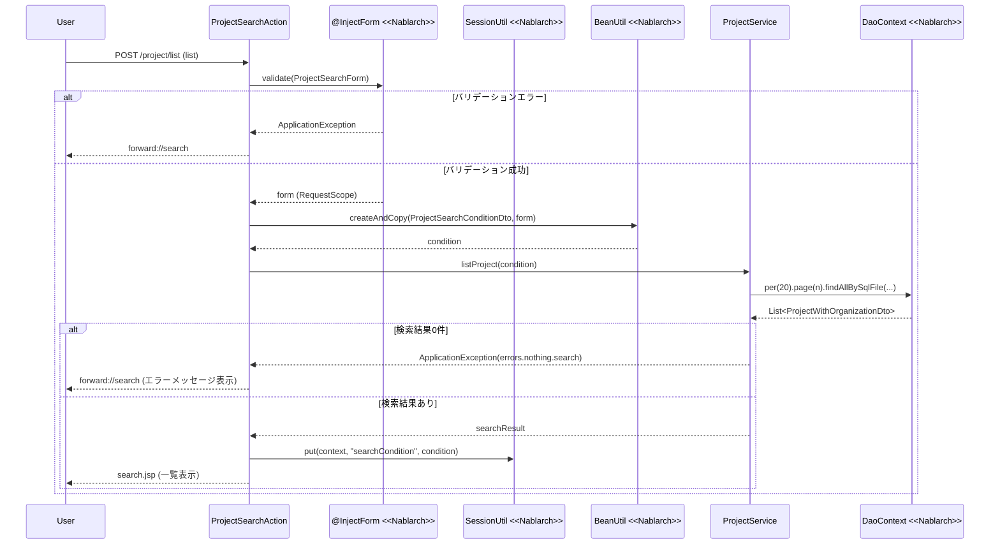

# Code Analysis: ProjectSearchAction

**Generated**: 2026-03-07 15:18:07
**Target**: プロジェクト検索・一覧表示・詳細表示アクション
**Modules**: proman-web
**Analysis Duration**: 約5分11秒

---

## Overview

`ProjectSearchAction` はプロジェクト管理Webアプリケーションにおける検索・一覧・詳細表示を担うアクションクラスです。4つのHTTPハンドラメソッドを提供します：初期表示（`search`）、一覧検索（`list`）、詳細画面への戻り（`backToList`）、詳細表示（`detail`）。

入力バリデーションは `@InjectForm` インターセプターで宣言的に処理し、バリデーションエラー時は `@OnError` で検索画面へフォワードします。検索条件はセッションに保存し、詳細画面から戻った際に復元します。データアクセスは `ProjectService` に委譲し、サービス内で `DaoContext`（UniversalDao）を使ってページング付き検索を実行します。

---

## Architecture

### Dependency Graph

```mermaid
classDiagram
    class ProjectSearchAction
    class ProjectSearchForm {
        <<Form>>
    }
    class ProjectSearchConditionDto {
        <<DTO>>
    }
    class ProjectService
    class ProjectDetailInitialForm {
        <<Form>>
    }
    class ProjectWithOrganizationDto {
        <<DTO>>
    }
    class SearchFormBase {
        <<Nablarch>>
    }
    class Project {
        <<Entity>>
    }
    class DaoContext {
        <<Nablarch>>
    }
    class SessionUtil {
        <<Nablarch>>
    }
    class BeanUtil {
        <<Nablarch>>
    }
    class ExecutionContext {
        <<Nablarch>>
    }

    ProjectSearchForm--|>SearchFormBase : extends
    ProjectWithOrganizationDto--|>Project : extends
    ProjectSearchAction ..> ProjectSearchForm : validates
    ProjectSearchAction ..> ProjectDetailInitialForm : validates
    ProjectSearchAction ..> ProjectSearchConditionDto : creates
    ProjectSearchAction ..> ProjectService : delegates to
    ProjectSearchAction ..> SessionUtil : uses
    ProjectSearchAction ..> BeanUtil : uses
    ProjectSearchAction ..> ExecutionContext : uses
    ProjectService ..> DaoContext : queries
    ProjectService ..> ProjectWithOrganizationDto : returns
    ProjectSearchConditionDto ..|> Serializable : implements
    ProjectSearchForm ..|> Serializable : implements
    ProjectDetailInitialForm ..|> Serializable : implements
```



**Note**: This diagram uses Mermaid `classDiagram` syntax to show class names and their relationships. Use `--|>` for inheritance (extends/implements) and `..>` for dependencies (uses/creates).

### Component Summary

| Component | Role | Type | Dependencies |
|-----------|------|------|--------------|
| ProjectSearchAction | プロジェクト検索・一覧・詳細表示制御 | Action | ProjectSearchForm, ProjectDetailInitialForm, ProjectService, SessionUtil, BeanUtil, ExecutionContext |
| ProjectSearchForm | 検索条件の入力・バリデーション | Form | SearchFormBase, @Domain, @AssertTrue |
| ProjectSearchConditionDto | 検索条件の受け渡しDTO | DTO | なし |
| ProjectService | プロジェクトデータアクセスサービス | Service | DaoContext（UniversalDao） |
| ProjectDetailInitialForm | 詳細画面初期表示フォーム | Form | @Required, @Domain |
| ProjectWithOrganizationDto | 組織情報付きプロジェクト検索結果 | DTO | Project（Entity） |

---

## Flow

### Processing Flow

**一覧検索フロー（`list`メソッド）**:

1. `@InjectForm(form = ProjectSearchForm.class, prefix = "form")` がHTTPリクエストからフォームを生成し、Bean Validationを実行する
2. バリデーションエラー時は `@OnError(type = ApplicationException.class, path = "forward://search")` で検索画面にフォワード
3. リクエストスコープから `ProjectSearchForm` を取得し、ページ番号が未設定なら "1" をセット（Line 54-57）
4. `BeanUtil.createAndCopy()` でフォームを `ProjectSearchConditionDto` に変換（Line 58）
5. `ProjectService.listProject()` で検索実行、結果をリクエストスコープに設定（Line 61）
6. `SessionUtil.put()` で検索条件をセッションに保存（Line 66）
7. 検索画面JSPへレスポンス（Line 68）

**検索画面戻りフロー（`backToList`メソッド）**:

1. `SessionUtil.get()` でセッションから保存済み検索条件を取得（Line 81）
2. 検索を再実行してリクエストスコープに結果をセット
3. `BeanUtil.createAndCopy()` で条件をフォームに逆変換し、入力値を復元（Line 85）

**詳細表示フロー（`detail`メソッド）**:

1. `@InjectForm(form = ProjectDetailInitialForm.class)` でプロジェクトIDをバリデーション
2. `ProjectService.findProjectByIdWithOrganization()` でプロジェクト詳細を1件取得
3. 詳細画面JSPへレスポンス

### Sequence Diagram



---

## Components

### ProjectSearchAction

**ファイル**: [ProjectSearchAction.java](../../.lw/nab-official/v6/nablarch-system-development-guide/Sample_Project/Source_Code/proman-project/proman-web/src/main/java/com/nablarch/example/proman/web/project/ProjectSearchAction.java)

**役割**: プロジェクト検索・一覧表示・詳細表示を担うWebアクションクラス。

**キーメソッド**:

- `search(HttpRequest, ExecutionContext)` (Line 35-40): 検索画面の初期表示。セッションから前回条件を削除し、組織情報をリクエストスコープに設定する。
- `list(HttpRequest, ExecutionContext)` (Line 49-69): `@InjectForm`・`@OnError` 付き。フォームをDTOに変換後、検索実行・セッション保存・画面遷移。
- `backToList(HttpRequest, ExecutionContext)` (Line 79-91): セッションから検索条件を復元し、再検索・フォーム復元を行う。
- `detail(HttpRequest, ExecutionContext)` (Line 101-109): プロジェクトIDを受け取り、詳細1件を取得して詳細画面へ。

**依存関係**: ProjectSearchForm, ProjectDetailInitialForm, ProjectSearchConditionDto, ProjectService, SessionUtil, BeanUtil, ExecutionContext, ApplicationException, MessageUtil

---

### ProjectSearchForm

**ファイル**: [ProjectSearchForm.java](../../.lw/nab-official/v6/nablarch-system-development-guide/Sample_Project/Source_Code/proman-project/proman-web/src/main/java/com/nablarch/example/proman/web/project/ProjectSearchForm.java)

**役割**: 検索条件の入力値を保持し、Bean Validationでバリデーションを実行するフォームクラス。

**キーメソッド**:

- `isValidProjectSalesRange()` (Line 295-297): `@AssertTrue` で売上高FROM/TOの大小関係を検証。
- `isValidProjectStartDateRange()` (Line 306-308): 開始日FROM/TOの日付順序を検証。
- `isValidProjectEndDateRange()` (Line 318-320): 終了日FROM/TOの日付順序を検証。

**依存関係**: SearchFormBase, @Domain, @AssertTrue, MoneyRelationUtil, DateRelationUtil

---

### ProjectService

**ファイル**: [ProjectService.java](../../.lw/nab-official/v6/nablarch-system-development-guide/Sample_Project/Source_Code/proman-project/proman-web/src/main/java/com/nablarch/example/proman/web/project/ProjectService.java)

**役割**: プロジェクトおよび組織のデータアクセスを担うサービスクラス。UniversalDao（DaoContext）経由でDBアクセスする。

**キーメソッド**:

- `listProject(ProjectSearchConditionDto)` (Line 99-104): ページング付きプロジェクト一覧検索。`per(20).page(n).findAllBySqlFile()` を使用。
- `findProjectByIdWithOrganization(Integer)` (Line 112-116): プロジェクトIDで1件検索。`findBySqlFile()` を使用。
- `findAllDivision()` / `findAllDepartment()` (Line 50-61): 事業部・部門の全件取得。`findAllBySqlFile()` を使用。

**依存関係**: DaoContext, DaoFactory, Project (Entity), Organization (Entity), ProjectWithOrganizationDto

---

### ProjectSearchConditionDto

**ファイル**: [ProjectSearchConditionDto.java](../../.lw/nab-official/v6/nablarch-system-development-guide/Sample_Project/Source_Code/proman-project/proman-web/src/main/java/com/nablarch/example/proman/web/project/ProjectSearchConditionDto.java)

**役割**: フォームからServiceへ検索条件を受け渡すDTO。SQLへのパラメータバインド用。ページ番号（`pageNumber`）も含む。

**依存関係**: なし（純粋なデータオブジェクト）

---

### ProjectDetailInitialForm

**ファイル**: [ProjectDetailInitialForm.java](../../.lw/nab-official/v6/nablarch-system-development-guide/Sample_Project/Source_Code/proman-project/proman-web/src/main/java/com/nablarch/example/proman/web/project/ProjectDetailInitialForm.java)

**役割**: 詳細画面初期表示用フォーム。プロジェクトIDのみを保持し `@Required`・`@Domain` でバリデーション。

**依存関係**: @Required, @Domain

---

### ProjectWithOrganizationDto

**ファイル**: [ProjectWithOrganizationDto.java](../../.lw/nab-official/v6/nablarch-system-development-guide/Sample_Project/Source_Code/proman-project/proman-web/src/main/java/com/nablarch/example/proman/web/project/ProjectWithOrganizationDto.java)

**役割**: 検索結果DTOで `Project` エンティティを継承し、事業部名（`divisionName`）・部門名（`organizationName`）を追加保持する。

**依存関係**: Project (Entity)

---

## Nablarch Framework Usage

### DaoContext (UniversalDao)

**クラス**: `nablarch.common.dao.DaoContext`

**説明**: Nablarchが提供するO/Rマッパー。SQLファイルベースの検索やCRUD操作、ページング検索をサポートする。

**使用方法**:
```java
// ページング付き検索
List<ProjectWithOrganizationDto> result = universalDao
    .per(RECORDS_PER_PAGE)
    .page(condition.getPageNumber())
    .findAllBySqlFile(ProjectWithOrganizationDto.class, "FIND_PROJECT_WITH_ORGANIZATION", condition);

// 1件検索
ProjectWithOrganizationDto project = universalDao
    .findBySqlFile(ProjectWithOrganizationDto.class, "FIND_PROJECT_WITH_ORGANIZATION_BY_PROJECT_ID", condition);
```

**重要ポイント**:
- ✅ **ページング前に`per()`と`page()`を呼ぶ**: `per()`で1ページあたりの件数、`page()`でページ番号を指定。呼び出し順は`per().page()`の順。
- ⚠️ **件数取得SQLが先に発行される**: ページング時は件数取得のSQLが自動で発行されるため、パフォーマンスに影響する場合はカスタムSQLを検討する。
- 💡 **条件Beanを直接渡せる**: `findAllBySqlFile()` の第3引数に検索条件Beanを渡すと、BeanのプロパティがSQL2.0式のバインド変数に自動マッピングされる。

**このコードでの使い方**:
- `ProjectService.listProject()` (Line 99-104) で `per(20).page(condition.getPageNumber())` でページング設定後、`findAllBySqlFile()` に `ProjectSearchConditionDto` を渡して検索実行
- `ProjectService.findProjectByIdWithOrganization()` (Line 112-116) で `findBySqlFile()` により1件取得

**詳細**: [Libraries Universal_dao](../../.claude/skills/nabledge-6/docs/component/libraries/libraries-universal_dao.md)

---

### SessionUtil

**クラス**: `nablarch.common.web.session.SessionUtil`

**説明**: Webセッションへの値の保存・取得・削除を行うユーティリティクラス。型安全なセッション操作を提供する。

**使用方法**:
```java
// セッションに保存
SessionUtil.put(context, "searchCondition", condition);

// セッションから取得
ProjectSearchConditionDto condition = SessionUtil.get(context, "searchCondition");

// セッションから削除
SessionUtil.delete(context, "searchCondition");
```

**重要ポイント**:
- ✅ **初期表示時に必ずdelete()**: `search()` メソッドで `SessionUtil.delete()` を呼び、前回の検索条件をクリアしてから初期表示する（Line 36）。
- 💡 **詳細画面からの戻り機能を実現**: `list()` でセッション保存した条件を `backToList()` で再利用することで、ページ遷移後も検索条件を維持できる。
- ⚠️ **セッションストアの設定が必要**: `SessionUtil` の動作はセッションストア（DBセッション、HiddenSessionStore等）の設定に依存する。

**このコードでの使い方**:
- `search()` (Line 36): `SessionUtil.delete()` で初期表示時に前回条件をクリア
- `list()` (Line 66): `SessionUtil.put()` で検索条件をセッションに保存
- `backToList()` (Line 81): `SessionUtil.get()` でセッションから検索条件を復元

---

### @InjectForm / @OnError インターセプター

**クラス**: `nablarch.common.web.interceptor.InjectForm` / `nablarch.fw.web.interceptor.OnError`

**説明**: `@InjectForm` はHTTPリクエストパラメータからフォームオブジェクトを生成しBean Validationを実行するインターセプター。`@OnError` は指定例外発生時に指定パスへフォワードするインターセプター。

**使用方法**:
```java
@InjectForm(form = ProjectSearchForm.class, prefix = "form")
@OnError(type = ApplicationException.class, path = "forward://search")
public HttpResponse list(HttpRequest request, ExecutionContext context) {
    ProjectSearchForm form = context.getRequestScopedVar("form");
    // ...
}
```

**重要ポイント**:
- ✅ **フォームはリクエストスコープから取得**: `@InjectForm` でバリデーション済みフォームがリクエストスコープに設定されるため、`context.getRequestScopedVar("form")` で取得する（Line 53）。
- 💡 **宣言的バリデーション**: バリデーションロジックをアクションメソッド外で宣言することで、アクション本体をビジネスロジックに集中できる。
- ⚠️ **@OnErrorのpathはforward://を使う**: 検索画面への遷移は `"forward://search"` のようにフォワードを使い、同アクション内のメソッドにルーティングする。

**このコードでの使い方**:
- `list()` (Line 49-50): `@InjectForm` で `ProjectSearchForm` を生成、`@OnError` でバリデーションエラー時に `forward://search` へ
- `detail()` (Line 101): `@InjectForm` で `ProjectDetailInitialForm` を生成（`@OnError` なし）

---

### BeanUtil

**クラス**: `nablarch.core.beans.BeanUtil`

**説明**: Java BeansのプロパティをコピーするユーティリティクラスS。同名プロパティを自動マッピングし、型変換も行う。

**使用方法**:
```java
// フォーム → DTO変換
ProjectSearchConditionDto condition = BeanUtil.createAndCopy(ProjectSearchConditionDto.class, form);

// DTO → フォーム逆変換
ProjectSearchForm form = BeanUtil.createAndCopy(ProjectSearchForm.class, condition);
```

**重要ポイント**:
- 💡 **型変換が自動で行われる**: `ProjectSearchForm` の `String` 型フィールドが `ProjectSearchConditionDto` の `Integer` や `java.sql.Date` 型に自動変換される（例: `divisionId`, `projectStartDateFrom`）。
- ⚠️ **同名プロパティのみコピー**: プロパティ名が異なる場合は自動コピーされない。フォームとDTOでプロパティ名を一致させる設計が前提。

**このコードでの使い方**:
- `list()` (Line 58): `BeanUtil.createAndCopy()` で `ProjectSearchForm` → `ProjectSearchConditionDto` に変換
- `backToList()` (Line 85): `BeanUtil.createAndCopy()` で `ProjectSearchConditionDto` → `ProjectSearchForm` に逆変換し、入力値を画面に復元

---

## References

### Source Files

- [ProjectSearchAction.java (.lw/nab-official/v6/nablarch-system-development-guide/en/Sample_Project/Source_Code/proman-project/proman-web/src/main/java/com/nablarch/example/proman/web/project)](../../.lw/nab-official/v6/nablarch-system-development-guide/en/Sample_Project/Source_Code/proman-project/proman-web/src/main/java/com/nablarch/example/proman/web/project/ProjectSearchAction.java) - ProjectSearchAction
- [ProjectSearchAction.java (.lw/nab-official/v6/nablarch-system-development-guide/Sample_Project/Source_Code/proman-project/proman-web/src/main/java/com/nablarch/example/proman/web/project)](../../.lw/nab-official/v6/nablarch-system-development-guide/Sample_Project/Source_Code/proman-project/proman-web/src/main/java/com/nablarch/example/proman/web/project/ProjectSearchAction.java) - ProjectSearchAction
- [ProjectSearchForm.java (.lw/nab-official/v6/nablarch-system-development-guide/en/Sample_Project/Source_Code/proman-project/proman-web/src/main/java/com/nablarch/example/proman/web/project)](../../.lw/nab-official/v6/nablarch-system-development-guide/en/Sample_Project/Source_Code/proman-project/proman-web/src/main/java/com/nablarch/example/proman/web/project/ProjectSearchForm.java) - ProjectSearchForm
- [ProjectSearchForm.java (.lw/nab-official/v6/nablarch-system-development-guide/Sample_Project/Source_Code/proman-project/proman-web/src/main/java/com/nablarch/example/proman/web/project)](../../.lw/nab-official/v6/nablarch-system-development-guide/Sample_Project/Source_Code/proman-project/proman-web/src/main/java/com/nablarch/example/proman/web/project/ProjectSearchForm.java) - ProjectSearchForm
- [ProjectSearchConditionDto.java (.lw/nab-official/v6/nablarch-system-development-guide/en/Sample_Project/Source_Code/proman-project/proman-web/src/main/java/com/nablarch/example/proman/web/project)](../../.lw/nab-official/v6/nablarch-system-development-guide/en/Sample_Project/Source_Code/proman-project/proman-web/src/main/java/com/nablarch/example/proman/web/project/ProjectSearchConditionDto.java) - ProjectSearchConditionDto
- [ProjectSearchConditionDto.java (.lw/nab-official/v6/nablarch-system-development-guide/Sample_Project/Source_Code/proman-project/proman-web/src/main/java/com/nablarch/example/proman/web/project)](../../.lw/nab-official/v6/nablarch-system-development-guide/Sample_Project/Source_Code/proman-project/proman-web/src/main/java/com/nablarch/example/proman/web/project/ProjectSearchConditionDto.java) - ProjectSearchConditionDto
- [ProjectService.java (.lw/nab-official/v6/nablarch-system-development-guide/en/Sample_Project/Source_Code/proman-project/proman-web/src/main/java/com/nablarch/example/proman/web/project)](../../.lw/nab-official/v6/nablarch-system-development-guide/en/Sample_Project/Source_Code/proman-project/proman-web/src/main/java/com/nablarch/example/proman/web/project/ProjectService.java) - ProjectService
- [ProjectService.java (.lw/nab-official/v6/nablarch-system-development-guide/Sample_Project/Source_Code/proman-project/proman-web/src/main/java/com/nablarch/example/proman/web/project)](../../.lw/nab-official/v6/nablarch-system-development-guide/Sample_Project/Source_Code/proman-project/proman-web/src/main/java/com/nablarch/example/proman/web/project/ProjectService.java) - ProjectService
- [ProjectDetailInitialForm.java (.lw/nab-official/v6/nablarch-system-development-guide/en/Sample_Project/Source_Code/proman-project/proman-web/src/main/java/com/nablarch/example/proman/web/project)](../../.lw/nab-official/v6/nablarch-system-development-guide/en/Sample_Project/Source_Code/proman-project/proman-web/src/main/java/com/nablarch/example/proman/web/project/ProjectDetailInitialForm.java) - ProjectDetailInitialForm
- [ProjectDetailInitialForm.java (.lw/nab-official/v6/nablarch-system-development-guide/Sample_Project/Source_Code/proman-project/proman-web/src/main/java/com/nablarch/example/proman/web/project)](../../.lw/nab-official/v6/nablarch-system-development-guide/Sample_Project/Source_Code/proman-project/proman-web/src/main/java/com/nablarch/example/proman/web/project/ProjectDetailInitialForm.java) - ProjectDetailInitialForm
- [ProjectWithOrganizationDto.java (.lw/nab-official/v6/nablarch-system-development-guide/en/Sample_Project/Source_Code/proman-project/proman-web/src/main/java/com/nablarch/example/proman/web/project)](../../.lw/nab-official/v6/nablarch-system-development-guide/en/Sample_Project/Source_Code/proman-project/proman-web/src/main/java/com/nablarch/example/proman/web/project/ProjectWithOrganizationDto.java) - ProjectWithOrganizationDto
- [ProjectWithOrganizationDto.java (.lw/nab-official/v6/nablarch-system-development-guide/Sample_Project/Source_Code/proman-project/proman-web/src/main/java/com/nablarch/example/proman/web/project)](../../.lw/nab-official/v6/nablarch-system-development-guide/Sample_Project/Source_Code/proman-project/proman-web/src/main/java/com/nablarch/example/proman/web/project/ProjectWithOrganizationDto.java) - ProjectWithOrganizationDto

### Knowledge Base (Nabledge-6)

- [Libraries Universal_dao](../../.claude/skills/nabledge-6/docs/component/libraries/libraries-universal_dao.md)

### Official Documentation


- [BasicDaoContextFactory](https://nablarch.github.io/docs/LATEST/javadoc/nablarch/common/dao/BasicDaoContextFactory.html)
- [ConnectionFactory](https://nablarch.github.io/docs/LATEST/javadoc/nablarch/core/db/connection/ConnectionFactory.html)
- [DatabaseMetaDataExtractor](https://nablarch.github.io/docs/LATEST/javadoc/nablarch/common/dao/DatabaseMetaDataExtractor.html)
- [Date](https://nablarch.github.io/docs/LATEST/javadoc/java/sql/Date.html)
- [DeferredEntityList](https://nablarch.github.io/docs/LATEST/javadoc/nablarch/common/dao/DeferredEntityList.html)
- [Dialect](https://nablarch.github.io/docs/LATEST/javadoc/nablarch/core/db/dialect/Dialect.html)
- [EntityList](https://nablarch.github.io/docs/LATEST/javadoc/nablarch/common/dao/EntityList.html)
- [GenerationType](https://nablarch.github.io/docs/LATEST/javadoc/jakarta/persistence/GenerationType.html)
- [H2Dialect](https://nablarch.github.io/docs/LATEST/javadoc/nablarch/core/db/dialect/H2Dialect.html)
- [Integer](https://nablarch.github.io/docs/LATEST/javadoc/java/lang/Integer.html)
- [Long](https://nablarch.github.io/docs/LATEST/javadoc/java/lang/Long.html)
- [OnError](https://nablarch.github.io/docs/LATEST/javadoc/nablarch/fw/web/interceptor/OnError.html)
- [OptimisticLockException](https://nablarch.github.io/docs/LATEST/javadoc/jakarta/persistence/OptimisticLockException.html)
- [Pagination](https://nablarch.github.io/docs/LATEST/javadoc/nablarch/common/dao/Pagination.html)
- [SimpleDbTransactionManager](https://nablarch.github.io/docs/LATEST/javadoc/nablarch/core/db/transaction/SimpleDbTransactionManager.html)
- [TransactionFactory](https://nablarch.github.io/docs/LATEST/javadoc/nablarch/core/transaction/TransactionFactory.html)
- [Universal Dao](https://nablarch.github.io/docs/LATEST/doc/application_framework/application_framework/libraries/database/universal_dao.html)
- [UniversalDao.Transaction](https://nablarch.github.io/docs/LATEST/javadoc/nablarch/common/dao/UniversalDao.Transaction.html)
- [UniversalDao](https://nablarch.github.io/docs/LATEST/javadoc/nablarch/common/dao/UniversalDao.html)

---

**Note**: This documentation was generated by the code-analysis workflow of the nabledge-6 skill.
