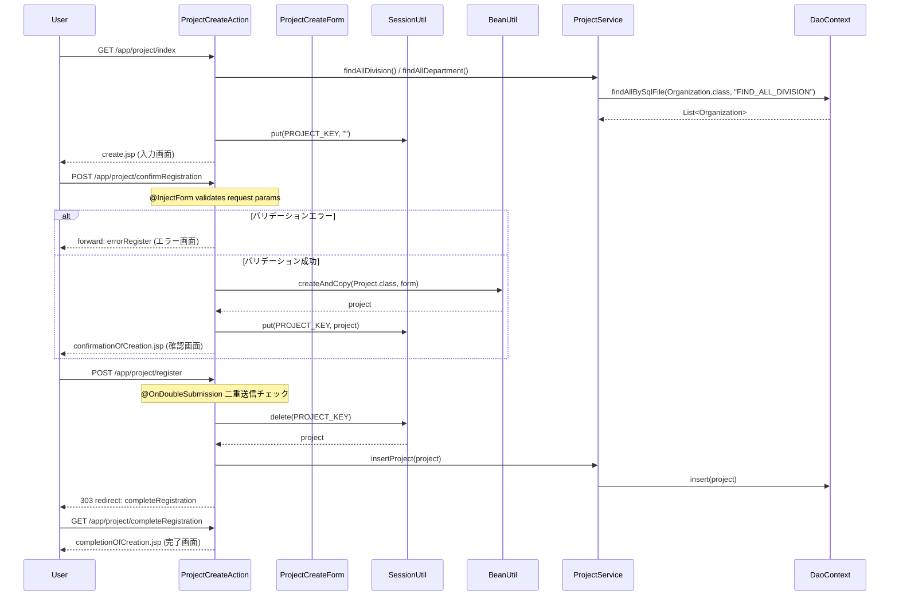

# Code Analysis: ProjectCreateAction

**Generated**: 2026-03-07 15:28:37
**Target**: プロジェクト登録処理アクション
**Modules**: proman-web
**Analysis Duration**: 約7分51秒

---

## Overview

`ProjectCreateAction` はプロジェクト登録機能を担うウェブアクションクラスです。入力画面表示・確認画面表示・登録実行・完了画面表示・入力画面への戻りという5段階の画面遷移フローを管理します。

主要な構成：
- **ProjectCreateAction**: 画面遷移制御とビジネスロジック呼び出し（アクションクラス）
- **ProjectCreateForm**: 入力値のバリデーションを担うフォームクラス
- **ProjectService**: UniversalDAO を使ったデータベース操作を集約したサービスクラス

Nablarch のインターセプター機能（`@InjectForm`、`@OnError`、`@OnDoubleSubmission`）を活用し、バリデーション・エラー処理・二重送信防止をアノテーションで宣言的に実装しています。

---

## Architecture

### Dependency Graph

```mermaid
classDiagram
    class ProjectCreateAction
    class ProjectCreateForm {
        <<Form>>
    }
    class ProjectService
    class Project {
        <<Entity>>
    }
    class Organization {
        <<Entity>>
    }
    class DaoContext {
        <<Nablarch>>
    }
    class SessionUtil {
        <<Nablarch>>
    }
    class BeanUtil {
        <<Nablarch>>
    }
    class ExecutionContext {
        <<Nablarch>>
    }
    class InjectForm {
        <<Nablarch>>
    }
    class OnDoubleSubmission {
        <<Nablarch>>
    }

    ProjectCreateAction ..> ProjectCreateForm : validates
    ProjectCreateAction ..> ProjectService : delegates to
    ProjectCreateAction ..> SessionUtil : stores/retrieves
    ProjectCreateAction ..> BeanUtil : converts
    ProjectCreateAction ..> ExecutionContext : uses
    ProjectCreateAction ..> InjectForm : uses
    ProjectCreateAction ..> OnDoubleSubmission : uses
    ProjectService ..> DaoContext : queries/persists
    ProjectService ..> Project : persists
    ProjectService ..> Organization : queries
    ProjectCreateForm ..|> Serializable : implements
```



**Note**: This diagram uses Mermaid `classDiagram` syntax to show class names and their relationships. Use `--|>` for inheritance (extends/implements) and `..>` for dependencies (uses/creates).

### Component Summary

| Component | Role | Type | Dependencies |
|-----------|------|------|--------------|
| ProjectCreateAction | プロジェクト登録の画面遷移制御と処理実行 | Action | ProjectCreateForm, ProjectService, SessionUtil, BeanUtil, ExecutionContext |
| ProjectCreateForm | 登録入力値の検証フォーム | Form | DateRelationUtil |
| ProjectService | プロジェクト・組織のDB操作を集約 | Service | DaoContext, Project, Organization |
| Project | プロジェクトエンティティ（データ保持） | Entity | なし |
| Organization | 組織（事業部/部門）エンティティ | Entity | なし |

---

## Flow

### Processing Flow

プロジェクト登録は以下の5ステップで構成されます。

1. **入力画面表示** (`index`): 事業部/部門のプルダウンデータをDBから取得し、リクエストスコープに設定して入力画面を表示します。
2. **確認画面表示** (`confirmRegistration`): `@InjectForm` でリクエストパラメータをバリデーション・バインド後、`BeanUtil.createAndCopy` でフォームを Project エンティティに変換し、セッションに保存して確認画面を表示します。バリデーションエラー時は `@OnError` でエラー画面にフォワードします。
3. **登録実行** (`register`): `@OnDoubleSubmission` で二重送信を防止。セッションから Project を取得し、`ProjectService.insertProject` でDBに登録後、303リダイレクトで完了画面へ遷移します。
4. **完了画面表示** (`completeRegistration`): 完了画面を表示します。
5. **入力画面への戻り** (`backToEnterRegistration`): セッションから Project を取得、`BeanUtil.createAndCopy` でフォームに逆変換、日付を `DateUtil.formatDate` でフォーマットし直して入力画面へフォワードします。

### Sequence Diagram



---

## Components

### ProjectCreateAction

**ファイル**: [ProjectCreateAction.java]( ../../.lw/nab-official/v6/nablarch-system-development-guide/Sample_Project/Source_Code/proman-project/proman-web/src/main/java/com/nablarch/example/proman/web/project/ProjectCreateAction.java)

**役割**: プロジェクト登録機能の画面遷移制御クラス。入力・確認・登録・完了・戻りの5つのアクションメソッドを提供します。

**キーメソッド**:

- `index` (L33-39): 事業部/部門プルダウンをDBから取得してリクエストスコープに設定し、入力画面を返す
- `confirmRegistration` (L48-63): `@InjectForm` によるバリデーション後、フォームをエンティティに変換してセッション保存、確認画面を返す
- `register` (L72-78): `@OnDoubleSubmission` 保護のもと、セッションから Project を取り出してDB登録し、303リダイレクト
- `backToEnterRegistration` (L98-118): セッションのデータをフォームに逆変換し日付フォーマットを調整、入力画面にフォワード

**依存**:
- `ProjectCreateForm`: バリデーション済みフォームデータ
- `ProjectService`: DBアクセスの委譲先
- `SessionUtil`: セッション間でのエンティティ受け渡し
- `BeanUtil`: Form ↔ Entity 変換

---

### ProjectCreateForm

**ファイル**: [ProjectCreateForm.java](../../.lw/nab-official/v6/nablarch-system-development-guide/Sample_Project/Source_Code/proman-project/proman-web/src/main/java/com/nablarch/example/proman/web/project/ProjectCreateForm.java)

**役割**: プロジェクト登録入力値を保持し、Bean Validation でバリデーションを行うフォームクラス。

**キーメソッド**:

- `isValidProjectPeriod` (L329-331): `@AssertTrue` アノテーションで宣言的に、開始日 ≤ 終了日の期間整合性チェックを実施

**特徴**:
- `Serializable` を実装（セッションへの格納に必要）
- `@Required` と `@Domain` アノテーションでフィールドごとの必須・ドメインバリデーションを定義
- 日付フィールドは `String` 型で保持し、フォーマット変換は Action 側で実施

**依存**:
- `DateRelationUtil`: 期間整合性チェックのユーティリティ

---

### ProjectService

**ファイル**: [ProjectService.java](../../.lw/nab-official/v6/nablarch-system-development-guide/Sample_Project/Source_Code/proman-project/proman-web/src/main/java/com/nablarch/example/proman/web/project/ProjectService.java)

**役割**: プロジェクト・組織のDBアクセスを集約したサービスクラス。ユニバーサルDAO（`DaoContext`）を内部に保持し、CRUD操作を提供します。

**キーメソッド**:

- `findAllDivision` (L50-52): SQLファイル `FIND_ALL_DIVISION` を使って全事業部を取得
- `findAllDepartment` (L59-61): SQLファイル `FIND_ALL_DEPARTMENT` を使って全部門を取得
- `insertProject` (L80-82): `universalDao.insert(project)` でプロジェクトをDB登録
- `findOrganizationById` (L70-73): 主キー指定で組織を1件取得

**依存**:
- `DaoContext`: ユニバーサルDAO本体
- `DaoFactory`: DAO インスタンスの生成

---

## Nablarch Framework Usage

### UniversalDao (DaoContext)

**クラス**: `nablarch.common.dao.DaoContext` / `nablarch.common.dao.UniversalDao`

**説明**: Jakarta Persistence アノテーションを付与した Entity を使って、SQL を書かずに CRUD 操作を行えるシンプルな O/R マッパー。SQLファイルを使った柔軟な検索も可能。

**使用方法**:
```java
// SQLファイルを使った全件検索
List<Organization> list = universalDao.findAllBySqlFile(Organization.class, "FIND_ALL_DIVISION");

// 主キーによる1件検索
Organization org = universalDao.findById(Organization.class, new Object[]{organizationId});

// 登録
universalDao.insert(project);
```

**重要ポイント**:
- ✅ **Entity に Jakarta Persistence アノテーションを付与する**: `@Table`、`@Id`、`@Column` 等が必須。アノテーションからSQL文が自動構築される
- ⚠️ **主キー以外の条件での更新/削除は不可**: その場合は `database`（JDBCラッパー）を使うこと
- 💡 **SQLファイルのパスは FQCN から自動導出**: `com.example.entity.Organization` → `com/example/entity/Organization.sql`
- ⚠️ **共通項目（登録ユーザ・更新ユーザ等）の自動設定は提供しない**: アプリケーション側で明示的に設定すること

**このコードでの使い方**:
- `ProjectService.findAllDivision()` / `findAllDepartment()` で `findAllBySqlFile` を使って組織一覧を取得（L51, L60）
- `ProjectService.findOrganizationById()` で `findById` を使って組織を1件取得（L72）
- `ProjectService.insertProject()` で `insert` を使ってプロジェクトを登録（L81）

**詳細**: [Libraries Universal_dao](../../.claude/skills/nabledge-6/docs/component/libraries/libraries-universal_dao.md)

---

### @InjectForm (フォームインジェクション)

**クラス**: `nablarch.common.web.interceptor.InjectForm`

**説明**: アクションメソッドにアノテーションを付与することで、リクエストパラメータの自動バインドとBean Validationによるバリデーションを実行するインターセプター。

**使用方法**:
```java
@InjectForm(form = ProjectCreateForm.class, prefix = "form")
@OnError(type = ApplicationException.class, path = "forward:///app/project/errorRegister")
public HttpResponse confirmRegistration(HttpRequest request, ExecutionContext context) {
    ProjectCreateForm form = context.getRequestScopedVar("form");
    // フォームはバリデーション済み
}
```

**重要ポイント**:
- ✅ **`@OnError` とセットで使う**: バリデーションエラー時は `ApplicationException` がスローされるため、エラー時の遷移先を必ず指定する
- 💡 **バリデーション済みフォームはリクエストスコープから取得**: `context.getRequestScopedVar("form")` で取得できる
- ⚠️ **prefix 指定に注意**: リクエストパラメータの prefix（"form."）と一致させること

**このコードでの使い方**:
- `confirmRegistration()` メソッド（L48-63）でフォームバインドとバリデーションを実施

---

### @OnDoubleSubmission (二重送信防止)

**クラス**: `nablarch.common.web.token.OnDoubleSubmission`

**説明**: フォーム送信の二重送信を防止するインターセプター。トークンを使って同一リクエストの重複実行を検知・拒否する。

**使用方法**:
```java
@OnDoubleSubmission
public HttpResponse register(HttpRequest request, ExecutionContext context) {
    // 二重送信時はここに到達しない
}
```

**重要ポイント**:
- ✅ **登録・更新・削除など副作用のある処理に必ず付与**: ネットワーク遅延等によるユーザの再送信を防止
- ⚠️ **CSRF対策にはCSRF対策機能を使うこと**: データベース使用の二重サブミット防止機能はCSRF対策に非対応。HttpSession使用の場合はCSRF対策と同等の効果があるが、明示的実装が必要で対策漏れのリスクあり
- 💡 **HttpSession を使う実装**: Nablarch のセキュリティチェックリストでも、HttpSession ベースの二重サブミット防止はCSRF対策として認められている

**このコードでの使い方**:
- `register()` メソッド（L72-78）で二重送信を防止。確認画面表示後の本登録処理を保護

---

### SessionUtil (セッション管理)

**クラス**: `nablarch.common.web.session.SessionUtil`

**説明**: HTTPセッションへのデータ格納・取得・削除を担うユーティリティ。セッションIDは推測困難なUUIDを使用し、セッション管理の不備対策を提供。

**使用方法**:
```java
// セッションへ保存
SessionUtil.put(context, "key", object);

// セッションから取得
Project project = SessionUtil.get(context, "key");

// セッションから取得して削除
Project project = SessionUtil.delete(context, "key");
```

**重要ポイント**:
- ✅ **登録実行時は `delete` で取得**: セッションデータを消費することで、確認画面→登録の1方向フローを保証
- 💡 **`Serializable` 実装が必要**: セッションに格納するオブジェクトは `Serializable` を実装すること（`ProjectCreateForm` が `implements Serializable` している理由）
- ⚠️ **HTTPS利用時は secure 属性を設定**: デフォルトではCookieに secure 属性が付かない。HTTPS環境では設定で有効化すること

**このコードでの使い方**:
- `confirmRegistration()` で `put` により Project をセッションに保存（L59）
- `register()` で `delete` によりセッションから Project を取得して削除（L74）
- `backToEnterRegistration()` で `get` によりセッションから Project を取得（L100）

---

### BeanUtil (Beanコピー)

**クラス**: `nablarch.core.beans.BeanUtil`

**説明**: JavaBeans 間でプロパティをコピーするユーティリティ。Form から Entity への変換、Entity から Form への逆変換に使用する。

**使用方法**:
```java
// フォームからエンティティへ変換
Project project = BeanUtil.createAndCopy(Project.class, form);

// エンティティからフォームへ逆変換
ProjectCreateForm form = BeanUtil.createAndCopy(ProjectCreateForm.class, project);
```

**重要ポイント**:
- 💡 **同名プロパティを自動コピー**: 型変換も自動で行われるため、FormとEntityで対応するプロパティ名を統一すると効率的
- ⚠️ **手動設定が必要な項目に注意**: `confirmRegistration()` では `project.setClientId(0)` を手動設定（TODO コメントあり、顧客選択未実装のため）
- ⚠️ **日付フォーマットの扱い**: 日付文字列は Form 側で "yyyyMMdd" 形式、表示時は "yyyy/MM/dd" 形式に変換する必要があり、`backToEnterRegistration()` 内で `DateUtil.formatDate` を使って再変換している

**このコードでの使い方**:
- `confirmRegistration()` で Form → Project 変換（L52）
- `backToEnterRegistration()` で Project → ProjectCreateForm 変換（L101）

---

## References

### Source Files

- [ProjectCreateAction.java (.lw/nab-official/v6/nablarch-system-development-guide/en/Sample_Project/Source_Code/proman-project/proman-web/src/main/java/com/nablarch/example/proman/web/project)](../../.lw/nab-official/v6/nablarch-system-development-guide/en/Sample_Project/Source_Code/proman-project/proman-web/src/main/java/com/nablarch/example/proman/web/project/ProjectCreateAction.java) - ProjectCreateAction
- [ProjectCreateAction.java (.lw/nab-official/v6/nablarch-system-development-guide/Sample_Project/Source_Code/proman-project/proman-web/src/main/java/com/nablarch/example/proman/web/project)](../../.lw/nab-official/v6/nablarch-system-development-guide/Sample_Project/Source_Code/proman-project/proman-web/src/main/java/com/nablarch/example/proman/web/project/ProjectCreateAction.java) - ProjectCreateAction
- [ProjectCreateForm.java (.lw/nab-official/v6/nablarch-system-development-guide/en/Sample_Project/Source_Code/proman-project/proman-web/src/main/java/com/nablarch/example/proman/web/project)](../../.lw/nab-official/v6/nablarch-system-development-guide/en/Sample_Project/Source_Code/proman-project/proman-web/src/main/java/com/nablarch/example/proman/web/project/ProjectCreateForm.java) - ProjectCreateForm
- [ProjectCreateForm.java (.lw/nab-official/v6/nablarch-system-development-guide/Sample_Project/Source_Code/proman-project/proman-web/src/main/java/com/nablarch/example/proman/web/project)](../../.lw/nab-official/v6/nablarch-system-development-guide/Sample_Project/Source_Code/proman-project/proman-web/src/main/java/com/nablarch/example/proman/web/project/ProjectCreateForm.java) - ProjectCreateForm
- [ProjectService.java (.lw/nab-official/v6/nablarch-system-development-guide/en/Sample_Project/Source_Code/proman-project/proman-web/src/main/java/com/nablarch/example/proman/web/project)](../../.lw/nab-official/v6/nablarch-system-development-guide/en/Sample_Project/Source_Code/proman-project/proman-web/src/main/java/com/nablarch/example/proman/web/project/ProjectService.java) - ProjectService
- [ProjectService.java (.lw/nab-official/v6/nablarch-system-development-guide/Sample_Project/Source_Code/proman-project/proman-web/src/main/java/com/nablarch/example/proman/web/project)](../../.lw/nab-official/v6/nablarch-system-development-guide/Sample_Project/Source_Code/proman-project/proman-web/src/main/java/com/nablarch/example/proman/web/project/ProjectService.java) - ProjectService

### Knowledge Base (Nabledge-6)

- [Libraries Universal_dao](../../.claude/skills/nabledge-6/docs/component/libraries/libraries-universal_dao.md)
- [Security Check](../../.claude/skills/nabledge-6/docs/check/security-check/security-check.md)
- [Libraries Date](../../.claude/skills/nabledge-6/docs/component/libraries/libraries-date.md)

### Official Documentation


- [252](https://fintan.jp/page/252/)
- [BasicBusinessDateProvider](https://nablarch.github.io/docs/LATEST/javadoc/nablarch/core/date/BasicBusinessDateProvider.html)
- [BasicDaoContextFactory](https://nablarch.github.io/docs/LATEST/javadoc/nablarch/common/dao/BasicDaoContextFactory.html)
- [BasicSystemTimeProvider](https://nablarch.github.io/docs/LATEST/javadoc/nablarch/core/date/BasicSystemTimeProvider.html)
- [BusinessDateProvider](https://nablarch.github.io/docs/LATEST/javadoc/nablarch/core/date/BusinessDateProvider.html)
- [BusinessDateUtil](https://nablarch.github.io/docs/LATEST/javadoc/nablarch/core/date/BusinessDateUtil.html)
- [ConnectionFactory](https://nablarch.github.io/docs/LATEST/javadoc/nablarch/core/db/connection/ConnectionFactory.html)
- [DatabaseMetaDataExtractor](https://nablarch.github.io/docs/LATEST/javadoc/nablarch/common/dao/DatabaseMetaDataExtractor.html)
- [Date](https://nablarch.github.io/docs/LATEST/doc/application_framework/application_framework/libraries/date.html)
- [Date](https://nablarch.github.io/docs/LATEST/javadoc/java/sql/Date.html)
- [DeferredEntityList](https://nablarch.github.io/docs/LATEST/javadoc/nablarch/common/dao/DeferredEntityList.html)
- [Dialect](https://nablarch.github.io/docs/LATEST/javadoc/nablarch/core/db/dialect/Dialect.html)
- [EntityList](https://nablarch.github.io/docs/LATEST/javadoc/nablarch/common/dao/EntityList.html)
- [GenerationType](https://nablarch.github.io/docs/LATEST/javadoc/jakarta/persistence/GenerationType.html)
- [H2Dialect](https://nablarch.github.io/docs/LATEST/javadoc/nablarch/core/db/dialect/H2Dialect.html)
- [Integer](https://nablarch.github.io/docs/LATEST/javadoc/java/lang/Integer.html)
- [Long](https://nablarch.github.io/docs/LATEST/javadoc/java/lang/Long.html)
- [OnError](https://nablarch.github.io/docs/LATEST/javadoc/nablarch/fw/web/interceptor/OnError.html)
- [OptimisticLockException](https://nablarch.github.io/docs/LATEST/javadoc/jakarta/persistence/OptimisticLockException.html)
- [Pagination](https://nablarch.github.io/docs/LATEST/javadoc/nablarch/common/dao/Pagination.html)
- [SimpleDbTransactionManager](https://nablarch.github.io/docs/LATEST/javadoc/nablarch/core/db/transaction/SimpleDbTransactionManager.html)
- [SystemTimeProvider](https://nablarch.github.io/docs/LATEST/javadoc/nablarch/core/date/SystemTimeProvider.html)
- [SystemTimeUtil](https://nablarch.github.io/docs/LATEST/javadoc/nablarch/core/date/SystemTimeUtil.html)
- [TransactionFactory](https://nablarch.github.io/docs/LATEST/javadoc/nablarch/core/transaction/TransactionFactory.html)
- [Universal Dao](https://nablarch.github.io/docs/LATEST/doc/application_framework/application_framework/libraries/database/universal_dao.html)
- [UniversalDao.Transaction](https://nablarch.github.io/docs/LATEST/javadoc/nablarch/common/dao/UniversalDao.Transaction.html)
- [UniversalDao](https://nablarch.github.io/docs/LATEST/javadoc/nablarch/common/dao/UniversalDao.html)

---

**Note**: This documentation was generated by the code-analysis workflow of the nabledge-6 skill.
