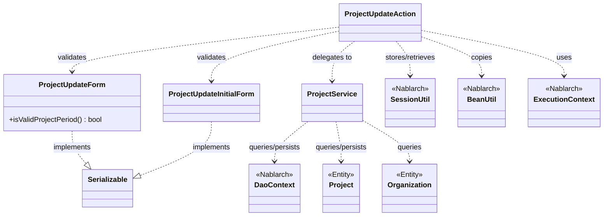
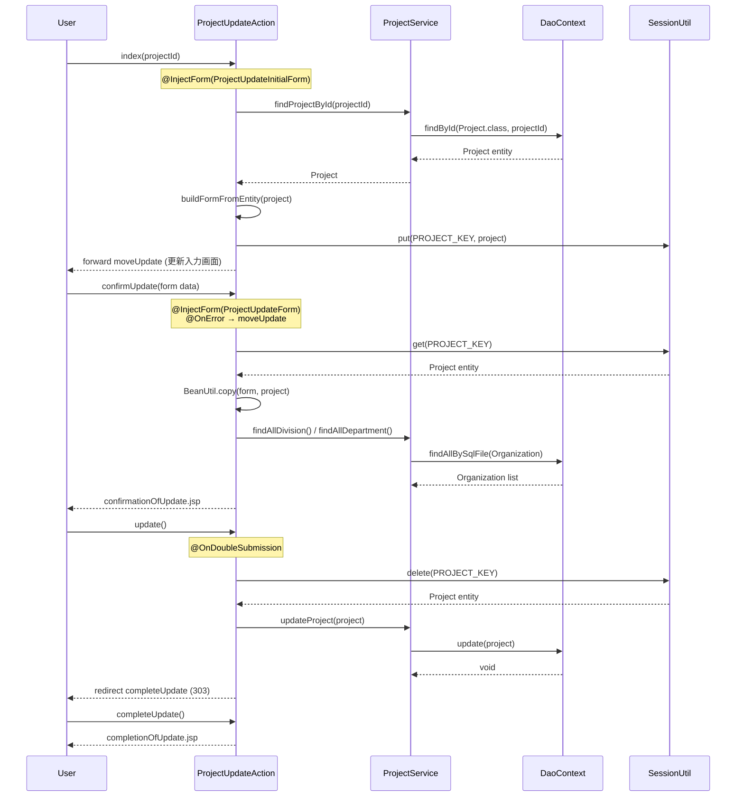

# Code Analysis: ProjectUpdateAction

**Generated**: 2026-03-07 15:43:09
**Target**: プロジェクト更新処理アクション
**Modules**: proman-web
**Analysis Duration**: 約7分39秒

---

## Overview

`ProjectUpdateAction` は、プロジェクト情報の更新フローを担うWebアクションクラスである。プロジェクト詳細画面から呼び出され、入力画面表示・確認画面表示・更新実行・完了画面表示という典型的な4ステップ更新フローを実装している。

セッションストアを活用してプロジェクトエンティティを画面遷移間で保持し、二重サブミット防止（`@OnDoubleSubmission`）やバリデーションエラー時のリダイレクト（`@OnError`）をNablarchのインターセプタで宣言的に制御している。データベースアクセスは `ProjectService` に委譲し、`DaoContext`（UniversalDAO）経由でエンティティの取得・更新を行う。

---

## Architecture

### Dependency Graph



**Note**: This diagram uses Mermaid `classDiagram` syntax to show class names and their relationships. Use `--|>` for inheritance (extends/implements) and `..>` for dependencies (uses/creates).

### Component Summary

| Component | Role | Type | Dependencies |
|-----------|------|------|--------------|
| ProjectUpdateAction | プロジェクト更新フロー制御 | Action | ProjectUpdateForm, ProjectUpdateInitialForm, ProjectService, SessionUtil, BeanUtil, ExecutionContext |
| ProjectUpdateForm | 更新入力フォーム・バリデーション | Form | DateRelationUtil |
| ProjectUpdateInitialForm | 更新初期遷移フォーム（プロジェクトID受取） | Form | なし |
| ProjectService | プロジェクト・組織DBアクセス | Service | DaoContext, Project, Organization |
| Project | プロジェクトエンティティ | Entity | なし |
| Organization | 組織エンティティ | Entity | なし |

---

## Flow

### Processing Flow

プロジェクト更新は以下の4ステップで構成される。

1. **index（更新入力画面表示）**: プロジェクト詳細画面からプロジェクトIDを受け取り（`ProjectUpdateInitialForm`でバリデーション）、DBからプロジェクトを取得してフォームに変換。セッションストアにエンティティを保存し、更新入力画面へフォワードする。

2. **confirmUpdate（確認画面表示）**: 入力フォーム（`ProjectUpdateForm`）でバリデーション実施。エラー時は `@OnError` により更新入力画面へフォワード。正常時はフォームの内容をエンティティにコピーし、事業部・部門プルダウンをリクエストスコープに設定して確認画面を表示する。

3. **update（更新実行）**: `@OnDoubleSubmission` により二重サブミットを防止。セッションストアからエンティティを取得して削除し、`ProjectService.updateProject()` でDB更新。完了画面へリダイレクトする。

4. **completeUpdate（完了画面表示）**: 更新完了画面（JSP）を返す。

なお `backToEnterUpdate` と `indexSetPullDown` は確認画面から入力画面に戻る際のナビゲーションメソッドである。

### Sequence Diagram



---

## Components

### ProjectUpdateAction

**ファイル**: [ProjectUpdateAction.java](../../.lw/nab-official/v6/nablarch-system-development-guide/Sample_Project/Source_Code/proman-project/proman-web/src/main/java/com/nablarch/example/proman/web/project/ProjectUpdateAction.java)

**役割**: プロジェクト更新フロー全体を制御するWebアクション。入力→確認→完了の画面遷移とデータ整合性を管理する。

**キーメソッド**:
- `index()` [L35-43]: プロジェクトIDでDB検索、フォーム生成、セッション保存、入力画面表示
- `confirmUpdate()` [L54-62]: フォームバリデーション後、エンティティにコピー、確認画面表示
- `update()` [L72-77]: セッションからエンティティ取得・削除、DB更新、完了リダイレクト
- `buildFormFromEntity()` [L111-125]: エンティティ→フォーム変換（日付フォーマット・組織階層解決）

**依存関係**: ProjectUpdateForm, ProjectUpdateInitialForm, ProjectService, SessionUtil, BeanUtil, ExecutionContext, DateUtil

**実装上のポイント**:
- `PROJECT_KEY = "projectUpdateActionProject"` でセッションキーを定数管理
- 確認→更新のセッション取得は `SessionUtil.delete()` を使用（取得と同時に削除で二重実行防止を補強）
- 事業部・部門プルダウンは `confirmUpdate` と `indexSetPullDown` 両方で設定が必要

---

### ProjectUpdateForm

**ファイル**: [ProjectUpdateForm.java](../../.lw/nab-official/v6/nablarch-system-development-guide/Sample_Project/Source_Code/proman-project/proman-web/src/main/java/com/nablarch/example/proman/web/project/ProjectUpdateForm.java)

**役割**: プロジェクト更新入力のフォームクラス。Jakarta EEバリデーションアノテーションとNablarchドメインバリデーションを組み合わせて入力値検証を行う。

**キーメソッド**:
- `isValidProjectPeriod()` [L329-331]: `@AssertTrue` によるプロジェクト期間整合性チェック（開始日≦終了日）

**依存関係**: DateRelationUtil（期間バリデーション）

**バリデーション設定**:
- `@Required` + `@Domain` でほとんどのフィールドを必須・ドメイン制約
- clientId のみ `@Required` をコメントアウト（顧客選択未実装のためTODO）

---

### ProjectUpdateInitialForm

**ファイル**: [ProjectUpdateInitialForm.java](../../.lw/nab-official/v6/nablarch-system-development-guide/Sample_Project/Source_Code/proman-project/proman-web/src/main/java/com/nablarch/example/proman/web/project/ProjectUpdateInitialForm.java)

**役割**: プロジェクト詳細画面から更新画面への遷移時にプロジェクトIDを受け取るフォーム。

**依存関係**: なし

---

### ProjectService

**ファイル**: [ProjectService.java](../../.lw/nab-official/v6/nablarch-system-development-guide/Sample_Project/Source_Code/proman-project/proman-web/src/main/java/com/nablarch/example/proman/web/project/ProjectService.java)

**役割**: プロジェクトおよび組織のデータベースアクセスを担うサービスクラス。DaoContext（UniversalDAO）を内部で使用する。

**キーメソッド**:
- `findProjectById()` [L124-126]: プロジェクトIDで1件取得 (`findById`)
- `updateProject()` [L89-91]: プロジェクトエンティティを更新 (`update`)
- `findAllDivision()` [L50-52]: 全事業部をSQLファイル検索で取得
- `findAllDepartment()` [L59-61]: 全部門をSQLファイル検索で取得
- `findOrganizationById()` [L70-73]: 組織IDで1件取得

**依存関係**: DaoContext, Project (Entity), Organization (Entity)

---

## Nablarch Framework Usage

### SessionUtil

**クラス**: `nablarch.common.web.session.SessionUtil`

**説明**: Nablarchのセッションストアに対してオブジェクトを保存・取得・削除するユーティリティクラス。

**使用方法**:
```java
// 保存
SessionUtil.put(context, "key", object);
// 取得
MyEntity entity = SessionUtil.get(context, "key");
// 取得して削除
MyEntity entity = SessionUtil.delete(context, "key");
```

**重要ポイント**:
- ✅ **更新実行時は `delete()` を使う**: `get()` ではなく `delete()` を使うことで、取得と同時にセッションから削除し、二重実行時のデータ残留を防ぐ
- ⚠️ **セッションキーの衝突に注意**: アクションクラス名を含むユニークなキー名（例: `projectUpdateActionProject`）を定数で定義すること
- 💡 **画面遷移間のエンティティ保持**: DBから取得したエンティティを確認画面経由で更新処理まで保持するために使用

**このコードでの使い方**:
- `index()` で `SessionUtil.put()` してプロジェクトエンティティを保存（Line 41）
- `confirmUpdate()` で `SessionUtil.get()` して確認画面に表示（Line 56）
- `update()` で `SessionUtil.delete()` して取得後即削除（Line 73）

**詳細**: この情報は知識ファイルに含まれていません。

---

### BeanUtil

**クラス**: `nablarch.core.beans.BeanUtil`

**説明**: JavaBeansのプロパティコピーを行うNablarchユーティリティ。同名プロパティを自動的にコピーする。

**使用方法**:
```java
// 既存オブジェクトへのコピー
BeanUtil.copy(sourceBean, destinationBean);
// 新規オブジェクト生成とコピー
DestType dest = BeanUtil.createAndCopy(DestType.class, sourceBean);
```

**重要ポイント**:
- ✅ **型変換が自動**: 同名プロパティで型が互換であれば自動変換される
- ⚠️ **コピーされない場合**: プロパティ名が異なる場合は自動コピーされない。`buildFormFromEntity()` のように手動設定が必要なケースに注意
- 💡 **フォーム→エンティティのマッピング**: `copy(form, entity)` でフォームの更新内容をエンティティに反映

**このコードでの使い方**:
- `confirmUpdate()` で `BeanUtil.copy(form, project)` によりフォーム内容をエンティティへ反映（Line 57）
- `buildFormFromEntity()` で `BeanUtil.createAndCopy(ProjectUpdateForm.class, project)` によりエンティティからフォームを生成（Line 112）

**詳細**: この情報は知識ファイルに含まれていません。

---

### DaoContext（UniversalDAO）

**クラス**: `nablarch.common.dao.DaoContext`

**説明**: ユニバーサルDAOのインターフェース。Jakarta PersistenceアノテーションをEntityに設定することで、SQLを記述せずにCRUD操作を実行できる簡易O/Rマッパー。

**使用方法**:
```java
// 主キーで1件取得
Project project = universalDao.findById(Project.class, projectId);

// エンティティを更新
universalDao.update(project);

// SQLファイルで全件取得
List<Organization> orgs = universalDao.findAllBySqlFile(Organization.class, "FIND_ALL_DIVISION");
```

**重要ポイント**:
- ✅ **主キー以外の条件更新は不可**: `update()` は主キー条件のみ。複雑な条件の更新は `database` ライブラリを使うこと
- ⚠️ **楽観的ロック**: エンティティに `@Version` を付与すると自動で楽観的ロックが有効になる。排他エラー時は `OptimisticLockException` が発生するため `@OnError` で制御する
- 💡 **SQLファイルによる柔軟な検索**: `findAllBySqlFile()` でSQL IDを指定してカスタムSQLを実行可能（`Organization.sql` の `FIND_ALL_DIVISION` など）

**このコードでの使い方**:
- `ProjectService.findProjectById()` で `findById(Project.class, projectId)` を使用（Line 125）
- `ProjectService.updateProject()` で `update(project)` を使用（Line 91）
- `ProjectService.findAllDivision/Department()` で `findAllBySqlFile()` を使用（Lines 51, 60）

**詳細**: [Libraries Universal_dao](../../.claude/skills/nabledge-6/docs/component/libraries/libraries-universal_dao.md)

---

### @InjectForm

**クラス**: `nablarch.common.web.interceptor.InjectForm`

**説明**: リクエストパラメータをフォームクラスにバインドし、バリデーションを実行するNablarchインターセプタ。バリデーション後のフォームオブジェクトはリクエストスコープ変数 `"form"` に設定される。

**使用方法**:
```java
@InjectForm(form = ProjectUpdateForm.class, prefix = "form")
@OnError(type = ApplicationException.class, path = "forward:///app/project/moveUpdate")
public HttpResponse confirmUpdate(HttpRequest request, ExecutionContext context) {
    ProjectUpdateForm form = context.getRequestScopedVar("form");
    // ...
}
```

**重要ポイント**:
- ✅ **`prefix` 指定**: フォームパラメータに `form.xxx` のようなプレフィックスがある場合は `prefix = "form"` を指定する
- ⚠️ **`@OnError` とセットで使う**: バリデーションエラーは `ApplicationException` として送出されるため、`@OnError` でエラー時の遷移先を指定する
- 💡 **宣言的バリデーション**: メソッド本体にバリデーションコードを書かず、アノテーションで宣言的に制御できる

**このコードでの使い方**:
- `index()` で `@InjectForm(form = ProjectUpdateInitialForm.class)` によりプロジェクトIDを受取（Line 34）
- `confirmUpdate()` で `@InjectForm(form = ProjectUpdateForm.class, prefix = "form")` と `@OnError` を組み合わせて入力バリデーション（Lines 52-53）

**詳細**: この情報は知識ファイルに含まれていません。

---

### @OnDoubleSubmission

**クラス**: `nablarch.common.web.token.OnDoubleSubmission`

**説明**: フォームの二重サブミット（ダブルクリックや再送信）を防止するインターセプタ。

**使用方法**:
```java
@OnDoubleSubmission
public HttpResponse update(HttpRequest request, ExecutionContext context) {
    // 二重サブミット時はこのメソッドが呼ばれない
}
```

**重要ポイント**:
- ✅ **更新・削除・登録処理に必須**: データを変更するアクションメソッドには必ず付与すること
- 💡 **セッション側での保護との組み合わせ**: `SessionUtil.delete()` との併用でより堅牢な二重実行防止が実現できる

**このコードでの使い方**:
- `update()` メソッドに付与し、二重サブミットを防止（Line 71）

**詳細**: この情報は知識ファイルに含まれていません。

---

## References

### Source Files

- [ProjectUpdateAction.java (.lw/nab-official/v6/nablarch-system-development-guide/en/Sample_Project/Source_Code/proman-project/proman-web/src/main/java/com/nablarch/example/proman/web/project)](../../.lw/nab-official/v6/nablarch-system-development-guide/en/Sample_Project/Source_Code/proman-project/proman-web/src/main/java/com/nablarch/example/proman/web/project/ProjectUpdateAction.java) - ProjectUpdateAction
- [ProjectUpdateAction.java (.lw/nab-official/v6/nablarch-system-development-guide/Sample_Project/Source_Code/proman-project/proman-web/src/main/java/com/nablarch/example/proman/web/project)](../../.lw/nab-official/v6/nablarch-system-development-guide/Sample_Project/Source_Code/proman-project/proman-web/src/main/java/com/nablarch/example/proman/web/project/ProjectUpdateAction.java) - ProjectUpdateAction
- [ProjectUpdateForm.java (.lw/nab-official/v6/nablarch-system-development-guide/en/Sample_Project/Source_Code/proman-project/proman-web/src/main/java/com/nablarch/example/proman/web/project)](../../.lw/nab-official/v6/nablarch-system-development-guide/en/Sample_Project/Source_Code/proman-project/proman-web/src/main/java/com/nablarch/example/proman/web/project/ProjectUpdateForm.java) - ProjectUpdateForm
- [ProjectUpdateForm.java (.lw/nab-official/v6/nablarch-system-development-guide/Sample_Project/Source_Code/proman-project/proman-web/src/main/java/com/nablarch/example/proman/web/project)](../../.lw/nab-official/v6/nablarch-system-development-guide/Sample_Project/Source_Code/proman-project/proman-web/src/main/java/com/nablarch/example/proman/web/project/ProjectUpdateForm.java) - ProjectUpdateForm
- [ProjectUpdateInitialForm.java (.lw/nab-official/v6/nablarch-system-development-guide/en/Sample_Project/Source_Code/proman-project/proman-web/src/main/java/com/nablarch/example/proman/web/project)](../../.lw/nab-official/v6/nablarch-system-development-guide/en/Sample_Project/Source_Code/proman-project/proman-web/src/main/java/com/nablarch/example/proman/web/project/ProjectUpdateInitialForm.java) - ProjectUpdateInitialForm
- [ProjectUpdateInitialForm.java (.lw/nab-official/v6/nablarch-system-development-guide/Sample_Project/Source_Code/proman-project/proman-web/src/main/java/com/nablarch/example/proman/web/project)](../../.lw/nab-official/v6/nablarch-system-development-guide/Sample_Project/Source_Code/proman-project/proman-web/src/main/java/com/nablarch/example/proman/web/project/ProjectUpdateInitialForm.java) - ProjectUpdateInitialForm
- [ProjectService.java (.lw/nab-official/v6/nablarch-system-development-guide/en/Sample_Project/Source_Code/proman-project/proman-web/src/main/java/com/nablarch/example/proman/web/project)](../../.lw/nab-official/v6/nablarch-system-development-guide/en/Sample_Project/Source_Code/proman-project/proman-web/src/main/java/com/nablarch/example/proman/web/project/ProjectService.java) - ProjectService
- [ProjectService.java (.lw/nab-official/v6/nablarch-system-development-guide/Sample_Project/Source_Code/proman-project/proman-web/src/main/java/com/nablarch/example/proman/web/project)](../../.lw/nab-official/v6/nablarch-system-development-guide/Sample_Project/Source_Code/proman-project/proman-web/src/main/java/com/nablarch/example/proman/web/project/ProjectService.java) - ProjectService

### Knowledge Base (Nabledge-6)

- [Libraries Universal_dao](../../.claude/skills/nabledge-6/docs/component/libraries/libraries-universal_dao.md)

### Official Documentation


- [BasicDaoContextFactory](https://nablarch.github.io/docs/LATEST/javadoc/nablarch/common/dao/BasicDaoContextFactory.html)
- [ConnectionFactory](https://nablarch.github.io/docs/LATEST/javadoc/nablarch/core/db/connection/ConnectionFactory.html)
- [DatabaseMetaDataExtractor](https://nablarch.github.io/docs/LATEST/javadoc/nablarch/common/dao/DatabaseMetaDataExtractor.html)
- [Date](https://nablarch.github.io/docs/LATEST/javadoc/java/sql/Date.html)
- [DeferredEntityList](https://nablarch.github.io/docs/LATEST/javadoc/nablarch/common/dao/DeferredEntityList.html)
- [Dialect](https://nablarch.github.io/docs/LATEST/javadoc/nablarch/core/db/dialect/Dialect.html)
- [EntityList](https://nablarch.github.io/docs/LATEST/javadoc/nablarch/common/dao/EntityList.html)
- [GenerationType](https://nablarch.github.io/docs/LATEST/javadoc/jakarta/persistence/GenerationType.html)
- [H2Dialect](https://nablarch.github.io/docs/LATEST/javadoc/nablarch/core/db/dialect/H2Dialect.html)
- [Integer](https://nablarch.github.io/docs/LATEST/javadoc/java/lang/Integer.html)
- [Long](https://nablarch.github.io/docs/LATEST/javadoc/java/lang/Long.html)
- [OnError](https://nablarch.github.io/docs/LATEST/javadoc/nablarch/fw/web/interceptor/OnError.html)
- [OptimisticLockException](https://nablarch.github.io/docs/LATEST/javadoc/jakarta/persistence/OptimisticLockException.html)
- [Pagination](https://nablarch.github.io/docs/LATEST/javadoc/nablarch/common/dao/Pagination.html)
- [SimpleDbTransactionManager](https://nablarch.github.io/docs/LATEST/javadoc/nablarch/core/db/transaction/SimpleDbTransactionManager.html)
- [TransactionFactory](https://nablarch.github.io/docs/LATEST/javadoc/nablarch/core/transaction/TransactionFactory.html)
- [Universal Dao](https://nablarch.github.io/docs/LATEST/doc/application_framework/application_framework/libraries/database/universal_dao.html)
- [UniversalDao.Transaction](https://nablarch.github.io/docs/LATEST/javadoc/nablarch/common/dao/UniversalDao.Transaction.html)
- [UniversalDao](https://nablarch.github.io/docs/LATEST/javadoc/nablarch/common/dao/UniversalDao.html)

---

**Note**: This documentation was generated by the code-analysis workflow of the nabledge-6 skill.
